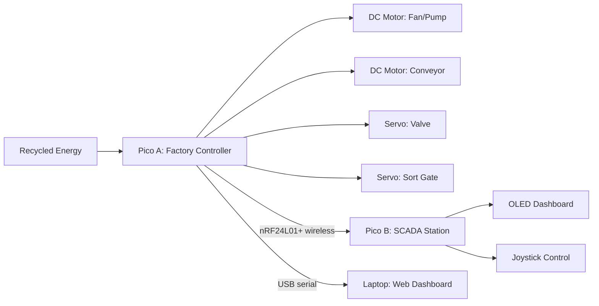

# GridBox — Smart Infrastructure Control System

<p align="center">
  <a href="https://hackabot-2026.com"></a>
  &nbsp;&nbsp;
  
</p>

<p align="center">
  <strong>A £15 smart factory controller powered by recycled energy</strong><br/>
  Monitors, decides, and acts autonomously — replacing £162K of industrial equipment
</p>

<p align="center">
  <a href="docs/01-overview/gridbox-design.md">Design Doc</a> · <a href="docs/01-overview/context.md">Project Context</a> · <a href="docs/02-electrical/wiring-connections.md">Wiring Guide</a> · <a href="docs/04-team/team-plan.md">Team Plan</a>
</p>

---

## Group 1 — Hack-A-Bot 2026, Project 6: Creative

| Name | Role | Responsibility |
|---|---|---|
| **Doyun Gu** | System Designer / Lead | Power grid architecture, firmware (MicroPython + C), web dashboard, SCADA protocol, team coordination |
| **Wooseong Jung** | Electronics Engineer | Circuit design, MOSFET switching, current sensing, IMU wiring, energy signature fault detection |
| **Billy Park** | Mechanical Engineer | 3D printing, chassis design, turntable mechanism, motor mounts, factory layout, physical assembly |

---

## What We're Building

GridBox is a miniature **smart factory** — a water bottling / sorting plant powered by recycled energy. Two Raspberry Pi Pico 2 boards work together wirelessly: one controls the factory floor, the other is a remote SCADA monitoring station.



### Key Features

| Feature | How It Works |
|---|---|
| **Smart power management** | ADC senses current at every branch. Pico reroutes excess power. $P \propto n^3$ — 20% slower = 49% less energy |
| **Autonomous fault detection** | IMU vibration monitoring (ISO 10816) + current signature analysis. Detects bearing wear, jams, loose connections |
| **Intelligent load shedding** | Bus voltage drops → system sheds non-essential loads by priority. Critical systems stay powered |
| **Weight-based sorting** | Motor current change = item weight. Timed servo gate sorts good/bad at the end of the belt |
| **Wireless SCADA** | 6-type binary datagram protocol at 50Hz. OLED dashboard with 5 views. Joystick override + potentiometer setpoint |
| **Failure simulator** | Inject faults on command during demo — judges watch the system handle wireless dropout, motor stall, power sag, IMU failure |
| **Web dashboard** | Live graphs on laptop via USB serial. SQLite database for persistent data logging |

### The Demo

| Step | What Happens |
|---|---|
| 1 | Power on — system auto-starts, motors spin, LEDs green |
| 2 | Turn potentiometer — motor speeds change, OLED updates live |
| 3 | Place items on turntable — sorted by weight into PASS / REJECT bins |
| 4 | Shake motor — fault detected in <100ms, motor stops, power reroutes |
| 5 | Press joystick to reset — system recovers automatically |
| 6 | Show OLED — "Smart mode saved 69% energy vs dumb mode" |

---

## Themes

<p align="center">
  <strong>Sustainability</strong> — Smart energy management, waste reduction, recycled power<br/>
  <strong>Autonomy</strong> — Sense, decide, and act with zero human input
</p>

---

## Tech Stack

| Layer | Technology |
|---|---|
| **Microcontrollers** | 2× Raspberry Pi Pico 2 (RP2350, ARM Cortex-M33, dual-core) |
| **Wireless** | nRF24L01+ PA+LNA, 2.4GHz, custom 6-type binary datagram protocol |
| **Sensors** | BMI160 IMU (vibration), ADC (voltage + current via 1Ω sense resistors) |
| **Actuators** | 2× DC Motor (200RPM geared), 2× MG90S Servo, via PCA9685 PWM driver |
| **Display** | 0.96" SSD1306 OLED (128×64, 5 dashboard views) |
| **Switching** | N-channel MOSFETs on GPIO for power routing |
| **Firmware** | MicroPython (development) + C SDK (production demo) |
| **Dashboard** | Flask + SQLite + live graphs on laptop |
| **Power** | 12V PSU → LM2596S buck (5V logic) + 300W buck-boost (motor power) |

---

## Repository Structure

```
hack-a-bot-2026/
├── firmware/                    ← Flashable firmware snapshots
│   ├── 01-v1/                   ← First complete build (21 modules)
│   └── 02-v2/                   ← + datagram protocol, self-test, A/B comparison
│
├── src/                         ← Development source code
│   ├── master-pico/micropython/ ← Pico A: 13 modules (control loop, drivers, fault detection)
│   ├── slave-pico/micropython/  ← Pico B: 7 modules (SCADA dashboard, operator input)
│   ├── shared/protocol.py       ← 6-type binary datagram protocol (32-byte packets)
│   ├── web/                     ← Flask dashboard + SQLite database
│   ├── hardware/electronics/    ← Circuit docs (Wooseong)
│   ├── hardware/chassis/        ← CAD + 3D print files (Billy)
│   └── tools/                   ← setup-pico.sh, flash.sh
│
├── docs/
│   ├── 01-overview/             ← Design doc, proposal, context, hardware ref
│   ├── 02-electrical/           ← Wiring (81 connections), power system, datagram,
│   │                               debug system, failure handling, motor specs,
│   │                               energy signature fault detection (Wooseong)
│   ├── 03-factory/              ← Physical factory design, weight sensing, build plans
│   ├── 04-team/                 ← Team task lists + timeline
│   └── 05-archive/              ← Past ideas explored (14 ideas ranked)
│
└── media/                       ← Build progress photos + demo videos
```

---

## Supported By

<p align="center">
  <a href="https://hackabot-2026.com"></a>&nbsp;&nbsp;&nbsp;
  <a href="https://hackabot-2026.com"></a>&nbsp;&nbsp;&nbsp;
  <a href="https://www.manchester.ac.uk"></a>&nbsp;&nbsp;&nbsp;
  <a href="https://hackabot-2026.com"></a>
</p>

<p align="center">
  <em>Part of <a href="https://hackabot-2026.com">Hack-A-Bot 2026</a> — supported by ARM, EEESoc, RoboSoc, Makerspace, Quanser, Cradle, Amentum, Ice Nine, Google Developer Groups, UKRI, RAICo</em>
</p>
