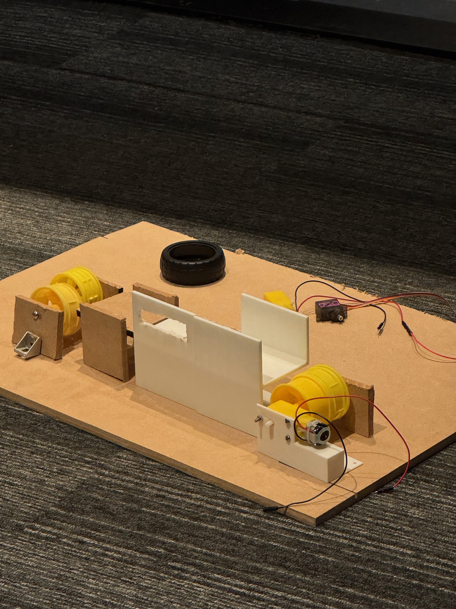
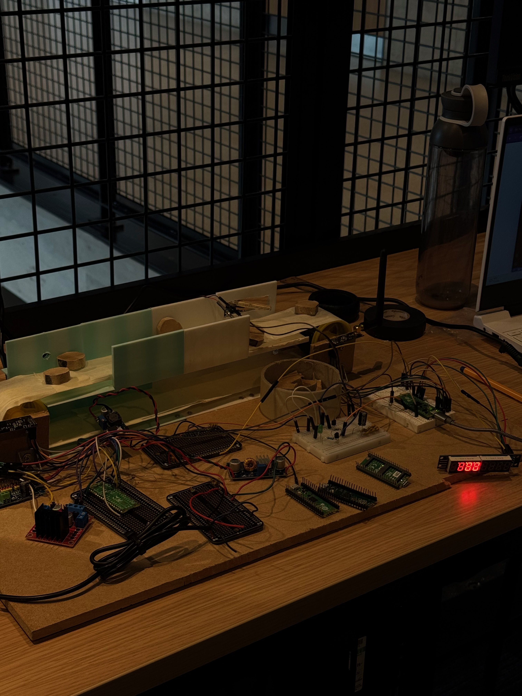
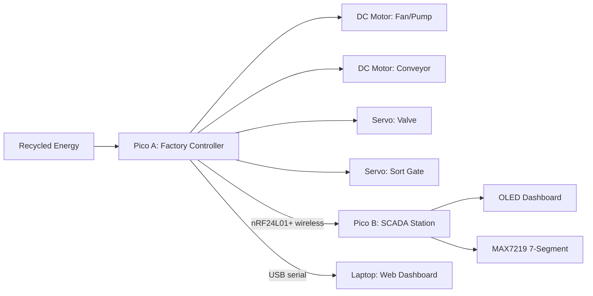
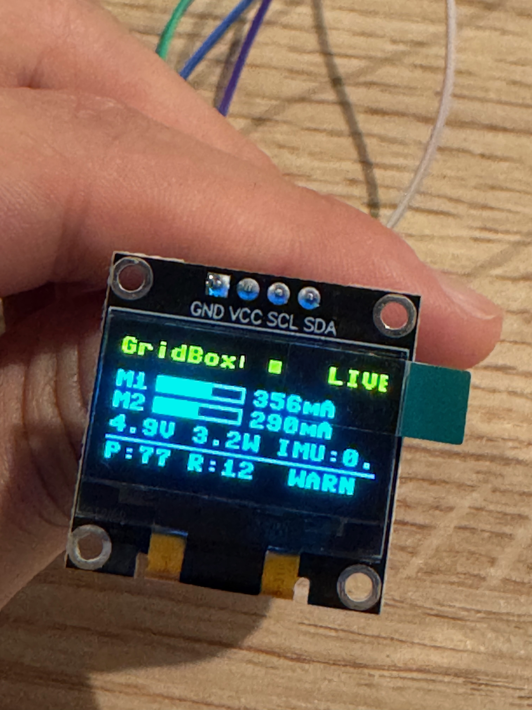
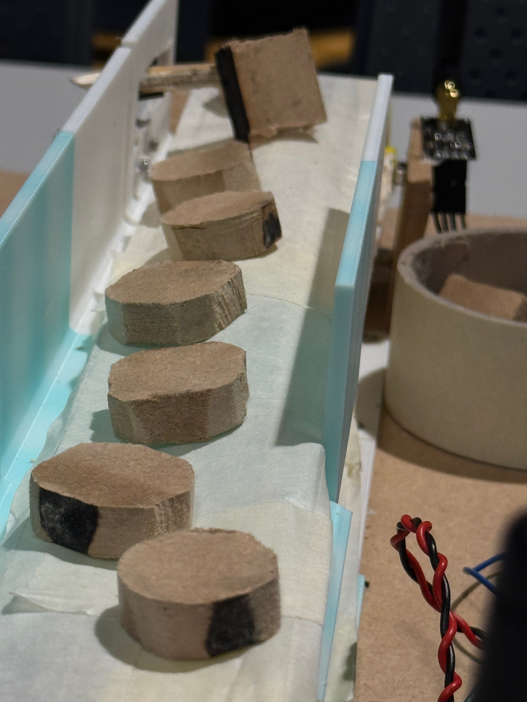
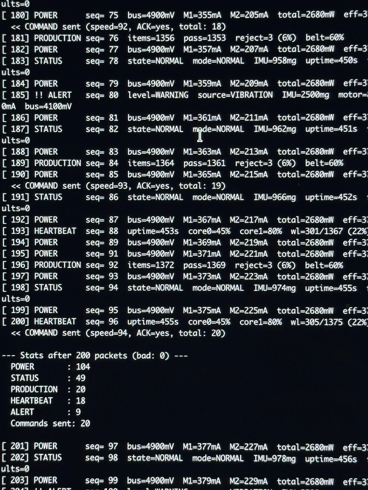
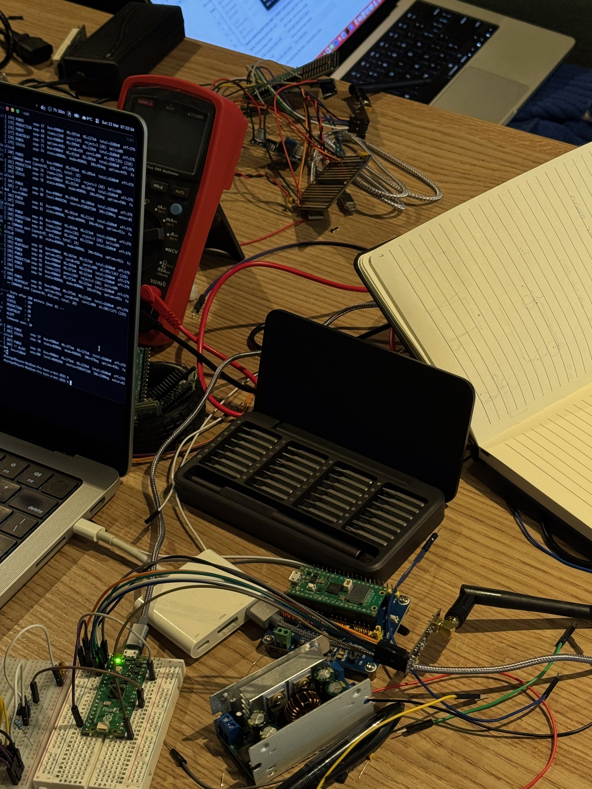
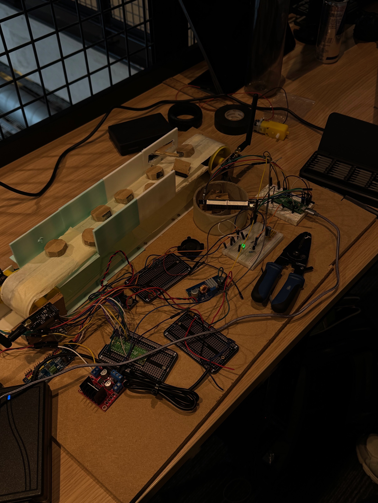
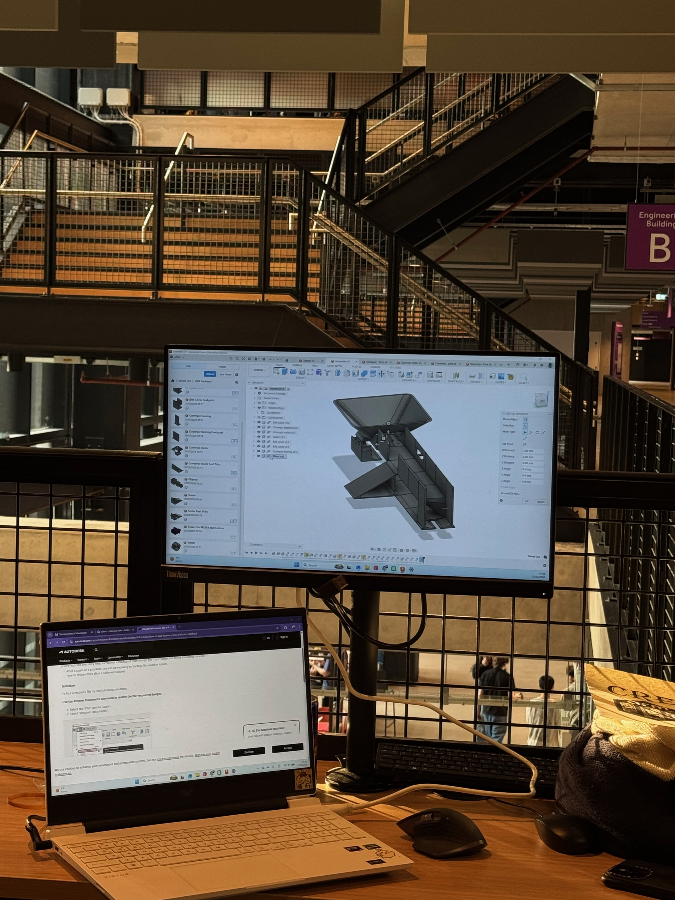
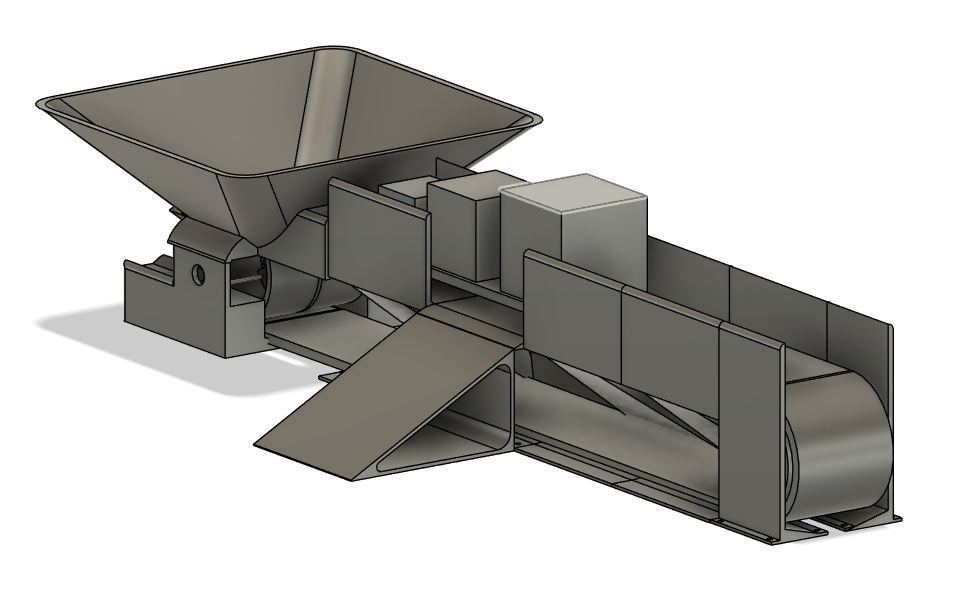

# GridBox — Smart Infrastructure Control System

<p align="center">
  <a href="https://hackabot-2026.com"></a>
  &nbsp;&nbsp;&nbsp;&nbsp;&nbsp;
  
</p>

<table>
<tr>
<td width="50%">

<br/>

</td>
<td width="50%">

### A £15 smart factory controller powered by recycled energy

Monitors, decides, and acts autonomously — replacing **£162K** of industrial equipment.

**What it does:**
- Senses power usage at every branch via ADC
- Autonomously reroutes excess energy via MOSFET switches
- Detects equipment faults via IMU vibration analysis
- Reports wirelessly to a SCADA dashboard

**Built with:**
- 2× Raspberry Pi Pico 2 (RP2350, dual-core ARM)
- nRF24L01+ wireless (custom 6-type datagram protocol)
- BMI160 IMU + PCA9685 PWM + SSD1306 OLED + MAX7219 7-segment
- MicroPython + C SDK firmware

**Team:** Doyun Gu (Lead) · Wooseong Jung (Electronics) · Billy Park (Mechatronics)

**24-hour hackathon** · 21 Mar 2026 12:00 — 22 Mar 2026 12:00

<a href="docs/01-overview/gridbox-design.md">Design Doc</a> · <a href="docs/01-overview/context.md">Project Context</a> · <a href="docs/02-electrical/wiring-connections.md">Wiring Guide</a> · <a href="docs/04-team/team-plan.md">Team Plan</a>

</td>
</tr>
</table>

---

## What We Built

GridBox is a miniature **smart factory** — a water bottling / sorting plant powered by recycled energy. Two Raspberry Pi Pico 2 boards work together wirelessly: one controls the factory floor, the other is a remote SCADA monitoring station.



### Key Features

| Feature | How It Works |
|---|---|
| **Smart power management** | ADC senses current at every branch. Pico reroutes excess power. $P \propto n^3$ — 20% slower = 49% less energy |
| **Autonomous fault detection** | IMU vibration monitoring (ISO 10816) + current signature analysis. Detects bearing wear, jams, loose connections |
| **Intelligent load shedding** | Bus voltage drops → system sheds non-essential loads by priority. Critical systems stay powered |
| **Weight-based sorting** | Motor current change = item weight. Timed servo gate sorts good/bad at the end of the belt |
| **Wireless SCADA** | 6-type binary datagram protocol at 50Hz. OLED dashboard with 5 views. MAX7219 7-segment live status display |
| **Failure simulator** | Inject faults during demo — judges watch the system handle wireless dropout, motor stall, power sag, IMU failure |
| **Web dashboard** | Live graphs on laptop via USB serial. SQLite database for persistent data logging |

### The Demo

| Step | What Happens |
|---|---|
| 1 | Power on — system auto-starts, motors spin, LEDs green |
| 2 | Wireless SCADA — Pico B display shows live speed, angle, fault status |
| 3 | Place items on conveyor — sorted by weight into PASS / REJECT bins |
| 4 | Shake motor — fault detected in <100ms, motor stops, power reroutes |
| 5 | Auto-recovery — vibration drops, system restores loads automatically |
| 6 | Energy summary — "Smart mode saved 69% energy vs dumb mode" |

---

## Themes

<p align="center">
  <strong>Sustainability</strong> — Smart energy management, waste reduction, recycled power<br/>
  <strong>Autonomy</strong> — Sense, decide, and act with zero human input
</p>

---

## Tech Stack

| Layer | Technology |
|---|---|
| **Microcontrollers** | 2× Raspberry Pi Pico 2 (RP2350, ARM Cortex-M33, dual-core) |
| **Wireless** | nRF24L01+ PA+LNA, 2.4GHz, custom 6-type binary datagram protocol |
| **Sensors** | BMI160 IMU (vibration), ADC (voltage + current via 1Ω sense resistors) |
| **Actuators** | 2× DC Motor (200RPM geared), 2× MG90S Servo, via PCA9685 PWM driver |
| **Display** | 0.96" SSD1306 OLED (128×64, 5 views) + MAX7219 8-digit 7-segment |
| **Switching** | Motor driver module + 2N2222 NPN transistor for energy recycling |
| **Firmware** | MicroPython (development) + C SDK (production demo) |
| **Dashboard** | Flask + SQLite + live graphs on laptop |
| **Power** | 12V PSU → LM2596S buck (5V logic) + 300W buck-boost (motor power) |

---

## Repository Structure

```
hack-a-bot-2026/
├── test.sh                         ← One command for all tests: ./test.sh led, ./test.sh oled, etc.
│
├── firmware/                       ← Frozen firmware snapshots (flash directly)
│   ├── 01-v1/                      ← MicroPython v1 (21 modules)
│   ├── 02-v2/                      ← + datagram protocol, self-test, A/B comparison
│   ├── 03-v3/                      ← + mock data, C stubs, integration test
│   └── 04-v4/                      ← + wireless verified, architecture diagrams
│
├── src/                            ← Development source code (11,500+ lines)
│   ├── master-pico/
│   │   ├── micropython/            ← Pico A: 14 MicroPython modules
│   │   ├── c_sdk/                  ← Pico A: C production firmware (5 drivers + main.c)
│   │   └── tests/                  ← 15 hardware test scripts
│   ├── slave-pico/
│   │   ├── micropython/            ← Pico B: 9 MicroPython modules
│   │   ├── c_sdk/                  ← Pico B: C production firmware (3 drivers + main.c)
│   │   └── tests/                  ← 6 display + wireless test scripts
│   ├── shared/protocol.py          ← 6-type binary datagram protocol (32-byte packets)
│   ├── web/                        ← Flask dashboard + SQLite + mock data generator
│   ├── hardware/electronics/       ← Circuit schematics + test logs (Wooseong)
│   ├── hardware/chassis/           ← CAD + 3D print files (Billy)
│   └── tools/                      ← setup-pico.sh, flash.sh, setup-pico1.sh
│
├── docs/
│   ├── 01-overview/                ← Design doc, proposal, context, quick-start, project summary
│   ├── 02-electrical/              ← Wiring, power system, datagram, debug, failure handling,
│   │                                  motor specs, wireless reliability, energy signature
│   ├── 03-factory/                 ← Factory design, conveyor calcs, weight sensing, demo script
│   ├── 04-team/                    ← Team plan + task lists
│   └── 05-archive/                 ← Past ideas explored
│
└── media/                          ← Build progress photos + demo videos
```

---

## Codebase Stats

**259 source files — 44,186 lines of code**

### By Language
| Language | Lines |
|---|---|
| Python | 36,799 |
| C/C++ | 5,673 |
| Shell | 928 |
| HTML | 786 |

### By Component
| Component | Lines | What |
|---|---|---|
| Firmware snapshots | 25,336 | 4 frozen releases (v1–v4) |
| Master Pico | 8,509 | MicroPython + C SDK + 15 tests |
| Slave Pico | 4,989 | MicroPython + C SDK + 6 tests |
| Demo | 1,674 | Integration demo scripts |
| Web Dashboard | 1,325 | Flask + SQLite + HTML |
| Tools/Scripts | 1,260 | Flash, build, test scripts |
| Shared Protocol | 358 | Wireless datagram protocol |

---

## Build Gallery

<table>
<tr>
<td align="center" width="33%"><br/><em>OLED SCADA display — live readings</em></td>
<td align="center" width="33%"><br/><em>Sorting conveyor with test objects</em></td>
<td align="center" width="33%"><br/><em>Wireless protocol — 200+ packets, 0 errors</em></td>
</tr>
<tr>
<td align="center" width="33%"><br/><em>Electronics workbench</em></td>
<td align="center" width="33%"><br/><em>Full integration — chassis + electronics</em></td>
<td align="center" width="33%"><br/><em>Billy designing chassis in Fusion 360</em></td>
</tr>
</table>

<p align="center">
<br/>
<em>CAD render — sorting conveyor designed by Billy Park in Fusion 360</em>
</p>

---

## Supported By

<table align="center">
<tr>
<td align="center"><a href="https://www.arm.com"></a></td>
<td align="center"><a href="https://manchesterstudentsunion.com/activities/view/eeesoc"></a></td>
<td align="center"><a href="https://www.manchester.ac.uk"></a></td>
<td align="center"><a href="https://www.makerspace.manchester.ac.uk"></a></td>
<td align="center"><a href="https://www.quanser.com"></a></td>
</tr>
<tr>
<td align="center"><a href="https://www.intechopen.com/profiles/213610"></a></td>
<td align="center"><a href="https://www.amentum.com"></a></td>
<td align="center"><a href="https://www.dominos.co.uk"></a></td>
<td align="center"><a href="https://manchesterstudentsunion.com/activities/view/robosoc"></a></td>
<td align="center"><a href="https://cradle.bio"></a></td>
</tr>
<tr>
<td align="center"><a href="https://gdg.community.dev"></a></td>
<td align="center"><a href="https://www.ukri.org"></a></td>
<td align="center"><a href="https://raico.org"></a></td>
<td align="center"><a href="https://www.redbull.com"></a></td>
<td align="center"></td>
</tr>
</table>

<p align="center">
  <em><a href="https://hackabot-2026.com">Hack-A-Bot 2026</a> — Project 6: Creative — University of Manchester</em>
</p>
