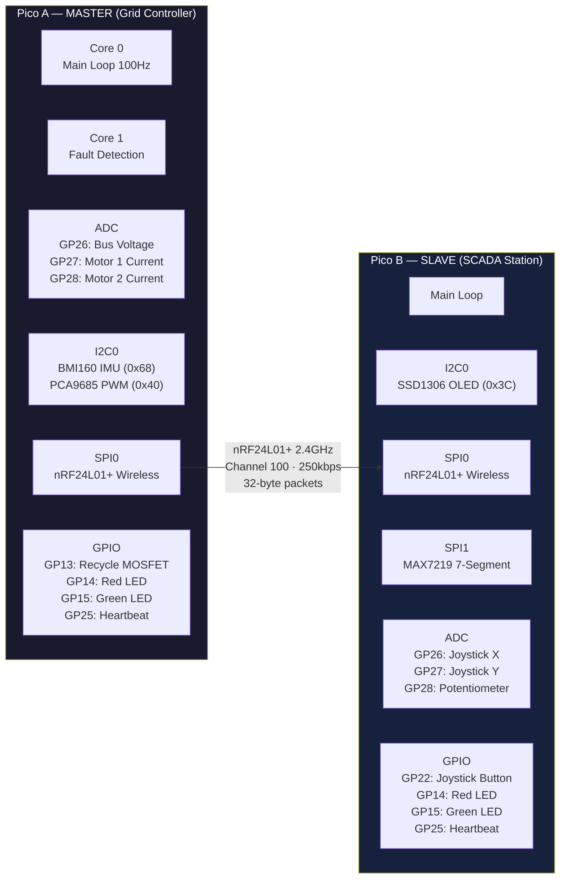
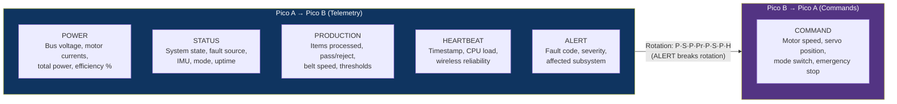
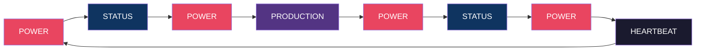
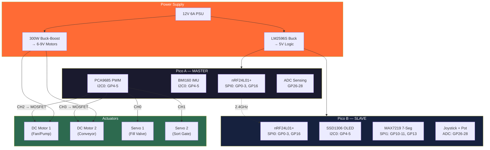
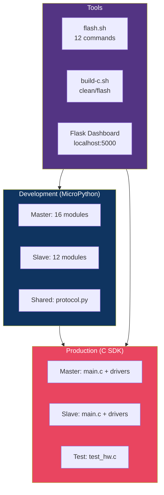
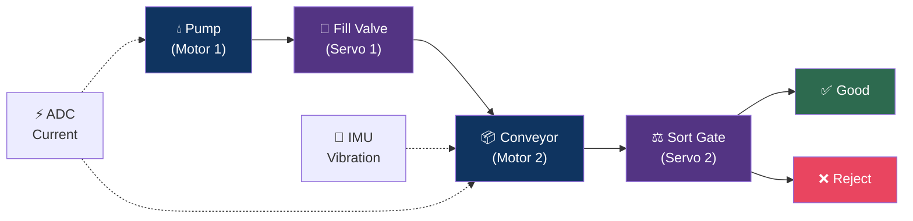

# GridBox — System Architecture Diagram

## Two-Pico Overview

## Wireless Protocol

## Packet Rotation Schedule

## Hardware Wiring

## Software Layers

## Demo Scenario: Smart Water Bottling Plant

