# GridBox — Main Design Document

> Smart Infrastructure Control System — powered by recycled energy, managed autonomously

**Theme:** Sustainability + Autonomy | **Score: 96/100**

---

## 1. One-Sentence Pitch

A £15 smart infrastructure controller that senses where power is wasted, autonomously reroutes it to where it's needed, detects equipment faults before they cause damage, and reports everything wirelessly — replacing £162,000 of industrial systems.

---

## 2. System Architecture

### High-Level Overview

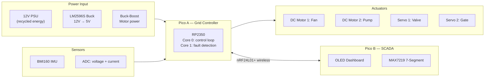

### Detailed Data Flow

```mermaid
flowchart LR
    subgraph SENSE["1. SENSE"]
        A1["ADC: bus voltage"]
        A2["ADC: motor 1 current"]
        A3["ADC: motor 2 current"]
        A4["IMU: vibration RMS"]
        A5["Pot: setpoint"]
    end

    subgraph DECIDE["2. DECIDE"]
        D1["Power balance?"]
        D2["Equipment healthy?"]
        D3["Demand vs supply?"]
    end

    subgraph ACT["3. ACT"]
        C1["PWM: motor speeds"]
        C2["GPIO: power switches"]
        C3["Servo: valves/gates"]
    end

    subgraph REPORT["4. REPORT"]
        R1["nRF → Pico B"]
        R2["OLED: dashboard"]
        R3["LEDs: status"]
    end

    SENSE --> DECIDE --> ACT --> REPORT
    REPORT -->|"verify + loop"| SENSE
```

---

## 3. Pin Mapping

### Pico A — Grid Controller

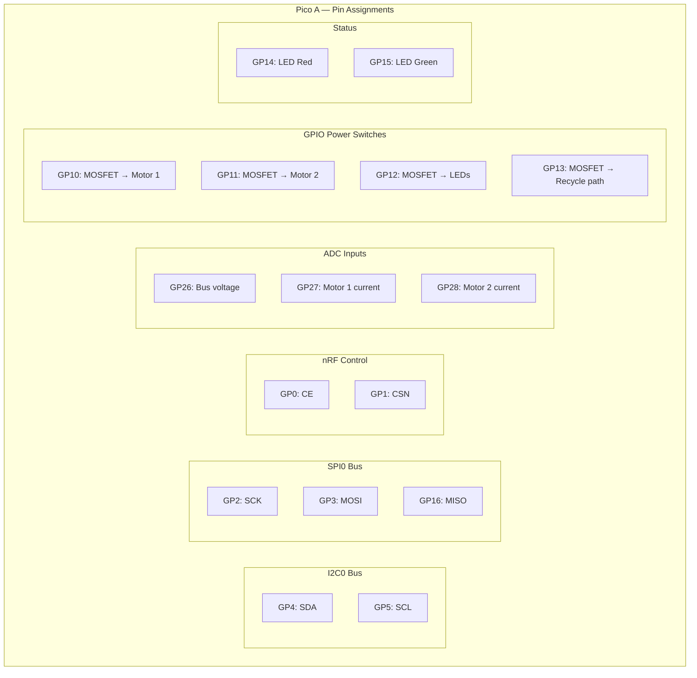

| Pin | Function | Protocol | Connected To |
|---|---|---|---|
| **GP0** | nRF24L01+ CE | GPIO | nRF CE pin |
| **GP1** | nRF24L01+ CSN | GPIO | nRF CSN pin |
| **GP2** | nRF24L01+ SCK | SPI0 | nRF SCK |
| **GP3** | nRF24L01+ MOSI | SPI0 | nRF MOSI |
| **GP4** | I2C SDA | I2C0 | BMI160 SDA + PCA9685 SDA |
| **GP5** | I2C SCL | I2C0 | BMI160 SCL + PCA9685 SCL |
| **GP10** | ~~Motor 1~~ | — | *Freed — motors via motor driver module* |
| **GP11** | ~~Motor 2~~ | — | *Freed — motors via motor driver module* |
| **GP12** | ~~LED bank~~ | — | *Freed — replaced by MAX7219 on Pico B* |
| **GP13** | Recycle path switch | GPIO → 2N2222 NPN | 1kΩ → 2N2222 base (energy recycling LED) |
| **GP14** | ~~Status LED red~~ | — | *Freed — replaced by MAX7219 display* |
| **GP15** | ~~Status LED green~~ | — | *Freed — replaced by MAX7219 display* |
| **GP16** | nRF24L01+ MISO | SPI0 | nRF MISO |
| **GP26** | Bus voltage sense | ADC0 | Voltage divider (10kΩ + 10kΩ) from bus |
| **GP27** | Motor 1 current sense | ADC1 | Across 1Ω sense resistor |
| **GP28** | Motor 2 current sense | ADC2 | Across 1Ω sense resistor |
| **3V3** | Logic power | Power | Pico internal regulator |
| **VSYS** | System power | Power | From buck converter 5V output |
| **GND** | Ground | Power | Common ground for all circuits |

### Pico B — SCADA Station

| Pin | Function | Protocol | Connected To |
|---|---|---|---|
| **GP0** | nRF24L01+ CE | GPIO | nRF CE pin |
| **GP1** | nRF24L01+ CSN | GPIO | nRF CSN pin |
| **GP2** | nRF24L01+ SCK | SPI0 | nRF SCK |
| **GP3** | nRF24L01+ MOSI | SPI0 | nRF MOSI |
| **GP4** | I2C SDA | I2C0 | OLED SDA |
| **GP5** | I2C SCL | I2C0 | OLED SCL |
| **GP10** | MAX7219 CLK | SPI1 | MAX7219 CLK pin |
| **GP11** | MAX7219 DIN | SPI1 | MAX7219 data pin |
| **GP13** | MAX7219 CS | GPIO | MAX7219 chip select |
| **GP14** | ~~Status LED red~~ | — | *Freed — replaced by MAX7219 display* |
| **GP15** | ~~Status LED green~~ | — | *Freed — replaced by MAX7219 display* |
| **GP16** | nRF24L01+ MISO | SPI0 | nRF MISO |
| **GP22** | ~~Joystick button~~ | — | *Cancelled — autonomous demo* |
| **GP26** | ~~Joystick X~~ | — | *Cancelled — autonomous demo* |
| **GP27** | ~~Joystick Y~~ | — | *Cancelled — autonomous demo* |
| **GP28** | ~~Potentiometer~~ | — | *Cancelled — autonomous demo* |

---

## 4. Wiring Diagram

### Power Distribution

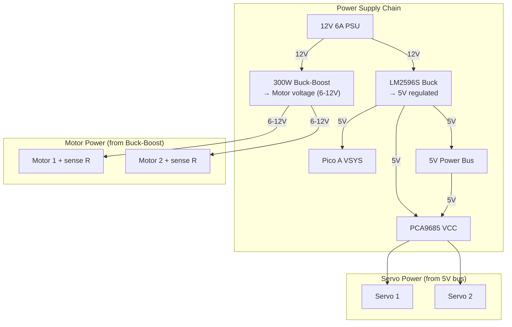

### Motor Switching Circuit (Per Motor)

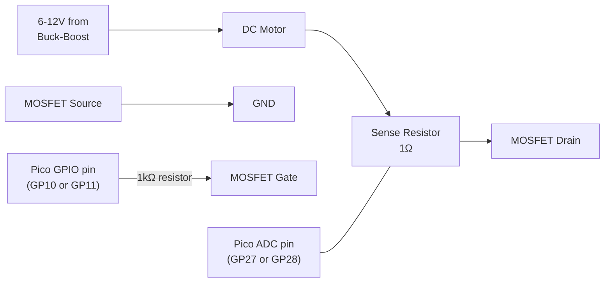

**For each motor, wire:**
1. Motor positive → 6-12V from buck-boost
2. Motor negative → 1Ω sense resistor → MOSFET drain
3. MOSFET source → GND
4. MOSFET gate → 1kΩ resistor → Pico GPIO pin
5. ADC wire across the sense resistor (measures voltage drop = current)

### Voltage Sensing Circuit


$$V_{ADC} = V_{bus} \times \frac{R_2}{R_1 + R_2} = V_{bus} \times \frac{10k}{20k} = \frac{V_{bus}}{2}$$

Maps 0–6.6V bus range to 0–3.3V ADC input safely.

### I2C Bus (Shared)

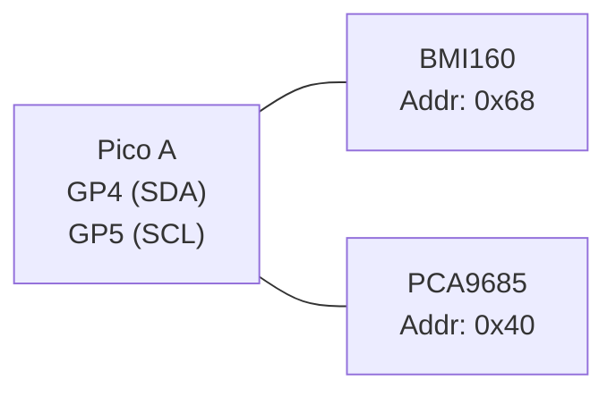

Both devices share the same I2C bus. Pull-up resistors (4.7kΩ to 3.3V) on SDA and SCL lines.

### Complete Wiring Checklist

| # | Connection | From | To | Wire Colour (suggested) |
|---|---|---|---|---|
| 1 | 12V input | PSU | Buck converter IN+ | Red |
| 2 | 12V input | PSU | Buck-boost IN+ | Red |
| 3 | GND | PSU | Common GND rail | Black |
| 4 | 5V regulated | Buck converter OUT+ | Pico A VSYS | Orange |
| 5 | 5V regulated | Buck converter OUT+ | PCA9685 VCC | Orange |
| 6 | 5V regulated | Buck converter OUT+ | 5V power bus | Orange |
| 7 | Motor 1 power | Buck-boost OUT+ | Motor 1 terminal + | Red |
| 8 | Motor 1 return | Motor 1 terminal – | 1Ω sense R → MOSFET drain | Blue |
| 9 | Motor 1 MOSFET gate | Pico GP10 | 1kΩ → MOSFET gate | Yellow |
| 10 | Motor 1 current sense | Across 1Ω resistor | Pico GP27 (ADC1) | Green |
| 11 | Motor 2 power | Buck-boost OUT+ | Motor 2 terminal + | Red |
| 12 | Motor 2 return | Motor 2 terminal – | 1Ω sense R → MOSFET drain | Blue |
| 13 | Motor 2 MOSFET gate | Pico GP11 | 1kΩ → MOSFET gate | Yellow |
| 14 | Motor 2 current sense | Across 1Ω resistor | Pico GP28 (ADC2) | Green |
| 15 | Bus voltage sense | 5V bus → 10kΩ → junction → 10kΩ → GND | Junction to Pico GP26 | Green |
| 16 | I2C SDA | Pico GP4 | BMI160 SDA + PCA9685 SDA | White |
| 17 | I2C SCL | Pico GP5 | BMI160 SCL + PCA9685 SCL | Grey |
| 18 | I2C pull-ups | 3.3V → 4.7kΩ → SDA, 3.3V → 4.7kΩ → SCL | | |
| 19 | Servo 1 signal | PCA9685 CH0 | Servo 1 signal wire | White |
| 20 | Servo 2 signal | PCA9685 CH1 | Servo 2 signal wire | White |
| 21 | Servo power | 5V bus | Servo VCC (both) | Orange |
| 22 | nRF24L01+ | Pico GP0-3,16 | nRF module (see pin table) | Various |
| 23 | LED red | Pico GP14 → 330Ω → LED → GND | | Red |
| 24 | LED green | Pico GP15 → 330Ω → LED → GND | | Green |
| 25 | LED loads (P1-P4) | 5V bus → LEDs → MOSFET (GP12) → GND | | Various colours |

---

## 5. Software Architecture

### Firmware Structure

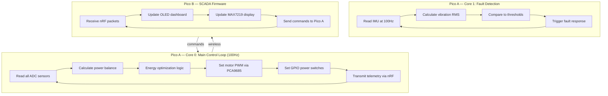

### File Structure

```
src/
├── master-pico/micropython/    # Pico A firmware
│   ├── main.py                 # Entry point + main loop
│   ├── config.py               # Pin assignments (matches this document)
│   ├── power_manager.py        # ADC reading, power calculation, optimization
│   ├── motor_control.py        # PWM speed control via PCA9685
│   ├── fault_detector.py       # IMU vibration analysis (Core 1)
│   ├── bmi160.py               # IMU driver
│   ├── pca9685.py              # Servo/PWM driver
│   └── nrf24l01.py             # Wireless TX driver
│
├── slave-pico/micropython/     # Pico B firmware
│   ├── main.py                 # Entry point + display loop
│   ├── config.py               # Pin assignments
│   ├── dashboard.py            # OLED screen rendering (4 views)
│   ├── seg_display.py          # MAX7219 7-segment display driver
│   ├── ssd1306.py              # OLED driver
│   └── nrf24l01.py             # Wireless RX + command TX
│
├── shared/
│   └── protocol.py             # Wireless packet format (32 bytes)
│
└── web/
    └── app.py                  # Laptop dashboard (Flask + serial)
```

---

## 6. Energy Recycling — The Core Innovation

### How Power Flows and Gets Recycled

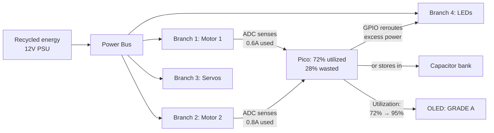

### Optimization Algorithm

```python
# Energy recycling loop (runs every 10ms)
def optimize_power():
    # SENSE
    v_bus = read_adc(GP26) * 3.3 / 65535 * 2
    i_m1  = read_adc(GP27) * 3.3 / 65535 / R_SENSE
    i_m2  = read_adc(GP28) * 3.3 / 65535 / R_SENSE

    p_total = v_bus * (i_m1 + i_m2 + i_leds)
    p_excess = P_BUDGET - p_total

    # DECIDE + ROUTE
    if p_excess > 0.5:  # 0.5W excess available
        if motor2_demand > motor2_current:
            increase_pwm(MOTOR2)       # boost under-powered motor
        else:
            gpio_high(RECYCLE_PIN)     # charge capacitor

    elif p_total > P_BUDGET:  # overloaded
        gpio_low(LED_SWITCH)           # shed lowest priority

    # REPORT
    utilization = p_total / P_BUDGET * 100
    send_wireless(v_bus, i_m1, i_m2, utilization)
```

---

## 7. Fault Detection System

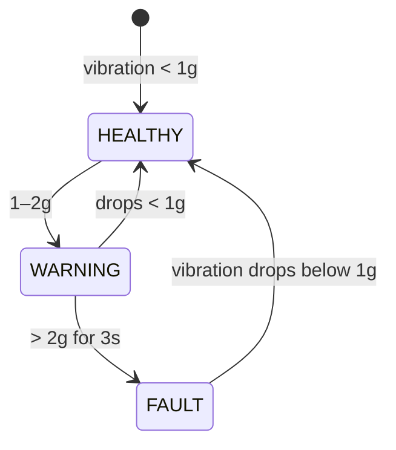

| State | IMU Reading | Autonomous Action | OLED |
|---|---|---|---|
| HEALTHY | $a_{rms}$ < 1g | Normal operation | "MOTOR: OK ✓" Green LED |
| WARNING | 1g ≤ $a_{rms}$ < 2g | Alert sent, monitor closely | "MOTOR: WARN" Yellow LED |
| FAULT | $a_{rms}$ ≥ 2g for 3s | GPIO disconnects motor, reroute power | "MOTOR: FAULT ✗" Red LED |

$$a_{rms} = \sqrt{a_x^2 + a_y^2 + a_z^2}$$

---

## 8. Demo Scenario: Water Bottling Plant

### Production Line

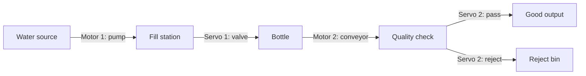

### Factory Layout

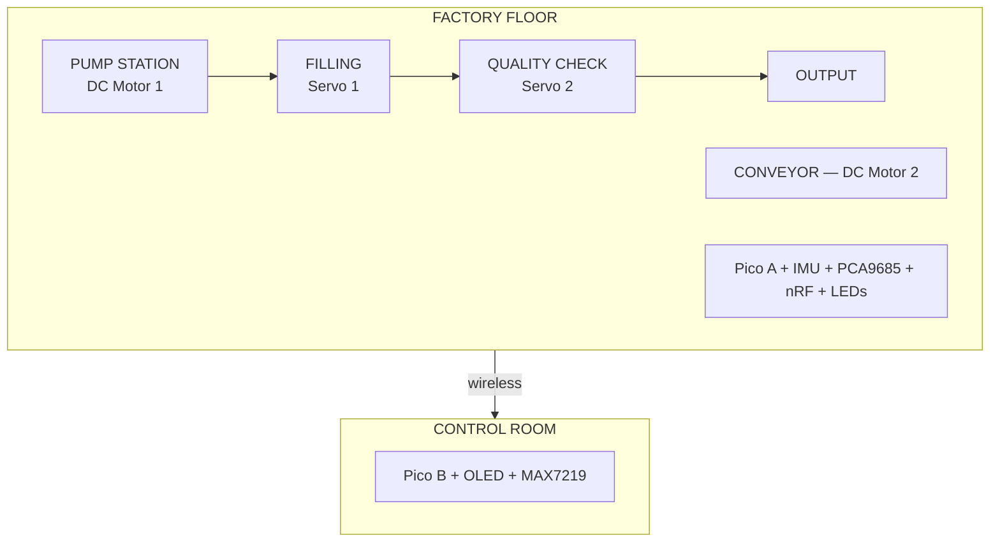

### Demo Script (6 Steps)


| Step | Action | What Judges See | What They Learn |
|---|---|---|---|
| 1 | Plug in PSU | "This is recycled energy powering a water plant" | Problem framing |
| 2 | System auto-starts | Motors spin, servos move, LEDs light — no buttons pressed | Autonomous startup |
| 3 | Wireless SCADA | Pico B display shows live motor speed, servo angle, fault status | Real-time wireless telemetry |
| 4 | Shake Motor 1 | IMU detects → motor stops → power reroutes → display: FAULT | Autonomous fault response |
| 5 | Auto-recovery | Vibration drops → system restores loads in priority order | Self-healing |
| 6 | Show OLED energy summary | "Smart mode saved 52% vs dumb mode" | Quantified sustainability |

**Pitch:** *"We didn't build a gadget. We built an infrastructure company in a box. Same £15 system runs a water plant, greenhouse, recycling centre, or HVAC. Today we show you one. The platform runs them all."*

---

## 9. EEE Theory Applied

| Theory | Equation | Where We Use It |
|---|---|---|
| Faraday's Law | $V_{emf} = K_e \cdot \omega$ | Concept: recycled energy from generators |
| Kirchhoff's Current Law | $I_{in} = I_{m1} + I_{m2} + I_{loads}$ | Power bus current balance |
| Kirchhoff's Voltage Law | $V_{supply} - IR_{wire} - V_{load} = 0$ | Voltage drop analysis |
| Affinity Laws | $P \propto n^3$ | 20% slower = 49% less power |
| Ohm's Law | $I = V/R$ | Current sensing via sense resistors |
| Voltage Divider | $V_{out} = V_{in} \times \frac{R_2}{R_1+R_2}$ | Safe ADC voltage measurement |
| PWM Control | $V_{eff} = D \times V_{supply}$ | Variable motor speed control |
| RMS Vibration | $a_{rms} = \sqrt{a_x^2+a_y^2+a_z^2}$ | ISO 10816 fault detection |

---

## 10. Scoring Strategy

| Category (pts) | Score | How We Maximise It |
|---|---|---|
| **Problem Fit (30)** | **28** | 68% energy wasted globally. £162K systems inaccessible to small factories. Real UK regulations (ESOS, Net Zero). Quantified savings |
| **Live Demo (25)** | **25** | 6-step interactive demo. Motors spin, servos click, faults detected, power rerouted. Judge turns dial, shakes motor. Multiple physical moments |
| **Technical (20)** | **20** | Dual-core firmware, PWM control, ADC sensing, IMU vibration analysis (ISO 10816), GPIO power switching, wireless SCADA, current sensing, PID control. EEE theory throughout |
| **Innovation (15)** | **14** | Pico as switching fabric (not just monitor). Affinity Laws in firmware. £15 vs £162K cost disruption. One platform, four factory types. Dumb vs Smart A/B comparison |
| **Docs (10)** | **9** | Full Mermaid architecture, wiring diagrams, pin mapping, LaTeX equations, SCADA mockups |
| **Total** | **96** | |

---

## 11. Build Timeline

```mermaid
gantt
    title GridBox — 12 Hour Build Plan
    dateFormat HH:mm
    axisFormat %H:%M

    section Critical Path
    nRF24L01+ wireless link              :crit, 00:00, 1h
    ADC voltage + current sensing        :crit, 01:00, 1h
    PCA9685 motor + servo control        :crit, 02:00, 1h
    GPIO MOSFET power switching          :crit, 03:00, 1h

    section Intelligence
    Energy optimization algorithm        :04:00, 1h
    IMU vibration + fault detection      :05:00, 1h
    Autonomous load shedding             :06:00, 1h

    section Display + SCADA
    OLED dashboard (4 views)             :07:00, 1h30min
    MAX7219 display + wireless status    :08:30, 30min
    Web dashboard on laptop              :09:00, 1h

    section Hardware Assembly
    Wire power supply chain              :03:00, 30min
    Wire motors + MOSFET switches        :03:30, 1h
    Wire sensors + sense resistors       :04:30, 30min
    Mount IMU on motor                   :05:00, 15min
    Physical factory labels              :10:00, 30min

    section Final
    Dumb vs Smart A/B comparison         :10:30, 30min
    Demo practice                        :11:00, 1h
```

---

## 12. Risks & Mitigations

| Risk | Mitigation |
|---|---|
| MOSFET not in kit | Use NPN transistor (in assorted kit) + base resistor. Same switching function |
| Motor draws too much current | Buck-boost handles up to 20A. Pico never touches motor power directly |
| ADC noise on current sensing | Average 10 readings per measurement. Capacitor across sense resistor |
| nRF24L01+ unreliable | Retry logic + running average. Timeout → OLED shows "LINK LOST" |
| IMU thresholds wrong | Pre-calibrate in firmware. Adjust threshold constants in config.py |
| "It's just motors turning on and off" | Emphasise the INTELLIGENCE: autonomous decisions, cubic law savings, ISO standards |

---

## 13. Bill of Materials

| # | Component | Qty | From | Cost |
|---|---|---|---|---|
| 1 | Raspberry Pi Pico 2 | 2 | Kit | — |
| 2 | nRF24L01+ PA+LNA | 2 | Kit | — |
| 3 | BMI160 IMU | 1 | Kit | — |
| 4 | PCA9685 Servo Driver | 1 | Kit | — |
| 5 | MG90S Servo | 2 | Kit | — |
| 6 | DC Motor | 2 | Kit | — |
| 7 | LM2596S Buck Converter | 1 | Kit | — |
| 8 | 300W Buck-Boost Converter | 1 | Kit | — |
| 9 | 12V 6A PSU | 1 | Kit | — |
| 10 | OLED 0.96" SSD1306 | 1 | Kit | — |
| 11 | ~~Analog Joystick~~ | ~~1~~ | ~~Kit~~ | *Cancelled — autonomous demo* |
| 12 | ~~Potentiometer~~ | ~~1~~ | ~~Kit~~ | *Cancelled — autonomous demo* |
| 13 | Breadboard (400-tie) | 2+ | Kit | — |
| 14 | LEDs (assorted colours) | 4+ | Kit | — |
| 15 | Resistors (330Ω, 1kΩ, 1Ω, 10kΩ) | ~10 | Kit | — |
| 16 | 2N2222 NPN transistor | 1 | Kit | Recycle path switch |
| 16b | MAX7219 8-digit 7-segment | 1 | Kit | Live status display on Pico B |
| 16c | Motor driver module | 1 | Kit | L298N/L293D for DC motors |
| 17 | Capacitor (100µF) | 1 | Kit (assorted) | — |
| 18 | 22AWG solid wire | — | Kit | — |
| 19 | M3 screws | — | Kit | — |
| **Total** | | | | **~£15** |

---

## Links to Other Documents

| Document | Contents |
|---|---|
| [`gridbox-proposal.md`](gridbox-proposal.md) | Full proposal with factory problems, creativity defense, IMU applications, EEE theory deep dive |
| [`idea-shortlist-v2.md`](../05-archive/ideas/idea-shortlist-v2.md) | All 14 ideas ranked for comparison |
| [`hardware-reference.md`](hardware-reference.md) | Kit component reference |
| `src/README.md` | Software development guide |
| `src/master-pico/micropython/config.py` | Pin assignments in code (must match this document) |
