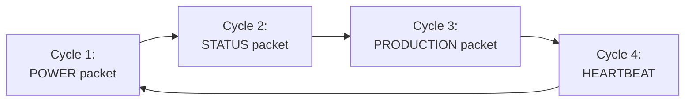

# Datagram Design — Wireless Communication Protocol

> How Pico A and Pico B communicate effectively over 32-byte nRF24L01+ packets.

---

## The Constraint

nRF24L01+ has a **hard 32-byte maximum** per packet. We can't send everything in one packet. Solution: **multiple packet types that rotate** on a schedule.

---

## Packet Type Rotation

Pico A sends packets at 50Hz (every 20ms). Different types rotate:



Each packet type is sent **~12 times per second**. Fast enough for live dashboard updates.

| Cycle | Packet Type | What It Contains | Priority |
|---|---|---|---|
| 1 | POWER | Motor currents, bus voltage, power per branch | Every cycle (critical) |
| 2 | STATUS | System state, fault level, IMU health, energy signature score | Every cycle |
| 3 | PRODUCTION | Sort stats, last item weight, pass/reject counts | Every 2nd cycle |
| 4 | HEARTBEAT | Timestamp, uptime, alive check | Every 4th cycle |
| Any | ALERT | Immediate fault alert — sent instantly, breaks rotation | On fault only |
| Any | COMMAND (B→A) | Operator override, threshold change, reset | On input only |

---

## Packet Formats (All 32 bytes)

### Common Header (first 2 bytes of every packet)

| Byte | Field | Type | Description |
|---|---|---|---|
| 0 | `pkt_type` | uint8 | Packet type identifier |
| 1 | `sequence` | uint8 | Sequence number (0-255, wraps) for packet loss detection |

### Type 0x01: POWER Packet (Pico A → B)

Real-time power measurements. Sent every cycle.

| Byte | Field | Type | Unit | Description |
|---|---|---|---|---|
| 0 | pkt_type | uint8 | — | 0x01 |
| 1 | sequence | uint8 | — | Counter |
| 2-3 | bus_voltage_mv | uint16 | mV | Bus voltage × 1000 (e.g., 4900 = 4.9V) |
| 4-5 | motor1_current_ma | uint16 | mA | Motor 1 current |
| 6-7 | motor2_current_ma | uint16 | mA | Motor 2 current |
| 8-9 | motor1_power_mw | uint16 | mW | Motor 1 power |
| 10-11 | motor2_power_mw | uint16 | mW | Motor 2 power |
| 12-13 | total_power_mw | uint16 | mW | Total system power |
| 14-15 | excess_power_mw | uint16 | mW | Available for rerouting |
| 16 | motor1_speed_pct | uint8 | % | Motor 1 PWM duty (0-100) |
| 17 | motor2_speed_pct | uint8 | % | Motor 2 PWM duty (0-100) |
| 18 | servo1_angle | uint8 | degrees | Servo 1 position (0-180) |
| 19 | servo2_angle | uint8 | degrees | Servo 2 position (0-180) |
| 20 | efficiency_pct | uint8 | % | Power efficiency (0-100) |
| 21 | led_bank_state | uint8 | bitfield | Which LEDs are on (bit per LED) |
| 22 | mosfet_state | uint8 | bitfield | Which MOSFETs are on (bit 0=M1, 1=M2, 2=LED, 3=recycle) |
| 23-31 | reserved | 9 bytes | — | Future use |

```python
POWER_FORMAT = '<BBHHHHHHHBBBBBBBxxxxxxxxx'
# B=type, B=seq, H=busV, H=m1I, H=m2I, H=m1P, H=m2P, H=totP, H=excP,
# B=m1spd, B=m2spd, B=s1ang, B=s2ang, B=eff, B=leds, B=mosfets, 9x pad
```

### Type 0x02: STATUS Packet (Pico A → B)

System health and fault information. Sent every cycle.

| Byte | Field | Type | Unit | Description |
|---|---|---|---|---|
| 0 | pkt_type | uint8 | — | 0x02 |
| 1 | sequence | uint8 | — | Counter |
| 2 | system_state | uint8 | enum | 0=NORMAL, 1=DRIFT, 2=WARNING, 3=FAULT, 4=EMERGENCY |
| 3 | fault_source | uint8 | enum | What caused the fault (0=none, 1=vibration, 2=overcurrent, 3=undervoltage, 4=intermittent, 5=jam) |
| 4-5 | imu_rms_mg | uint16 | mg | IMU a_rms × 1000 (e.g., 1500 = 1.5g) |
| 6 | imu_state | uint8 | enum | 0=HEALTHY, 1=WARNING, 2=FAULT |
| 7-8 | es_score_x100 | uint16 | ×100 | Energy signature divergence score × 100 (e.g., 45 = 0.45) |
| 9 | es_classification | uint8 | enum | 0=HEALTHY, 1=DRIFT, 2=PREFAULT, 3=FAULT |
| 10-11 | es_mean_current_ma | uint16 | mA | Energy signature mean current |
| 12-13 | es_std_current_ma | uint16 | mA | Energy signature std current |
| 14 | shedding_level | uint8 | 0-4 | Load shedding level (0=none, 4=emergency) |
| 15 | mode | uint8 | enum | Operating mode (NORMAL, DUMB, MANUAL, etc.) |
| 16-19 | uptime_s | uint32 | seconds | System uptime |
| 20 | faults_today | uint8 | count | Total faults detected today |
| 21 | reroute_active | uint8 | bool | Power rerouting in progress |
| 22-31 | reserved | 10 bytes | — | Future use |

### Type 0x03: PRODUCTION Packet (Pico A → B)

Sorting and production statistics. Sent every 2nd cycle.

| Byte | Field | Type | Unit | Description |
|---|---|---|---|---|
| 0 | pkt_type | uint8 | — | 0x03 |
| 1 | sequence | uint8 | — | Counter |
| 2-3 | total_items | uint16 | count | Total items sorted |
| 4-5 | passed_items | uint16 | count | Items that passed |
| 6-7 | rejected_items | uint16 | count | Items rejected |
| 8 | reject_rate_pct | uint8 | % | Reject rate (0-100) |
| 9-10 | last_weight_mg | uint16 | mg | Last item weight in milligrams |
| 11 | last_result | uint8 | enum | 0=PASS, 1=REJECT_HEAVY, 2=REJECT_LIGHT, 3=JAM |
| 12 | belt_speed_pct | uint8 | % | Current belt speed |
| 13-14 | threshold_min_mg | uint16 | mg | Minimum acceptable weight |
| 15-16 | threshold_max_mg | uint16 | mg | Maximum acceptable weight |
| 17 | station_active | uint8 | 0-4 | Which LED station is currently lit |
| 18 | sorting_active | uint8 | bool | Sorting cycle in progress |
| 19-31 | reserved | 13 bytes | — | Future use |

### Type 0x04: HEARTBEAT Packet (Pico A → B)

Alive check. Sent every 4th cycle.

| Byte | Field | Type | Description |
|---|---|---|---|
| 0 | pkt_type | uint8 | 0x04 |
| 1 | sequence | uint8 | Counter |
| 2-5 | timestamp_ms | uint32 | Millisecond timestamp |
| 6-9 | uptime_s | uint32 | Seconds since boot |
| 10 | core0_load_pct | uint8 | Core 0 CPU usage estimate |
| 11 | core1_load_pct | uint8 | Core 1 CPU usage estimate |
| 12-31 | reserved | 20 bytes | — |

### Type 0x05: ALERT Packet (Pico A → B)

Immediate fault notification. Breaks rotation — sent instantly when fault detected.

| Byte | Field | Type | Description |
|---|---|---|---|
| 0 | pkt_type | uint8 | 0x05 |
| 1 | sequence | uint8 | Counter |
| 2 | alert_level | uint8 | 0=INFO, 1=WARNING, 2=FAULT, 3=EMERGENCY |
| 3 | alert_source | uint8 | Same as fault_source enum |
| 4-7 | timestamp_ms | uint32 | When the fault occurred |
| 8-9 | imu_rms_mg | uint16 | IMU value at fault time |
| 10-11 | motor_current_ma | uint16 | Motor current at fault time |
| 12-13 | bus_voltage_mv | uint16 | Bus voltage at fault time |
| 14 | action_taken | uint8 | Bitfield: bit0=motor_stopped, bit1=load_shed, bit2=rerouted |
| 15-31 | reserved | 17 bytes | — |

### Type 0x10: COMMAND Packet (Pico B → A)

Operator commands from SCADA station.

| Byte | Field | Type | Description |
|---|---|---|---|
| 0 | pkt_type | uint8 | 0x10 |
| 1 | sequence | uint8 | Counter |
| 2 | cmd_type | uint8 | Command identifier (see table below) |
| 3 | target | uint8 | Target device (0=system, 1=motor1, 2=motor2, 3=servo1, 4=servo2) |
| 4-5 | value | uint16 | Command value (speed %, angle, threshold, etc.) |
| 6 | mode | uint8 | Operating mode (for CMD_SET_MODE) |
| 7-31 | reserved | 25 bytes | — |

| cmd_type | Name | target | value |
|---|---|---|---|
| 0x01 | SET_SPEED | motor_id (1 or 2) | speed % (0-100) |
| 0x02 | SET_SERVO | servo_id (1 or 2) | angle (0-180) |
| 0x03 | SET_THRESHOLD | 0 (min) or 1 (max) | weight in mg |
| 0x04 | RESET_FAULT | 0 | 0 |
| 0x05 | SET_MODE | 0 | mode enum |
| 0x06 | EMERGENCY_STOP | 0 | 0 |
| 0x07 | START_CALIBRATION | 0 | 0 |
| 0x08 | START_LEARNING | 0 | duration_s |

---

## Packet Rotation Schedule

At 50Hz (20ms per packet), the rotation looks like:

| ms | Packet Sent | Data Updated On OLED |
|---|---|---|
| 0 | POWER | Motor currents, power bars |
| 20 | STATUS | Fault state, IMU health |
| 40 | POWER | Motor currents refresh |
| 60 | PRODUCTION | Sort stats, item count |
| 80 | POWER | Motor currents refresh |
| 100 | STATUS | Fault state refresh |
| 120 | POWER | Motor currents refresh |
| 140 | HEARTBEAT | Connection alive |
| ... | repeat | |

POWER is sent most often (25Hz) because motor currents change fastest. PRODUCTION is least frequent (6Hz) because sort stats change slowly.

**ALERT packets break the rotation** — if a fault occurs, ALERT is sent immediately regardless of schedule.

**COMMAND packets are sent on demand** — only when the operator moves the joystick or presses a button.

---

## Data Efficiency

| | Old Protocol | New Datagram |
|---|---|---|
| Useful data per packet | ~20 bytes (8 bytes padding) | ~22-28 bytes (minimal padding) |
| Data types | 1 (everything crammed in) | 6 (optimised per type) |
| Motor current resolution | float (4 bytes, overkill) | uint16 mA (2 bytes, sufficient) |
| Measurements per second | 50 (all same data) | 25 power + 12 status + 6 production + 3 heartbeat |
| Total unique data points | ~10 fields | ~45 fields across all types |
| Command types | 5 (limited) | 8 (comprehensive) |

**4.5× more data** in the same bandwidth.

---

## Implementation

```python
# Packet type constants
PKT_POWER = 0x01
PKT_STATUS = 0x02
PKT_PRODUCTION = 0x03
PKT_HEARTBEAT = 0x04
PKT_ALERT = 0x05
PKT_COMMAND = 0x10

# Pack formats
FMT_POWER = '<BBHHHHHHHBBBBBBB9x'       # 32 bytes
FMT_STATUS = '<BBBBHBHHBBIBBx10x'        # 32 bytes
FMT_PRODUCTION = '<BBHHH B HB HH BB 13x' # 32 bytes
FMT_HEARTBEAT = '<BBIIBBB20x'            # 32 bytes
FMT_ALERT = '<BBBBIHHH Bx17x'            # 32 bytes
FMT_COMMAND = '<BBBB HB 25x'             # 32 bytes

# Rotation schedule on Pico A
rotation = [PKT_POWER, PKT_STATUS, PKT_POWER, PKT_PRODUCTION,
            PKT_POWER, PKT_STATUS, PKT_POWER, PKT_HEARTBEAT]
cycle_index = 0

def send_next_packet():
    global cycle_index
    pkt_type = rotation[cycle_index % len(rotation)]
    cycle_index += 1

    if pkt_type == PKT_POWER:
        data = pack_power(bus_mv, m1_ma, m2_ma, ...)
    elif pkt_type == PKT_STATUS:
        data = pack_status(state, imu_rms, es_score, ...)
    elif pkt_type == PKT_PRODUCTION:
        data = pack_production(total, passed, rejected, ...)
    elif pkt_type == PKT_HEARTBEAT:
        data = pack_heartbeat(time_ms, uptime_s, ...)

    nrf.send(data)
```

---

## Why This Matters for Judges

| What We Say | Why It's Impressive |
|---|---|
| "We designed a custom datagram protocol" | Shows real network engineering thinking |
| "6 packet types rotating at 50Hz" | Shows understanding of bandwidth management |
| "ALERT packets break rotation for instant fault notification" | Shows priority-based communication design |
| "4.5× more data in the same 32-byte bandwidth" | Shows optimisation skills |
| "uint16 instead of float saves 50% per measurement" | Shows embedded systems awareness — every byte matters |
