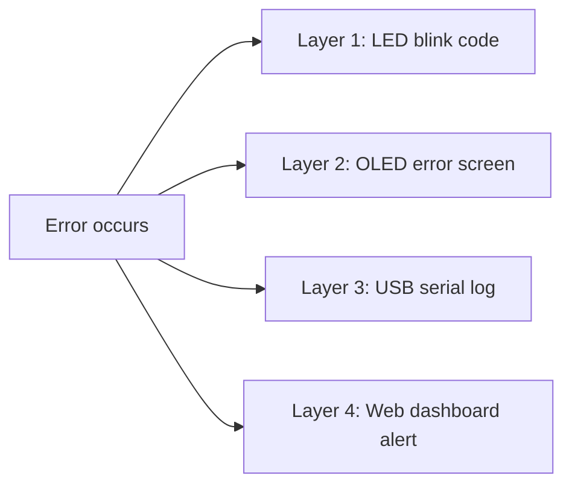
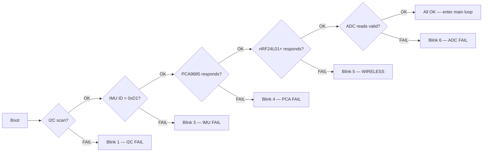

# Debug System — Error Identification & Diagnosis

> How to identify what's wrong without a screen, without a laptop, just by looking at the device.

---

## The Problem

During the hackathon, things WILL break. You need to know **instantly** what's wrong without connecting a laptop. The device must tell you through LEDs, servo positions, and OLED messages.

---

## Debug Layer Architecture



| Layer | What | When to Use | Needs |
|---|---|---|---|
| **Layer 1: LED blink** | Red LED blinks a pattern | Always — works even if OLED/wireless broken | Just eyes |
| **Layer 2: OLED message** | Error text on screen | When OLED is working | Look at Pico B |
| **Layer 3: Serial log** | Detailed error in terminal | When USB connected to laptop | `mpremote repl` |
| **Layer 4: Web dashboard** | Error highlighted on webpage | When Flask running on laptop | Browser |

---

## Layer 1: LED Blink Error Codes

The red LED on Pico A (GP14) blinks a pattern to identify the error. **No laptop needed — just count the blinks.**

### Blink Pattern: [N fast blinks] — [pause] — [repeat]

| Blinks | Error | Meaning | Fix |
|---|---|---|---|
| 1 | **I2C FAIL** | BMI160 or PCA9685 not responding | Check SDA (GP4), SCL (GP5), pull-ups (4.7kΩ), power |
| 2 | **SPI FAIL** | nRF24L01+ not responding | Check SCK (GP2), MOSI (GP3), MISO (GP16), CSN (GP1), CE (GP0) |
| 3 | **IMU FAIL** | BMI160 init failed or wrong chip ID | Check I2C address (0x68 vs 0x69), reseat sensor |
| 4 | **PCA FAIL** | PCA9685 init failed | Check I2C address (0x40), power to PCA9685 |
| 5 | **WIRELESS FAIL** | nRF24L01+ can't send/receive | Check 3.3V power (NOT 5V!), antenna, channel match |
| 6 | **ADC FAIL** | ADC readings out of range | Check voltage divider, sense resistors, pin connections |
| 7 | **MOTOR STALL** | Motor drawing >800mA (jam) | Check motor path, remove obstruction, MOSFET gate |
| 8 | **OLED FAIL** | SSD1306 not responding (Pico B) | Check I2C on Pico B, OLED power |
| SOLID ON | **EMERGENCY** | Multiple faults, system stopped | Full reset needed — check everything |
| FAST FLASH | **BOOT FAIL** | main.py crashed at startup | Connect USB, check `mpremote repl` for traceback |

### Implementation

```python
def blink_error(led_pin, code, repeat=3):
    """Blink error code on LED. N blinks = error type."""
    for _ in range(repeat):
        for _ in range(code):
            led_pin.value(1)
            time.sleep_ms(150)
            led_pin.value(0)
            time.sleep_ms(150)
        time.sleep_ms(800)  # pause between repeats
```

### Green LED Patterns (Pico A)

| Pattern | Meaning |
|---|---|
| Solid ON | System running normally |
| Slow blink (1Hz) | Idle / waiting for calibration |
| Fast blink (4Hz) | Calibrating / learning baseline |
| OFF | System stopped or in fault |

### Green LED Patterns (Pico B)

| Pattern | Meaning |
|---|---|
| Solid ON | Wireless link active, receiving packets |
| Slow blink | Waiting for first packet from Pico A |
| OFF | Link lost (no packets for 3s) |

---

## Layer 2: OLED Error Messages

When OLED works, show the error directly:

```
ERROR: I2C FAIL
━━━━━━━━━━━━━━━━
Device: BMI160
Addr: 0x68
Pin SDA: GP4
Pin SCL: GP5
━━━━━━━━━━━━━━━━
Check: wiring
       pull-ups
       power 3.3V
```

### Error Screen Function

```python
def show_error(oled, title, device, details, fixes):
    """Display error info on OLED."""
    oled.fill(0)
    oled.text("ERR:" + title, 0, 0)
    oled.hline(0, 9, 128, 1)
    oled.text("Dev:" + device, 0, 12)
    for i, line in enumerate(details[:3]):
        oled.text(line, 0, 24 + i * 10)
    oled.hline(0, 48, 128, 1)
    for i, fix in enumerate(fixes[:2]):
        oled.text(fix, 0, 52 + i * 8)
    oled.show()
```

---

## Layer 3: Serial Debug Log

Every module prints tagged messages over USB serial:

```
[MASTER] Initialising hardware...
[MASTER] I2C devices: ['0x40', '0x68']
[MASTER] BMI160 OK (ID=0xD1)
[MASTER] PCA9685 OK
[MASTER] nRF24L01+ OK
[MASTER] Power manager OK
[MASTER] Entering main loop (100Hz)
```

When errors occur:

```
[MASTER] ERROR: BMI160 not found on I2C
[MASTER]   Expected addr: 0x68
[MASTER]   Devices found: ['0x40']
[MASTER]   → Check: SDA/SCL wiring, IMU power, solder joints
[MASTER]   → Blink code: 3 (IMU FAIL)
```

### Debug Levels

```python
DEBUG_LEVEL = 2  # 0=silent, 1=errors only, 2=info, 3=verbose

def debug(module, msg, level=2):
    if level <= DEBUG_LEVEL:
        prefix = {0: "SILENT", 1: "ERROR", 2: "INFO", 3: "DEBUG"}
        print(f"[{module}] {prefix.get(level, '?')}: {msg}")
```

---

## Layer 4: Web Dashboard Alerts

The Flask web dashboard highlights errors in red:

```
┌─────────────────────────────────────┐
│  GRIDBOX DASHBOARD        [LIVE]    │
│                                     │
│  Bus: 4.9V    M1: 380mA   NORMAL   │
│  M2: 0mA      IMU: 0.3g   OK       │
│                                     │
│  ┌─────────────────────────────┐    │
│  │ ⚠ ALERT: Motor 2 offline   │    │ ← red box
│  │   Last seen: 14:32:07      │    │
│  │   Cause: MOSFET GP11 fault │    │
│  └─────────────────────────────┘    │
└─────────────────────────────────────┘
```

---

## Startup Self-Test Sequence

When Pico boots, it tests every component before entering the main loop:



```python
def startup_selftest(hw):
    """Run self-test on all hardware. Returns list of failures."""
    failures = []

    # Test 1: I2C bus
    if hw['i2c'] is None:
        failures.append(('I2C', 1, 'No I2C bus'))
    else:
        devices = hw['i2c'].scan()
        if 0x68 not in devices and 0x69 not in devices:
            failures.append(('IMU', 3, f'BMI160 not found. Found: {[hex(d) for d in devices]}'))
        if 0x40 not in devices:
            failures.append(('PCA', 4, f'PCA9685 not found. Found: {[hex(d) for d in devices]}'))

    # Test 2: SPI / nRF
    if hw['nrf'] is None:
        failures.append(('NRF', 5, 'nRF24L01+ init failed'))

    # Test 3: ADC
    adc_val = ADC(Pin(config.ADC_BUS_VOLTAGE)).read_u16()
    if adc_val < 100:  # should read > 0 if divider connected
        failures.append(('ADC', 6, f'Bus voltage ADC reads {adc_val} — check divider'))

    if failures:
        print(f"[MASTER] SELFTEST FAILED: {len(failures)} issue(s)")
        for name, code, msg in failures:
            print(f"  [{name}] Blink {code}: {msg}")
            blink_error(hw['led_red'], code, repeat=5)
    else:
        print("[MASTER] SELFTEST PASSED — all hardware OK")
        hw['led_green'].value(1)

    return failures
```

---

## Quick Diagnosis Table

**For Wooseong — when wiring doesn't work, check this first:**

| Symptom | LED Code | Most Likely Cause | Check |
|---|---|---|---|
| Nothing happens at all | No LEDs | Pico not powered | VSYS getting 5V? USB connected? |
| Red LED blinks 1× | I2C FAIL | SDA/SCL wires swapped or disconnected | GP4→SDA, GP5→SCL, 4.7kΩ pull-ups to 3.3V |
| Red LED blinks 2× | SPI FAIL | nRF wiring wrong | GP2→SCK, GP3→MOSI, GP16→MISO, GP1→CSN, GP0→CE |
| Red LED blinks 3× | IMU FAIL | BMI160 not detected | Check 0x68 address, power, solder joints |
| Red LED blinks 4× | PCA FAIL | PCA9685 not detected | Check 0x40 address, power to VCC and V+ |
| Red LED blinks 5× | WIRELESS | nRF can't communicate | **3.3V power only!** 5V kills nRF. Check antenna |
| Red LED blinks 6× | ADC FAIL | Voltage divider not working | Check 10kΩ+10kΩ to GP26, sense Rs to GP27/28 |
| Red LED blinks 7× | MOTOR STALL | Motor jammed or shorted | Remove obstruction, check MOSFET, check motor wires |
| Red LED solid ON | EMERGENCY | Multiple failures | Connect USB, run `mpremote repl`, check traceback |
| Red LED fast flash | BOOT CRASH | Python error in main.py | `mpremote repl` → see error message → fix code |
| Green LED ON, nothing else | Code running but no action | Main loop running but no I/O | Check if motors/servos wired to correct PCA9685 channels |

---

## Debug Commands (via mpremote REPL)

When connected via USB, type these directly in the REPL:

```python
# Scan I2C bus
from machine import I2C, Pin
i2c = I2C(0, sda=Pin(4), scl=Pin(5), freq=400000)
print(i2c.scan())  # should show [64, 104] = [0x40, 0x68]

# Read IMU chip ID
i2c.readfrom_mem(0x68, 0x00, 1)  # should return b'\xd1'

# Read ADC
from machine import ADC
print(ADC(Pin(26)).read_u16())  # bus voltage
print(ADC(Pin(27)).read_u16())  # motor 1 current
print(ADC(Pin(28)).read_u16())  # motor 2 current

# Test a MOSFET switch
p = Pin(10, Pin.OUT)
p.value(1)  # Motor 1 should spin
p.value(0)  # Motor 1 should stop

# Test servo via PCA9685
from pca9685 import PCA9685
pca = PCA9685(i2c)
pca.set_servo_angle(0, 90)   # servo 1 to 90°
pca.set_servo_angle(1, 0)    # servo 2 to 0°

# Test nRF24L01+
from nrf24l01 import NRF24L01
from machine import SPI
spi = SPI(0, baudrate=10000000, sck=Pin(2), mosi=Pin(3), miso=Pin(16))
nrf = NRF24L01(spi, Pin(1), Pin(0))
# if no error = nRF is alive
```
