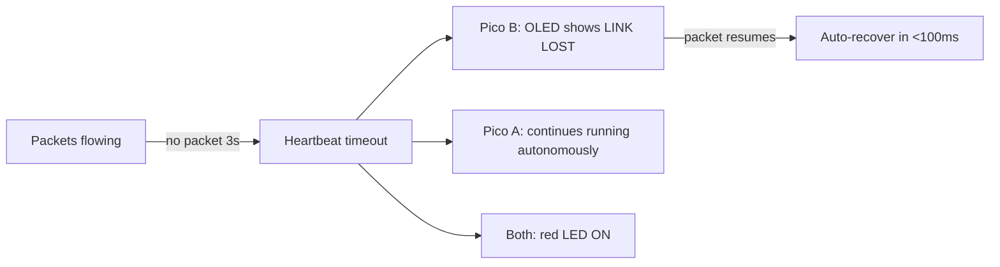
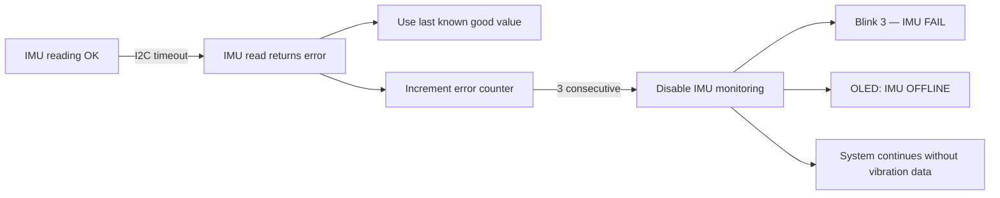
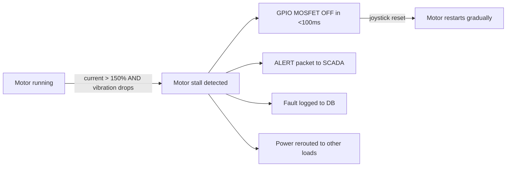
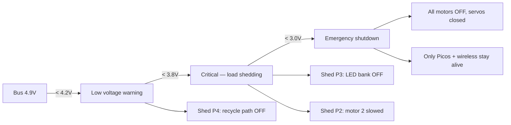

# Failure Handling & Recovery Protocol

> What happens when things go wrong — data loss, sensor failure, wireless dropout, motor stall. How the system detects, responds, and recovers. Also includes a failure simulator for demo.

---

## Design Principle

**The system must never silently fail.** Every failure must be:
1. **Detected** — within 100ms
2. **Announced** — LED blink code + OLED message + serial log
3. **Handled** — autonomous safe-state action
4. **Recoverable** — manual or automatic path back to normal

---

## Failure Scenarios & Responses

### F1: Data Loss — Wireless Link Drops



| Aspect | Detail |
|---|---|
| **Detection** | Pico B counts `time.ticks_diff(now, last_packet_ms)` — if > 3000ms → link lost |
| **Pico A response** | Keeps running normally. Sensor data queued in memory buffer (last 100 readings). When link returns, resumes sending — no data lost from Pico A side |
| **Pico B response** | OLED switches to "LINK LOST" screen. Shows last known values greyed out. Red LED ON. Joystick still works for local display |
| **Data loss** | Pico B misses readings during dropout. Database has a gap. Not recoverable — but gap is logged with timestamp |
| **Recovery** | Automatic when packets resume. No manual action needed. OLED returns to live view. Green LED ON |
| **Demo answer** | *"If wireless drops, Pico A keeps the factory running safely on its own. Pico B shows LINK LOST and auto-recovers when signal returns. The factory never stops."* |

### F2: Sensor Failure — IMU Stops Responding



| Aspect | Detail |
|---|---|
| **Detection** | `try/except` around every `i2c.readfrom_mem()` call. 3 consecutive failures → declared offline |
| **Response** | System continues running. Fault detection loses vibration monitoring but still has current sensing (energy signature). One layer down, not blind |
| **Data in DB** | `imu_rms` field shows `None` / `-1` during outage — visible gap in data |
| **Recovery** | IMU re-checked every 10 seconds. If it starts responding again → auto-re-enable |
| **Demo answer** | *"If the vibration sensor fails, the system degrades gracefully — current monitoring still catches faults. It doesn't crash, it adapts."* |

### F3: Motor Stall — Current Spike + No Movement



| Aspect | Detail |
|---|---|
| **Detection** | ADC current > `MOTOR_CURRENT_MAX_MA` (800mA) AND IMU vibration near 0 (motor stopped but drawing power = stalled) |
| **Response** | MOSFET switched OFF immediately (GPIO LOW). Prevents motor burnout. Power excess rerouted to other loads or capacitor |
| **Time to respond** | <100ms (runs in 100Hz main loop) |
| **Recovery** | Manual reset via joystick. Motor ramps up gradually (not instant full speed) to prevent re-stall |
| **Demo answer** | *"The motor jammed. The system cut power in under 100 milliseconds — before the motor could burn out. That's faster than any human operator."* |

### F4: Power Supply Failure — Bus Voltage Drops



| Level | Voltage | Action |
|---|---|---|
| Normal | > 4.2V | Full operation |
| Low | 3.8-4.2V | Shed non-essential loads (P4, P3) |
| Critical | 3.0-3.8V | Motors to minimum speed, most loads OFF |
| Emergency | < 3.0V | Everything OFF except Picos — system preserves communication |

### F5: Database Corruption / Disk Full

| Aspect | Detail |
|---|---|
| **Detection** | `try/except` around every `db.execute()`. If SQLite throws an error → log to serial |
| **Response** | Dashboard continues running from memory buffer only. DB writes disabled. No crash |
| **User notification** | Serial: `[DB] ERROR: write failed — running in memory-only mode` |
| **Recovery** | Delete `gridbox.db` and restart. Schema auto-recreates. Old data lost but system runs |
| **Prevention** | DB auto-cleans readings older than 24 hours (can add to database.py) |

### F6: Complete Pico A Crash

| Aspect | Detail |
|---|---|
| **Detection** | Pico B heartbeat timeout (3s). Serial output stops |
| **Pico B response** | OLED: "NODE OFFLINE". Red LED solid. Sends no commands |
| **Factory state** | All MOSFETs default to OFF (GPIO pins float low on reset). Motors stop. Servos hold last position |
| **Recovery** | Power cycle Pico A. It reboots, runs self-test, resumes main loop. Pico B auto-reconnects |
| **Data** | Readings during crash are lost. DB has gap. Session continues when Pico reboots |
| **Demo answer** | *"If the controller crashes, the factory stops safely — all switches default to OFF. Power cycle and it's back online in 3 seconds."* |

---

## Failure Simulator (For Demo)

Judges want to SEE the system handle failures. We build a **simulator** that injects faults on command.

### Simulator Triggers (via Joystick on SCADA)

| Joystick Action | Simulated Failure | What Judges See |
|---|---|---|
| Long press (3s) in Fault View | **Wireless dropout** — stop sending packets for 5s | OLED: "LINK LOST" → auto-recovers after 5s |
| Press + Left | **Motor 1 stall** — set Motor 1 current threshold low, trigger stall | Motor stops, red LED, OLED: "MOTOR 1 STALL", power reroutes |
| Press + Right | **Voltage sag** — reduce Motor 1 PWM to simulate load increase | Voltage dips on ADC, load shedding activates, LEDs turn off in priority |
| Press + Up | **IMU failure** — disable IMU reads temporarily | OLED: "IMU OFFLINE", system continues on current sensing only |
| Press + Down | **Full recovery** — reset all simulated faults | Everything returns to normal, green LED |

### Implementation in Firmware

```python
# In master main.py — add simulator module
class FailureSimulator:
    def __init__(self):
        self.wireless_blocked = False
        self.wireless_block_until = 0
        self.motor1_stall_sim = False
        self.imu_disabled = False
        self.voltage_sag_sim = False

    def simulate_wireless_dropout(self, duration_ms=5000):
        """Block wireless for N ms."""
        self.wireless_blocked = True
        self.wireless_block_until = time.ticks_ms() + duration_ms

    def simulate_motor_stall(self):
        """Pretend motor 1 is stalled."""
        self.motor1_stall_sim = True

    def simulate_imu_failure(self):
        """Pretend IMU stopped responding."""
        self.imu_disabled = True

    def simulate_voltage_sag(self):
        """Reduce motor speeds to simulate power drop."""
        self.voltage_sag_sim = True

    def reset_all(self):
        """Clear all simulated faults."""
        self.wireless_blocked = False
        self.motor1_stall_sim = False
        self.imu_disabled = False
        self.voltage_sag_sim = False

    def update(self):
        """Check if timed simulations should end."""
        if self.wireless_blocked:
            if time.ticks_diff(time.ticks_ms(), self.wireless_block_until) > 0:
                self.wireless_blocked = False
```

### Demo Script with Failure Injection

| Time | Action | What Judges See | System Response |
|---|---|---|---|
| 0:00 | System running normally | Motors spin, LEDs green, OLED: NORMAL | — |
| 0:30 | **Simulate wireless dropout** (press+left) | OLED: "LINK LOST" on Pico B | Pico A keeps running. After 5s, link returns. OLED: "RECONNECTED" |
| 1:00 | **Simulate motor stall** (press+right) | Motor 1 stops. Red LED. OLED: "MOTOR 1 STALL" | MOSFET OFF in <100ms. Power rerouted. Motor 2 speeds up |
| 1:30 | **Reset fault** (press+down) | Motor 1 restarts gradually. Green LED | System recovers to NORMAL |
| 2:00 | **Simulate IMU failure** (press+up) | OLED: "IMU OFFLINE" | System continues — current sensing still active |
| 2:30 | **Simulate voltage sag** (press+left) | LEDs shed in order (P4→P3). OLED: "LOAD SHEDDING" | Critical loads stay on (P1 hospital LED) |
| 3:00 | **Full recovery** (press+down) | Everything returns to normal | All LEDs back, all motors running |

**Pitch to judges:** *"We don't just handle the faults we know about. We built a simulator so we can PROVE every failure mode works. Wireless drops — it recovers. Motor stalls — it protects. Power sags — it sheds loads. IMU dies — it degrades gracefully. The system is fault-tolerant by design, not by accident."*

---

## Data Integrity

### What Happens to Data During Failures

| Failure | Data Impact | How We Handle It |
|---|---|---|
| Wireless dropout | Readings not sent to Pico B | Pico A buffers last 100 readings. DB has timestamp gap — gap itself is informative |
| Pico A crash | Current readings lost | DB records stop. Gap visible in timeline. Session log shows crash time |
| DB write failure | Reading not stored | Falls back to memory-only. Serial log continues. No crash |
| Pico B crash | Display stops, commands stop | Pico A continues autonomously. No data loss on A side |
| Power loss | Everything stops | Next boot: DB has clean cutoff. New session starts. Old data preserved |

### Database Recovery

```python
# Auto-cleanup old data (add to database.py)
def cleanup_old_data(days=7):
    """Delete readings older than N days to prevent disk fill."""
    db = get_db()
    cutoff = (datetime.now() - timedelta(days=days)).isoformat()
    deleted = db.execute(
        "DELETE FROM readings WHERE timestamp < ?", (cutoff,)
    ).rowcount
    db.commit()
    db.close()
    return deleted
```

### Proving Data Integrity to Judges

| What We Show | How |
|---|---|
| "Data persists across reboots" | Stop and restart the dashboard. Open `/api/db/readings` — old data still there |
| "Faults are logged permanently" | Open `/api/db/faults` — every fault event with timestamp, cause, values |
| "Sessions are tracked" | Open `/api/db/sessions` — each demo run has summary stats |
| "Gaps are visible" | Simulate a wireless dropout. Show the DB — timestamp gap clearly visible |
| "System degrades, doesn't crash" | Simulate IMU failure → system keeps running on current sensing alone |

---

## Summary: Failure Handling Matrix

| # | Failure | Detection Time | Response | Data Impact | Recovery |
|---|---|---|---|---|---|
| F1 | Wireless dropout | 3s (heartbeat) | Pico A autonomous, Pico B shows LINK LOST | Gap in Pico B data | Auto when link returns |
| F2 | IMU failure | 30ms (3 errors) | Degrade to current-only monitoring | imu_rms = null in DB | Auto re-check every 10s |
| F3 | Motor stall | <100ms | MOSFET OFF, power reroute, alert | Fault logged in DB | Manual reset (joystick) |
| F4 | Power drop | <100ms | Load shedding by priority | Logged, lower readings visible | Auto when voltage recovers |
| F5 | DB corruption | On write error | Memory-only mode, serial log | DB data lost, memory OK | Delete DB, restart |
| F6 | Pico A crash | 3s (heartbeat) | Factory stops safely (MOSFETs OFF) | Gap in all data | Power cycle, 3s reboot |
| F7 | Pico B crash | Immediate | Pico A continues alone | No display, commands stop | Power cycle Pico B |
