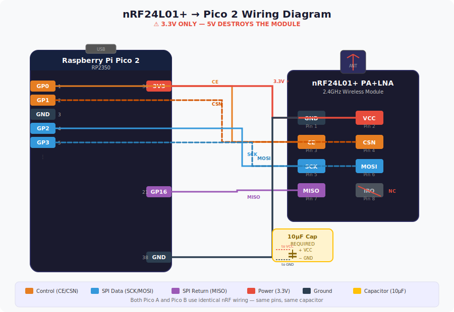
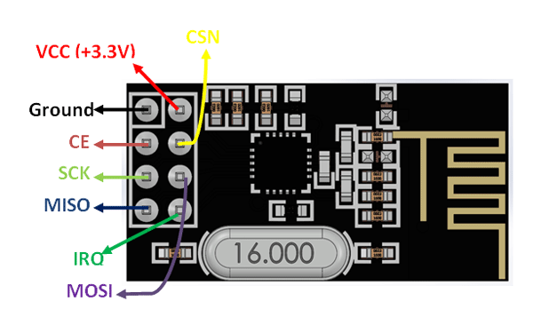
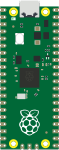
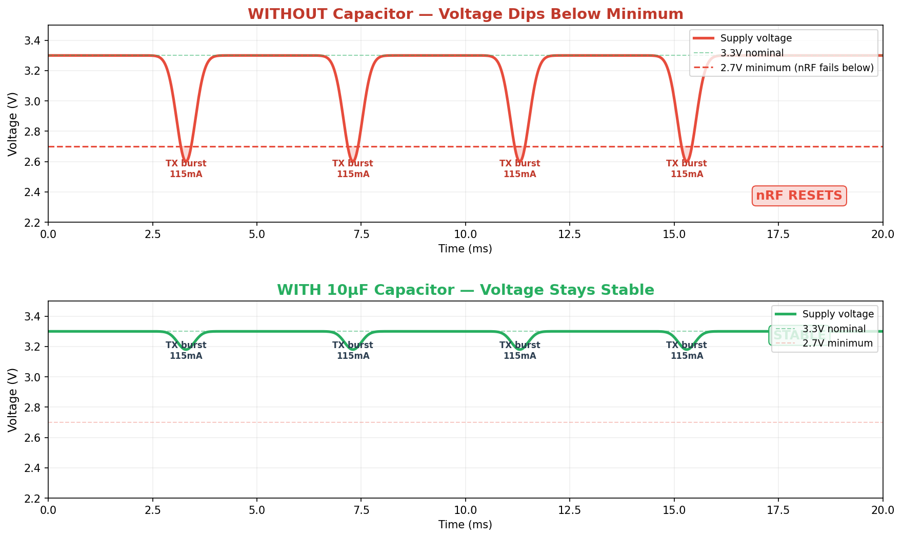
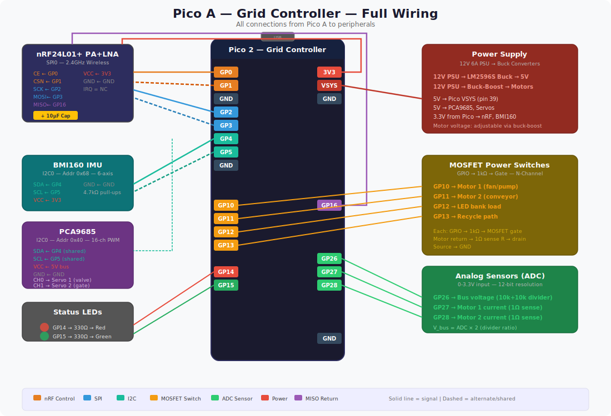
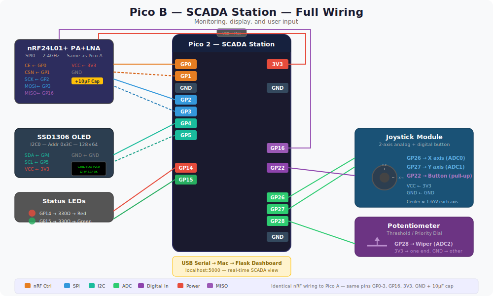

# nRF24L01+ Wiring Guide

> Print this and follow it exactly. The nRF is the most fragile module — wrong voltage kills it instantly.

---

## Pin Layout

### Wiring Diagram — nRF24L01+ to Pico 2



### Reference Pinouts

<p>


</p>

**WARNING: The nRF image is the FRONT view. When you flip the board, left and right are reversed. Always verify by reading the text labels on the BACK.**

### Pin Diagram

Looking at the module from the **top, antenna pointing up:**

```
            ANTENNA
              ↑
        ┌───────────┐
        │           │
        │ nRF24L01+ │
        │           │
        └──┬─┬─┬─┬──┘
           │ │ │ │
    ┌──────┴─┴─┴─┴──────┐
    │  1   3   5   7    │  ← bottom row
    │  2   4   6   8    │  ← top row
    └───────────────────┘

    Pin 1 = bottom-left (square pad / dot marking)
```

---

## Wiring Table

| Pin | Name | Pico GPIO | Description |
|---|---|---|---|
| **1** | GND | GND | Ground |
| **2** | VCC | **3V3** | Power — **3.3V ONLY, 5V KILLS IT** |
| **3** | CE | GP0 | Chip Enable (TX/RX activate) |
| **4** | CSN | GP1 | Chip Select (SPI) |
| **5** | SCK | GP2 | SPI Clock |
| **6** | MOSI | GP3 | SPI Data Out (Pico → nRF) |
| **7** | MISO | GP16 | SPI Data In (nRF → Pico) |
| **8** | IRQ | Not connected | Leave empty |

---

## Capacitor — REQUIRED

Add a **10µF capacitor** directly across pins 1 and 2 (as close to the module as possible):

```
3V3 ───┬─── Pin 2 (VCC)
       │
     [10µF]  ← capacitor (observe polarity if electrolytic: + to VCC)
       │
GND ───┴─── Pin 1 (GND)
```

**Without this capacitor, the wireless will be unreliable or not work at all.**

### Why the Capacitor is Critical

The nRF24L01+ draws current in short **bursts** — idle at 12mA, then suddenly 115mA during transmission (lasting ~1ms). This sudden current demand causes the 3.3V supply voltage to **dip**:



The capacitor acts as a **tiny battery** — it stores charge and releases it during the current burst, keeping the voltage stable.

### Common nRF Problems Solved by the Capacitor

| Symptom | Without Cap | With Cap |
|---|---|---|
| `status=0xFF` (not responding) | Module resets during init | Stable power, responds correctly |
| Packets send but never received | TX power dips, corrupted signal | Clean transmission |
| Works for 5 seconds then stops | Voltage drifts below minimum | Stays stable indefinitely |
| Random `LINK LOST` on SCADA | Receiver brownouts during RX | Consistent reception |
| Works close but not at 2m+ | Weak transmission power | Full power, full range |

### What If You Don't Have 10µF?

| Alternative | Works? |
|---|---|
| 22µF or 47µF | Yes — bigger is fine, just use correct polarity |
| 4.7µF | Marginal — may still have occasional drops |
| 1µF | Not enough — bursts are too fast |
| 100µF | Overkill but works — slower power-up |
| No capacitor at all | Will likely fail — especially with PA+LNA version (higher current) |

The PA+LNA version (which you have — it has the small antenna board) draws **more current** than the basic nRF24L01+ because the power amplifier boosts the signal. This makes the capacitor even more critical.

---

## Safety Rules

| Rule | Consequence of Breaking |
|---|---|
| **VCC = 3.3V only** | 5V destroys the module permanently |
| **Add 10µF capacitor** | Without it: random packet loss, module resets, no connection |
| **Pin 8 (IRQ) leave empty** | Connecting it wrong can cause issues |
| **Same wiring on both Picos** | Both must use identical pin mapping |
| **Keep antenna clear** | Don't place metal objects near the antenna |

---

## How to Verify It's Working

After wiring, run:

```bash
mpremote run src/master-pico/tests/test_circuit_check.py
```

Look for: `[PASS] nRF24L01+ responds (status=0x0E)` — any status between 0x01 and 0x7F means it's alive.

If you see `status=0xFF` — module not responding. Check wiring.
If you see `status=0x00` — module in reset. Check 10µF capacitor and 3.3V power.

---

## Which Pin is Pin 1?

Three ways to identify:

1. **Square pad** — one pin has a square solder pad, others are round. That's pin 1 (GND)
2. **Dot marking** — small dot printed on the PCB near pin 1
3. **Multimeter** — pin 1 (GND) has continuity with the metal RF shielding on top of the module

---

## Full System Wiring Diagrams

For context on how the nRF fits into the complete system:

- **Pico A (Grid Controller):** 
- **Pico B (SCADA Station):** 
