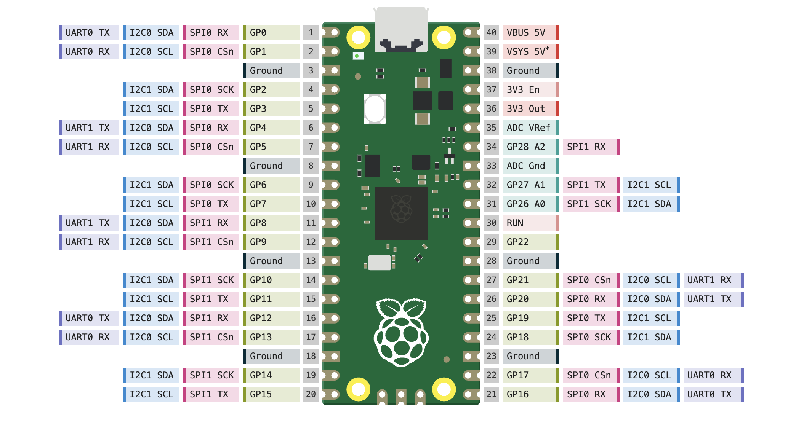

# Power Budget — Can the Pico Power Everything?

> Calculate total current draw and determine if we need separate power supplies.

---

## Reference Pinout

<p>

</p>

---

## Pico Power Limits

| Power Source | Max Current | Voltage |
|---|---|---|
| **USB (VBUS)** | 500mA from laptop USB | 5V |
| **3V3 pin** | 300mA (from Pico's internal regulator) | 3.3V |
| **VSYS** | 500mA (from USB) or external supply | 1.8-5.5V |

---

## Every Component's Power Draw

### 3.3V Components (from Pico 3V3 pin)

| Component | Typical | Peak | Status |
|---|---|---|---|
| BMI160 IMU | 1mA | 3mA | Running 100Hz |
| nRF24L01+ (idle) | 12mA | 12mA | Listening |
| nRF24L01+ (transmitting) | 12mA | **115mA** | Burst during TX |
| OLED SSD1306 | 10mA | 20mA | All pixels on |
| **3.3V Total** | **35mA** | **150mA** | Under 300mA limit |

### 5V Components (from VBUS or buck converter)

| Component | Typical | Peak | Status |
|---|---|---|---|
| Pico itself | 30mA | 100mA | Both cores active |
| PCA9685 (logic) | 10mA | 25mA | Driving PWM |
| MG90S Servo (×1) | 100mA | **500mA** | Moving under load |
| MG90D Servo (×1) | 150mA | **500mA** | Spinning |
| MAX7219 7-seg display | 10mA | **320mA** | All segments on |
| LEDs (×6 with 330Ω) | 60mA | 60mA | All on |
| **5V Total (no servos)** | **110mA** | **505mA** | OK from USB |
| **5V Total (with servos)** | **360mA** | **1505mA** | **EXCEEDS USB 500mA!** |

### Motor Power (6-9V from buck-boost)

| Component | Typical | Peak/Stall |
|---|---|---|
| DC Motor 200RPM (×1) | 200mA | 800mA |
| DC Motor 200RPM (×2) | 400mA | 1600mA |

---

## The Problem

```
USB power budget: 500mA at 5V

Without servos: 110mA typical ← OK
With 1 servo:   260mA typical ← OK
With 2 servos:  460mA typical ← BORDERLINE
With 2 servos moving: 960mA  ← EXCEEDS USB!
With motors:    NEEDS SEPARATE POWER
```

$$P_{total} = P_{pico} + P_{sensors} + P_{servos} + P_{display} + P_{LEDs}$$

$$P_{total} = 150mW + 50mW + 5000mW + 1600mW + 300mW = 7100mW$$

$$I_{total} = \frac{7100mW}{5V} = 1420mA$$

**USB cannot power everything. You NEED the buck converter.**

---

## Solution: Split Power Rails

```
12V PSU ──→ Buck Converter (set to 5V!) ──→ Servos + PCA9685 + MAX7219 + LEDs
                                            (high current loads)

12V PSU ──→ Buck-Boost (set to 6V) ──→ DC Motors
                                       (separate motor power)

USB (laptop) ──→ Pico VBUS ──→ Pico logic only
                              3V3 pin ──→ IMU + nRF + OLED
                              (low current sensors)
```

| Rail | Source | Powers | Max Current |
|---|---|---|---|
| **3.3V** | Pico's 3V3 pin (from USB) | IMU, nRF24L01+, OLED | 300mA — enough |
| **5V (logic)** | USB through Pico VBUS | Pico itself | 500mA — enough |
| **5V (power)** | Buck converter from 12V PSU | Servos, PCA9685, MAX7219, LEDs | Up to 3A — enough |
| **6-9V** | Buck-boost from 12V PSU | DC Motors | Up to 20A — enough |

### Critical Rule

**Never power servos or motors from the Pico's USB power.** They draw too much current and will:
- Cause voltage drops → Pico resets
- Damage the laptop USB port
- Make the system unreliable

---

## What Can Run From USB Only (For Testing)

| Component | From USB? | Notes |
|---|---|---|
| Pico | Yes | Always powered by USB when connected |
| BMI160 IMU | Yes | 1mA from 3V3 pin |
| OLED SSD1306 | Yes | 10mA from 3V3 pin |
| nRF24L01+ | Yes | 12mA from 3V3 pin (but add 10µF cap!) |
| MAX7219 7-seg | **Careful** | 10mA idle OK, full brightness may brownout |
| PCA9685 (no servos) | Yes | 10mA logic only |
| **1 servo** | **Risky** | May work if servo is unloaded, will brownout under load |
| **2 servos** | **No** | Will exceed USB current limit |
| **DC Motors** | **No** | Need separate power |

### For Testing Right Now (USB Only)

You can safely test these without the buck converter:
- I2C scan (IMU + PCA9685 + OLED)
- IMU vibration readings
- OLED display
- nRF24L01+ wireless
- 7-segment display (low brightness)
- PCA9685 PWM signals (without servo connected)

**Do NOT connect servos or motors to Pico USB power.**

---

## For Demo Day — Full Power Setup

```
12V 6A PSU (72W budget)
├── Buck Converter (5V 3A) ──→ PCA9685 V+ ──→ Servos
│                          ──→ MAX7219 VCC
│                          ──→ LED bank
│                          ──→ Pico VSYS (optional backup)
│
└── Buck-Boost (6-9V) ──→ MOSFET 1 ──→ DC Motor 1
                      ──→ MOSFET 2 ──→ DC Motor 2

Laptop USB ──→ Pico VBUS ──→ Pico logic + 3.3V sensors
                          ──→ Serial data to web dashboard
```

Total power budget:

$$P_{PSU} = 12V \times 6A = 72W$$

$$P_{used} = P_{motors} + P_{servos} + P_{logic} = 9.6W + 5.0W + 0.8W = 15.4W$$

$$\text{Headroom} = \frac{72W - 15.4W}{72W} = 78\%$$

**Plenty of power. The 12V PSU can handle everything easily.**

---

## Summary

| Question | Answer |
|---|---|
| Can Pico USB power everything? | **No** — only sensors and logic |
| Do we need the buck converter? | **Yes** — for servos, motors, LEDs, 7-segment |
| Is the 12V PSU enough? | **Yes** — using only 21% of its 72W capacity |
| What's safe to test from USB? | IMU, OLED, nRF, PCA9685 (no servo), 7-segment (dim) |
