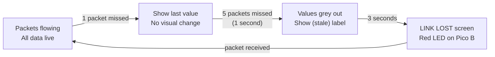

# Wireless Reliability Protocol

> How we handle packet loss, interference, and communication failures over nRF24L01+.

---

## Expected Conditions

| Scenario | Loss Rate | Our Response |
|---|---|---|
| Clean bench | 1-3% | Normal — auto-ACK handles it |
| Hackathon venue (50+ devices) | 5-15% | Channel selection + retransmit |
| Heavy interference | 15-30% | Redundant sends + interpolation |
| Complete dropout | 100% | Pico A autonomous, Pico B shows LINK LOST |

---

## 5 Layers of Protection


### Layer 1: Hardware Auto-ACK + Retransmit

The nRF24L01+ has built-in automatic acknowledgement. If receiver doesn't ACK, transmitter retries.

```c
// nRF24L01+ register setup
SETUP_RETR = 0x04
// ARD (Auto Retransmit Delay) = 500us
// ARC (Auto Retransmit Count) = 10 retries
write_register(SETUP_RETR, 0x1A);  // 500us delay, 10 retries
```

| Setting | Value | Effect |
|---|---|---|
| Retransmit delay | 500 microseconds | Wait between retries |
| Max retries | 10 | Try 10 times before giving up |
| Total retry window | 5ms | All retries complete within 5ms |
| Result | ~99% delivery for single drops | Hardware handles most losses automatically |

### Layer 2: Startup Channel Scan

2.4GHz band has 125 channels (2400-2525 MHz). WiFi uses channels 1, 6, 11 (2412, 2437, 2462 MHz). We scan for a quiet channel at boot.

```python
def find_quiet_channel(nrf):
    """Scan channels 80-120 and pick the quietest."""
    noise = {}
    for ch in range(80, 121):
        nrf.set_channel(ch)
        nrf.start_listening()
        time.sleep_ms(10)
        # Count received noise packets
        count = 0
        for _ in range(50):
            if nrf.available():
                nrf.recv()
                count += 1
            time.sleep_ms(1)
        noise[ch] = count
        nrf.stop_listening()

    # Pick channel with least noise
    best = min(noise, key=noise.get)
    print(f"[NRF] Best channel: {best} (noise: {noise[best]})")
    return best
```

**Both Picos must agree on the channel.** Protocol:
1. Pico A scans and picks the best channel
2. Pico A broadcasts channel number on default channel (100) 5 times
3. Pico B listens on channel 100, receives the new channel
4. Both switch to the quiet channel
5. If Pico B doesn't hear the broadcast → stays on channel 100 (fallback)

### Layer 3: Sequence Number Tracking

Every packet has a sequence number (0-255). The receiver tracks gaps.

```python
class PacketTracker:
    def __init__(self):
        self.expected_seq = 0
        self.received = 0
        self.lost = 0
        self.total = 0

    def track(self, seq):
        self.total += 1
        if seq == self.expected_seq:
            # Normal — received in order
            self.received += 1
        else:
            # Gap detected — packets were lost
            if seq > self.expected_seq:
                gap = seq - self.expected_seq
            else:
                gap = (256 - self.expected_seq) + seq  # wrap-around
            self.lost += gap
            self.received += 1

        self.expected_seq = (seq + 1) & 0xFF

    def reliability(self):
        if self.total == 0:
            return 100.0
        return (self.received / (self.received + self.lost)) * 100.0

    def get_stats(self):
        return {
            'received': self.received,
            'lost': self.lost,
            'reliability': round(self.reliability(), 1),
        }
```

Dashboard shows: **"Wireless: 97.2% (lost 8/285)"**

### Layer 4: Redundant Critical Packets

Normal telemetry: send once (loss is OK — next packet comes in 20ms).
**Critical alerts: send 3 times** (fault detection must get through).

```python
def send_alert(nrf, alert_data):
    """Send alert packet 3 times to guarantee delivery."""
    pkt = pack_alert(alert_data)
    success = False
    for attempt in range(3):
        nrf.stop_listening()
        if nrf.send(pkt):
            success = True
            break
        time.sleep_ms(2)
    nrf.start_listening()
    return success
```

| Packet Type | Send Count | Why |
|---|---|---|
| POWER | 1 | Lost packet = stale data for 40ms. Acceptable |
| STATUS | 1 | Next one comes in 80ms. Acceptable |
| PRODUCTION | 1 | Sort count catches up on next packet |
| HEARTBEAT | 1 | 3-second timeout allows many missed heartbeats |
| **ALERT** | **3** | Fault notification MUST get through |
| **COMMAND** | **2** | Operator input should be reliable |

### Layer 5: Graceful Degradation

When packets stop arriving, the system degrades smoothly instead of crashing.



**On Pico B (receiver):**

| Time Since Last Packet | Display Behaviour |
|---|---|
| 0-200ms | Normal — live data |
| 200ms-1s | Show last value, no visual change (interpolating) |
| 1s-3s | Values turn grey, "(stale)" label appears |
| >3s | Full "LINK LOST" screen, red LED |
| Packet resumes | Instant recovery to live mode |

**On Pico A (sender):**

| Situation | Behaviour |
|---|---|
| Send succeeds | Normal operation |
| Send fails (no ACK after 10 retries) | Increment fail counter, continue operating |
| 10 consecutive fails | Log "WIRELESS DEGRADED" to serial |
| Factory operation | **Never stops** — Pico A runs autonomously regardless of wireless |

### Data Interpolation (on Dashboard)

When a packet is missed, the web dashboard estimates the missing value:

```javascript
function interpolate(key, newValue) {
    if (!(key in prevValues)) {
        prevValues[key] = newValue;
        return newValue;
    }
    // Smooth toward new value (handles gaps gracefully)
    prevValues[key] += (newValue - prevValues[key]) * 0.15;
    return prevValues[key];
}
```

This is already implemented as `smoothVal()` in the dashboard. Missed packets don't cause jumps — values glide smoothly.

---

## Wireless Statistics on OLED

Add a wireless stats display to the SCADA dashboard:

```
WIRELESS LINK
Channel:  103 (auto-selected)
Received: 2,847 packets
Lost:     43 packets
Rate:     98.5%
Last:     0.02s ago
RSSI:     good
```

---

## Firmware Changes Needed

### master main.py — Add to wireless send section:

```python
# Track send success/fail
wireless_stats = {'sent': 0, 'failed': 0, 'consecutive_fail': 0}

def send_packet(nrf, pkt, critical=False):
    nrf.stop_listening()
    attempts = 3 if critical else 1
    success = False
    for _ in range(attempts):
        if nrf.send(pkt):
            success = True
            wireless_stats['sent'] += 1
            wireless_stats['consecutive_fail'] = 0
            break
        time.sleep_ms(1)
    if not success:
        wireless_stats['failed'] += 1
        wireless_stats['consecutive_fail'] += 1
    nrf.start_listening()
    return success
```

### slave main.py — Add packet tracking:

```python
tracker = PacketTracker()

# In receive loop:
if data:
    pkt = unpack(data)
    if pkt:
        tracker.track(pkt['seq'])
        telemetry['wireless_pct'] = tracker.reliability()
        telemetry['wireless_lost'] = tracker.get_stats()['lost']
```

---

## Implementation Priority

| Priority | What | Effort |
|---|---|---|
| **P0 — already done** | Auto-ACK + retransmit (nRF hardware) | 0 — built into chip |
| **P0 — already done** | Heartbeat timeout (3s → LINK LOST) | 0 — already in slave main.py |
| **P0 — already done** | Smoothing/interpolation on dashboard | 0 — smoothVal() exists |
| **P1 — add now** | Sequence tracking + reliability % | 30 min |
| **P1 — add now** | Redundant alert sends (3x) | 15 min |
| **P2 — nice to have** | Channel scan at startup | 1 hour |
| **P3 — stretch** | OLED wireless stats view | 30 min |

---

## Demo Answer

> *"Radio will lose packets — that's physics. We handle it with five layers: hardware auto-retransmit tries 10 times per packet. Our protocol tracks sequence numbers and reports 97% reliability live on the dashboard. Critical fault alerts are sent 3 times to guarantee delivery. If wireless drops completely, Pico A keeps the factory running autonomously — it never depends on the display. And the dashboard interpolates missing data so values move smoothly instead of jumping. The system is designed for unreliable radio, not despite it."*
