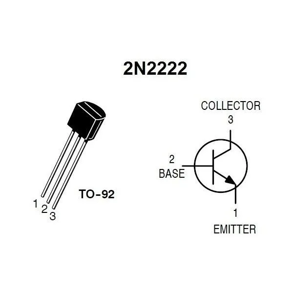

# Wiring Connection Table — Every Wire in the System

> Print this and check off each connection as you wire it. Every wire is listed once.
>
> **Revision 3 (2026-03-22):** Major scope reduction — LED bank, status LEDs, joystick, potentiometer all removed. Motor MOSFETs driven by PCA9685 PWM. ~66 wires total. See [Change Log](#change-log) at bottom.
>
> **Wooseong's progress:** Steps 1-7 DONE (power, nRF both Picos, wireless link, MAX7219). Steps 8-14 remaining.

---

## Power Supply Chain

| # | From | To | Wire | Purpose |
|---|---|---|---|---|
| P1 | **12V PSU +** | LM2596S buck converter IN+ | Red 16AWG | Main power input |
| P2 | **12V PSU +** | 300W buck-boost IN+ | Red 16AWG | Motor power input |
| P3 | **12V PSU –** | Common GND rail on breadboard | Black 16AWG | System ground |
| P4 | **LM2596S OUT+** (adjust to 5V) | Breadboard 5V rail | Orange | Logic power for Picos, PCA9685, servos |
| P5 | **LM2596S OUT–** | Common GND rail | Black | Buck converter ground |
| P6 | **Buck-boost OUT+** (adjust to 6-9V) | Motor power rail (separate from logic) | Red | Motor drive voltage |
| P7 | **Buck-boost OUT–** | Common GND rail | Black | Motor power ground |

**Verify with multimeter before connecting Picos:** 5V rail = 4.9-5.1V, Motor rail = 6-9V

---

## Pico A — Grid Controller

### Power

| # | From | To | Wire | Purpose |
|---|---|---|---|---|
| A1 | **5V rail** | Pico A **VSYS** pin | Orange | Powers Pico A (internal 3.3V regulator) |
| A2 | **GND rail** | Pico A **GND** pin | Black | Pico A ground |

### I2C Bus (shared: IMU + PCA9685)

| # | From | To | Wire | Purpose |
|---|---|---|---|---|
| A3 | **Pico A GP4** | BMI160 **SDA** | White | I2C data line |
| A4 | **Pico A GP4** | PCA9685 **SDA** | White | I2C data line (same bus) |
| A5 | **Pico A GP5** | BMI160 **SCL** | Grey | I2C clock line |
| A6 | **Pico A GP5** | PCA9685 **SCL** | Grey | I2C clock line (same bus) |
| A7 | **3.3V** → 4.7kΩ → **GP4 (SDA)** | Pull-up resistor | — | I2C requires pull-ups |
| A8 | **3.3V** → 4.7kΩ → **GP5 (SCL)** | Pull-up resistor | — | I2C requires pull-ups |
| A9 | **3.3V** | BMI160 **VCC** | Red thin | IMU power |
| A10 | **GND** | BMI160 **GND** | Black thin | IMU ground |
| A11 | **3.3V** | PCA9685 **VCC** | Red thin | PCA9685 logic power (3.3V matches Pico I2C) |
| A12 | **GND** | PCA9685 **GND** | Black | PCA9685 ground |
| A13 | **5V rail** | PCA9685 **V+** (output power) | Orange | Servo + MOSFET gate drive power |

### SPI Bus (nRF24L01+)

| # | From | To | Wire | Purpose |
|---|---|---|---|---|
| A14 | **Pico A GP0** | nRF24L01+ **CE** | Purple | Chip enable |
| A15 | **Pico A GP1** | nRF24L01+ **CSN** | Blue | Chip select |
| A16 | **Pico A GP2** | nRF24L01+ **SCK** | Yellow | SPI clock |
| A17 | **Pico A GP3** | nRF24L01+ **MOSI** | Green | SPI data out |
| A18 | **Pico A GP16** | nRF24L01+ **MISO** | Brown | SPI data in |
| A19 | **3.3V** | nRF24L01+ **VCC** | Red thin | nRF power (**3.3V ONLY — 5V will kill it!**) |
| A20 | **GND** | nRF24L01+ **GND** | Black | nRF ground |

### Motor Switching — Via Motor Driver Module

> **Changed (2026-03-22):** DC motors driven by a dedicated motor driver module (e.g. L298N / L293D), not MOSFETs. PCA9685 PWM outputs connect to the motor driver's input pins for speed control.

| # | From | To | Wire | Purpose |
|---|---|---|---|---|
| A21 | **PCA9685 CH2** | Motor driver **IN1** or **ENA** | Yellow | Motor 1 PWM speed control |
| A22 | **Motor driver OUT1** | Motor 1 **terminal +** | Red | Motor 1 output |
| A23 | **Motor driver OUT2** | Motor 1 **terminal –** | Blue | Motor 1 output |
| A24 | **PCA9685 CH3** | Motor driver **IN3** or **ENB** | Yellow | Motor 2 PWM speed control |
| A25 | **Motor driver OUT3** | Motor 2 **terminal +** | Red | Motor 2 output |
| A26 | **Motor driver OUT4** | Motor 2 **terminal –** | Blue | Motor 2 output |
| A27 | **Motor power rail** | Motor driver **VMS / +12V** | Red | Motor power input |
| A28 | **5V rail** | Motor driver **VCC / +5V** | Orange | Logic power |
| A29 | **GND** | Motor driver **GND** | Black | Common ground |

> **Note:** Exact pin names depend on your motor driver module. Update labels when you identify the specific board. Direction control pins (IN1/IN2 per motor) can be tied HIGH/LOW if you only need one direction.

### ~~LED Bank Switch~~ — REMOVED

> **CANCELLED:** LED bank (wires A29-A34) replaced by MAX7219 8-digit 7-segment display on Pico B SPI1. Status indicators now shown wirelessly on the display. See `docs/02-electrical/max7219-wiring.md`.

### Recycle Path Switch (2N2222 NPN + LED Indicator)

> **Changed (2026-03-22):** Uses 2N2222 NPN transistor instead of MOSFET. LED shows recycled energy discharging — the "fade effect" visually proves energy was captured and reused.

```
Circuit diagram:

    5V rail ──→ Cap (+) ──┬──→ LED (+) ──→ LED (–) ──[150Ω]──→ GND
                          │
                       Cap (–)
                          │
                      2N2222 Collector (C)
                          │
    GP13 ──[1kΩ]──→ 2N2222 Base (B)
                          │
               GND ←── 2N2222 Emitter (E)


    2N2222 pinout (TO-92, flat side facing you):
    Pin 1 = Emitter  → GND
    Pin 2 = Base     → 1kΩ → GP13
    Pin 3 = Collector → Cap (–)

    See pinout diagram: docs/images/2N2222-pinout.webp


    How it works:
    ┌─────────────────────────────────────────────────────────┐
    │ GP13 HIGH → transistor ON → cap charges from 5V rail   │
    │            (LED dim — most current flows through 2N2222)│
    │                                                         │
    │ GP13 LOW  → transistor OFF → cap discharges through LED │
    │            → LED GLOWS AND FADES ← judges see this!     │
    └─────────────────────────────────────────────────────────┘
```

| # | From | To | Wire | Purpose |
|---|---|---|---|---|
| A30 | **Pico A GP13** | → **1kΩ resistor** → 2N2222 **Base (B)** | Yellow | Recycle path on/off control |
| A31 | **5V rail** | **100µF capacitor (+)** | Orange | Energy storage (positive) |
| A32 | **100µF capacitor (–)** | 2N2222 **Collector (C)** | Blue | Controlled charge path |
| A33 | 2N2222 **Emitter (E)** | **GND** | Black | Transistor ground |
| A34 | **100µF capacitor (+)** | **LED anode (+)** (long leg) | Red thin | Discharge path (recycled energy) |
| A35 | **LED cathode (–)** (short leg) | → **150Ω resistor** → **GND** | Green | Current limiter for LED |

**2N2222 Pinout Reference (TO-92 package):**



> **Demo script:** Toggle GP13 on/off every 2-3 seconds. Judges see: charge (LED dim) → release (LED glows and fades). Tell them: *"The capacitor captured wasted energy from the grid. When we release it, that stored energy powers this LED — same principle as regenerative braking, at bench scale."*
>
> **Parts:** 1× 2N2222, 1× 1kΩ, 1× 150Ω, 1× 100µF (or parallel combination e.g. 40+40+20µF), 1× LED (any colour — green recommended for "recycled energy" theming)

### ADC Sensing

| # | From | To | Wire | Purpose |
|---|---|---|---|---|
| A36 | 5V rail → **10kΩ** → junction → **10kΩ** → GND | Junction → **Pico A GP26** | Green | Bus voltage sensing (V/2 divider) |
| A37 | Across Motor 1 **sense point** | **Pico A GP27** | Green | Motor 1 current sensing (optional) |
| A38 | Across Motor 2 **sense point** | **Pico A GP28** | Green | Motor 2 current sensing (optional) |

### ~~Status LEDs~~ — REMOVED

> **CANCELLED:** External red/green status LEDs replaced by MAX7219 8-segment display on Pico B. GP14/GP15 freed on Pico A.

---

## Pico B — SCADA Station

### Power

| # | From | To | Wire | Purpose |
|---|---|---|---|---|
| B1 | **5V rail** (or separate USB) | Pico B **VSYS** | Orange | Powers Pico B |
| B2 | **GND** | Pico B **GND** | Black | Pico B ground |

### I2C Bus (OLED)

| # | From | To | Wire | Purpose |
|---|---|---|---|---|
| B3 | **Pico B GP4** | OLED **SDA** | White | I2C data |
| B4 | **Pico B GP5** | OLED **SCL** | Grey | I2C clock |
| B5 | **3.3V** → 4.7kΩ → **GP4** | Pull-up resistor | — | I2C pull-up |
| B6 | **3.3V** → 4.7kΩ → **GP5** | Pull-up resistor | — | I2C pull-up |
| B7 | **3.3V** | OLED **VCC** | Red thin | OLED power |
| B8 | **GND** | OLED **GND** | Black | OLED ground |

### SPI0 Bus (nRF24L01+)

| # | From | To | Wire | Purpose |
|---|---|---|---|---|
| B9 | **Pico B GP0** | nRF24L01+ **CE** | Purple | Chip enable |
| B10 | **Pico B GP1** | nRF24L01+ **CSN** | Blue | Chip select |
| B11 | **Pico B GP2** | nRF24L01+ **SCK** | Yellow | SPI clock |
| B12 | **Pico B GP3** | nRF24L01+ **MOSI** | Green | SPI data out |
| B13 | **Pico B GP16** | nRF24L01+ **MISO** | Brown | SPI data in |
| B14 | **3.3V** | nRF24L01+ **VCC** | Red thin | **3.3V ONLY!** |
| B15 | **GND** | nRF24L01+ **GND** | Black | nRF ground |

### SPI1 Bus (MAX7219 7-Segment Display)

> **NEW:** Replaces LED bank on Pico A. Shows system status, wireless link, fault codes, power readings. See `docs/02-electrical/max7219-wiring.md` for full details.

| # | From | To | Wire | Purpose |
|---|---|---|---|---|
| B16 | **Pico B GP10** | MAX7219 **CLK** | Yellow | SPI1 clock |
| B17 | **Pico B GP11** | MAX7219 **DIN** | Green | SPI1 data |
| B18 | **Pico B GP13** | MAX7219 **CS** | Blue | Chip select |
| B19 | **5V (VBUS)** | MAX7219 **VCC** | Red | Display power (**5V for brightness**) |
| B20 | **GND** | MAX7219 **GND** | Black | Display ground |

### ~~Joystick~~ — CANCELLED

> **CANCELLED:** Joystick removed — focus is on wireless communication and autonomous operation. GP22, GP26, GP27 freed on Pico B.

### ~~Potentiometer~~ — CANCELLED

> **CANCELLED:** Potentiometer removed — not needed for autonomous demo. GP28 freed on Pico B.

### ~~Status LEDs~~ — REMOVED

> **CANCELLED:** External red/green status LEDs replaced by MAX7219 8-segment display. GP14/GP15 freed on Pico B.

---

## Servo Connections (via PCA9685)

| # | PCA9685 Channel | Connected To | Signal Wire | Purpose |
|---|---|---|---|---|
| S1 | **CH0** | Servo 1 signal (orange/white wire) | White | Fill valve / vent damper |
| S2 | **CH1** | Servo 2 signal (orange/white wire) | White | Sort gate / quality gate |
| S3 | All servo **VCC** (red wire) | 5V rail via PCA9685 V+ | Red | Servo power |
| S4 | All servo **GND** (brown wire) | GND rail via PCA9685 GND | Brown | Servo ground |

---

## IMU Placement

| # | Detail |
|---|---|
| Mount | BMI160 attached to **DC Motor 1 body** with double-sided tape |
| Orientation | Flat against motor housing — Z-axis perpendicular to motor surface |
| Purpose | Vibration = bearing health. Shake motor = fault demo |
| Wiring | I2C (SDA/SCL) runs from motor down to Pico A breadboard |

---

## Wire Count Summary

| Category | Wires | Status | Notes |
|---|---|---|---|
| Power supply | 7 | DONE | PSU → buck → boost → rails |
| Pico A power | 2 | DONE | VSYS + GND |
| Pico A I2C | 11 | DONE | BMI160 + PCA9685 connected, I2C wired |
| Pico A SPI | 7 | DONE | nRF24L01+ verified |
| Pico A motor switching | 9 | DONE | Motor driver connected |
| ~~Pico A LED bank~~ | ~~6~~ | ~~REMOVED~~ | ~~Replaced by MAX7219 on Pico B~~ |
| Pico A recycle path | 6 | DONE | 2N2222 + cap + LED |
| Pico A ADC | 3 | IN PROGRESS | Bus voltage + 2 current sense |
| ~~Pico A status LEDs~~ | ~~2~~ | ~~REMOVED~~ | ~~Replaced by MAX7219 display~~ |
| Pico B power | 2 | DONE | VSYS + GND |
| Pico B I2C | 6 | NOT STARTED | OLED |
| Pico B SPI0 | 7 | DONE | nRF24L01+ verified |
| Pico B SPI1 | 5 | DONE | MAX7219 7-segment display |
| ~~Pico B joystick~~ | ~~5~~ | ~~CANCELLED~~ | ~~Focus on wireless/autonomous~~ |
| ~~Pico B potentiometer~~ | ~~3~~ | ~~CANCELLED~~ | ~~Not needed for demo~~ |
| ~~Pico B status LEDs~~ | ~~2~~ | ~~REMOVED~~ | ~~Replaced by MAX7219 display~~ |
| Servos | 4 | NOT STARTED | 2 servos × signal, shared VCC + GND |
| **Total** | **~66 wires** | | **~48 done, ~10 TODO, ~18 cancelled** |

### Progress Summary

| Status | Count | Wires | Categories |
|---|---|---|---|
| DONE | 10 | ~48 | Power, Pico A (power, I2C, SPI, motors, recycle), Pico B (power, SPI0, SPI1) |
| TODO | 3 | ~13 | ADC sensing (3), OLED (6), Servos (4) |
| CANCELLED/REMOVED | 5 | ~18 | LED bank (6), status LEDs A (2), status LEDs B (2), joystick (5), potentiometer (3) |

**Completion: 10/13 active tasks done (77%). 3 remaining.**

---

## Wiring Order (for Wooseong)

Wire in this order — test after each group:

| Order | Group | Wires | Status | Test |
|---|---|---|---|---|
| 1 | Power supply chain | P1-P7 | DONE | Multimeter: 5V and 6-9V on rails |
| 2 | Pico A power | A1-A2 | DONE | Pico A boots, onboard LED blinks |
| 3 | Pico A SPI/nRF | A14-A20 | DONE | `./flash.sh test` — PASS (0x0E) |
| 4 | Pico B power | B1-B2 | DONE | Pico B boots, onboard LED blinks |
| 5 | Pico B SPI0/nRF | B9-B15 | DONE | `./flash.sh test` — PASS (0x0E) |
| 6 | **Wireless test** | (no new wires) | DONE | Datagram test — 200+ packets, 0 bad |
| 7 | Pico B SPI1/MAX7219 | B16-B20 | DONE | `./flash.sh test-display` — PASS |
| 8 | Pico A I2C (PCA9685 + IMU) | A3-A13 | DONE | IMU + PCA9685 connected, I2C bus wired |
| 9 | Motors via motor driver | A21-A29 | DONE | Motor driver connected, motors attached |
| 10 | Recycle path (2N2222 + LED) | A30-A35 | DONE | 2N2222 + cap + LED wired (tested on GP22) |
| 11 | ADC bus voltage | A36 | **TODO** | ADC reads ~half of bus voltage |
| 12 | Pico B I2C/OLED | B3-B8 | **TODO** | OLED displays text |
| ~~13~~ | ~~Pico B inputs~~ | ~~B21-B28~~ | ~~CANCELLED~~ | ~~Joystick + pot removed~~ |
| 14 | Servos | S1-S4 | **TODO** | Servos move to test angles |

**Test after EVERY group.** Don't wire everything then test — find problems early.

**Progress:** Steps 1-10 DONE. Steps 11-14 remaining.

---

## Change Log

| Date | Change | Reason |
|---|---|---|
| 2026-03-22 | **LED bank (old A29-A34) REMOVED** | Replaced by MAX7219 8-digit 7-segment display on Pico B SPI1. Status info now shown wirelessly. |
| 2026-03-22 | **Motor gates: GPIO → PCA9685 PWM** | PCA9685 Ch2/Ch3 drive MOSFET gates instead of GP10/GP11. Gives 12-bit PWM speed control (4096 steps). GP10-GP12 freed on Pico A. |
| 2026-03-22 | **MAX7219 display added to Pico B** | 5 new wires (B16-B20) on SPI1 bus. |
| 2026-03-22 | **Wire numbers renumbered** | A29+ renumbered after LED bank removal. Pico B wires renumbered to include MAX7219 (B16-B20). |
| 2026-03-22 | **Wiring order revised** | Wireless-first priority. nRF on both Picos tested before anything else. |
| 2026-03-22 | **Status LEDs (A36-A37, B29-B30) REMOVED** | All status indicators now on MAX7219 8-segment display. GP14/GP15 freed on both Picos. |
| 2026-03-22 | **Progress markers added** | Steps 1-7 DONE, steps 8-14 remaining. |
| 2026-03-22 | **Joystick + Potentiometer CANCELLED** | Focus narrowed to wireless communication + autonomous operation. Manual operator input not needed for demo. GP22, GP26-28 freed on Pico B. Wire count reduced to ~66. |
| 2026-03-22 | **MOSFETs → 2N2222 NPN transistor (recycle path)** | No MOSFETs available. 2N2222 NPN transistor used for recycle path switch (GP13 → 1kΩ → Base). Same function, just current-driven instead of voltage-driven. |
| 2026-03-22 | **DC motors → motor driver module** | Motors driven by dedicated motor driver module (L298N/L293D) instead of MOSFET switching. PCA9685 PWM outputs connect to motor driver input pins. |
| 2026-03-22 | **Motor MOSFET circuits (old A21-A28) REPLACED** | Rewired for motor driver module (A21-A29). Recycle path renumbered to A30-A35. |
| 2026-03-22 | **Recycle path LED added** | LED + 150Ω on discharge path (A34-A35). Cap charges when GP13 HIGH, LED glows and fades when GP13 LOW — visual proof of energy recycling for judges. |
