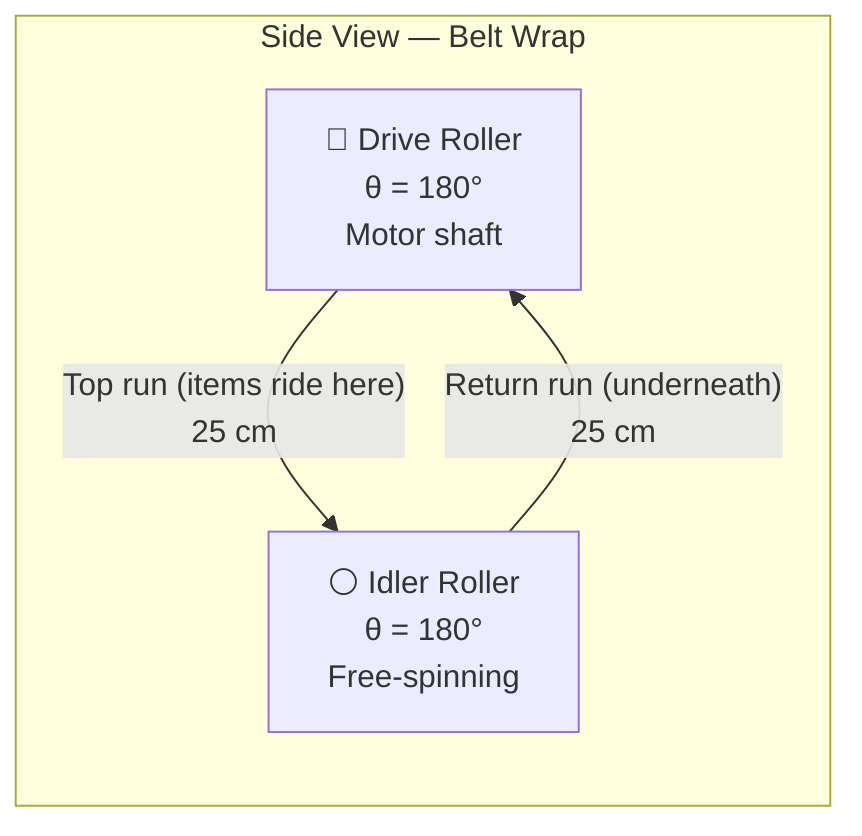
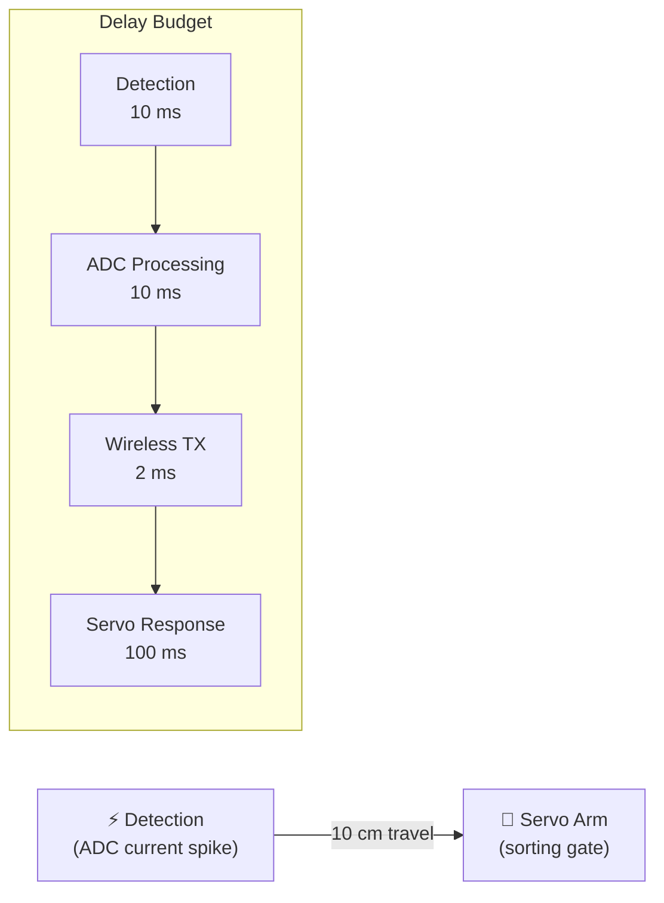
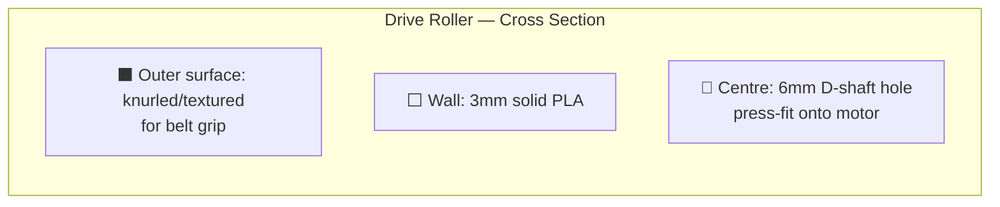
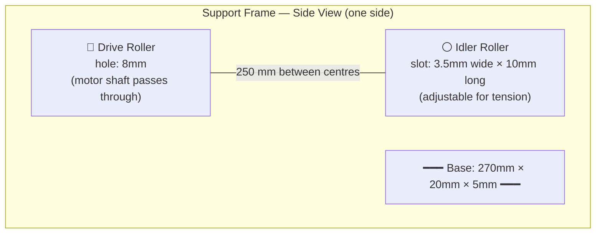
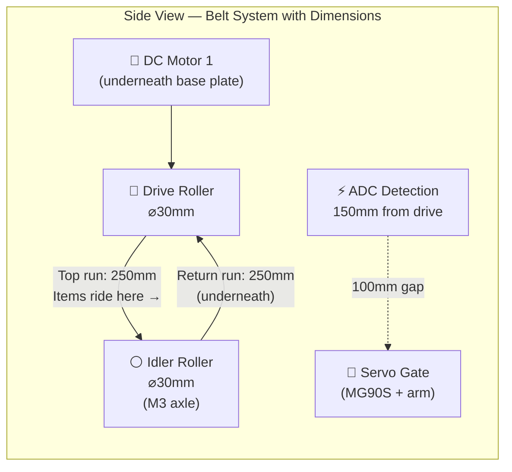
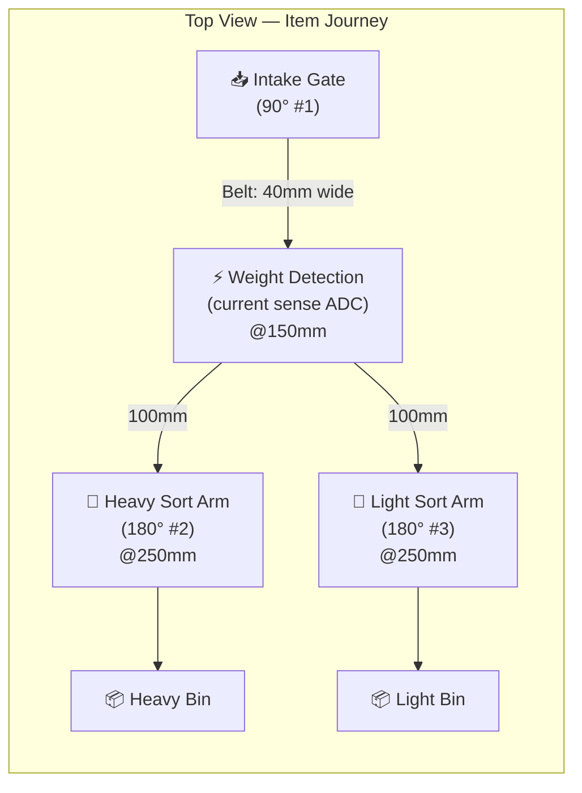
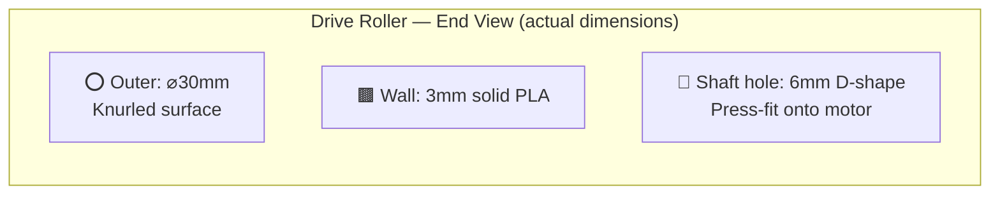

# Conveyor Belt Calculations — GridCell Factory

> All mechanical dimensions, equations, and specifications for Billy's conveyor belt build.
> Motor: 200RPM 3-6V DC geared, ~2 kg·cm stall torque. Items: 3D printed blocks 15g–80g.

---

## 1. Belt Length and Roller Sizing

### Layout Constraints

From the factory layout (40cm × 50cm base plate), the conveyor spans from the intake gate through Stage 1 (size sorting) and Stage 2 (weight sorting). Accounting for intake hopper clearance and electronics bay:

| Parameter | Value | Source |
|---|---|---|
| Distance between roller centres | 25 cm | Factory layout — intake to end of Stage 2 |
| Detection point (ADC current sense) | 15 cm from drive roller | Midway through weight sorting zone |
| Detection to sorting gate | 10 cm | Space for ADC sampling before arm sweep |

### Belt Circumference

The belt wraps around two rollers and spans the gap between them twice (top run + return run):

$$L_{belt} = 2 \times D_{between\_rollers} + \pi \times d_{roller}$$

| Roller Diameter $d$ | Belt Circumference $L_{belt}$ |
|---|---|
| 2 cm | $2(25) + \pi(2) = 56.3$ cm |
| 3 cm | $2(25) + \pi(3) = 59.4$ cm |
| 4 cm | $2(25) + \pi(4) = 62.6$ cm |

### Belt Speed

$$v_{belt} = \pi \times d_{roller} \times \frac{RPM}{60}$$

At full speed (200 RPM):

| Roller Diameter | Belt Speed |
|---|---|
| 2 cm | $\pi(2)\frac{200}{60} = 20.9$ cm/s |
| 3 cm | $\pi(3)\frac{200}{60} = 31.4$ cm/s |
| 4 cm | $\pi(4)\frac{200}{60} = 41.9$ cm/s |

### Wrap Angle

For a standard two-roller flat belt (both rollers same diameter):

$$\theta = \pi \text{ rad} = 180°$$

The belt contacts each roller over a full semicircle. This is the maximum wrap angle for a flat belt — good for grip.

---

## 2. Belt Speed at Different PWM Settings

PWM reduces effective RPM linearly: $RPM_{eff} = \frac{PWM\%}{100} \times 200$

### Speed Table (cm/s)

| PWM % | Eff. RPM | d = 2 cm | d = 3 cm | d = 4 cm |
|---|---|---|---|---|
| 25% | 50 | 5.2 | 7.9 | 10.5 |
| 30% | 60 | 6.3 | 9.4 | 12.6 |
| 40% | 80 | 8.4 | 12.6 | 16.8 |
| 50% | 100 | 10.5 | 15.7 | 20.9 |
| 75% | 150 | 15.7 | 23.6 | 31.4 |
| 100% | 200 | 20.9 | 31.4 | 41.9 |

### Travel Time — Full Belt Span (25 cm)

$$t_{travel} = \frac{D_{span}}{v_{belt}}$$

| PWM % | d = 2 cm | d = 3 cm | d = 4 cm |
|---|---|---|---|
| 25% | 4.8 s | 3.2 s | 2.4 s |
| 30% | 4.0 s | 2.7 s | 2.0 s |
| 40% | 3.0 s | 2.0 s | 1.5 s |
| 50% | 2.4 s | 1.6 s | 1.2 s |
| 75% | 1.6 s | 1.1 s | 0.8 s |
| 100% | 1.2 s | 0.8 s | 0.6 s |

### Recommended Demo Speed

**Target:** Items clearly visible moving, judges can follow the sorting action, servos have time to react.

| Speed | Verdict |
|---|---|
| < 8 cm/s | Too slow — looks broken, boring demo |
| **10–16 cm/s** | **Ideal — items visibly move, servos have time, looks professional** |
| 17–25 cm/s | Fast — works but judges may miss sorting action |
| > 25 cm/s | Too fast — items fly off, servos can't keep up |

**Recommendation: d = 3 cm roller at 40–50% PWM → 12.6–15.7 cm/s**

This gives 1.6–2.0 seconds of travel time — enough for detection, sorting, and dramatic effect.

---

## 3. Belt Tension and Friction

### Capstan Equation

The drive roller transmits force to the belt through friction. The ratio of tight side tension ($T_1$) to slack side tension ($T_2$) is governed by:

$$\frac{T_1}{T_2} = e^{\mu \theta}$$

Where:
- $\mu$ = friction coefficient between belt and roller
- $\theta$ = wrap angle in radians ($\pi$ for our 180° wrap)

### Tension Ratios by Belt Material

| Belt Material | $\mu$ | $e^{\mu\pi}$ | Meaning |
|---|---|---|---|
| **Rubber band** | 0.8 | $e^{2.51} = 12.3$ | Excellent grip — 12× tension multiplication |
| **Fabric strip** | 0.4 | $e^{1.26} = 3.5$ | Good grip — 3.5× multiplication |
| **String/cord** | 0.3 | $e^{0.94} = 2.6$ | Marginal — slips under load |

### Minimum Tension to Prevent Slipping

The belt must transmit enough force to move the heaviest item. The resistive force is:

$$F_{resistance} = (m_{item} + m_{belt}) \times g \times \mu_{slide}$$

Where $\mu_{slide} \approx 0.3$ (belt underside on support surface).

Worst case: 80g item + ~30g belt section = 110g total:

$$F_{resistance} = 0.110 \times 9.81 \times 0.3 = 0.324 \text{ N}$$

The required slack-side tension:

$$T_2 = \frac{F_{resistance}}{e^{\mu\theta} - 1}$$

| Belt Material | $T_2$ (slack) | $T_1$ (tight) | Tension Weight Equivalent |
|---|---|---|---|
| Rubber band | $\frac{0.324}{11.3} = 0.029$ N | 0.35 N | **3g** — trivial |
| Fabric strip | $\frac{0.324}{2.5} = 0.129$ N | 0.45 N | **13g** weight needed |
| String/cord | $\frac{0.324}{1.6} = 0.206$ N | 0.53 N | **21g** weight needed |

### Tensioning Method

For rubber band: Self-tension is sufficient — stretch the band slightly between rollers.

For fabric/string: Add a **tensioning weight** or **spring** on the idler roller:

$$m_{tension} = \frac{T_2}{g} \times \text{safety factor (2×)}$$

| Belt Material | Min Tension Weight | Recommended (2× safety) |
|---|---|---|
| Rubber band | 3g | Not needed — elastic self-tensions |
| Fabric strip | 13g | **26g** (a few coins taped to idler mount) |
| String/cord | 21g | **42g** (small weight on spring-loaded idler) |

**Recommendation: Rubber band or wide elastic band — zero tensioning hardware needed.**

---

## 4. Maximum Load Capacity

### Available Motor Torque

Stall torque: ~2.0 kg·cm at 6V. Use **50% of stall** for continuous safe operation:

$$T_{operating} = 0.5 \times T_{stall} = 0.5 \times 2.0 = 1.0 \text{ kg·cm}$$

### Pull Force at Roller Surface

$$F_{pull} = \frac{T_{motor}}{r_{roller}}$$

| Roller Diameter | Radius | Pull Force |
|---|---|---|
| 2 cm | 1.0 cm | $\frac{1.0}{1.0} = 1.0$ kg·f = 9.81 N |
| 3 cm | 1.5 cm | $\frac{1.0}{1.5} = 0.67$ kg·f = 6.54 N |
| 4 cm | 2.0 cm | $\frac{1.0}{2.0} = 0.50$ kg·f = 4.91 N |

### Maximum Belt Load

The motor must overcome friction between the belt underside and the support surface:

$$m_{max} = \frac{F_{pull}}{\mu_{slide} \times g}$$

With $\mu_{slide} = 0.3$ (belt on wooden/MDF support):

| Roller Diameter | Max Total Load | Max Item Weight (belt = 30g) |
|---|---|---|
| 2 cm | $\frac{9.81}{0.3 \times 9.81} = 3.33$ kg | **3.30 kg** |
| 3 cm | $\frac{6.54}{0.3 \times 9.81} = 2.22$ kg | **2.19 kg** |
| 4 cm | $\frac{4.91}{0.3 \times 9.81} = 1.67$ kg | **1.64 kg** |

### Recommended Maximum (60% safety margin)

$$m_{recommended} = 0.6 \times m_{max}$$

| Roller Diameter | Recommended Max Item Weight |
|---|---|
| 2 cm | **1.98 kg** |
| 3 cm | **1.31 kg** |
| 4 cm | **0.98 kg** |

**Our heaviest item is 80g. The motor can handle this with massive margin — no load concerns whatsoever.** Even with a 3 cm roller, we have 16× headroom.

---

## 5. Sorting Gate Timing

### Detection-to-Gate Timeline

### Travel Time from Detection to Gate

$$t_{travel} = \frac{D_{detection \to gate}}{v_{belt}}$$

With $D = 10$ cm:

| PWM % | d = 3 cm Speed | Travel Time |
|---|---|---|
| 25% | 7.9 cm/s | 1271 ms |
| 30% | 9.4 cm/s | 1061 ms |
| 40% | 12.6 cm/s | 796 ms |
| 50% | 15.7 cm/s | 637 ms |
| 75% | 23.6 cm/s | 424 ms |
| 100% | 31.4 cm/s | 318 ms |

### Total System Delay Budget

| Stage | Time | Cumulative |
|---|---|---|
| Detection (current spike crosses threshold) | 10 ms | 10 ms |
| ADC processing (10-sample average) | 10 ms | 20 ms |
| Wireless TX to SCADA (if needed) | 2 ms | 22 ms |
| Servo response (MG90S: 0.1s/60°) | 100 ms | **122 ms** |

### Maximum Belt Speed for Reliable Sorting

**Constraint 1 — Item must not pass gate before servo reacts:**

$$v_{max,1} = \frac{D_{detection \to gate}}{t_{overhead}} = \frac{10}{0.122} = 82.0 \text{ cm/s}$$

**Constraint 2 — Item must be at gate position long enough for servo to sweep:**

A 3 cm item at speed $v$ is at the gate for $t_{at\_gate} = \frac{w_{item}}{v}$.

The servo needs 100 ms to complete its sweep:

$$v_{max,2} = \frac{w_{item}}{t_{servo}} = \frac{3}{0.100} = 30.0 \text{ cm/s}$$

**Constraint 2 is the limiting factor: $v_{max} = 30.0$ cm/s**

With a 3 cm roller, this means: $RPM = \frac{v \times 60}{\pi d} = \frac{30 \times 60}{\pi \times 3} = 191$ RPM → **~95% PWM max**

| Belt Speed | Available Sorting Time | Reliable? |
|---|---|---|
| 10 cm/s | 300 ms — item at gate | ✅ Very reliable |
| 15 cm/s | 200 ms — item at gate | ✅ Reliable |
| 20 cm/s | 150 ms — tight margin | ⚠️ Marginal |
| 30 cm/s | 100 ms — exactly servo time | ❌ Risky — no margin |
| 40+ cm/s | < 75 ms | ❌ Item passes before servo sweeps |

**Recommendation: Keep below 20 cm/s for reliable sorting.** With d = 3 cm roller, this is ≤ 64% PWM.

---

## 6. Power Consumption

### Motor Current at Different Loads

From motor specs at 5V (recommended demo voltage, ~170 RPM):

$$I_{motor} = \frac{V_{supply} - K_e \cdot \omega}{R_{winding}}$$

| Condition | Current | Power ($P = V \times I$) |
|---|---|---|
| No load (belt running, no items) | ~80 mA | 0.40 W |
| Light item (15g) | ~83 mA | 0.42 W |
| Medium item (40g) | ~88 mA | 0.44 W |
| Heavy item (80g) | ~96 mA | 0.48 W |
| Stall (belt jammed) | ~800+ mA | 4.0+ W ⚠️ |

### Expected Current Change per Gram

From the motor-specs analysis with a sense resistor:

$$\Delta I \approx 0.2 \text{ mA per gram of load}$$

| Item Weight | $\Delta I$ | ADC Count Change | Detection Quality |
|---|---|---|---|
| 15g (light block) | ~3 mA | ~60 counts | Detectable with averaging |
| 20g | ~4 mA | ~80 counts | **Reliably detectable** |
| 40g (normal block) | ~8 mA | ~160 counts | Clear signal |
| 80g (heavy block) | ~16 mA | ~320 counts | Very strong signal |

### ADC Resolution

$$\text{ADC sensitivity} = \frac{3.3V}{65536} = 0.050 \text{ mV/count}$$

$$\text{Current per count} = \frac{0.050 \text{ mV}}{1\Omega_{sense}} = 0.050 \text{ mA/count}$$

### Speed Effects on Detection

Slower belt = steadier current = cleaner ADC readings:

| Belt Speed | Vibration Noise | Recommended ADC Averaging |
|---|---|---|
| < 10 cm/s | Low (±5 counts) | 5 samples |
| 10–20 cm/s | Medium (±10 counts) | 10 samples |
| > 20 cm/s | High (±20 counts) | 20+ samples |

At 15 cm/s with 10-sample averaging, a 20g item produces ~80 ADC counts against ~±10 noise. **Signal-to-noise ratio: 8:1 — very reliable.**

---

## 7. Recommended Design Specifications

Final recommendation for Billy:

| Parameter | Value | Reasoning |
|---|---|---|
| **Roller diameter** | **3 cm** | Best balance: 15.7 cm/s at 50% PWM, ample torque |
| **Distance between rollers** | **25 cm** | Fits factory layout, room for all sorting stations |
| **Belt circumference** | **59.4 cm** | $2(25) + \pi(3) = 59.4$ cm |
| **Belt material** | **Wide rubber band or elastic strip** | μ = 0.8, self-tensioning, best grip |
| **Belt width** | **4 cm** | Wide enough for 3 cm blocks with margin |
| **Demo PWM** | **40–50%** | 12.6–15.7 cm/s — visible, reliable sorting |
| **Max belt speed** | **20 cm/s** | Above this, servo can't sort reliably |
| **Max item weight** | **200g** | Motor handles 1.3 kg — massive headroom |
| **Min detectable weight** | **20g** | 80 ADC counts — reliable with averaging |
| **Detection → gate distance** | **10 cm** | 637 ms travel at 15.7 cm/s — ample servo time |
| **Belt tension** | **Self-tensioned** | Rubber band stretches to fit — no weights needed |
| **Motor voltage** | **5V** | From buck converter, ~170 RPM, stable |

---

## 8. 3D Print Specifications for Billy

### Part 1: Drive Roller (Motor Side)

| Dimension | Value |
|---|---|
| Outer diameter | **30 mm** |
| Length | **45 mm** (belt width + 2.5 mm margin each side) |
| Shaft hole | **6 mm D-shape** (measure motor shaft — adjust if needed) |
| Wall thickness | **3 mm** minimum |
| Surface texture | **0.5 mm knurl grooves** (horizontal lines around circumference) |
| Infill | **60%** — needs to be strong at the shaft |
| Layer height | **0.2 mm** |
| Print orientation | **Horizontal** (axis flat on bed) — better roundness |
| Est. print time | **~45 min** |

### Part 2: Idler Roller (Free-Spinning End)

| Dimension | Value |
|---|---|
| Outer diameter | **30 mm** (must match drive roller) |
| Length | **45 mm** |
| Centre hole | **3.2 mm** (for M3 bolt as axle — loose fit to spin freely) |
| Wall thickness | **3 mm** |
| Surface texture | **Smooth** (less important — belt tension handles grip) |
| Infill | **40%** — lighter is better, less inertia |
| Layer height | **0.2 mm** |
| Print orientation | **Horizontal** |
| Est. print time | **~35 min** |

### Part 3: Roller Support Frame (×2 — Left and Right Sides)

| Dimension | Value |
|---|---|
| Length | **270 mm** (250 mm between roller centres + 10 mm each end) |
| Height | **40 mm** (roller centre sits 20 mm above base plate) |
| Thickness | **5 mm** |
| Drive roller hole | **8 mm** diameter (6 mm shaft + clearance for motor mount) |
| Idler roller slot | **3.5 mm wide × 10 mm long** (allows tension adjustment) |
| Base mounting holes | **3.2 mm × 4 holes** (M3 screws to base plate) |
| Infill | **50%** |
| Layer height | **0.2 mm** |
| Print orientation | **Flat** (largest face on bed) |
| Est. print time | **~1 h** per side |

### Part 4: Belt Guides (×2 — Left and Right Rails)

| Dimension | Value |
|---|---|
| Length | **250 mm** (full span between rollers) |
| Height | **8 mm** (5 mm above belt surface) |
| Thickness | **3 mm** |
| Gap between guides | **42 mm** (belt width + 1 mm each side) |
| Mounting | Slot into support frame top edge or hot-glue |
| Infill | **30%** — cosmetic, not structural |
| Layer height | **0.2 mm** |
| Print orientation | **Flat** |
| Est. print time | **~30 min** each |

### Part 5: Servo Mount Bracket (for MG90S at Sorting Gate)

| Dimension | Value |
|---|---|
| Servo pocket | **23 mm × 12.5 mm × 28 mm** (MG90S body) |
| Mounting tab holes | **2× M2 holes**, matching MG90S ears |
| Base plate mounting | **2× M3 holes** at bottom |
| Bracket height | **35 mm** (servo centre at belt level) |
| Position | **10 cm from drive roller** (detection-to-gate distance) |
| Wall thickness | **2.5 mm** |
| Infill | **50%** |
| Layer height | **0.2 mm** |
| Print orientation | **Upright** (pocket opening facing up) |
| Est. print time | **~25 min** |

### Diagrams

#### Side View — Complete Belt System

#### Top View — Item Path

#### Drive Roller Cross-Section

### Print Summary Table

| Part | Qty | Print Time | Filament | Priority |
|---|---|---|---|---|
| Drive roller | 1 | ~45 min | ~8g PLA | **P1** — need first |
| Idler roller | 1 | ~35 min | ~6g PLA | **P1** — need first |
| Support frame (side) | 2 | ~2 h total | ~20g PLA | **P1** — structural |
| Belt guides | 2 | ~1 h total | ~8g PLA | P2 — can add later |
| Servo mount bracket | 1 | ~25 min | ~5g PLA | P2 — after belt works |
| **Total** | **7 parts** | **~4 h 45 min** | **~47g PLA** | |

### Critical Measurements Billy Must Take

Before printing, **measure the actual motor**:

| Measurement | What to Check | Affects |
|---|---|---|
| Motor shaft diameter | Caliper the shaft — is it exactly 6mm? | Drive roller hole size |
| D-shaft flat width | How wide is the flat? | D-hole geometry |
| Motor body diameter | For motor mount bracket | Frame design |
| M3 mounting hole spacing | Distance between motor face holes | Frame mounting |

**If shaft is not 6mm, adjust the drive roller centre hole to match.** A 0.1mm error means the roller wobbles.

---

## Quick Reference Card

| What | Value |
|---|---|
| Roller diameter | 30 mm |
| Roller spacing | 250 mm |
| Belt length | 594 mm circumference |
| Belt width | 40 mm |
| Belt material | Rubber band / elastic |
| Demo speed | 12.6–15.7 cm/s (40–50% PWM) |
| Max sorting speed | 20 cm/s (64% PWM) |
| Detection → gate | 10 cm / 637 ms at 50% PWM |
| Max item weight | 200g (motor limit ~1.3 kg) |
| Min detectable | 20g (80 ADC counts) |
| Demo items | 15g / 40g / 80g 3D printed blocks |
| Total 3D print time | ~4 h 45 min |
| Total PLA | ~47g |
