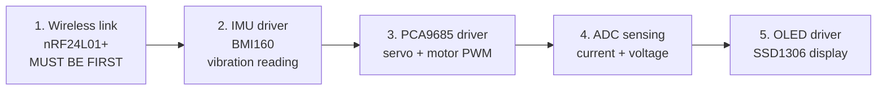
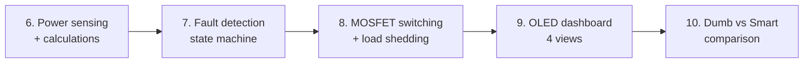
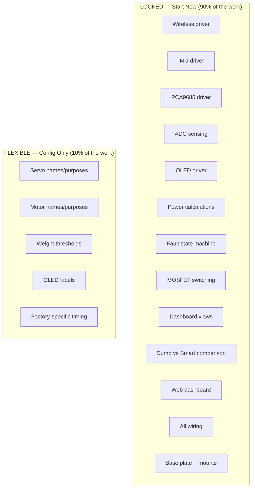

# Development Priority — What to Build and When

> Firmware work that is LOCKED regardless of factory design. Start immediately.

---

## Phase 1: Foundations (Can Start NOW)

These work the same no matter what factory we build. Zero risk of rework.

| # | Task | Time | Depends On | Test |
|---|---|---|---|---|
| **F1** | nRF24L01+ wireless link — two Picos send/receive packets | 1.5h | Nothing — start first | Ping-pong test: Pico A sends, Pico B replies |
| **F2** | BMI160 IMU driver — read accel + gyro, calculate $a_{rms}$ | 1.5h | I2C wiring (Wooseong W2) | Print vibration values over serial. Shake sensor = values spike |
| **F3** | PCA9685 driver — set PWM on any channel (servo angle, motor speed) | 1.5h | I2C wiring (Wooseong W2) | Servo moves to commanded angle. Motor spins at set speed |
| **F4** | ADC sensing — read GP26 (bus voltage), GP27 (M1 current), GP28 (M2 current) | 1h | Voltage divider + sense resistors (Wooseong W4-W5) | ADC readings match multimeter within 10% |
| **F5** | SSD1306 OLED driver — text, lines, rectangles, pixel drawing | 1h | I2C wiring on Pico B (Wooseong W7) | "Hello GridBox" displays on screen |

**Total Phase 1: ~6.5 hours.** After this, every sensor and actuator works independently.

---

## Phase 2: Core Logic (Can Start After Phase 1)

The algorithms that make GridBox smart. Same logic regardless of factory type.

| # | Task | Time | Depends On | Test |
|---|---|---|---|---|
| **L1** | Power calculations — convert ADC to voltage/current/watts. Calculate per-branch power, total, excess | 1h | F4 (ADC working) | OLED shows correct wattage matching multimeter |
| **L2** | Fault detection state machine — NORMAL→DRIFT→WARNING→FAULT→EMERGENCY using IMU $a_{rms}$ thresholds | 1h | F2 (IMU working) | Shake motor → state transitions through each level |
| **L3** | MOSFET switching — GPIO 10-13 control, load shedding priority (P4→P3→P2→P1) | 1h | Wooseong's MOSFET circuits (W3) | Reduce bus voltage → LEDs shed in order |
| **L4** | OLED dashboard — 4 views: system status, power flow, fault monitor, manual control. Joystick scrolls | 1.5h | F5 (OLED working) + L1 (power data) | All 4 views render with live data |
| **L5** | Dumb vs Smart A/B — run 10s dumb (100% everything), 10s smart (intelligent), measure savings | 1h | L1 + L3 | OLED shows: "Smart saved 69% vs Dumb" with real ADC data |

**Total Phase 2: ~5.5 hours.**

---

## Phase 3: Factory-Specific (After Physical Build Decided)

This is the ONLY part that depends on the factory design. But it's mostly **configuration, not new code.**

| # | Task | Time | What Changes |
|---|---|---|---|
| **S1** | Weight sensing via motor current — detect items on belt/turntable | 1h | Threshold values in `config.py` |
| **S2** | Sorting logic — servo timing based on belt length + speed | 1h | `BELT_LENGTH_CM` and `SPEED_CM_PER_S` in `config.py` |
| **S3** | 4-LED station sequence — INTAKE→WEIGH→RESULT→SORTED | 30min | LED pin assignments + labels in `config.py` |
| **S4** | OLED production view — items counted, weight readings, sort stats | 1h | Screen text labels in `config.py` |
| **S5** | Calibration routine — empty belt baseline, known weight reference | 30min | Called once at startup |
| **S6** | Energy signature integration — Wooseong's current analysis on Core 1 | 1.5h | Divergence score thresholds |

**Total Phase 3: ~5.5 hours.** But most of this is connecting Phase 1+2 code to specific factory scenarios.

---

## Phase 4: Polish (Last)

| # | Task | Time |
|---|---|---|
| **P1** | Web dashboard on laptop — Flask reads serial, shows live graphs | 1h |
| **P2** | C SDK port — port core modules for production demo | 2h |
| **P3** | Demo practice — rehearse the 6-step script, time it | 1h |
| **P4** | Documentation — update README, wiring photos, final architecture | 1h |

---

## What Wooseong Can Wire NOW

These circuits are FIXED — same wiring regardless of factory:

| Circuit | Pins | Status |
|---|---|---|
| I2C bus (IMU + PCA9685) | GP4 SDA, GP5 SCL + 4.7kΩ pull-ups | Wire now |
| SPI bus (nRF24L01+) | GP0-3, GP16 + 3.3V power | Wire now |
| ADC voltage divider | GP26 + 10kΩ+10kΩ | Wire now |
| Current sense resistors | GP27 + 1Ω (M1), GP28 + 1Ω (M2) | Wire now |
| MOSFET switches | GP10-13 + 1kΩ gate resistors | Wire now |
| Status LEDs | GP14 red, GP15 green + 330Ω | Wire now |
| Pico B: OLED + joystick + pot + nRF | GP4/5, GP26/27/28, GP22, SPI | Wire now |

**100% of Wooseong's wiring is factory-independent.** He can start everything now.

## What Billy Can Build NOW

| Part | Status |
|---|---|
| Base plate — cut to size | Build now |
| Motor mounts — hold motors in position | Build now (measure motor dimensions) |
| Servo brackets — hold servos | Build now (MG90S is standard 23×12×28mm) |
| Electronics bay — space for breadboards | Build now |
| LED tower housing | Build now |
| SCADA station (Pico B base) | Build now |

**The only thing that depends on factory choice:** turntable disc vs conveyor rollers vs fan housing. But the mounts, brackets, and base are the same.

---

## Summary: What's Locked

**90% of the project is factory-independent.** Start everything now. The remaining 10% is config values we set on hackathon day.
