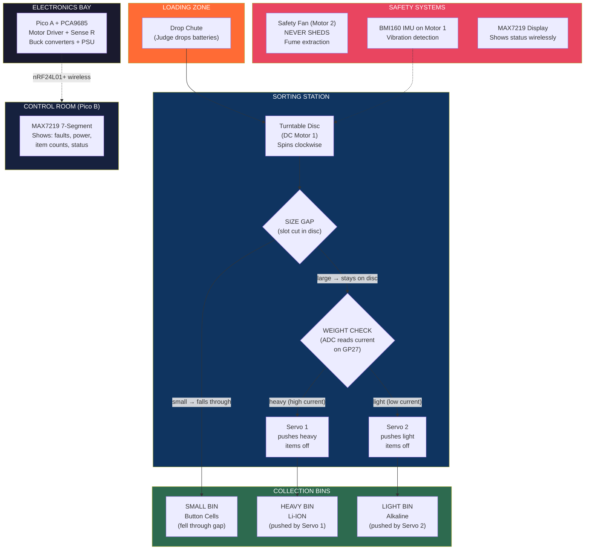
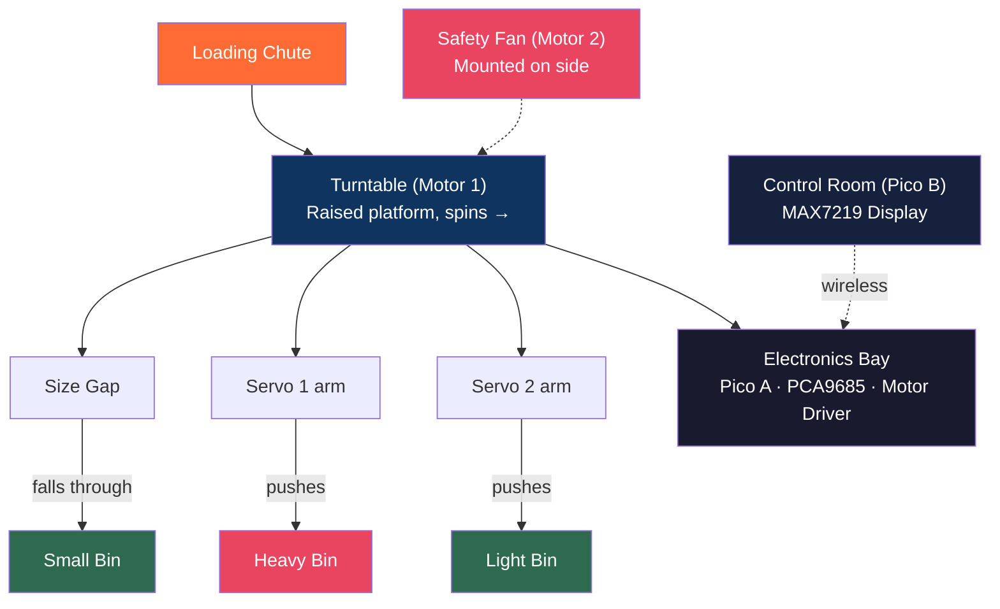
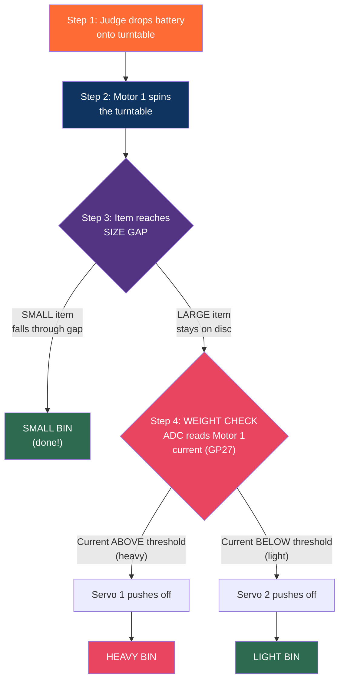

# Battery Recovery Factory — Build Plan

> How we sort objects by WEIGHT and SIZE using our actual hardware.

---

## Our Actual Parts (What We Really Have)

| Part | Qty | What It Does For Us |
|------|-----|-------------------|
| DC Motor 1 | 1 | Spins the sorting turntable |
| DC Motor 2 | 1 | Spins the safety extraction fan |
| Servo 1 (MG90S) | 1 | HEAVY sort gate — pushes heavy items off turntable |
| Servo 2 (MG90S) | 1 | LIGHT sort gate — pushes light items off turntable |
| BMI160 IMU | 1 | Mounted on Motor 1 — detects vibration = fault |
| ADC GP26 | 1 | Bus voltage measurement |
| ADC GP27 | 1 | Motor 1 current sense (THIS IS HOW WE WEIGH!) |
| ADC GP28 | 1 | Motor 2 current sense |
| Potentiometer | 1 | Judge sets weight threshold (heavy vs light cutoff) |
| Joystick | 1 | Manual override + fault reset |
| OLED | 1 | Live dashboard — shows weight, power, sorted count |
| LEDs (R/Y/G/B) | 4 | Status tower |
| Load LEDs (P1-P4) | 4 | Power priority indicators |
| PCA9685 | 1 | Drives both servos |
| 2x MOSFET | 2 | Switch motors on/off |
| 2x 1 ohm resistor | 2 | Current sense resistors |

---

## How We Detect Weight (The Smart Part)

We DON'T have a scale. But we DO have current sensing on Motor 1.

```
HEAVIER object on turntable
    = Motor needs MORE torque to spin it
    = Motor draws MORE current
    = ADC GP27 reads HIGHER voltage across 1 ohm sense resistor
    = We know it's HEAVY

LIGHTER object on turntable
    = Motor needs LESS torque
    = Motor draws LESS current
    = ADC GP27 reads LOWER voltage
    = We know it's LIGHT
```

### The Math (Simple)

```
V_sense = ADC_raw x (3.3 / 65535)     <-- voltage across sense resistor
I_motor = V_sense / 1 ohm = V_sense   <-- current in amps (Ohm's law)
Weight  = proportional to I_motor      <-- heavier = more current

Example:
  Empty turntable:    I = 0.15A (baseline)
  Light battery (AA): I = 0.20A (small increase)
  Heavy battery (D):  I = 0.35A (big increase)

  Threshold set by potentiometer:
  If I_motor > threshold --> HEAVY --> Servo 1 pushes to HEAVY bin
  If I_motor < threshold --> LIGHT --> Servo 2 pushes to LIGHT bin
```

### How We Detect Size

Size sorting is done PHYSICALLY, not electronically:

```
The turntable has a GAP/SLOT cut into the edge:
  - SMALL items (AA batteries) fall through the gap into a chute below
  - LARGE items (D batteries, phone batteries) are too big to fall through
  - Large items stay on the turntable and get pushed by a servo

This is exactly how real MRFs work — "star screens" are just
spinning discs with gaps that sort by size.
```

---

## The Factory Layout (Top View)



---

## The Factory Layout (Side View)



---

## Sorting Flow — Step by Step



### What Goes In Each Bin

| SMALL BIN | LIGHT BIN | HEAVY BIN |
|---|---|---|
| Fell through the gap | Large but light | Large and heavy |
| AAA batteries | Empty AA cells | D batteries |
| Button cells | Discharged lithium pouch | Phone batteries |
| Coin batteries | Alkaline AA (used up) | Full 18650s |
| Watch batteries | | Laptop cells |
| **Label:** "BUTTON CELL RECOVERY" | **Label:** "ALKALINE RECYCLING" | **Label:** "LITHIUM ION - CAUTION" |

---

## OLED Dashboard Screens (4 Views)

### Screen 1: LIVE SORTING

```
+------------------------+
| GRIDCELL v1.0    LIVE  |
|                        |
| CURRENT: 0.34A         |
| WEIGHT:  #### HEAVY    |
| THRESHOLD: 0.25A       |
|                        |
| SORTED: 12 items       |
| SM:4  LT:5  HV:3      |
+------------------------+
```

### Screen 2: POWER

```
+------------------------+
| POWER MONITOR          |
|                        |
| BUS:     5.1V          |
| MOTOR 1: 0.34A  1.7W  |
| MOTOR 2: 0.28A  1.4W  |
| TOTAL:   4.2W          |
|                        |
| BUDGET: 72W  UTIL: 6%  |
+------------------------+
```

### Screen 3: ENERGY COMPARISON

```
+------------------------+
| ENERGY SAVINGS         |
|                        |
| SMART MODE:   4.2W avg |
| DUMB MODE:    8.1W avg |
|                        |
| SAVED: 48%             |
| ################       |
| That's REAL data from  |
| sense resistors!       |
+------------------------+
```

### Screen 4: FAULT STATUS

```
+------------------------+
| SYSTEM STATUS          |
|                        |
| MOTOR 1: OK            |
| MOTOR 2: OK            |
| IMU:     HEALTHY       |
| COMMS:   LINKED        |
|                        |
| FAN: ALWAYS ON         |
| UPTIME: 00:04:32       |
+------------------------+
```

---

## Demo Script for Judges

| Step | Time | What Happens | What You Say |
|------|------|-------------|-------------|
| 1 | 0:00 | Plug in PSU. Fan starts FIRST. LEDs boot: red, yellow, green. OLED: "GridCell v1.0 - EXTRACTION ACTIVE" | "First thing: the safety fan. Lithium batteries release toxic gas. This fan NEVER turns off." |
| 2 | 0:10 | Drop a small button cell. It falls through the gap. OLED: "SORTED: 1 - SMALL" | "Size sorting first. Button cells fall through the gap - too small for the main line." |
| 3 | 0:15 | Drop a heavy D battery. Stays on disc. Current spikes on OLED. Servo 1 pushes it to HEAVY bin. | "Large and heavy. Motor current jumped to 0.35A. That's a D cell - lithium processing line." |
| 4 | 0:20 | Drop a light empty AA. Stays on disc. Current stays low. Servo 2 pushes it to LIGHT bin. | "Large but light - used alkaline. Only 0.18A. Different recycling process needed." |
| 5 | 0:30 | Judge turns potentiometer. Threshold changes on OLED. | "You set the weight cutoff. Stricter threshold catches borderline cells. This is how real plants calibrate." |
| 6 | 0:40 | Drop 3 more batteries quickly. System sorts each one automatically. | "Full speed sorting. Each one weighed by motor current, sorted in under 2 seconds." |
| 7 | 0:50 | Turn potentiometer up high. Motors speed up. P4 LED turns off. P3 dims. | "Power budget hit. Lights shed first. Sorting slows. But the fan -" (point) "- still running. Safety first." |
| 8 | 1:00 | Shake Motor 1. RED LED. All servos stop. Fan speeds UP. OLED: "THERMAL EVENT PROTOCOL" | "Anomaly! Could be a battery rupturing. Everything stops. Fan goes to MAX. Containment." |
| 9 | 1:05 | Press joystick button. System recovers. Green LED. | "All clear. System self-heals." |
| 10 | 1:10 | OLED shows savings screen. | "12 batteries sorted. 3 sizes, 3 processing lines. 48% energy saved. All measured with real sense resistors, not simulated. Total cost: 15 pounds." |

---

## Physical Build Materials

### What You Need

| Item | Where to Get | Cost |
|------|-------------|------|
| Cardboard disc (turntable) | Cut from box | Free |
| Slot/gap in disc edge | Cut with scissors | Free |
| 3 small bins/cups | Paper cups or cut boxes | Free |
| Labels: "BUTTON CELL", "ALKALINE", "LITHIUM ION" | Print or write | Free |
| Yellow hazard tape | Hardware store / Amazon | ~$3 |
| Dead batteries (props) | From home | Free |
| Cardboard box (enclosure) | Any box | Free |
| Hot glue / tape | From home | Free |

### How to Build the Turntable

```
1. Cut a cardboard circle (about 15-20cm diameter)
2. Poke a hole in the centre
3. Attach to Motor 1 shaft (hot glue or press fit)
4. Cut a rectangular GAP in the edge (about 2cm wide)
   - AA batteries are 14mm diameter, so 2cm gap lets small stuff fall
   - D batteries are 33mm diameter, so they WON'T fall through
5. Motor 1 sits underneath, shaft points UP through the platform
```

### How to Mount the Servos

```
Servo 1 (HEAVY gate):
  - Mount on the platform edge, arm pointing inward
  - When activated: arm swings 90 degrees, pushes item off disc
  - Item falls into HEAVY BIN placed next to platform

Servo 2 (LIGHT gate):
  - Mount 90 degrees around from Servo 1
  - Same action: arm swings, pushes item off disc
  - Item falls into LIGHT BIN

The SIZE GAP is positioned BEFORE both servos (items hit the gap first)
```

### Assembly Diagram

```
          TOP VIEW OF PLATFORM

              LOADING
              ZONE
               |
               v
        +------+------+
       /       |       \
      /   +---------+   \
     /    | TURNTABLE|    \
    |     |  DISC    |     |
    |     |          |     |
    |     |  Motor1  |     |
    |  [GAP]  shaft  |     |
    |   ||    (o)    |     |      [HEAVY BIN]
    |   vv           |  <--[SERVO 1]
    | (small     +---+     |
    |  falls)    |         |
    |            |         |
    |         <--[SERVO 2]
     \           |        /       [LIGHT BIN]
      \   +------+       /
       \  |     fan     /
        +-+--+---------+
              |
         [SMALL BIN]
         (under gap)


    [FAN Motor 2]          [CONTROL ROOM]
    mounted on side         separate box
    of platform             with OLED,
    blowing across          joystick,
                            potentiometer
```

---

## Wiring Summary

### Pico A (Factory Floor)

```
GP4  (SDA) ----> BMI160 + PCA9685
GP5  (SCL) ----> BMI160 + PCA9685
GP26 (ADC) ----> Bus voltage divider (10k + 10k)
GP27 (ADC) ----> Motor 1 sense resistor (1 ohm) <-- WEIGHT SENSING!
GP28 (ADC) ----> Motor 2 sense resistor (1 ohm)
GP10       ----> MOSFET gate Motor 1 (via 1k resistor)
GP11       ----> MOSFET gate Motor 2 (via 1k resistor)
GP12       ----> LED bank switch
GP13       ----> Recycle path switch
GP14       ----> Red LED (330 ohm)
GP15       ----> Green LED (330 ohm)
GP0,1,2,3,16 -> nRF24L01+ (SPI)

PCA9685 CH0 --> Servo 1 (heavy gate)
PCA9685 CH1 --> Servo 2 (light gate)
```

### Pico B (Control Room)

```
GP4  (SDA) ----> OLED SSD1306
GP5  (SCL) ----> OLED SSD1306
GP26 (ADC) ----> Joystick X
GP27 (ADC) ----> Joystick Y
GP28 (ADC) ----> Potentiometer (weight threshold)
GP22       ----> Joystick button (pull-up)
GP14       ----> Red LED (330 ohm)
GP15       ----> Green LED (330 ohm)
GP0,1,2,3,16 -> nRF24L01+ (SPI)
```

---

## The Key Selling Points for Judges

1. **We WEIGH items using motor current** — no expensive load cell needed. This is how real industrial conveyors detect load changes.

2. **We sort by SIZE using a physical gap** — exactly how real star screens work in recycling plants. No camera or sensor needed.

3. **The fan NEVER turns off** — best demo of intelligent power priority. Judges can SEE it.

4. **All power measurements are REAL** — sense resistors, not simulated numbers.

5. **Judge interaction:**
   - Drop batteries on the turntable (tactile)
   - Turn the potentiometer to change weight threshold (control)
   - Shake Motor 1 to trigger fault (dramatic)
   - Press joystick to reset (satisfying)

6. **Total cost: ~$15** — mostly the kit components we already have.
