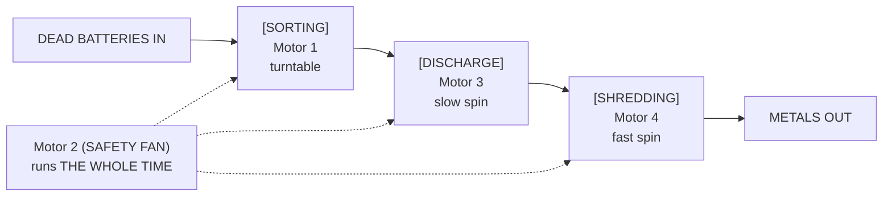
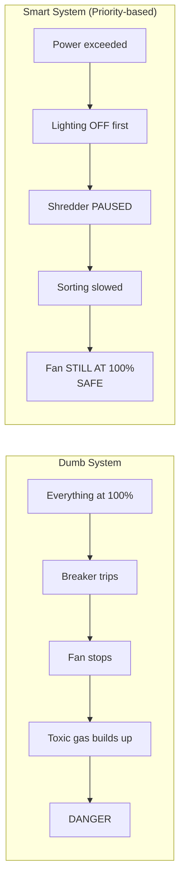
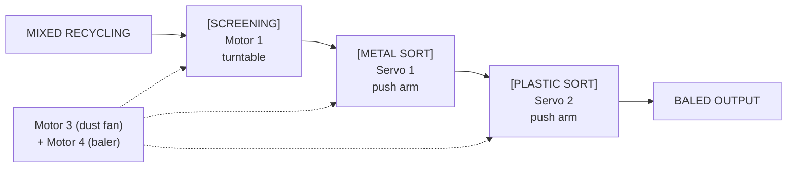

# Factory Deep Dive - Simple Version

> We have 4 factory ideas. This doc explains what each one is, how we build it with our parts, and which one we should pick.

## What Parts Do We Have?

| Part | How Many | What It Does |
|---|---|---|
| DC Motors | 4 | Spin things (discs, fans, drums, rollers) |
| Servos (MG90S) | 6+ | Move to exact positions (gates, push arms, valves) |
| LEDs | Lots | Status lights and load indicators |
| IMU (BMI160) | 1 | Detects shaking/vibration - stick it on a motor to detect faults |
| ADC (analog inputs) | 3 | Measure voltage + current on 2 motors |
| Potentiometer | 1 | A dial the judge can turn |
| Joystick | 1 | Manual override control |
| OLED Screen | 1 | Shows live data (like a mini dashboard) |
| PCA9685 | 1 | Controls all the servos + motors (16 channels) |

## How We Measure Power (This Is Our Main Trick)

We measure REAL power, not fake numbers:

- Motor 1 - has a sense resistor, so we measure its actual current
- Motor 2 - same, real current measurement
- Motor 3 & 4 - estimated from how fast we're running them (PWM)
- Servos & LEDs - estimated/calculated

We compare "dumb mode" (everything at 100%) vs "smart mode" (only use what you need) and show judges the real energy savings (~50%).

This is how real factories work - important stuff gets hardware sensors, everything else gets software estimation.

---

## Factory 1: Pharmaceutical Tablet Factory

Name: GridPharma

What it is: A mini pill-making factory

### The 4 Stages

### What Each Part Does

| Part | Role | What Judges See |
|---|---|---|
| Motor 1 | Mixing drum - spins a paddle | A disc spinning |
| Motor 2 | Tablet press - spins a turntable | Items riding on a spinning platform |
| Motor 3 | Coating dryer fan | A fan blowing air |
| Motor 4 | Conveyor between stages | Movement between stations |
| Servo 1 | Feed gate (opens to let ingredients in) | Arm clicks open/closed |
| Servo 2 | QC reject arm (pushes bad pills off) | Items get pushed into a red "REJECT" bin |
| Servo 3 | Good product gate | Gate opens, items fall through |
| Servo 4 | Packaging selector (left or right) | Flap swings to route items |
| Servo 5 | Blister seal press | Arm presses down |
| Servo 6 | Emergency shutoff | All gates close at once |
| IMU | Vibration sensor on Motor 1 | Judge shakes motor = FAULT triggered |
| Pot | Controls production speed | Turn dial = everything speeds up |
| Joystick | Manual override | Press button to trigger actions |
| OLED | Dashboard | Live numbers: batch #, pills made, power usage |
| LEDs | Status tower | Green=good, Yellow=warning, Red=batch hold, Blue=saving energy |

### The Demo (What We Show Judges)

- Power on - motors start, LEDs do a boot sequence, OLED shows "GridPharma v1.0"
- Drop mints on turntable - they spin around through the stages
- Servo pushes some to PASS, some to REJECT - "Every tablet gets checked"
- Judge turns the dial - everything speeds up, power goes up on screen
- Power budget exceeded - lighting LED turns off automatically to save power
- Judge shakes Motor 1 - FAULT! Motor stops, red LED flashes, "BATCH HOLD"
- Other motors keep running - power from broken motor goes to keep the fan going
- Judge presses joystick - system recovers
- OLED shows savings - "Smart: 7.2W vs Dumb: 14.8W - SAVED 51%"

### Build It With

- Cardboard disc on Motor 1 labelled "GRANULATOR"
- Turntable disc on Motor 2 labelled "TABLET PRESS"
- Fan on Motor 3 labelled "COATING DRYER"
- Small roller on Motor 4 labelled "CONVEYOR"
- Two bins: green "PASS" and red "REJECT"
- White cardboard enclosure (pharma factories are white)
- Props: mints, Smarties, or small foam discs

### Why Pick This One?

- "Every pill you've ever taken was made in a factory like this"
- WHO stat: 1 in 10 medicines in developing countries is substandard
- Pharma HVAC uses 40-60% of total energy - smart control matters
- Score: 95/100

---

## Factory 2: E-Waste Battery Sorting Plant

Name: GridCell

What it is: A battery recycling plant that sorts dead batteries safely

### The 4 Stages

### What Each Part Does

| Part | Role | What Judges See |
|---|---|---|
| Motor 1 | Receiving turntable - batteries go on here | Items spinning on disc |
| Motor 2 | SAFETY FAN - NEVER turns off | Fan always spinning, even during faults |
| Motor 3 | Discharge station | Motor turning slowly |
| Motor 4 | Shredder | Motor spinning fast |
| Servo 1 | Lithium battery sorter | Pushes items to "Li-ION" bin |
| Servo 2 | Alkaline battery sorter | Pushes items to "ALK" bin |
| Servo 3 | Hazmat blocker | Blocks damaged batteries - "HAZMAT" bin |
| Servo 4 | Discharge valve | Opens/closes |
| Servo 5 | Shredder feed gate | Only opens after discharge is done |
| Servo 6 | Emergency lockout | ALL gates snap closed at once |
| IMU | On Motor 1 - detects problems | Judge shakes motor = "THERMAL EVENT!" |
| Pot | Processing speed | Judge turns dial |
| Joystick | Emergency override | Judge presses to reset |
| OLED | Dashboard | Cells processed, sort breakdown, energy data |
| LEDs | Safety tower | Green=normal, Yellow=hot, Red=THERMAL EVENT, Blue=saving |

### The Star Feature: Fan Never Sheds

This is the best demo of smart power management:

Judges can SEE this: the lighting LED turns off, then shredder LED, but the fan stays on. Always.

### The Demo

- Power on - fan starts FIRST. "Lithium batteries make toxic gas. Fan never stops."
- Drop 5 batteries on turntable - real dead AA/AAA batteries
- Servos sort them - lithium to one bin, alkaline to another, damaged to hazmat
- Turn dial up - everything speeds up
- Power exceeded - lighting off, shredder paused, BUT FAN STILL RUNNING
- Shake Motor 1 - "THERMAL EVENT!" All sorting stops. Fan goes to MAX speed.
- Press joystick - system recovers
- OLED shows - "47 cells sorted. 50% energy saved."

### Build It With

- Turntable disc on Motor 1
- Fan on Motor 2 with big label: "FUME EXTRACTION - SAFETY CRITICAL"
- 3 bins: "Li-ION" (green), "ALK/NiMH" (blue), "HAZMAT" (red with warning signs)
- Output tray: "BLACK MASS - RECOVERED METALS"
- Props: real dead batteries (free - everyone has them)
- Yellow hazard tape around HAZMAT bin (about $3, looks amazing)

### Why Pick This One?

- Fan-never-sheds is the single best demo of smart power management
- EU Battery Regulation 2023 - this is in the news right now
- 78 million batteries reach end-of-life yearly in the UK, only 5% recycled
- Real batteries as props - judges can hold them
- Score: 96/100 (HIGHEST)

---

## Factory 3: Coffee Roasting Facility

Name: GridRoast

What it is: A smart coffee roastery

### The 4 Stages

### What Each Part Does

| Part | Role | What Judges See |
|---|---|---|
| Motor 1 | Roasting drum (a tube that spins) | A cylinder rotating - looks industrial |
| Motor 2 | Cooling fan (critical - beans burn without it) | Fan blasting air |
| Motor 3 | Chaff collector fan | Second fan |
| Motor 4 | Packaging conveyor | Items moving to final station |
| Servo 1 | Dump gate - opens to drop beans from drum to cooling | Gate opens, items fall out. THE big moment |
| Servo 2 | QC arm - pushes bad beans out | Arm pushes rejects |
| Servo 3 | Bag size selector (250g or 1kg) | Flap switches left/right |
| Servo 4 | Feed hopper gate | Opens to load new batch |
| Servo 5 | Emergency dump | All gates open - "SAVE THE BEANS!" |
| IMU | On the drum motor | Shake = "DRUM FAULT - EMERGENCY COOL" |
| Pot | Roast level: Light <-> Dark | Most intuitive - everyone gets it |
| OLED | Roast dashboard | Batch #, roast time, energy |
| LEDs | Roast phase | Green=drying, Yellow=browning, Red=second crack, Blue=cooling |

### The Demo

- Power on - "Smart coffee roastery"
- Turn pot to Medium Roast - system calculates speed + time
- Load beans, servo opens feed gate - beans drop into drum
- Drum spins, LED goes green -> yellow -> red - roasting phases
- Servo 1 opens dump gate! - beans fall to cooling tray, fan goes MAX
- Servo 2 pushes rejects - "QC: 2 quakers removed, batch quality 97.3%"
- Turn pot to Dark Roast - drum runs longer
- Shake motor - "Bearing failure! Emergency dump and cool!"
- OLED - "3 batches. 55% energy saved."

### Build It With

- Toilet roll tube on Motor 1 as the roasting drum
- Fan underneath a flat tray on Motor 2
- Props: dried kidney beans, brown beads, or actual coffee beans (about $3)
- Bins: "GRADE A" (green), "QUAKERS/REJECT" (red)
- Brown/warm colour scheme

### Why Pick This One?

- Everyone drinks coffee - instant emotional connection
- Potentiometer as "light <-> dark" roast is the most natural control
- The drum dump gate is the most dramatic physical moment
- But: the problem is less "urgent" than batteries or pharma
- Score: 94/100

---

## Factory 4: Recycling Centre (MRF)

Name: GridSort

What it is: Where your recycling bin stuff actually gets sorted

### The Stages

### What Each Part Does

| Part | Role | What Judges See |
|---|---|---|
| Motor 1 | Screening turntable | Items spinning on disc |
| Motor 2 | Separator | Second motor spinning |
| Motor 3 | Dust/air extraction fan | Fan blowing |
| Motor 4 | Baler motor | Motor spinning - "compressing bale" |
| Servo 1 | Metal separator arm | Pushes metal to METAL bin |
| Servo 2 | Plastic sorter arm | Pushes plastic to PLASTIC bin |
| Servo 3 | Contaminant blocker | Blocks bad items - "shouldn't be in recycling!" |
| Servo 4 | Baler output gate | Opens when bale done |
| Servo 5 | Feed rate gate | Controls input speed |
| Servo 6 | Emergency all-stop | Everything halts |
| IMU | On Motor 1 | Shake = "SCREEN JAM - LINE STOPPED" |
| Pot | Processing speed (tonnes/hour) | Judge turns dial |
| OLED | Dashboard | Items sorted, contamination %, energy |

### The Demo

- Power on - "This is where your recycling bin contents actually go"
- Drop mixed items on turntable - bottle caps, paper, metal bits
- Servos sort - metal to one bin, plastic to another
- Servo blocks a contaminant - "Food wrapper! This shouldn't be in recycling"
- Turn dial - "Morning rush, collection trucks queuing"
- Power exceeded - baler paused, lighting shed, sorting continues
- Shake motor - "Screen jam!"
- OLED - "89 items sorted. 48% energy saved."

### The Cool Part

Judges can bring stuff from their own pockets - a coin, a receipt, a pen cap - and watch it get "sorted."

### Build It With

- Turntable on Motor 1
- Props: real bottle caps, crushed can pieces, paper scraps, plastic caps
- Bins: "METAL", "PLASTIC", "PAPER", "LANDFILL"

### Why Pick This One?

- Everyone recycles - most relatable to everyday life
- Free props (household items)
- UK sends 11 million tonnes of recyclable material to landfill yearly
- But: sorting is a common hackathon idea, less unique
- Score: 94/100

---

## Which One Should We Pick?

| | Pharma | Battery | Coffee | Recycling |
|---|---|---|---|---|
| Score | 95 | 96 | 94 | 94 |
| Best feature | QC reject + batch hold | Fan never sheds | Drum dump gate | Sort real items |
| Judge connection | Medium | Very high (battery fires in news) | Very high (everyone drinks coffee) | Very high (everyone recycles) |
| Props cost | Mints (~$1) | Dead batteries (free) | Coffee beans (~$3) | Household stuff (free) |
| Build difficulty | Medium | Medium | Medium-Hard (drum) | Easy-Medium |

### Final Ranking

- Battery Recovery (96) - Fan-never-sheds is the killer demo. EU law makes it urgent. "Thermal event protocol" is unforgettable.
- Pharma (95) - WHO stats win Problem Definition. "Every pill you've ever taken" hooks judges.
- Coffee (94) - Best emotional connection. Most dramatic physical moment. But less urgent problem.
- Recycling (94) - Safest choice, most relatable, but less unique at hackathons.
