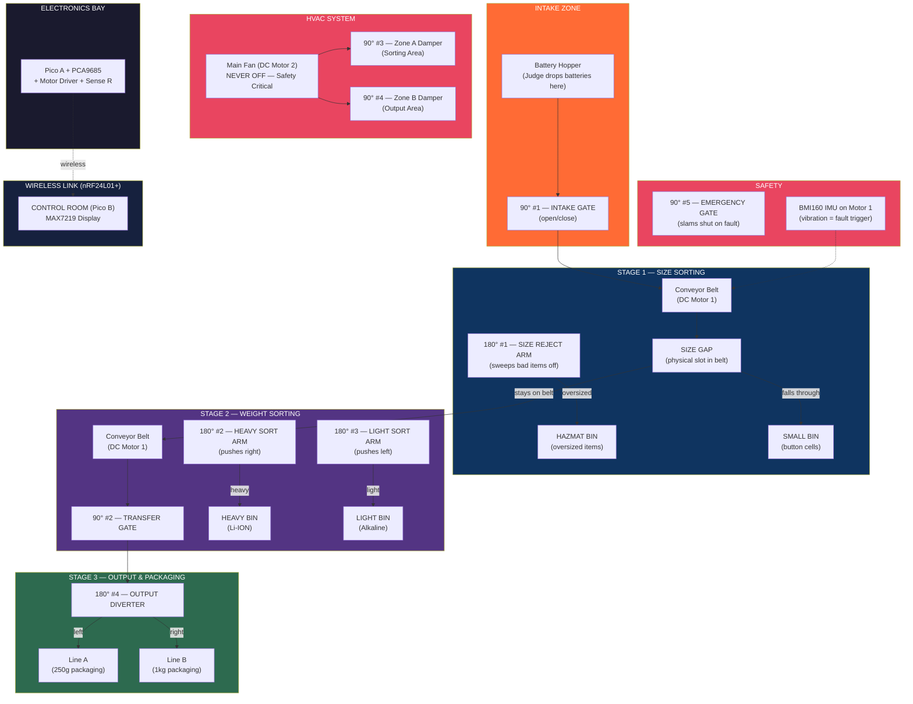
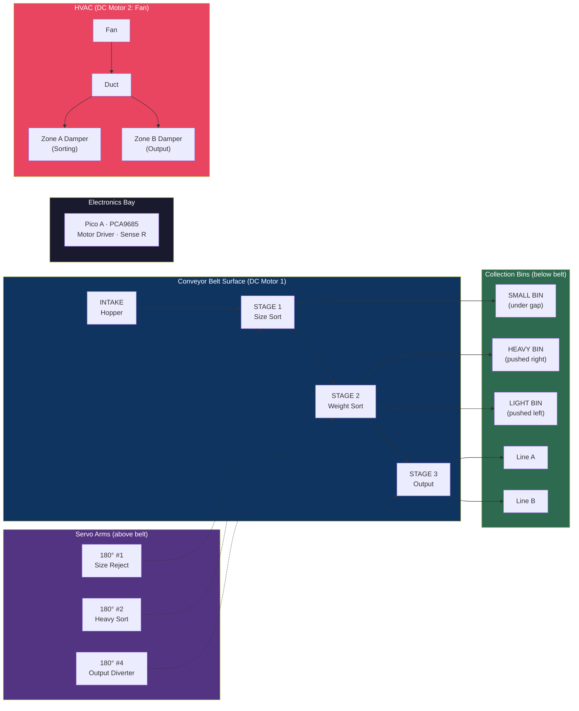

# GridCell Factory — Full Layout & Component Plan

> Battery Recovery Plant with HVAC + Sorting + Conveyor Belt
> Using: 2 DC Motors, 5x 90-degree servos, 4x 180-degree servos

---

## Component Allocation — What Does What

### DC Motors (2)

| Motor | System | Job |
|-------|--------|-----|
| DC Motor 1 | CONVEYOR | Drives the main conveyor belt/turntable. Moves batteries from input through sorting to output |
| DC Motor 2 | HVAC | Ventilation fan. Extracts toxic fumes. NEVER turns off — safety critical |

### 90-Degree Servos (5) — Gates & Dampers

90-degree servos are perfect for OPEN/CLOSE actions (gates, dampers, valves).

| Servo | Name | System | Job |
|-------|------|--------|-----|
| 90° #1 | INTAKE GATE | CONVEYOR | Opens/closes to let batteries onto the conveyor. Controls input flow rate |
| 90° #2 | TRANSFER GATE | CONVEYOR | Gate between Stage 1 (size sort) and Stage 2 (weight sort). Opens when ready |
| 90° #3 | ZONE A DAMPER | HVAC | Controls airflow to the sorting area. Opens/closes 0-90 degrees |
| 90° #4 | ZONE B DAMPER | HVAC | Controls airflow to the conveyor/output area. Opens/closes 0-90 degrees |
| 90° #5 | EMERGENCY GATE | ALL | Emergency lockout. Slams shut to block ALL flow. Triggered by IMU fault |

### 180-Degree Servos (4) — Push Arms & Diverters

180-degree servos are perfect for PUSH/SWEEP actions (sorting arms, diverters).

| Servo | Name | System | Job |
|-------|------|--------|-----|
| 180° #1 | SIZE REJECT ARM | SORTING | Sweeps oversized/damaged batteries off conveyor into HAZMAT bin |
| 180° #2 | HEAVY SORT ARM | SORTING | Pushes heavy batteries (high current reading) into HEAVY bin |
| 180° #3 | LIGHT SORT ARM | SORTING | Pushes light batteries (low current reading) into LIGHT bin |
| 180° #4 | OUTPUT DIVERTER | SORTING | Routes sorted batteries left or right to Packaging Line A or Line B |

---

## PCA9685 Channel Mapping

The PCA9685 has 16 PWM channels. Here's how we wire all 9 servos:

```
PCA9685 Channel Map:
  CH0  --> 90 #1  INTAKE GATE
  CH1  --> 90 #2  TRANSFER GATE
  CH2  --> 90 #3  ZONE A DAMPER (HVAC)
  CH3  --> 90 #4  ZONE B DAMPER (HVAC)
  CH4  --> 90 #5  EMERGENCY GATE
  CH5  --> 180 #1 SIZE REJECT ARM
  CH6  --> 180 #2 HEAVY SORT ARM
  CH7  --> 180 #3 LIGHT SORT ARM
  CH8  --> 180 #4 OUTPUT DIVERTER
  CH9-15 --> unused (available for LEDs or future)
```

---

## Factory Layout — Top View



---

## Factory Layout — Side View



---

## How Each System Works

### 1. CONVEYOR BELT SYSTEM

```
WHAT IT DOES:
  Moves batteries from input, through sorting, to output.

HOW:
  DC Motor 1 drives a belt or turntable disc.
  Items travel through 3 stages.

COMPONENTS:
  - DC Motor 1          = belt/disc drive
  - 90 #1 (INTAKE GATE) = controls when items enter
  - 90 #2 (TRANSFER)    = controls flow between stages

SPEED CONTROL:
  - Potentiometer sets conveyor speed (via Pico B wireless to Pico A)
  - Motor PWM duty cycle = speed
  - Faster conveyor = more items/minute but more power

WEIGHT DETECTION:
  - ADC GP27 reads current through Motor 1's sense resistor
  - Heavier item on belt = more current drawn
  - Pico A compares current against threshold to classify:
      > threshold = HEAVY
      < threshold = LIGHT
```

### 2. SORTING SYSTEM

```
WHAT IT DOES:
  Sorts batteries into 4 categories by size and weight.

HOW IT SORTS:

  STEP 1 — SIZE CHECK (physical)
  +------------------------------------------+
  |  Battery hits a GAP in the belt           |
  |  Small items (button cells) fall through  |
  |  Large items stay on belt                 |
  |  --> SMALL BIN                            |
  +------------------------------------------+
         |
         v (large items continue)

  STEP 2 — HAZMAT CHECK (180 #1 arm)
  +------------------------------------------+
  |  180 #1 arm is positioned at belt edge    |
  |  If IMU detects abnormal vibration        |
  |  pattern = damaged/swollen battery        |
  |  --> ARM SWEEPS item to HAZMAT BIN        |
  |  If normal: item passes through           |
  +------------------------------------------+
         |
         v (safe items continue)

  STEP 3 — WEIGHT CHECK (180 #2 and #3 arms)
  +------------------------------------------+
  |  Pico reads Motor 1 current (ADC GP27)   |
  |                                           |
  |  Current > threshold?                     |
  |    YES --> 180 #2 pushes to HEAVY BIN     |
  |    NO  --> 180 #3 pushes to LIGHT BIN     |
  +------------------------------------------+

  STEP 4 — OUTPUT ROUTING (180 #4 diverter)
  +------------------------------------------+
  |  Items that pass all checks reach output  |
  |  180 #4 diverter routes to:               |
  |    LEFT  = Packaging Line A (small batch) |
  |    RIGHT = Packaging Line B (bulk batch)  |
  +------------------------------------------+

TOTAL BINS:
  [SMALL]   - fell through gap    - "Button Cell Recovery"
  [HAZMAT]  - rejected by 180 #1  - "Damaged - Containment"
  [HEAVY]   - pushed by 180 #2    - "Li-ION Processing"
  [LIGHT]   - pushed by 180 #3    - "Alkaline Recycling"
  [LINE A]  - routed by 180 #4    - "Small Batch Pack"
  [LINE B]  - routed by 180 #4    - "Bulk Pack"
```

### 3. HVAC SYSTEM

```
WHAT IT DOES:
  Controls air quality in the factory. Extracts toxic fumes
  from battery processing. Directs airflow where needed.

HOW:
  DC Motor 2 = main extraction fan (ALWAYS ON)
  90 #3 = Zone A damper (sorting area)
  90 #4 = Zone B damper (output area)

SMART HVAC LOGIC:

  NORMAL MODE:
    Fan: 60% speed
    Zone A damper: 90 deg OPEN (sorting needs more air)
    Zone B damper: 45 deg HALF-OPEN (output needs less)

  HIGH LOAD (lots of batteries being sorted):
    Fan: 80% speed
    Zone A damper: 90 deg FULL OPEN
    Zone B damper: 90 deg FULL OPEN

  THERMAL EVENT (IMU fault detected):
    Fan: 100% MAX SPEED
    Zone A damper: 90 deg FULL OPEN
    Zone B damper: 90 deg FULL OPEN
    Emergency gate (90 #5): CLOSED (stop all intake)
    All sorting arms: STOP
    = Maximum extraction, zero new input

  POWER SAVING MODE (no batteries being processed):
    Fan: 40% speed (minimum safe level)
    Zone A damper: 30 deg MOSTLY CLOSED
    Zone B damper: 0 deg CLOSED
    = Minimum energy while maintaining safety

WHY THIS MATTERS:
  "Real battery plants spend 40-60% of energy on ventilation.
   A dumb system runs fans at 100% all day.
   Our smart system matches airflow to actual processing load.
   That's where the energy savings come from."

POWER PRIORITY (load shedding order):
  P1 = Fan (Motor 2)    --> NEVER shed. Safety critical.
  P2 = Conveyor (Motor 1) --> Shed second-to-last. Revenue.
  P3 = Sorting (servos)  --> Shed if needed. Pause sorting.
  P4 = Lights (LEDs)     --> Shed FIRST. Non-essential.
```

---

## The Sorting Flow — Full Picture

```
  Judge drops battery
        |
        v
  [90 #1 INTAKE GATE] -- closed? wait. open? proceed.
        |
        v
  ====== CONVEYOR BELT (Motor 1) ======
        |
        v
  [SIZE GAP] --- small? ---> falls to SMALL BIN
        |
     (large)
        |
        v
  [180 #1 SIZE REJECT ARM] --- damaged/swollen? ---> HAZMAT BIN
        |
     (safe)
        |
        v
  [WEIGHT CHECK: ADC GP27 reads motor current]
        |
    heavy? --YES--> [180 #2 HEAVY ARM] ---> HEAVY BIN "Li-ION"
        |
    light? --YES--> [180 #3 LIGHT ARM] ---> LIGHT BIN "Alkaline"
        |
   (passed all checks - clean item)
        |
        v
  [90 #2 TRANSFER GATE] -- opens to release
        |
        v
  [180 #4 OUTPUT DIVERTER]
        |            |
     LEFT          RIGHT
        v            v
   [LINE A]      [LINE B]
   small batch   bulk batch


  MEANWHILE, THE WHOLE TIME:

  [DC Motor 2 FAN] ---> blowing through duct --->
        |                                    |
   [90 #3 ZONE A DAMPER]           [90 #4 ZONE B DAMPER]
        |                                    |
   air to sorting area              air to output area

  [90 #5 EMERGENCY GATE] = ready to slam shut if IMU triggers
```

---

## Physical Build — How to Actually Make It

### The Conveyor/Turntable

```
Option A: TURNTABLE DISC (easier to build)
  - Cut a 20cm cardboard circle
  - Mount on Motor 1 shaft (hot glue)
  - Items ride around the disc past each servo station
  - Cut a 2cm gap at one edge (size sorting slot)

Option B: CONVEYOR BELT (looks more impressive)
  - Two rollers (toilet roll tubes) on a frame
  - Rubber band or fabric strip as the belt
  - Motor 1 drives one roller
  - Items ride along the belt past each station
  - Gap = space between belt sections

Recommendation: TURNTABLE is much easier and still looks great.
```

### Servo Mounting

```
90-DEGREE SERVOS (gates/dampers):

  90 #1 INTAKE GATE:
    - Mount vertically at the intake chute
    - Arm swings 0-90 deg to block/open the chute
    - 0 deg = closed (arm blocks chute)
    - 90 deg = open (arm is out of the way)

  90 #2 TRANSFER GATE:
    - Mount between sorting area and output area
    - Same open/close action
    - Controls item flow between stages

  90 #3 ZONE A DAMPER:
    - Mount inside the HVAC duct (cardboard tube)
    - Arm acts as a flap inside the tube
    - 0 deg = duct closed (no airflow)
    - 90 deg = duct open (full airflow)

  90 #4 ZONE B DAMPER:
    - Same as Zone A, on the second duct branch

  90 #5 EMERGENCY GATE:
    - Mount at the intake, BEHIND the intake gate
    - This is the "oh no" gate — slams shut on faults
    - Normally open. Only closes during THERMAL EVENT.


180-DEGREE SERVOS (push arms):

  180 #1 SIZE REJECT ARM:
    - Mount on the edge of the turntable platform
    - Arm reaches ACROSS the conveyor path
    - Sweeps 0 to 180 deg to push items off
    - Position: first sorting station (after size gap)

  180 #2 HEAVY SORT ARM:
    - Mount on one side of the conveyor
    - Pushes heavy items to the OPPOSITE side into HEAVY BIN
    - Position: second sorting station

  180 #3 LIGHT SORT ARM:
    - Mount on the OTHER side (opposite to 180 #2)
    - Pushes light items off the other way into LIGHT BIN
    - Position: right after 180 #2

  180 #4 OUTPUT DIVERTER:
    - Mount at the end of the conveyor
    - Arm swings left (Line A) or right (Line B)
    - Full 180 deg sweep = can reach both sides
    - Position: final station before output bins
```

### HVAC Ductwork

```
Build this from cardboard tubes or folded cardboard channels:

                    [FAN Motor 2]
                         |
                   +=====+=====+
                   |  MAIN DUCT |
                   |  (tube)    |
                   +-----+-----+
                         |
                    +----+----+
                    |         |
              [90 #3]    [90 #4]
              DAMPER A    DAMPER B
                |            |
                v            v
           ZONE A        ZONE B
           (sorting)     (output)

Materials:
  - Toilet roll tubes or paper towel tubes = ducts
  - Servos mounted inside the tube = damper flaps
  - Fan mounted at the end of the main duct
  - Hot glue to attach everything
```

---

## Wiring — All 9 Servos + 2 Motors

### Pico A (Factory Floor)

```
I2C (shared bus):
  GP4 (SDA) --> BMI160 (0x68) + PCA9685 (0x40)
  GP5 (SCL) --> BMI160 (0x68) + PCA9685 (0x40)

ADC:
  GP26 --> Bus voltage (10k + 10k divider)
  GP27 --> Motor 1 current (1 ohm sense R) = WEIGHT SENSOR
  GP28 --> Motor 2 current (1 ohm sense R) = FAN POWER

Motor switching:
  GP10 --> MOSFET gate Motor 1 (conveyor) via 1k resistor
  GP11 --> MOSFET gate Motor 2 (fan) via 1k resistor

LEDs:
  GP12 --> LED bank switch (load LEDs P1-P4)
  GP13 --> Recycle path (capacitor charge)
  GP14 --> Red status LED (330 ohm)
  GP15 --> Green status LED (330 ohm)

SPI (nRF24L01+):
  GP0 = CE, GP1 = CSN, GP2 = SCK, GP3 = MOSI, GP16 = MISO

PCA9685 outputs (all servos):
  CH0 = 90 #1  INTAKE GATE
  CH1 = 90 #2  TRANSFER GATE
  CH2 = 90 #3  ZONE A DAMPER
  CH3 = 90 #4  ZONE B DAMPER
  CH4 = 90 #5  EMERGENCY GATE
  CH5 = 180 #1 SIZE REJECT ARM
  CH6 = 180 #2 HEAVY SORT ARM
  CH7 = 180 #3 LIGHT SORT ARM
  CH8 = 180 #4 OUTPUT DIVERTER
```

### Pico B (Control Room)

```
I2C:
  GP4 (SDA) --> OLED SSD1306 (0x3C)
  GP5 (SCL) --> OLED SSD1306 (0x3C)

ADC:
  GP26 --> Joystick X
  GP27 --> Joystick Y
  GP28 --> Potentiometer (weight threshold dial)

Digital:
  GP22 --> Joystick button (pull-up, active low)

LEDs:
  GP14 --> Red LED (330 ohm)
  GP15 --> Green LED (330 ohm)

SPI (nRF24L01+):
  GP0 = CE, GP1 = CSN, GP2 = SCK, GP3 = MOSI, GP16 = MISO
```

---

## Demo Script

| Step | Time | What Happens | Say This |
|------|------|-------------|----------|
| 1 | 0:00 | Power on. Fan starts FIRST. HVAC dampers open. LEDs boot. OLED: "GridCell v1.0 - HVAC ACTIVE" | "Safety first. Extraction fan and HVAC start before anything else. Lithium batteries produce toxic hydrogen fluoride." |
| 2 | 0:10 | Intake gate opens. Drop a small button cell. Falls through size gap. OLED: "SMALL - Button Cell" | "Size sorting. Too small for the main line - falls through the screen gap into button cell recovery." |
| 3 | 0:15 | Drop a heavy D battery. Stays on belt. Current spikes on OLED. 180 #2 pushes it to HEAVY bin. | "Heavy one. Motor current jumped to 0.35 amps. That's a lithium D cell - separate processing line." |
| 4 | 0:20 | Drop a light empty AA. Current stays low. 180 #3 pushes it to LIGHT bin. | "Light and large - used alkaline. Only 0.18 amps. Different recycling chemistry needed." |
| 5 | 0:30 | Drop 3 more batteries quickly. System sorts each one. HVAC Zone A damper opens wider (more processing = more fumes). | "Batch coming in. Watch the HVAC - Zone A damper opens wider because more batteries means more fume risk. Smart airflow." |
| 6 | 0:40 | Judge turns potentiometer. Weight threshold changes. | "You set the weight cutoff. Like calibrating a real industrial sorter. Stricter threshold catches borderline cells." |
| 7 | 0:50 | Turn pot up high for speed. P4 LED off. P3 dims. Fan stays on. HVAC dampers stay open. | "Power budget hit. Lights shed first. Sorting slows. But fan and HVAC dampers? Still running. ALWAYS. That's intelligent load priority." |
| 8 | 1:00 | Shake Motor 1. RED LED. Emergency gate slams shut. All sort arms stop. Fan goes MAX. Both dampers FULL OPEN. OLED: "THERMAL EVENT" | "Anomaly detected! Emergency gate closed - no new batteries enter. Fan to maximum. Both HVAC zones full extraction. Containment protocol." |
| 9 | 1:05 | Press joystick. System recovers. Emergency gate opens. Sorting resumes. Fan returns to normal. | "All clear. Self-healing system." |
| 10 | 1:10 | OLED shows: "Sorted: 8. Small:1 Heavy:3 Light:4. HVAC saved 42%. Total saved 48%. Real measurements." | "8 batteries sorted by size and weight. HVAC matched airflow to load - saved 42% on ventilation alone. Total 48% energy saved. Real sense resistors, real data, 15 quid." |

---

## Component Summary Table

| # | Component | System | Type | PCA9685 CH | What Judges See |
|---|-----------|--------|------|-----------|----------------|
| 1 | DC Motor 1 | Conveyor | Motor | GPIO 10 | Belt/disc spinning, carrying batteries |
| 2 | DC Motor 2 | HVAC | Motor | GPIO 11 | Fan always spinning |
| 3 | 90 #1 | Conveyor | Gate | CH0 | Gate opens to let batteries in |
| 4 | 90 #2 | Conveyor | Gate | CH1 | Gate opens between stages |
| 5 | 90 #3 | HVAC | Damper | CH2 | Duct flap opens/closes (air to sorting) |
| 6 | 90 #4 | HVAC | Damper | CH3 | Duct flap opens/closes (air to output) |
| 7 | 90 #5 | Safety | Gate | CH4 | SLAMS shut on emergency - dramatic |
| 8 | 180 #1 | Sorting | Arm | CH5 | Sweeps damaged batteries to HAZMAT |
| 9 | 180 #2 | Sorting | Arm | CH6 | Pushes heavy batteries to HEAVY bin |
| 10 | 180 #3 | Sorting | Arm | CH7 | Pushes light batteries to LIGHT bin |
| 11 | 180 #4 | Sorting | Arm | CH8 | Routes output left or right |

**Total: 2 motors + 5x 90-deg + 4x 180-deg = ALL USED. Nothing wasted.**
