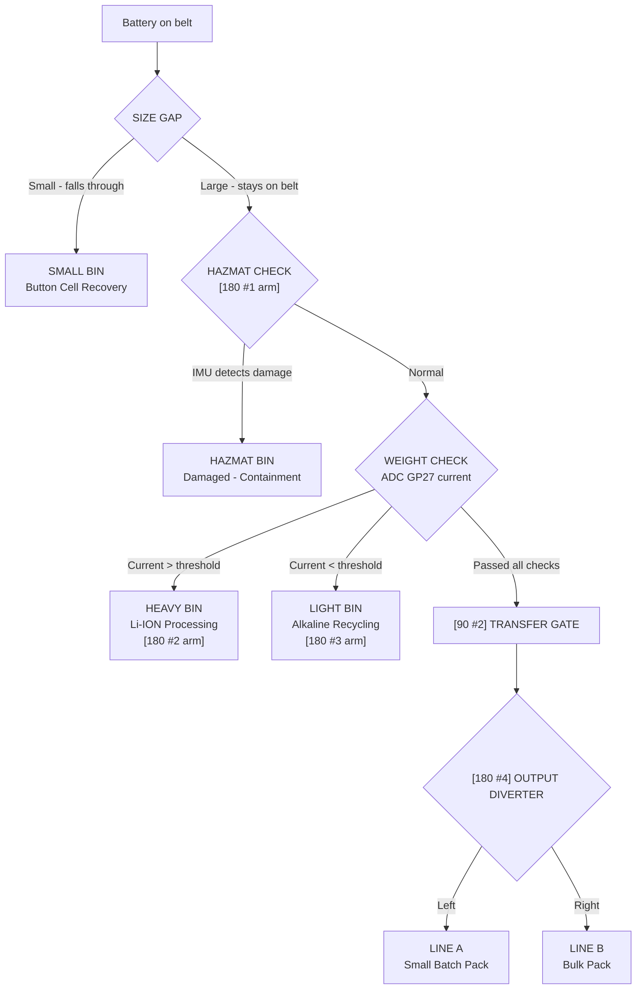
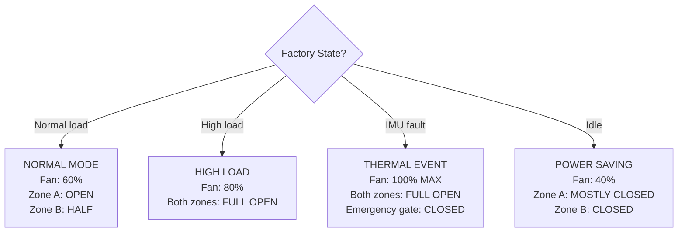
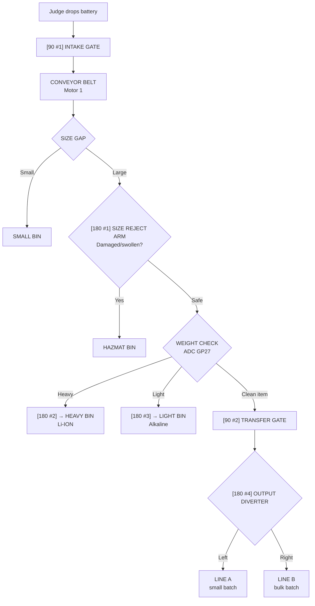
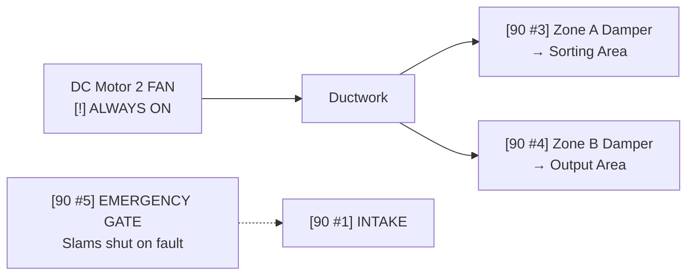

# GridCell Factory - Full Layout & Component Plan

> Battery Recovery Plant with HVAC + Sorting + Conveyor Belt
>
> Using: 2 DC Motors, 5x 90-degree servos, 4x 180-degree servos

## Component Allocation - What Does What

### DC Motors (2)

| Motor | System | Job |
|---|---|---|
| DC Motor 1 | CONVEYOR | Drives the main conveyor belt/turntable. Moves batteries from input through sorting to output |
| DC Motor 2 | HVAC | Ventilation fan. Extracts toxic fumes. NEVER turns off - safety critical |

### 90-Degree Servos (5) - Gates & Dampers

90-degree servos are perfect for OPEN/CLOSE actions (gates, dampers, valves).

| Servo | Name | System | Job |
|---|---|---|---|
| 90 deg #1 | INTAKE GATE | CONVEYOR | Opens/closes to let batteries onto the conveyor. Controls input flow rate |
| 90 deg #2 | TRANSFER GATE | CONVEYOR | Gate between Stage 1 (size sort) and Stage 2 (weight sort). Opens when ready |
| 90 deg #3 | ZONE A DAMPER | HVAC | Controls airflow to the sorting area. Opens/closes 0-90 degrees |
| 90 deg #4 | ZONE B DAMPER | HVAC | Controls airflow to the conveyor/output area. Opens/closes 0-90 degrees |
| 90 deg #5 | EMERGENCY GATE | ALL | Emergency lockout. Slams shut to block ALL flow. Triggered by IMU fault |

### 180-Degree Servos (4) - Push Arms & Diverters

180-degree servos are perfect for PUSH/SWEEP actions (sorting arms, diverters).

| Servo | Name | System | Job |
|---|---|---|---|
| 180 deg #1 | SIZE REJECT ARM | SORTING | Sweeps oversized/damaged batteries off conveyor into HAZMAT bin |
| 180 deg #2 | HEAVY SORT ARM | SORTING | Pushes heavy batteries (high current reading) into HEAVY bin |
| 180 deg #3 | LIGHT SORT ARM | SORTING | Pushes light batteries (low current reading) into LIGHT bin |
| 180 deg #4 | OUTPUT DIVERTER | SORTING | Routes sorted batteries left or right to Packaging Line A or Line B |

## PCA9685 Channel Mapping

The PCA9685 has 16 PWM channels. Here's how we wire all 9 servos:

```
PCA9685 Channel Map:
  CH0  --> 90 #1  INTAKE GATE
  CH1  --> 90 #2  TRANSFER GATE
  CH2  --> 90 #3  ZONE A DAMPER (HVAC)
  CH3  --> 90 #4  ZONE B DAMPER (HVAC)
  CH4  --> 90 #5  EMERGENCY GATE
  CH5  --> 180 #1 SIZE REJECT ARM
  CH6  --> 180 #2 HEAVY SORT ARM
  CH7  --> 180 #3 LIGHT SORT ARM
  CH8  --> 180 #4 OUTPUT DIVERTER
  CH9-15 --> unused (available for LEDs or future)
```

## Factory Layout - Top View

```
+======================================================================+
|                                                                      |
|         GRIDCELL - BATTERY RECOVERY PLANT                            |
|           "Smart Sorting with HVAC Control"                          |
|                                                                      |
|  +------------+    +-------------------+    +-------------------+    |
|  | INTAKE     |    |  STAGE 1          |    |  STAGE 2          |    |
|  | HOPPER     |    |  SIZE SORTING     |    |  WEIGHT SORTING   |    |
|  |            |    |                   |    |                   |    |
|  | Batteries  |    | Conveyor belt     |    | Conveyor belt     |    |
|  | dumped     |    | (Motor 1)         |    | (Motor 1)         |    |
|  | here by    |    |                   |    |                   |    |
|  | judge      |    | [180 #1]          |    | [180 #2] HEAVY    |    |
|  |   |        |    | SIZE REJECT       |    | SORT ARM          |    |
|  |   v        |    | ARM sweeps        |    | pushes right      |    |
|  | [90 #1]    |=====>|                 |    |                   |    |
|  | INTAKE     |    |      v            |    |     v             |    |
|  | GATE       |    | +---------+       |    | +---------+       |    |
|  | (open/     |    | | HAZMAT  |       |    | | HEAVY   |       |    |
|  |  close)    |    | | BIN     |       |    | | BIN     |       |    |
|  +-----------+     | | [!]     |       |    | | "Li-ION"|       |    |
|                    | +---------+       |    | +---------+       |    |
|                    |                   |    |                   |    |
|                    | ..........        |    | [180 #3] LIGHT    |    |
|                    | : SIZE GAP :      |    | SORT ARM          |    |
|                    | : (physical:      |    | pushes left       |    |
|                    | : slot in  :      |    |     |             |    |
|                    | : belt)    :      |    |     v             |    |
|                    | :....|.....:      |    | +---------+       |    |
|                    |      v            |    | | LIGHT   |       |    |
|                    | +---------+       |    | | BIN     |       |    |
|                    | | SMALL   |       |    | | "ALK"   |       |    |
|                    | | "BUTTON |       |    | +---------+       |    |
|                    | | CELLS"  |       |    |                   |    |
|                    | +---------+       |    | [90 #2]           |    |
|                    +-------------------+    | TRANSFER =====>|  |    |
|                                            | GATE             |  |    |
|                                            +--------+---------+  |    |
|                                                     |            |    |
|                                                     v            |    |
|                                            +-------------------+ |    |
|                                            | STAGE 3           | |    |
|                                            | OUTPUT &          | |    |
|                                            | PACKAGING         | |    |
|                                            |                   | |    |
|                                            | [180 #4]          | |    |
|                                            | OUTPUT DIVERTER   | |    |
|                                            | routes items:     | |    |
|                                            |                   | |    |
|                                            |  LEFT      RIGHT  | |    |
|                                            |   v          v    | |    |
|                                            | +------+ +------+ | |    |
|                                            | |LINE  | |LINE  | | |    |
|                                            | | A    | | B    | | |    |
|                                            | |250g  | |1kg   | | |    |
|                                            | +------+ +------+ | |    |
|                                            +-------------------+ |    |
|                                                                  |    |
|  +--------------------------------------------------------------+|    |
|  |                HVAC SYSTEM                                    ||    |
|  |  +------------------+                                         ||    |
|  |  | MAIN FAN         |    DUCT WORK                            ||    |
|  |  | (DC Motor 2)     |========================================||    |
|  |  | [!] NEVER OFF    |         |              |               ||    |
|  |  | Safety critical  |         |              |               ||    |
|  |  +------------------+   [90 #3]          [90 #4]             ||    |
|  |                       ZONE A             ZONE B              ||    |
|  |                       DAMPER             DAMPER              ||    |
|  |                         |                  |                 ||    |
|  |                         v                  v                 ||    |
|  |              Airflow to           Airflow to                 ||    |
|  |              SORTING AREA         CONVEYOR/OUTPUT            ||    |
|  |              (Stage 1 & 2)        (Stage 3)                  ||    |
|  |                                                              ||    |
|  |  Smart HVAC Logic:                                           ||    |
|  |  - Fan speed adjusts to factory load                         ||    |
|  |  - Dampers direct air WHERE it's needed                      ||    |
|  |  - Sorting area gets more air (battery fumes)                ||    |
|  |  - Output area gets less (no chemical risk)                  ||    |
|  |  - During THERMAL EVENT: both dampers FULL OPEN, fan MAX     ||    |
|  +--------------------------------------------------------------+|    |
|                                                                  |    |
|  [90 #5 EMERGENCY GATE] - mounted at intake, slams shut on fault|    |
|  [IMU on Motor 1] - vibration detection = fault trigger          |    |
|                                                                  |    |
|  +--------------------------------------------------------------+|    |
|  | ELECTRONICS BAY                                               ||    |
|  | [Pico A] [PCA9685] [2x MOSFET] [2x Sense R] [Buck converters]||    |
|  +--------------------------------------------------------------+|    |
|                                                                  |    |
|  ============= WIRELESS (nRF24L01+) =============               |    |
|                                                                  |    |
|  +--------------------------------------------------------------+|    |
|  | CONTROL ROOM (Pico B)                                         ||    |
|  |                                                               ||    |
|  | [OLED]          [JOYSTICK]         [POTENTIOMETER]            ||    |
|  | Dashboard       Manual override    Weight threshold           ||    |
|  |                 + fault reset      "heavy vs light"           ||    |
|  |                                                               ||    |
|  | [LED TOWER]     [LOAD PRIORITY LEDs]                          ||    |
|  | G Y R B         P1=Fan P2=Conveyor P3=Sorting P4=Lights      ||    |
|  +--------------------------------------------------------------+|    |
+===================================================================+
```

## Factory Layout - Side View

```
INTAKE       STAGE 1           STAGE 2               STAGE 3
             HOPPER      SIZE SORT          WEIGHT SORT        OUTPUT

              |       [180 #1 arm]     [180 #2 arm]     [180 #4 arm]
              |           |                |                |
              v           v                v                v
[90 #1]    +==========================================================+
INTAKE --> | CONVEYOR BELT SURFACE  (driven by DC Motor 1)            |
GATE       |                                                          |
           | items travel left to right --->                          |
           |                                                          |
           |     [GAP]          [90 #2]                               |
           |      |           TRANSFER                                |
           |      v              GATE                                 |
           +==========================================================+
           |       |                                                  |
           |  [SMALL BIN]  [HEAVY BIN]   [LIGHT BIN]   [A] [B]      |
           |   under gap    to right      to left       output       |
           +----------------------------------------------------------+
           | ELECTRONICS BAY                                          |
           | [Pico A] [PCA9685] [MOSFETs] [Sense Rs]                 |
           +----------------------------------------------------------+

[DC Motor 2: FAN] =====> [DUCT] ==+== [90 #3 damper] ==> ZONE A (sorting)
                                   |
                                   +== [90 #4 damper] ==> ZONE B (output)

[90 #5 EMERGENCY GATE: blocks intake on fault]
```

## How Each System Works

### 1. CONVEYOR BELT SYSTEM

```
WHAT IT DOES:
  Moves batteries from input, through sorting, to output.

HOW:
  DC Motor 1 drives a belt or turntable disc.
  Items travel through 3 stages.

COMPONENTS:
  - DC Motor 1          = belt/disc drive
  - 90 #1 (INTAKE GATE) = controls when items enter
  - 90 #2 (TRANSFER)    = controls flow between stages

SPEED CONTROL:
  - Potentiometer sets conveyor speed (via Pico B wireless to Pico A)
  - Motor PWM duty cycle = speed
  - Faster conveyor = more items/minute but more power

WEIGHT DETECTION:
  - ADC GP27 reads current through Motor 1's sense resistor
  - Heavier item on belt = more current drawn
  - Pico A compares current against threshold to classify:
      > threshold = HEAVY
      < threshold = LIGHT
```

### 2. SORTING SYSTEM

Sorts batteries into 4 categories by size and weight.



**Total Bins:**

| Bin | Trigger | Label |
|---|---|---|
| SMALL | Fell through gap | Button Cell Recovery |
| HAZMAT | Rejected by 180 #1 | Damaged - Containment |
| HEAVY | Pushed by 180 #2 | Li-ION Processing |
| LIGHT | Pushed by 180 #3 | Alkaline Recycling |
| LINE A | Routed by 180 #4 | Small Batch Pack |
| LINE B | Routed by 180 #4 | Bulk Pack |

### 3. HVAC SYSTEM

Controls air quality in the factory. Extracts toxic fumes from battery processing. Directs airflow where needed.

**Components:** DC Motor 2 = main extraction fan (ALWAYS ON), 90 #3 = Zone A damper (sorting area), 90 #4 = Zone B damper (output area).

#### Smart HVAC Logic



> "Real battery plants spend 40-60% of energy on ventilation. A dumb system runs fans at 100% all day. Our smart system matches airflow to actual processing load. That's where the energy savings come from."

**Power Priority (load shedding order):**

| Priority | System | Action |
|---|---|---|
| P1 | Fan (Motor 2) | NEVER shed. Safety critical. |
| P2 | Conveyor (Motor 1) | Shed second-to-last. Revenue. |
| P3 | Sorting (servos) | Shed if needed. Pause sorting. |
| P4 | Lights (LEDs) | Shed FIRST. Non-essential. |

## The Sorting Flow - Full Picture

#### Sorting Flow



#### HVAC Flow (runs continuously)



## Physical Build - How to Actually Make It

### The Conveyor/Turntable

```
Option A: TURNTABLE DISC (easier to build)
  - Cut a 20cm cardboard circle
  - Mount on Motor 1 shaft (hot glue)
  - Items ride around the disc past each servo station
  - Cut a 2cm gap at one edge (size sorting slot)

Option B: CONVEYOR BELT (looks more impressive)
  - Two rollers (toilet roll tubes) on a frame
  - Rubber band or fabric strip as the belt
  - Motor 1 drives one roller
  - Items ride along the belt past each station
  - Gap = space between belt sections

Recommendation: TURNTABLE is much easier and still looks great.
```

### Servo Mounting

(Note: The PDF ends here -- this was the last content on page 10)
