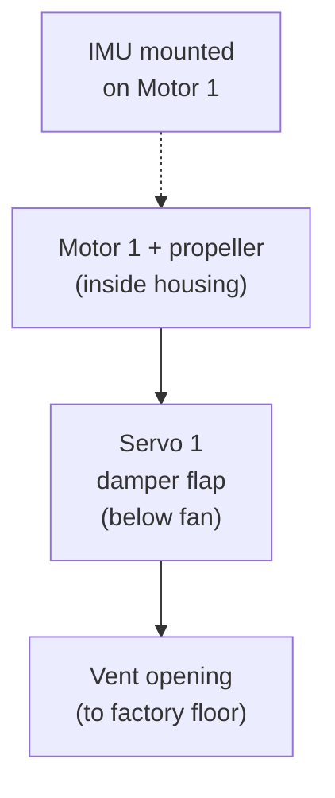
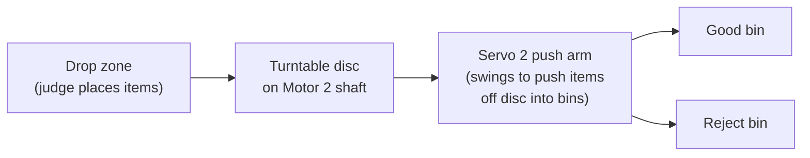
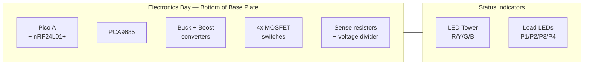
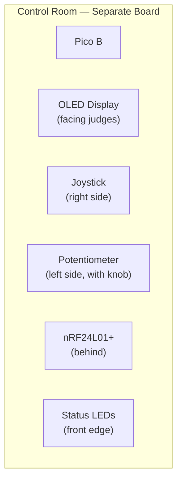

# Factory Layout — Physical Design Guide

> Combined HVAC + Sorting factory on one base plate. This is Billy's main reference doc.

---

## Layout Drawing


---

## Base Plate

| Property | Value |
|---|---|
| Size | 40cm × 50cm (or nearest available) |
| Material | MDF board, thick cardboard, or foamboard |
| Zones | Zone A (ventilation) top-left, Zone B (sorting) top-right, Electronics Bay bottom |

---

## Zone A: Ventilation System (Left Side)



### Parts

| Part | Dimensions | Material | Build Notes |
|---|---|---|---|
| Fan housing | 10cm × 10cm × 12cm tall | Cardboard box or 3D print | Open top + bottom. Motor sits inside near top. Propeller attached to shaft |
| Propeller | 6-8cm diameter | 3D printed or cut from plastic lid | 3-4 blades. Glue or press-fit onto motor shaft |
| Damper flap | 8cm × 3cm | Cardboard rectangle | Attached to Servo 1 horn. Covers/uncovers the bottom opening |
| Servo 1 mount | Servo screwed to housing side | M3 screws or hot glue | Servo arm swings flap across opening |
| IMU mount | Tape or glue BMI160 to motor body | Double-sided tape | Must be firmly attached — vibration transfer is critical |

### Placement

- Fan housing sits in **top-left** of base plate
- Motor shaft points **UP** (vertical)
- Damper is at the **bottom** of the housing
- Air flows **downward** through the housing when fan spins
- IMU is on the **outside** of the motor body — Wooseong wires I2C from here to electronics bay

---

## Zone B: Sorting Station (Right Side)



### Parts

| Part | Dimensions | Material | Build Notes |
|---|---|---|---|
| Turntable disc | 15-20cm diameter, 3-5mm thick | 3D printed circle or cardboard on motor shaft | Centre hole must fit Motor 2 shaft snugly. Flat top surface |
| Motor 2 mount | Holds motor with shaft pointing UP through base plate | 3D printed bracket or hot glue | Motor sits UNDER the base plate, shaft pokes up through a hole |
| Push arm | 8-10cm long, attached to Servo 2 horn | Wire (22AWG bent) or 3D printed paddle | Must reach from servo to edge of disc. Flat face to push items |
| Servo 2 mount | Next to turntable edge | M3 screws or hot glue to base plate | Position so arm swings ACROSS the disc edge |
| Good bin | 5cm × 5cm × 4cm deep | Small cup, cardboard box, or 3D printed | Placed where items fall when pushed. Label: "GOOD" green |
| Reject bin | Same as good bin | Same | Placed on opposite side or further along. Label: "REJECT" red |
| Items | 2-3cm size, various | Bottle caps, marbles, small blocks | Must slide on disc without falling off. Flat-bottom items work best |

### Placement

- Motor 2 is **under** the base plate (hidden), shaft pokes **up** through a hole
- Turntable disc is **on top** of base plate, spinning horizontally
- Servo 2 is at the **edge** of the disc, arm swings to push items off
- Good bin is on **one side**, reject bin on **the other**
- Drop zone is the **far side** from the servo — judge places items there, they ride around to the sorting point

### Sorting Mechanism Detail

```
TOP VIEW:

                DROP items here
                    ↓
              ╭─────────────╮
             ╱       ·       ╲        ← disc rotates
            │     ╱     ╲     │          counterclockwise
            │   ╱    ●    ╲   │       ● = motor shaft
            │   ╲  disc   ╱   │
             ╲       ·       ╱
              ╰──────┬──────╯
                     │
              SERVO ARM swings →  pushes items OFF disc
                     │
              ┌──────┴──────┐
              │   GOOD BIN  │    ← items land here
              └─────────────┘
```

When an item rotates past the servo: servo arm swings out → pushes item off the edge → item falls into bin. Servo retracts. Next item comes around.

---

## Electronics Bay (Bottom Third)



### Placement

| Component | Position | Notes |
|---|---|---|
| Pico A breadboard | Left side of electronics bay | USB port accessible for programming |
| PCA9685 | Next to Pico A | Short I2C wires to Pico |
| Power supply (buck + boost) | Centre | Keep away from signal wires (noise) |
| MOSFET switching board | Right side | Close to motor wires going up to zones |
| Sense resistors | Near MOSFETs | In the motor current path |
| LED tower | Left edge, standing vertical | Visible from 3m away |
| Load LEDs | Front edge | Visible to judges |
| Capacitor (recycle) | Near MOSFETs | In the recycle power path |

### Wire Routing

| Wire Route | From | To | Suggested Colour |
|---|---|---|---|
| Motor 1 power | MOSFET → up through base | Fan housing (Zone A) | Red + black |
| Motor 2 power | MOSFET → down under base | Motor under turntable (Zone B) | Red + black |
| Servo 1 signal | PCA9685 → up through base | Fan damper (Zone A) | White |
| Servo 2 signal | PCA9685 → across base | Sorting arm (Zone B) | White |
| IMU I2C | IMU on motor → down to Pico | Through base plate hole | White + grey |
| Servo power | 5V bus → through base | Both servos | Orange |

**Drill small holes** in the base plate where wires need to pass between top and bottom. Label each hole.

---

## SCADA Control Room (Separate Station)



| Property | Value |
|---|---|
| Size | 15cm × 20cm (separate board) |
| Position | Next to factory, ~30cm gap (wireless range) |
| OLED | Tilted toward judges (use angled mount or prop up) |
| Joystick | Right side — easy for judge to reach |
| Potentiometer | Left side — add a knob cap for easy turning |

---

## Side View


---

## Demo Table Setup


| Position | Item | Why |
|---|---|---|
| **Left** | Factory base plate | Main physical demo — judges see motors + servos + LEDs |
| **Centre** | Laptop showing web dashboard | Live graphs — the "manager's view" |
| **Right** | SCADA control room (Pico B) | Joystick + potentiometer — judges interact here |
| **Front edge** | LED tower + load LEDs | Visible status from standing position |

---

## Dimensions Checklist (for Billy)

| Part | Width | Depth | Height |
|---|---|---|---|
| Base plate | 40cm | 50cm | 1-2cm thick |
| Fan housing | 10cm | 10cm | 12cm tall |
| Turntable disc | 15-20cm diameter | — | 3-5mm thick |
| LED tower | 3cm | 3cm | 15cm tall |
| SCADA station | 15cm | 20cm | 5cm tall |
| Good bin | 5cm | 5cm | 4cm deep |
| Reject bin | 5cm | 5cm | 4cm deep |
| Motor mount (under base) | fits motor | — | motor height + 1cm clearance |
| Servo bracket | fits MG90S (23×12×28mm) | — | screw holes for M3 |

---

## What Billy Should Start With

| Priority | Task | Time |
|---|---|---|
| **1** | Cut base plate to size | 15min |
| **2** | Drill motor 2 shaft hole in base plate | 10min |
| **3** | 3D print turntable disc (15cm circle) | 1-2h (print time) |
| **4** | 3D print motor mount for Motor 2 (under base) | 1h (print time) |
| **5** | Build fan housing from cardboard | 30min |
| **6** | Cut propeller from plastic or 3D print | 30min |
| **7** | Mount servos with M3 screws or hot glue | 30min |
| **8** | Make sorting bins + labels | 20min |
| **9** | Drill wire routing holes | 15min |
| **10** | Final assembly | 1h |
