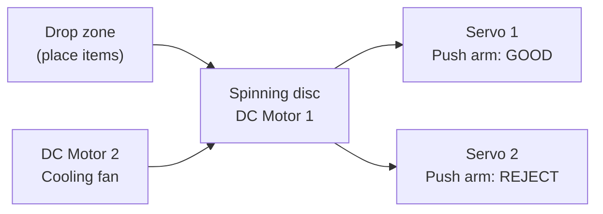
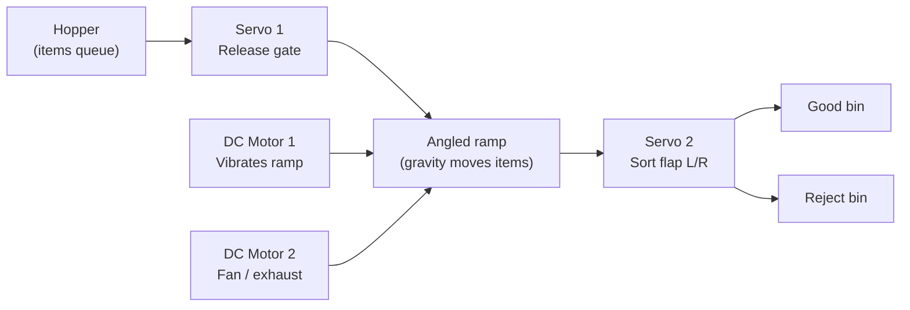
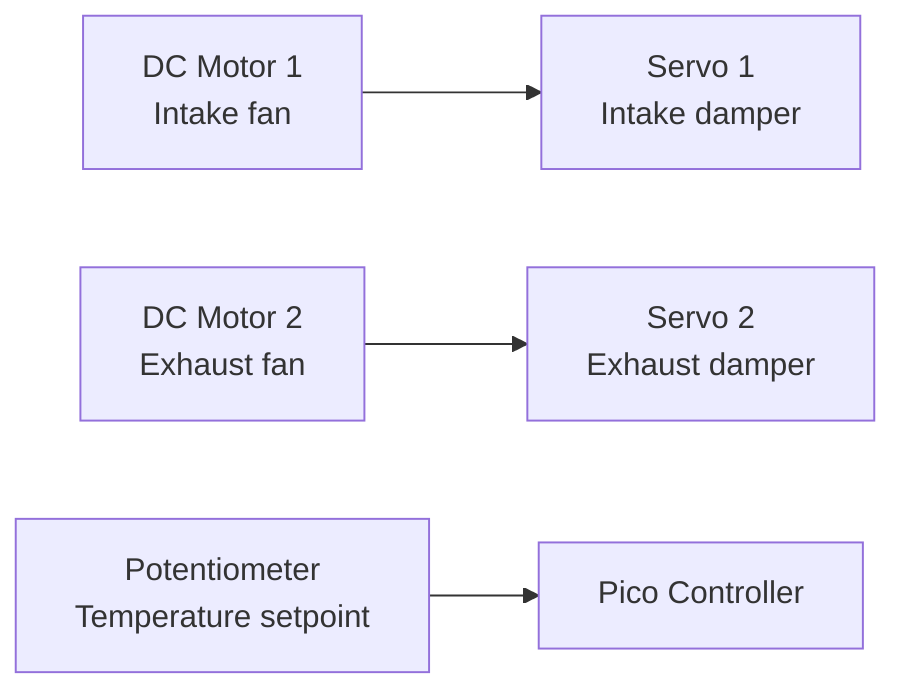
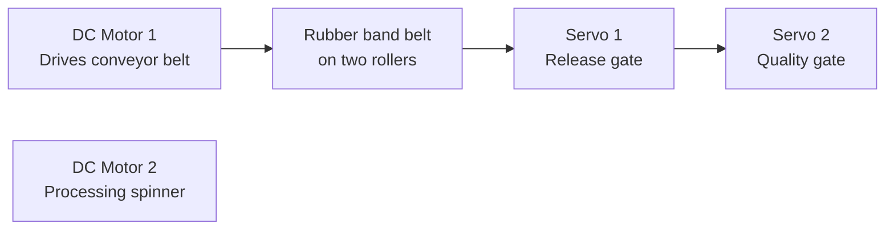
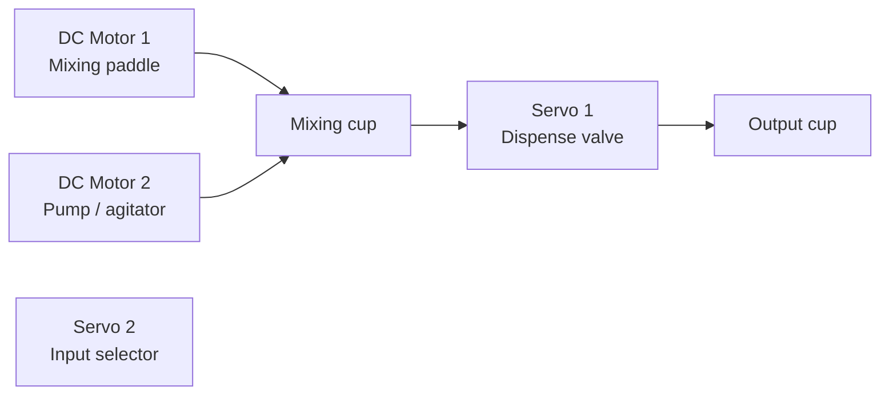
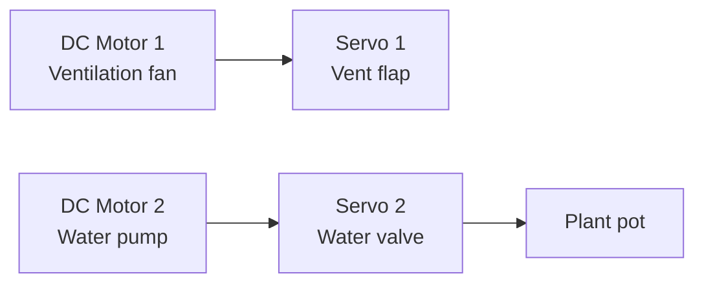
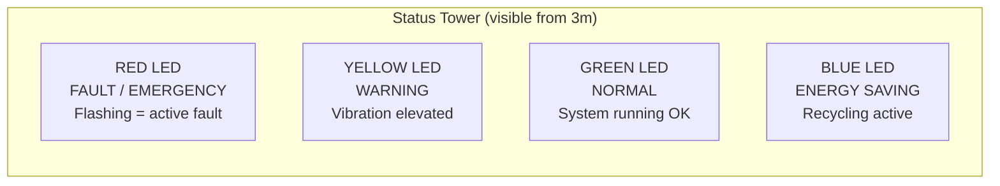

# Factory Design Options

> Which factory type should we physically build? Same firmware for all — only the physical layout and OLED labels change.

## Our Actuators & Sensors

| Type | Component | What It Can Do Physically |
|---|---|---|
| **Actuator** | DC Motor 1 | Spin continuously: fan, turntable, conveyor roller, mixer, pump impeller |
| **Actuator** | DC Motor 2 | Spin continuously: second fan, second roller, spinner, grinder |
| **Actuator** | Servo 1 | Swing 0-180°: gate, flap, valve, arm, pusher, lever |
| **Actuator** | Servo 2 | Swing 0-180°: second gate, sorter, clamp, switch |
| **Sensor** | BMI160 IMU | Vibration on motors, tilt of platform, impact detection |
| **Sensor** | ADC (×3) | Bus voltage, motor 1 current, motor 2 current |
| **Sensor** | Potentiometer | User setpoint dial (speed, threshold, temperature) |
| **Input** | Joystick | Manual override, menu navigation, directional control |
| **Display** | OLED | 4-view SCADA dashboard |
| **Indicator** | LEDs (4+) | Status tower: green/yellow/red + load indicators |

---

## Option 1: Turntable Sorting Station ★★★★★ (Recommended)

> Items drop onto a spinning disc. As they pass each station, servos push them into correct bins.

### What You See During Demo

| Moment | What Happens | Visual Impact |
|---|---|---|
| Items placed on disc | Judge drops bottle caps/marbles onto spinning turntable | Items start rotating |
| Good item reaches station | Servo 1 swings out, pushes item into green bin | Physical sorting — audible click |
| Bad item reaches station | Servo 2 swings out, pushes item into red bin | Different bin — visible separation |
| Speed change | Turn potentiometer → disc speeds up/slows down | All items move faster/slower |
| Fault | Shake motor → disc stops, items stay put | Dramatic stop — silence |
| Recovery | Press joystick → disc resumes | System comes alive again |

### Bill of Materials

| Part | How to Make | Material |
|---|---|---|
| Turntable disc | 3D print 15-20cm circle OR cardboard circle on motor shaft | PLA / cardboard |
| Motor mount | 3D print bracket holding Motor 1 shaft pointing UP | PLA + M3 screws |
| Push arms (×2) | Servo horns with extended arm (wire or 3D printed paddle ~5cm) | Kit servo horns + wire |
| Sorting bins (×2) | Small cardboard boxes or cups, labelled "GOOD" and "REJECT" | Cardboard |
| Fan mount | Motor 2 with propeller blade attached to shaft | Tape or 3D print |
| Base plate | 30×30cm board | Cardboard / MDF / 3D print |
| Items to sort | Bottle caps, marbles, small blocks, coins | Free |
| Ramp/chute | Angled guide to direct pushed items into bins | Cardboard |

### Required Electronics

| Component | Qty | Purpose |
|---|---|---|
| NPN transistor / MOSFET | 3 | Switch: Motor 1, Motor 2, LED bank |
| 1kΩ resistor | 3 | MOSFET gate resistors |
| 1Ω resistor | 2 | Current sense for Motor 1 and 2 |
| 10kΩ resistor | 2 | Voltage divider (10kΩ + 10kΩ) |
| 330Ω resistor | 4 | LED current limiting |
| LED green | 1 | Status: system OK |
| LED yellow | 1 | Status: warning |
| LED red | 1 | Status: fault |
| LED blue | 1 | Status: recycling/saving energy |
| 4.7kΩ resistor | 2 | I2C pull-ups (SDA, SCL) |
| 100µF capacitor | 1 | Power bus smoothing |

### Why It's the Best

- **Build difficulty: LOW** — disc on a motor shaft, two servo arms, done
- **Demo reliability: HIGH** — no belts to slip, no water to spill
- **All 4 actuators visible** at the same time
- **Items physically moving** = judges SEE a working factory
- **Sorting = decision making** = demonstrates autonomous intelligence
- **3 hours to build** — leaves time for polish

---

## Option 2: Gravity Chute Line ★★★★☆

> Items slide down a ramp by gravity. Servos control release and sorting at the bottom.

### What You See During Demo

| Moment | What Happens |
|---|---|
| Items loaded | Drop items into hopper at top |
| Release | Servo 1 opens gate → one item slides down ramp |
| Sorting | Servo 2 flips left/right → item goes to correct bin |
| Vibration | Motor 1 vibrates ramp — items don't get stuck |
| Fan | Motor 2 spins — visual indicator of system running |

### Bill of Materials

| Part | How to Make | Material |
|---|---|---|
| Ramp | 30cm angled chute (30° angle) | Cardboard folded into channel |
| Hopper | Small box at top with hole | Cardboard |
| Guide rails | Edges on ramp to keep items centred | Cardboard strips |
| Sort flap | Servo 2 arm with flat paddle at ramp bottom | Servo horn + cardboard |
| Release gate | Servo 1 arm blocks hopper hole | Servo horn |
| Vibration motor mount | Motor 1 glued to underside of ramp | Hot glue |
| Bins | Two cups or boxes at bottom | Cardboard |

### Required Electronics

Same as Option 1 — identical circuit.

### Pros & Cons

| Pro | Con |
|---|---|
| Gravity = free conveyor (no belt needed) | Less visually impressive than spinning turntable |
| Very reliable — items always slide down | Motor 1 as "vibrator" is less visible than as "spinner" |
| Easy for Billy to build | Items can jam if ramp angle is wrong |
| Release gate = timed production | Needs consistent item shape to slide properly |

---

## Option 3: Smart Ventilation / HVAC ★★★★☆

> Two fans (intake + exhaust) with servo-controlled dampers. Potentiometer = thermostat.

### What You See During Demo

| Moment | What Happens |
|---|---|
| Temperature low (pot turned down) | Both fans slow, dampers partially close |
| Temperature high (pot turned up) | Fans speed up, dampers fully open |
| Fault | Shake intake fan → stops. Exhaust fan speeds up to compensate |
| Energy saving | Fans at 60% speed → OLED shows 78% power saved (cubic law) |

### Bill of Materials

| Part | How to Make |
|---|---|
| Fan housing (×2) | Cardboard boxes ~10cm cube with holes for airflow |
| Propeller blades (×2) | 3D print or cut from plastic lid, attach to motor shaft |
| Damper flaps (×2) | Servo arms with cardboard flap covering the opening |
| Duct between them | Cardboard tube connecting intake to exhaust |
| "Building" enclosure | Box representing the room being ventilated |

### Required Electronics

Same circuit as Option 1, plus:

| Extra Component | Purpose |
|---|---|
| (None — same circuit) | HVAC just needs different OLED labels |

### Pros & Cons

| Pro | Con |
|---|---|
| Most realistic — real fans moving real air | No items being produced/sorted — less "factory" feeling |
| Affinity Laws demo is perfect (speed vs power) | Two fans + two flaps is visually repetitive |
| Simplest mechanical build | Judges may think "it's just fans" |
| Best for sustainability narrative | Less dramatic than sorting physical items |

---

## Option 4: Mini Conveyor Production Line ★★★☆☆

> Real belt conveyor moves items past stations. Most factory-like but hardest to build.

### Bill of Materials

| Part | How to Make | Difficulty |
|---|---|---|
| Conveyor belt | Rubber band stretched over two 3D printed rollers | **Hard** — tension and alignment critical |
| Rollers (×2) | 3D print cylinders that fit motor shaft + support shaft | Medium |
| Belt surface | Wide rubber band or fabric strip | Must be right length |
| Frame | Support structure holding rollers at same height | Medium |
| Items | Must be flat-bottomed to ride the belt | Limited options |

### Pros & Cons

| Pro | Con |
|---|---|
| Looks most like a real factory | Belt slipping = demo failure |
| Most impressive if it works | 5+ hours to build reliably |
| Real conveyor = real engineering | Motor torque may not be enough for belt |
| | If belt breaks during demo, game over |

---

## Option 5: Liquid Mixing / Dispensing ★★★☆☆

> Motor stirs liquid, servo controls dispense valve. Actual coloured liquid moves.

### Pros & Cons

| Pro | Con |
|---|---|
| Visually dramatic — coloured liquids mixing | Water near electronics = risk |
| Everyone understands a drink mixer | Waterproofing takes time |
| Very memorable demo | Spills during demo = disaster |
| | Cleanup between demos |

---

## Option 6: Automated Farm / Greenhouse ★★★☆☆

> Fan ventilates, motor pumps water through tubes, servo controls valve.

### Pros & Cons

| Pro | Con |
|---|---|
| Sustainability theme perfect | Water + electronics risk |
| Real water flowing through tubes is impressive | Needs actual pump mechanism (hard with DC motor) |
| Small plants on display look great | More "garden" than "factory" |

---

## Comparison Matrix

| Factory Type | Build Difficulty | Demo Reliability | Visual Impact | "Factory" Feel | Items Moving? | Build Time |
|---|---|---|---|---|---|---|
| **Turntable Sorting** ★★★★★ | Easy | High | High | Medium-High | Yes — items sorted | ~3h |
| **Gravity Chute** ★★★★☆ | Easy | High | Medium-High | Medium | Yes — items slide + sort | ~3h |
| **HVAC / Ventilation** ★★★★☆ | Easy | High | Medium | Low | No — just air | ~2h |
| **Conveyor Line** ★★★☆☆ | Hard | Medium | Highest | Highest | Yes — belt carries items | ~5h |
| **Liquid Mixing** ★★★☆☆ | Medium | Low | High | Medium | Yes — liquid moves | ~4h |
| **Greenhouse** ★★★☆☆ | Medium | Medium | Medium | Low | Water flows | ~4h |

---

## My Recommendation: Turntable Sorting Station

**Three reasons:**

1. **Billy can build it in 3 hours** — disc on shaft, two servo arms, two bins. Done. Leaves 9 hours for polish, labels, and making it look professional

2. **All 4 actuators are visible simultaneously** — disc spinning, both servos pushing, fan running. Judges see a living system from any angle

3. **Physical items moving = strongest demo** — judges watch a marble drop on the disc, ride around, get pushed into a bin. That's a real factory. An HVAC system is just fans spinning — less memorable

### The Demo Moment

> Judge drops a marble on the turntable. It spins around. Servo arm swings out — *click* — marble flies into the green bin. Next marble comes around. Different servo — *click* — into the red bin. Judge turns the potentiometer. Disc speeds up. Servos fire faster. Judge shakes the motor. Everything stops. OLED: "FAULT DETECTED." Judge presses joystick. System recovers.
>
> That's a 30-second demo that wins.

---

## LED Indicator Design

Regardless of factory type, the LED tower is the same:

Plus 4 smaller LEDs representing factory loads:

| LED | Colour | Represents | Load Priority |
|---|---|---|---|
| P1 | White | Critical system (always on) | Never shed |
| P2 | Green | Primary production | Shed last |
| P3 | Yellow | Secondary system | Shed second |
| P4 | Red | Non-essential (charging) | Shed first |

When load shedding activates, LEDs turn off from P4 → P3 → P2. P1 never turns off. Judges can **see** the priority system working.

---

## Sensor Placement

| Sensor | Where to Mount | What It Detects |
|---|---|---|
| BMI160 IMU | **On Motor 1** (turntable motor) with double-sided tape | Vibration = bearing health. Judges shake it = fault |
| ADC GP26 | Via voltage divider on **5V bus rail** | Total system voltage — drops when overloaded |
| ADC GP27 | Across **1Ω sense resistor on Motor 1** | Motor 1 current draw — high = jammed, zero = disconnected |
| ADC GP28 | Across **1Ω sense resistor on Motor 2** | Motor 2 current draw |
| Potentiometer | On **SCADA station** (Pico B side) | Production speed / demand setpoint |
| Joystick | On **SCADA station** (Pico B side) | Manual override + menu scroll |

---

## What to Discuss with Team

Share this doc with Wooseung and Billy, then decide:

1. **Which factory type?** — I recommend turntable sorting. Does Billy agree it's buildable?
2. **Turntable size?** — 15cm or 20cm diameter? Bigger = more impressive but needs more motor torque
3. **Items to sort?** — Bottle caps (flat, slide well), marbles (roll, more dramatic), small blocks (stackable)?
4. **Does Billy have access to 3D printer?** — If yes: print disc + motor mount. If no: cardboard disc works fine
5. **Separate bases or one big base?** — Factory floor + control room on one board, or two separate stations?
