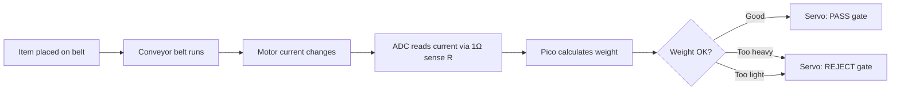
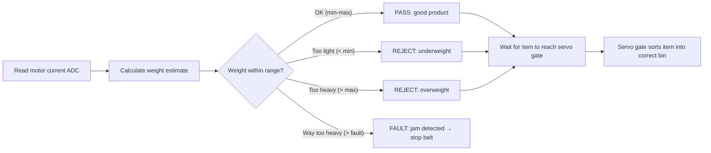
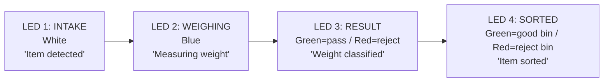
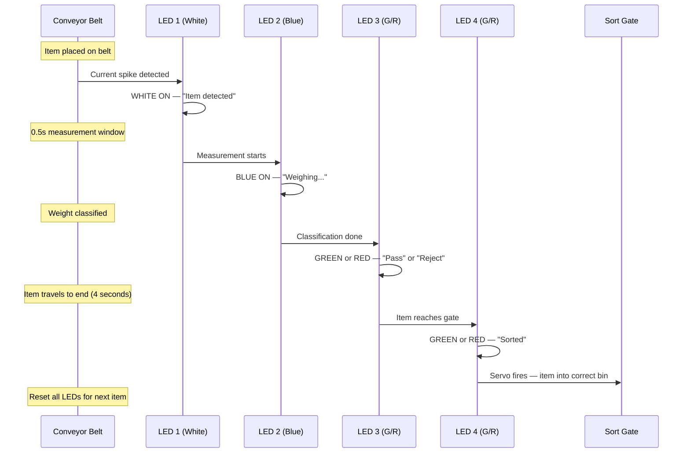
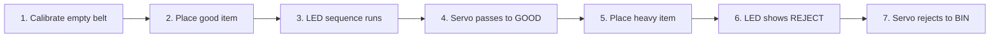

# Weight-Based Sorting via Motor Current Sensing

> Detect product weight from conveyor motor current draw. Sort good/bad at the end using servo gate. No load cell needed — the motor IS the sensor.

---

## The Core Idea

When a heavier item sits on the conveyor belt, the motor draws **more current** to maintain speed. A lighter item draws less. By measuring the current with our existing ADC + sense resistor, we know the weight WITHOUT a load cell.



---

## How It Works — Physics

A DC motor's current draw is proportional to the load torque:

$$I_{motor} = \frac{V_{supply} - K_e \cdot \omega}{R_{winding}}$$

When a heavier item sits on the belt, friction increases → motor torque increases → **current increases:**

$$\Delta I \propto \Delta m \cdot g \cdot \mu_{friction}$$

| Item on Belt | Extra Friction | Current Change | ADC Reading |
|---|---|---|---|
| Nothing (empty belt) | Baseline | ~300 mA | Baseline reference |
| Light item (~20g) | Small | ~310 mA (+3%) | Slightly above baseline |
| Normal item (~50g) | Medium | ~330 mA (+10%) | Within acceptable range |
| Heavy item (~100g) | Large | ~370 mA (+23%) | Above threshold → REJECT |
| Jam / stuck | Very large | ~450 mA (+50%) | FAULT → stop belt |

---

## Sorting Logic



### Timing: Belt Length + Speed = When to Sort

We know the belt length and motor speed (from PWM duty cycle):

$$t_{travel} = \frac{L_{belt}}{v_{belt}}$$

$$v_{belt} = K_{speed} \times D_{pwm}$$

When we detect a weight anomaly via current, we **wait** for `t_travel` seconds, then fire the servo gate to sort the item at the end of the belt.

```python
# Weight detection and timed sorting
BELT_LENGTH_CM = 20        # conveyor belt length
SPEED_CM_PER_S = 5         # belt speed at current PWM

# When current spike detected:
weight_class = classify_weight(current_reading)
travel_time = BELT_LENGTH_CM / SPEED_CM_PER_S  # = 4 seconds

if weight_class == "REJECT":
    # Wait for item to reach the end, then sort
    timer.init(period=int(travel_time * 1000),
               mode=Timer.ONE_SHOT,
               callback=lambda t: servo_reject())
elif weight_class == "PASS":
    timer.init(period=int(travel_time * 1000),
               mode=Timer.ONE_SHOT,
               callback=lambda t: servo_pass())
```

---

## 4-LED Station System

Four LED stations along the production line show the product's journey:



| Station | LED Colour | When It Lights | What It Means |
|---|---|---|---|
| **Station 1: INTAKE** | White | Item placed on belt → current rises above empty baseline | "Item detected on conveyor" |
| **Station 2: WEIGHING** | Blue | ADC sampling current for 0.5s window | "Measuring product weight..." |
| **Station 3: RESULT** | Green or Red | Weight classification complete | Green = "Weight OK" / Red = "Weight out of range" |
| **Station 4: SORTED** | Green or Red | Servo gate fires, item reaches bin | Green = "Sorted to GOOD bin" / Red = "Sorted to REJECT bin" |

### LED Timing Sequence (for one item)



---

## How This Integrates with GridBox

The weight sensing uses **components we already have** — no extra hardware:

| Component | Existing Use | New Use (Weight Sensing) |
|---|---|---|
| ADC GP28 | Motor 2 current sense | **Same** — current change = weight change |
| 1Ω sense resistor | Current measurement | **Same** — more current = heavier item |
| DC Motor 2 | Conveyor drive | **Same** — the motor IS the weight sensor |
| Servo 2 | Quality/sort gate | **Same** — sorts based on weight result |
| 4 LEDs (P1-P4) | Load priority indicators | **Repurposed** — now show production stations |
| OLED | SCADA dashboard | Adds weight readings to display |
| Potentiometer | Speed setpoint | Also sets weight thresholds (min/max acceptable) |

**Zero extra components.** We repurpose the existing current sensing as a weight measurement system.

---

## OLED Display Update

### Production View (new OLED screen)

```
PRODUCTION LINE       [LIVE]

Belt speed:    5 cm/s
Last item:     47g    PASS
Items today:   23
  Pass:   20 (87%)
  Reject:  3 (13%)

Threshold: 30-80g
Status: RUNNING
```

### Weight History View

```
WEIGHT LOG

#21  52g  PASS   14:32:07
#22  94g  REJECT 14:32:15
#23  41g  PASS   14:32:22
#24  28g  REJECT 14:32:30
#25  55g  PASS   14:32:38

Avg: 54g  Reject rate: 13%
```

---

## Calibration

Before demo, calibrate the weight-to-current mapping:

```python
# Calibration procedure
def calibrate():
    # Step 1: Empty belt baseline
    print("Remove all items from belt. Press joystick...")
    baseline = read_current_average(samples=100)

    # Step 2: Known weight reference
    print("Place 50g reference item. Press joystick...")
    reference = read_current_average(samples=100)

    # Calculate scale factor
    # delta_current = reference - baseline (mA)
    # known_weight = 50g
    scale = 50.0 / (reference - baseline)  # g per mA

    print(f"Baseline: {baseline}mA")
    print(f"Reference: {reference}mA")
    print(f"Scale: {scale:.1f} g/mA")

    return baseline, scale
```

---

## Demo Script Update



| Step | What Happens | What Judges See |
|---|---|---|
| 1 | Belt runs empty, baseline calibrated | OLED: "Calibrated: 300mA baseline" |
| 2 | Judge places normal item on belt | LED 1 (white) lights — "Item detected" |
| 3 | Item rides belt, LEDs light in sequence | LED 2 (blue) → LED 3 (green) → LED 4 (green) |
| 4 | Item reaches end, servo opens PASS gate | Item falls into GOOD bin. OLED: "47g — PASS" |
| 5 | Judge places heavy item on belt | LED 1 lights, current reading higher |
| 6 | Weight above threshold | LED 3 (RED) — "REJECT: 94g exceeds 80g max" |
| 7 | Item reaches end, servo opens REJECT gate | Item falls into REJECT bin. OLED: "94g — REJECT" |

**Key demo moment:** Judge places two different items. The system sorts them into different bins purely from motor current — no separate weight sensor. *"The motor doesn't just move the belt — it weighs every product."*

---

## Technical Considerations

### Sensitivity

$$\text{Sensitivity} = \frac{\Delta V_{sense}}{\Delta m} = \frac{R_{sense} \times \mu \times g}{K_t / R_{winding}}$$

With 1Ω sense resistor, expect ~0.5-2 mV per gram. The RP2350 ADC has ~0.8mV resolution (12-bit, 3.3V range) — so we can detect items heavier than ~1-2g.

### Noise Filtering

Motor current is noisy. Average over a window:

```python
def read_weight():
    samples = [adc.read_u16() for _ in range(50)]  # 50 samples
    avg = sum(samples) / len(samples)
    current_mA = (avg / 65535 * 3.3) / R_SENSE * 1000
    weight_g = (current_mA - baseline_mA) * scale_factor
    return weight_g
```

### What Items to Use in Demo

| Item | Approximate Weight | Expected Result | Easy to Get? |
|---|---|---|---|
| Coin (10p) | ~6.5g | PASS (if threshold > 5g) | Yes |
| AA battery | ~23g | PASS | Yes |
| Phone | ~180g | REJECT (too heavy) | Yes |
| Nothing | 0g | No detection | — |
| Stack of coins | Variable | Adjustable weight | Yes |
| Small bottle cap | ~2g | REJECT (too light) | Yes |
