# Presentation Diagrams (Mermaid)

> Render on GitHub or paste into [mermaid.live](https://mermaid.live) → screenshot for PPT.

---

## 1. System Architecture (Full)

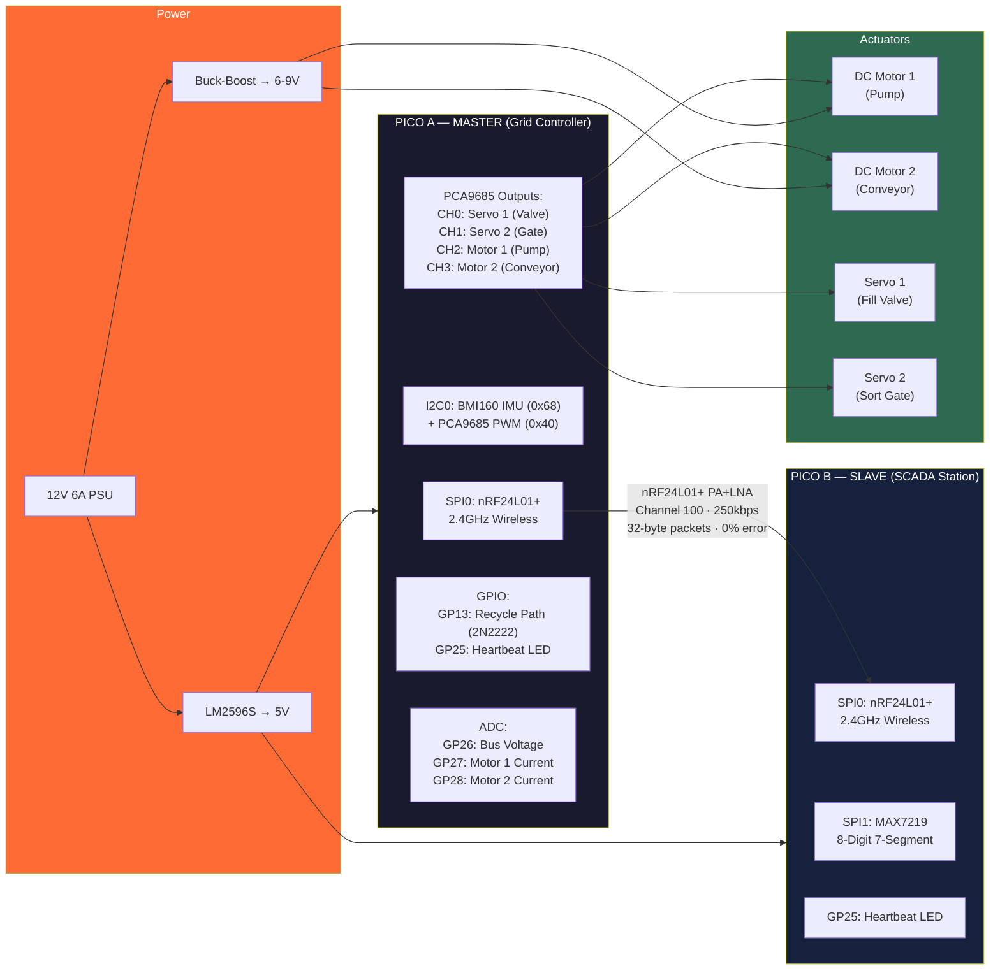

---

## 2. Wireless Protocol — 6 Datagram Types

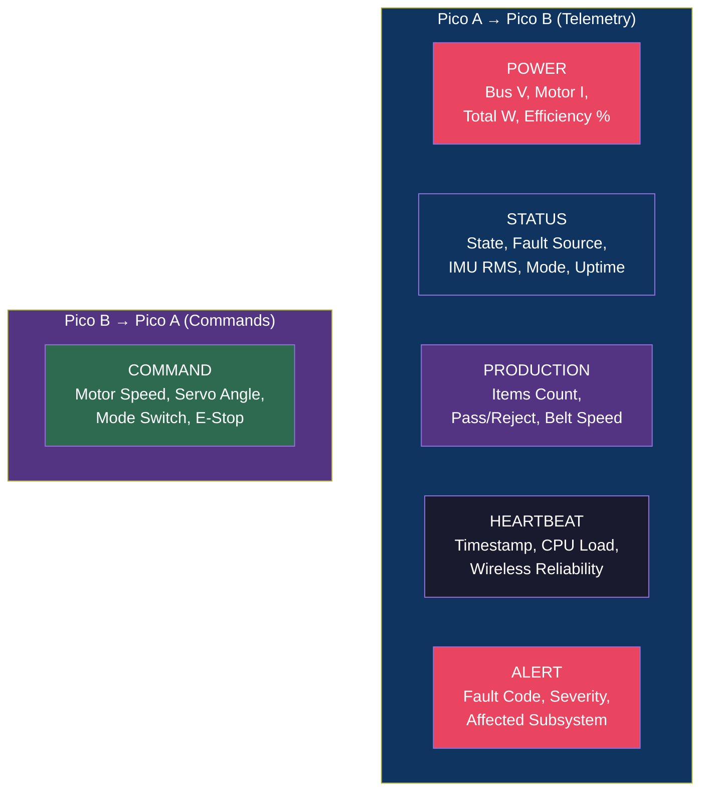

---

## 3. Packet Structure (32 Bytes)

---

## 4. Packet Rotation Schedule

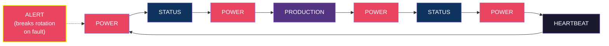

---

## 5. Closed-Loop Control (Every 10ms)

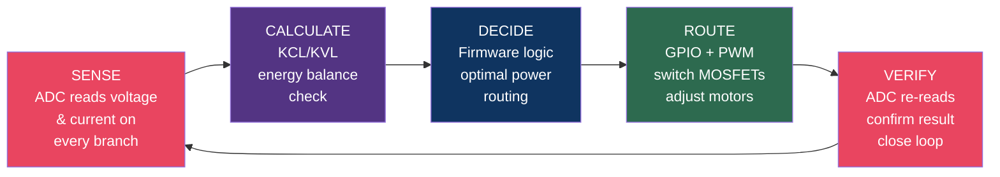

---

## 6. Fault Detection State Machine

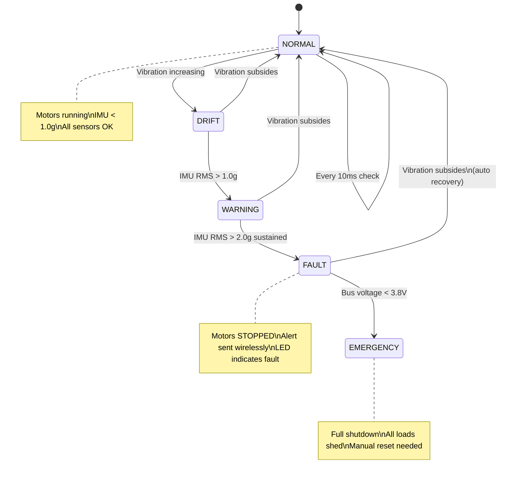

---

## 7. Demo Scenario — Smart Water Bottling Plant

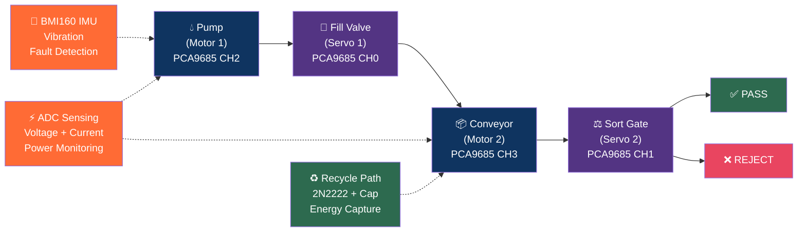

---

## 8. Demo Sequence Timeline

```mermaid
gantt
    title Demo Sequence (35 seconds)
    dateFormat ss
    axisFormat %S s

    section Stage
    BOOT - Self Test           :boot, 00, 3s
    READY - System Ready       :ready, after boot, 2s
    Motor 1 ON (Pump 65%)      :m1, after ready, 5s
    Motor 2 ON (Conveyor 45%)  :m2, after m1, 5s
    FAULT - Shake Detection    :crit, fault, after m2, 5s
    RECOVERY - Motors Restart  :recover, after fault, 3s
    RECYCLE - Energy Demo      :recycle, after recover, 4s
    DONE - Summary             :done, after recycle, 2s
```

---

## 9. Communication Flow (Sequence)

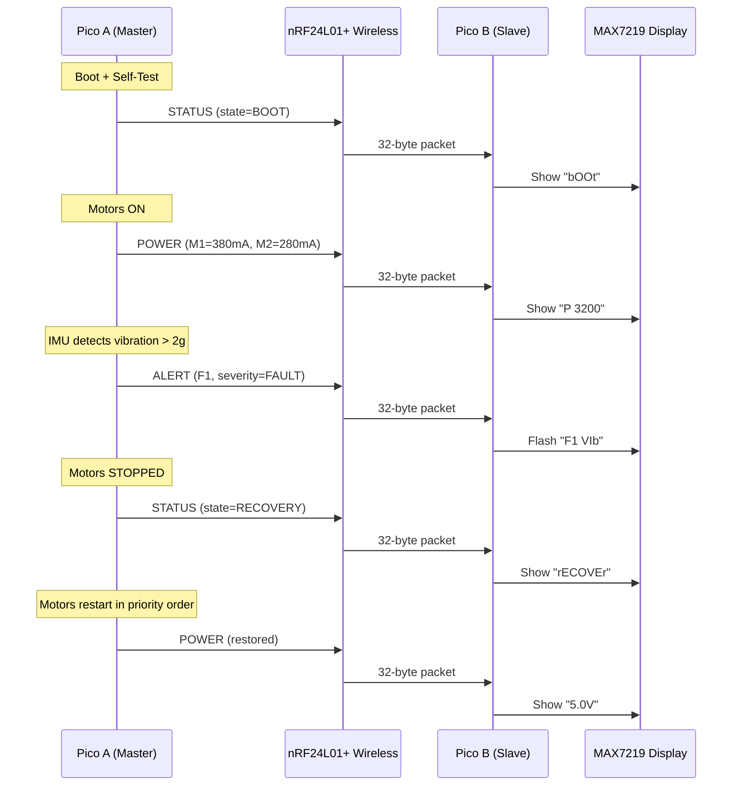

---

## 10. EEE Theory — Voltage Divider + Current Sensing

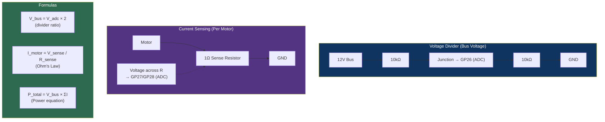

---

## 11. Recycle Path Circuit

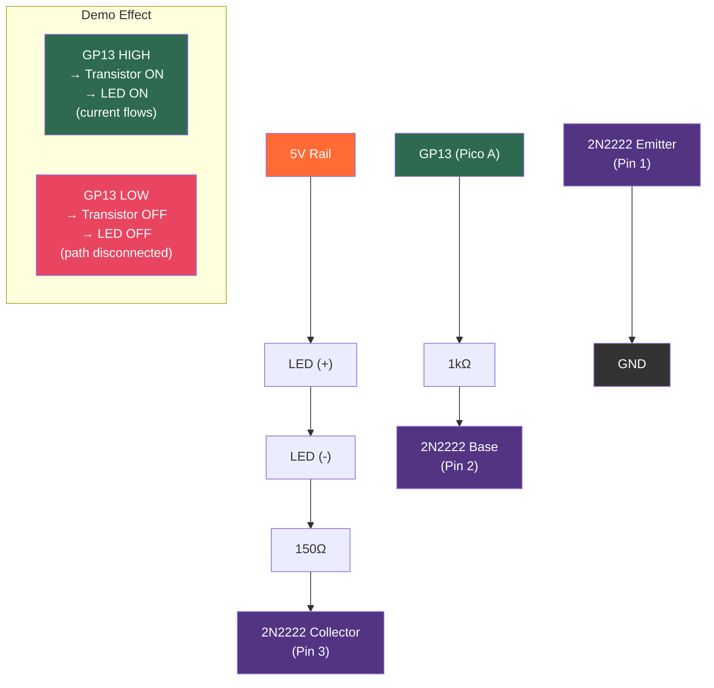

---

## 12. Cost Comparison

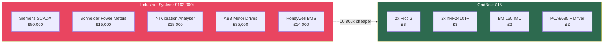

---

## Suggested Slide Mapping

| Slide | Diagram # | Topic |
|---|---|---|
| Problem | 12 | Cost comparison |
| Solution | 7 | Demo scenario flow |
| Architecture | 1 | Full two-Pico system |
| Technical — Protocol | 2, 3, 4 | Datagram types, packet structure, rotation |
| Technical — Control | 5 | Closed-loop SENSE→ROUTE→VERIFY |
| EEE Theory | 10 | Voltage divider + current sensing |
| Fault Detection | 6 | State machine |
| Live Demo | 8, 9 | Timeline + communication sequence |
| Recycle Path | 11 | Circuit diagram |
