# Presentation Reference — Visual Assets

> All images generated for the PPT. Pick what you need. PNG files in `docs/03-factory/charts/`.

---

## 1. Cost Comparison (£15 vs Industrial)

Use for: **Problem Fit (30pts)** — shows the cost gap

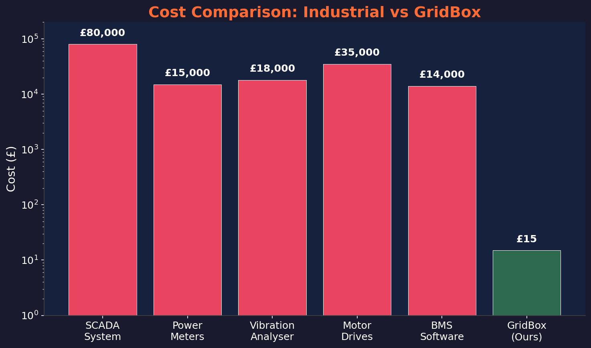

---

## 2. Affinity Laws Power Curve (P ∝ n³)

Use for: **Technical + Innovation** — shows 49% power saving at 80% speed

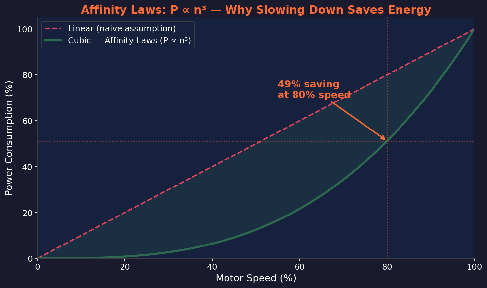

---

## 3. Packet Protocol (6 Datagram Types)

Use for: **Technical** — shows our custom wireless protocol, packet structure, and all 6 types

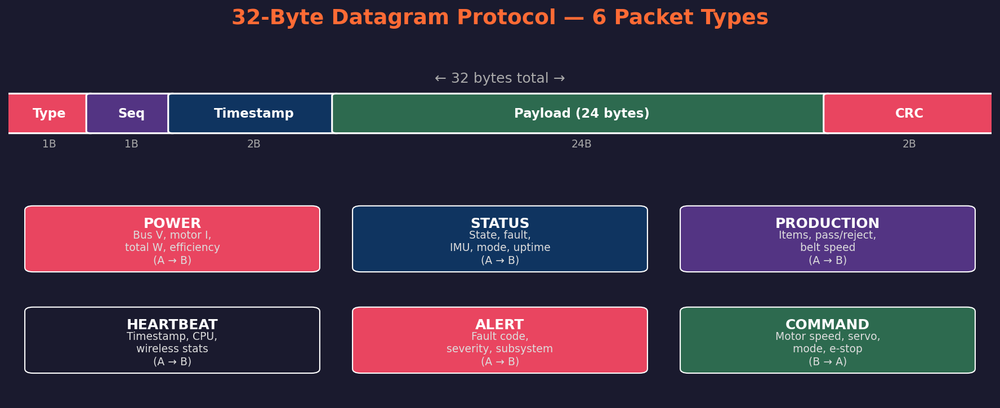

---

## 4. System Architecture (Two-Pico)

Use for: **System Architecture slide** — shows Pico A (master) and Pico B (slave) with all peripherals and wireless link

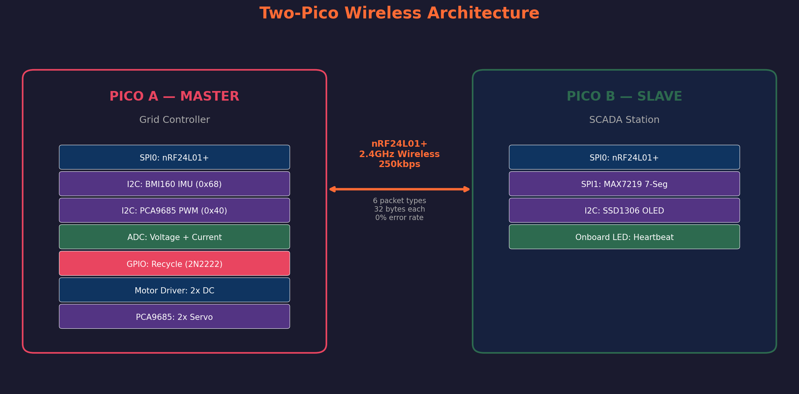

---

## 5. Scoring Radar Chart

Use for: **Results slide** — shows how we score against each judging category

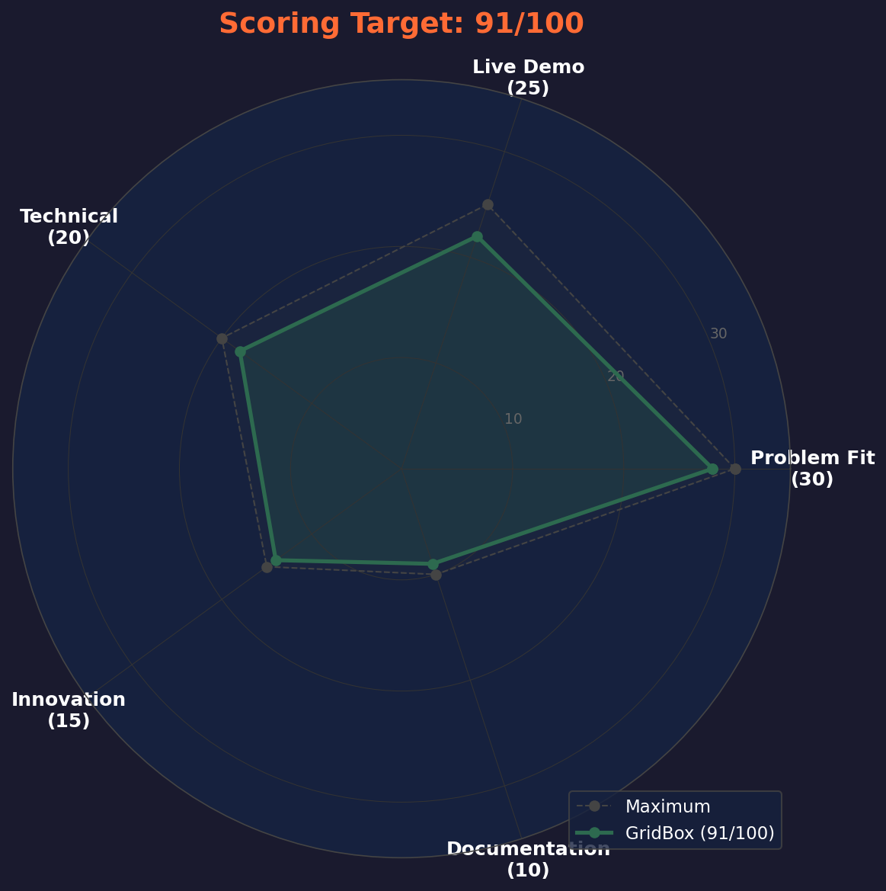

---

## 6. Closed-Loop Control Flow

Use for: **Technical** — shows SENSE → CALCULATE → DECIDE → ROUTE → VERIFY cycle at 100Hz

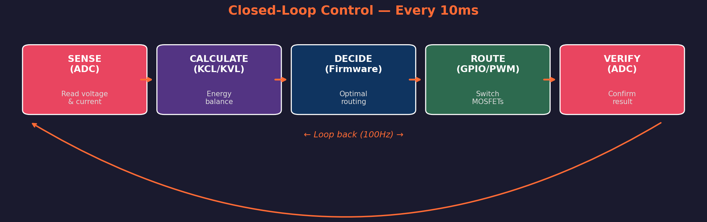

---

## 7. Fault Detection State Machine

Use for: **Technical + Innovation** — shows NORMAL → DRIFT → WARNING → FAULT → EMERGENCY + auto recovery

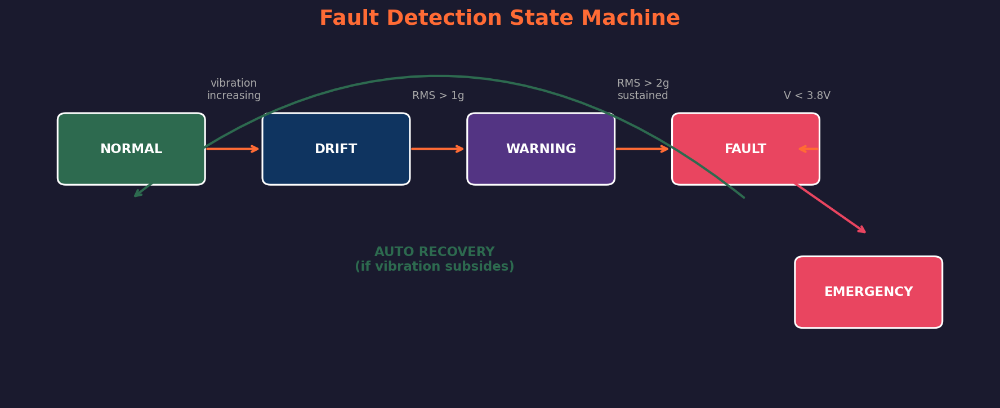

---

## 8. Wiring Progress

Use for: **Results** — shows 77% wiring complete (48 done, 13 TODO, 18 cancelled)

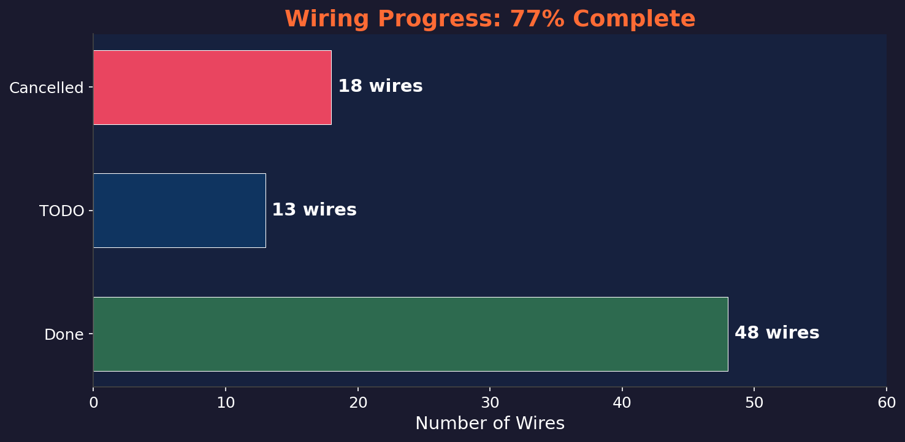

---

## Mermaid Diagrams (render on GitHub or mermaid.live)

### Packet Rotation Schedule

### Demo Scenario Flow

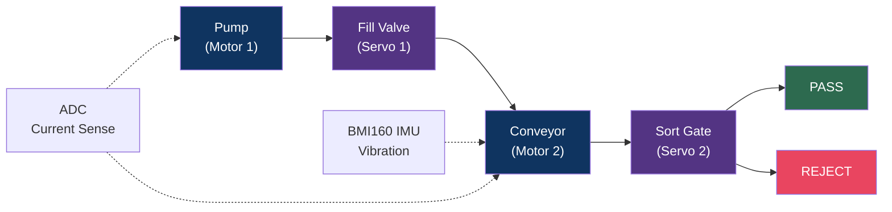

### Wireless Communication Flow

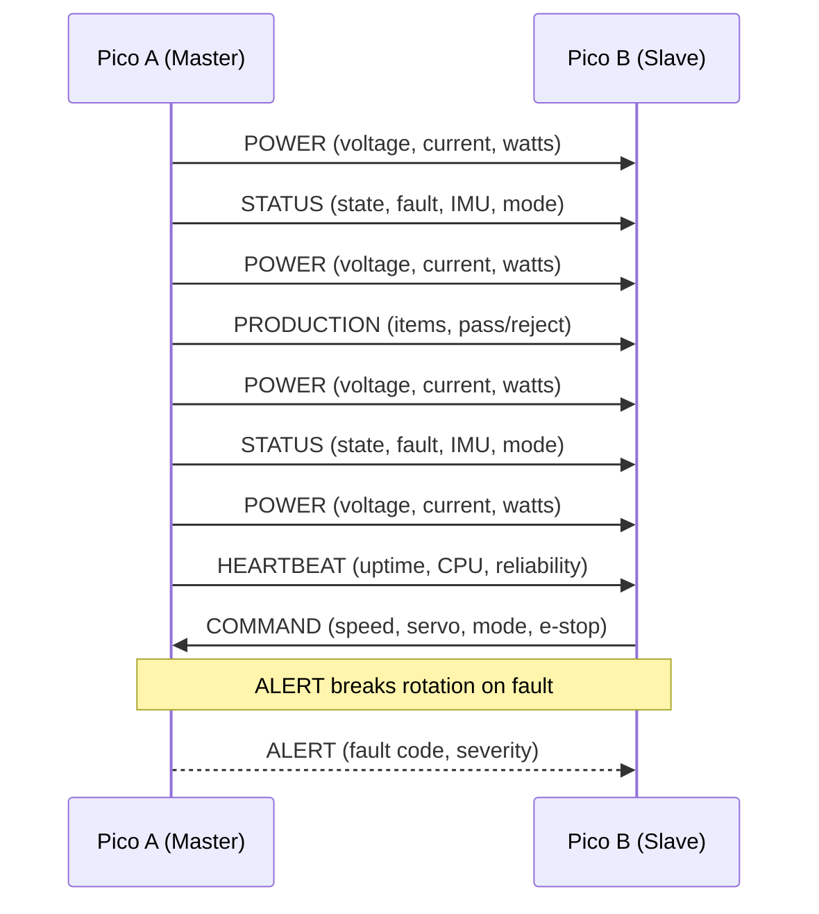

### Recycle Path Circuit

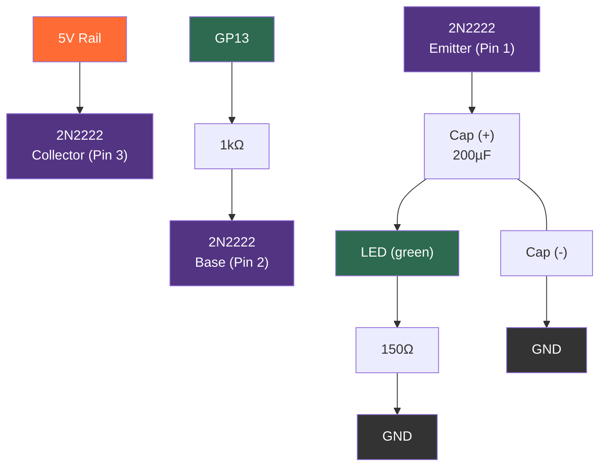

---

## Suggested Slide Mapping

| Slide | Charts to Use |
|---|---|
| Problem | `01-cost-comparison.png` |
| System Architecture | `04-architecture.png` |
| Technical Summary | `03-packet-protocol.png`, `06-control-loop.png` |
| EEE Theory | `02-affinity-laws.png`, `07-fault-state-machine.png` |
| Live Demo | Mermaid demo scenario flow |
| Results | `05-scoring-radar.png`, `08-wiring-progress.png` |
