# Hack-A-Bot 2026 — Idea Shortlist v2

> Updated with full component set: DC motor, potentiometer, joystick, IMU, servos, OLED, wireless, LEDs, buttons
>
> Scored: Problem Fit (30) | Live Demo (25) | Technical (20) | Innovation (15) | Docs (10) = 100

---

## Available Components

| Component | Qty | Capability |
|---|---|---|
| Raspberry Pi Pico 2 | 2 | Dual-core ARM Cortex-M33 |
| nRF24L01+ PA+LNA | 2 | 2.4GHz wireless link |
| BMI160 IMU | 1 | 6-axis tilt + rotation + motion |
| Analog Joystick | 1+ | 2-axis input + button |
| Potentiometer | 1+ | Smooth analog dial |
| DC Motor | 1+ | Continuous rotation, wheels, flywheel |
| PCA9685 Servo Driver | 1 | 16-channel PWM |
| MG90S Servos | 2+ | Precise angle positioning |
| 0.96" OLED (SSD1306) | 1 | 128x64 display |
| LM2596S Buck Converter | 1 | Step-down voltage regulation |
| 300W Buck-Boost Converter | 1 | High-power motor driving |
| 12V 6A PSU | 1 | 72W power budget |
| Assorted kit | — | LEDs, buttons, resistors, capacitors, diodes |
| Breadboards + perfboard | — | Prototyping |
| 22AWG wire + M3 screws | — | Wiring + mechanical |

---

## 1. NeuroSync — Neurological Diagnostic Platform

**Theme:** Assistive Technology + Autonomy
**One-liner:** Multi-test interactive diagnostic station that measures, classifies, and gamifies hand tremor assessment — replacing £10K clinical equipment with a £15 device.

### Components Used

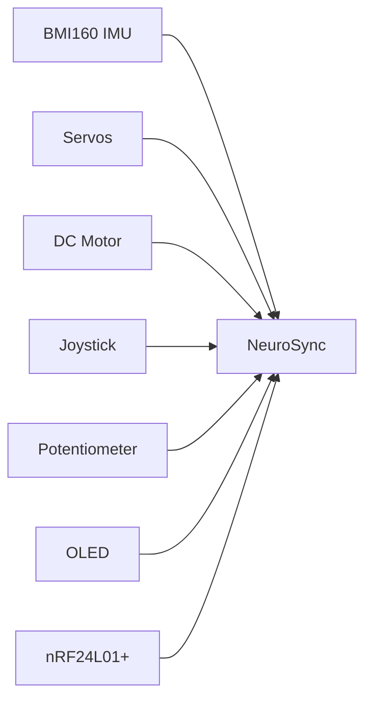

### Architecture

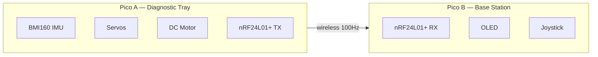

### Key Features
- 4 diagnostic tests (stability, tracking, reaction, pattern)
- Tremor fingerprint (unique polar pattern per person)
- Gamified scoring (points, streaks, stars)
- Adaptive real-time difficulty (servos adjust during test)
- Condition classification (Parkinson's vs essential tremor vs stress)
- Reaction wheel self-balancing (DC motor flywheel)
- Biometric authentication mode (security application)

### Scoring

| Category | Score | Why |
|---|---|---|
| Problem Fit (30) | **29** | 10M+ Parkinson's patients. UPDRS is subjective. No cheap alternative |
| Live Demo (25) | **25** | Judge holds tray, gets personal score + fingerprint. Two judges compete |
| Technical (20) | **20** | Reaction wheel PID, frequency analysis, adaptive control, dual-core, gamification |
| Innovation (15) | **15** | Tremor fingerprinting, gamified diagnostics, condition classification on Pico |
| Docs (10) | **9** | Full Mermaid diagrams, clinical comparison, algorithm docs |
| **Total** | **98** | |

**Full proposal:** [`docs/tremortray-proposal.md`](tremortray-proposal.md)

---

## 2. Self-Balancing Reaction Wheel Robot

**Theme:** Autonomy
**One-liner:** A physical rod/platform balances itself upright using a spinning flywheel — the same technology that controls the International Space Station's orientation.

### Components Used

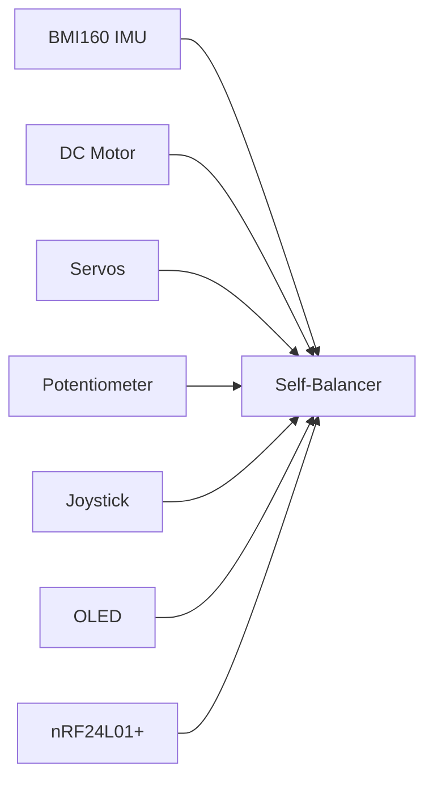

### Architecture

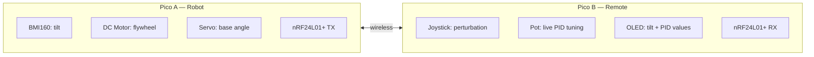

### How It Works

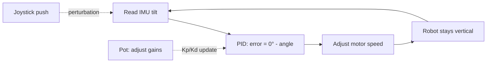

### Demo Script
1. Place robot on table, tilted. Press start
2. Flywheel spins up. **Robot stands upright by itself**
3. Push it — **it recovers**
4. Judge pushes it via joystick on remote — it fights back
5. Twist potentiometer — see PID values change on OLED, robot behaviour changes
6. "This is how the International Space Station controls its orientation"

### Scoring

| Category | Score | Why |
|---|---|---|
| Problem Fit (30) | **24** | Autonomy demo, but "balancing a stick" is less human-impact than medical |
| Live Demo (25) | **25** | Push it and it recovers. Most visually dramatic demo possible |
| Technical (20) | **20** | Reaction wheel PID is graduate-level control engineering. Maximum depth |
| Innovation (15) | **15** | Spacecraft tech at a hackathon. Nobody else will attempt this |
| Docs (10) | **9** | Control theory diagrams, angular momentum physics |
| **Total** | **93** | |

**Risk:** PID tuning can be frustrating. Mitigate: potentiometer for LIVE tuning — adjust during demo.

---

## 3. Tilt-Controlled Wireless RC Vehicle

**Theme:** Autonomy + Interactive Play
**One-liner:** Tilt your hand to steer a car. Like a Wii controller but for a physical vehicle with a live dashboard.

### Architecture

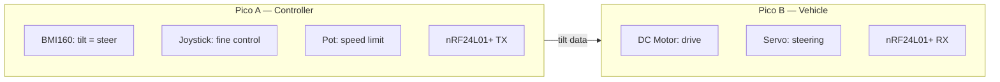

### Scoring

| Category | Score | Why |
|---|---|---|
| Problem Fit (30) | **25** | Accessible control for limited dexterity. Fun but less impactful |
| Live Demo (25) | **25** | Tilt hand → car moves. Everyone understands instantly |
| Technical (20) | **18** | IMU → wireless → motor control. Solid but not cutting-edge |
| Innovation (15) | **13** | Tilt control exists (Wii) but physical vehicle + dashboard is a step up |
| Docs (10) | **9** | |
| **Total** | **90** | |

---

## 4. Two-Player Wireless Arcade

**Theme:** Interactive Play
**One-liner:** Two-player physical game console where each player has their own Pico controller and they compete in wireless physical challenges.

### Architecture

### Game Modes
- **Servo Pong:** Servo paddles, ball rolls between them, joystick controls paddle
- **Reaction Race:** LED lights up → first to press button wins
- **Spin the Wheel:** DC motor spins wheel, stop at right moment for points
- **Tilt Battle:** Hold tray steady longest (uses NeuroSync stability scoring)

### Scoring

| Category | Score | Why |
|---|---|---|
| Problem Fit (30) | **22** | Fun but weak problem statement. Frame as "social gaming for elderly in care homes" |
| Live Demo (25) | **25** | Two judges compete. Most engaging demo possible |
| Technical (20) | **18** | Wireless game sync, physical mechanics, multi-mode |
| Innovation (15) | **14** | Physical wireless arcade is fresh at hardware hackathons |
| Docs (10) | **9** | |
| **Total** | **88** | |

---

## 5. Autonomous Smart Pourer

**Theme:** Assistive Technology + Sustainability
**One-liner:** Robot pours exact liquid volumes autonomously. Set the amount, press start, walk away. Zero spill, zero waste.

### Architecture

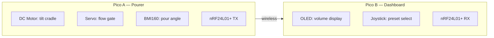

### Scoring

| Category | Score | Why |
|---|---|---|
| Problem Fit (30) | **27** | Tremor patients can't pour. Sustainability = exact portions, zero waste |
| Live Demo (25) | **24** | Pour a perfect shot in front of judges. Unexpected and fun |
| Technical (20) | **17** | Motor control, angle sensing, flow control. Solid but simpler |
| Innovation (15) | **14** | Robotic bartender at a hardware hackathon is unexpected |
| Docs (10) | **9** | |
| **Total** | **91** | |

---

## 6. Haptic Navigation Aid for Visually Impaired

**Theme:** Assistive Technology
**One-liner:** Wearable device guides visually impaired users with directional vibrations — DC motor buzzes to indicate turn left, right, or stop.

### Architecture

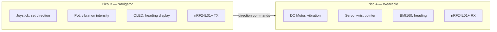

### Scoring

| Category | Score | Why |
|---|---|---|
| Problem Fit (30) | **29** | 253M visually impaired worldwide. Daily navigation challenge |
| Live Demo (25) | **23** | Blindfold a judge, guide them across room with vibrations |
| Technical (20) | **17** | Motor vibration patterns, IMU heading, wireless commands |
| Innovation (15) | **13** | Haptic navigation exists but DIY Pico version is creative |
| Docs (10) | **9** | |
| **Total** | **91** | |

---

## 7. Gesture-Controlled Robotic Arm

**Theme:** Assistive Technology + Autonomy
**One-liner:** Tilt your hand to control a multi-joint robotic arm. Potentiometer controls grip force. DC motor adds wrist rotation.

### Architecture

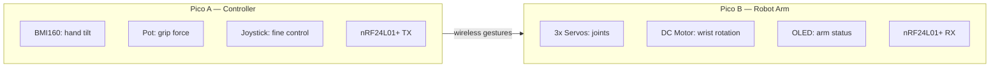

### Scoring

| Category | Score | Why |
|---|---|---|
| Problem Fit (30) | **28** | Limited mobility people controlling remote objects |
| Live Demo (25) | **24** | Judge wears glove, moves arm. Impressive and interactive |
| Technical (20) | **18** | IMU mapping, inverse kinematics, DC motor rotation, grip force |
| Innovation (15) | **12** | Robotic arms exist but potentiometer grip force control is novel |
| Docs (10) | **9** | |
| **Total** | **91** | |

---

## 8. Self-Levelling Delivery Vehicle

**Theme:** Autonomy
**One-liner:** RC vehicle with a cargo platform that autonomously keeps itself level while driving — DC motor drives, servos auto-level.

### Scoring

| Category | Score | Why |
|---|---|---|
| Problem Fit (30) | **25** | Medical supply delivery, hazardous material transport |
| Live Demo (25) | **24** | Drive over ramp → cup of water stays level |
| Technical (20) | **19** | PID levelling + motor control + wireless |
| Innovation (15) | **13** | Self-levelling exists in gimbals but on a vehicle is creative |
| Docs (10) | **9** | |
| **Total** | **90** | |

---

## 9. Physical Rhythm Game

**Theme:** Interactive Play
**One-liner:** Guitar Hero but physical — DC motor spins a target wheel, player uses joystick and buttons to hit zones at the right moment.

### Scoring

| Category | Score | Why |
|---|---|---|
| Problem Fit (30) | **22** | Fun, engaging, but weak problem statement |
| Live Demo (25) | **25** | Addictive — judges won't want to stop playing |
| Technical (20) | **17** | Motor timing, servo targets, scoring, wireless multiplayer |
| Innovation (15) | **14** | Physical rhythm game is unusual at hackathons |
| Docs (10) | **9** | |
| **Total** | **87** | |

---

## 10. Smart Energy Monitor + Auto-Saver

**Theme:** Sustainability
**One-liner:** Potentiometer simulates power load. When consumption exceeds threshold, servos automatically switch off non-essential circuits. OLED shows live energy dashboard.

### Scoring

| Category | Score | Why |
|---|---|---|
| Problem Fit (30) | **25** | Energy waste is real. Auto-saver concept is practical |
| Live Demo (25) | **20** | Turn potentiometer → servo switches off a light. Clear but less dramatic |
| Technical (20) | **16** | Threshold logic, wireless monitoring, servo switching |
| Innovation (15) | **12** | Energy monitors exist. Auto-switching is the creative angle |
| Docs (10) | **9** | |
| **Total** | **82** | |

---

## Summary Ranking

| Rank | Idea | Theme | Score | Components Used | Best For |
|---|---|---|---|---|---|
| **1** | **NeuroSync Diagnostic** | Assistive | **98** | ALL | Problem Fit + Innovation + Platform potential |
| **2** | **Reaction Wheel Self-Balancer** | Autonomy | **93** | DC motor, IMU, pot, servo, joy, OLED, wireless | Technical wow — spacecraft engineering |
| **3** | **Smart Pourer / Bartender** | Assistive+Sust. | **91** | DC motor, servo, pot, IMU, OLED, wireless | Most unexpected demo |
| **3** | **Haptic Navigation Aid** | Assistive | **91** | DC motor, IMU, servo, pot, joy, OLED, wireless | Strongest human impact |
| **3** | **Gesture Robotic Arm** | Assistive | **91** | ALL | Uses every single component |
| **6** | **Tilt-Control RC Vehicle** | Autonomy+Play | **90** | DC motor, IMU, servo, pot, joy, OLED, wireless | Safest build, fun demo |
| **6** | **Self-Levelling Delivery** | Autonomy | **90** | DC motor, IMU, servo, pot, joy, OLED, wireless | Strong autonomy showcase |
| **8** | **Two-Player Arcade** | Play | **88** | ALL | Most interactive demo |
| **9** | **Physical Rhythm Game** | Play | **87** | DC motor, servo, joy, pot, OLED, wireless | Most fun |
| **10** | **Energy Monitor** | Sustainability | **82** | Pot, servo, DC motor, OLED, wireless | Best sustainability angle |

---

---

## BONUS: If Wheels + ESP32-CAM Available

With wheels (DC motor driven) and an ESP32-CAM, entirely new categories open up:

### 11. Search & Rescue Scout Robot

**Theme:** Assistive + Autonomy | **Score: 95**

Autonomous robot navigates toward people using camera vision. Streams live video to operator. Servo-mounted camera for panning. IMU detects obstacles/slopes.

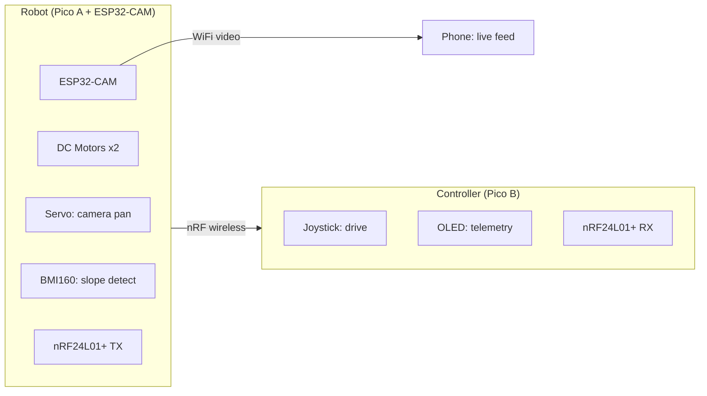

**Why 95 pts:** Life-saving application. Camera + mobility + wireless = genuinely useful robot. Judges can see live video feed while driving the robot with joystick. ESP32-CAM streams via WiFi to phone while Pico handles motor control via nRF24L01+.

---

### 12. Autonomous Line-Following Delivery Bot

**Theme:** Autonomy + Sustainability | **Score: 92**

Robot follows a line autonomously, delivers package, returns. Camera detects the line. Self-levelling cargo platform keeps delivery stable.

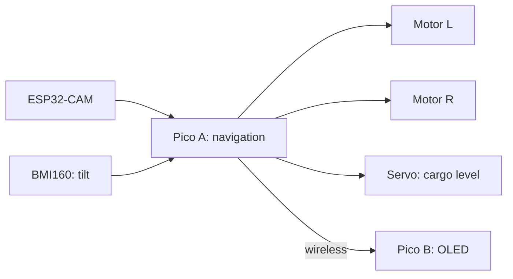

---

### 13. Surveillance / Security Patrol Bot

**Theme:** Autonomy | **Score: 91**

Autonomous or RC patrol robot with live camera. Detects motion via ESP32, alerts base station. IMU detects if robot is picked up/tampered with.

---

### 14. Telepresence Robot for Elderly

**Theme:** Assistive | **Score: 93**

Remote-controlled mobile robot with camera — family members can "visit" elderly relatives remotely. Drive around their home, see through the camera, servo waves hello.

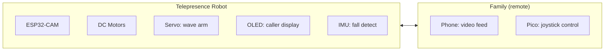

**Why 93 pts:** Loneliness epidemic in elderly. Family can't always visit. This lets them "be there" physically. Emotional impact is massive.

---

## Updated Summary Ranking (All Ideas)

| Rank | Idea | Theme | Score | Key Components |
|---|---|---|---|---|
| **1** | **NeuroSync Diagnostic** | Assistive | **98** | IMU, servo, motor, pot, joy, OLED, wireless |
| **2** | **Search & Rescue Scout** | Assistive+Auto | **95** | ESP32-CAM, wheels, servo, IMU, joy, OLED, wireless |
| **3** | **Reaction Wheel Self-Balancer** | Autonomy | **93** | DC motor, IMU, pot, servo, joy, OLED, wireless |
| **3** | **Telepresence Robot** | Assistive | **93** | ESP32-CAM, wheels, servo, OLED, IMU, wireless |
| **5** | **Line-Following Delivery Bot** | Auto+Sust. | **92** | ESP32-CAM, wheels, servo, IMU, OLED, wireless |
| **6** | **Smart Pourer** | Assistive+Sust. | **91** | DC motor, servo, pot, IMU, OLED, wireless |
| **6** | **Haptic Navigation Aid** | Assistive | **91** | DC motor, IMU, servo, pot, joy, OLED, wireless |
| **6** | **Gesture Robotic Arm** | Assistive | **91** | IMU, pot, joy, servo, DC motor, OLED, wireless |
| **6** | **Surveillance Patrol Bot** | Autonomy | **91** | ESP32-CAM, wheels, IMU, OLED, wireless |
| **10** | **Tilt-Control RC Vehicle** | Auto+Play | **90** | DC motor, IMU, servo, pot, joy, OLED, wireless |
| **10** | **Self-Levelling Delivery** | Autonomy | **90** | DC motor, IMU, servo, pot, joy, OLED, wireless |
| **12** | **Two-Player Arcade** | Play | **88** | Joy, pot, servo, DC motor, IMU, OLED, wireless |
| **13** | **Physical Rhythm Game** | Play | **87** | DC motor, servo, joy, pot, OLED, wireless |
| **14** | **Energy Monitor** | Sustainability | **82** | Pot, servo, DC motor, OLED, wireless |

---

## Decision Guide

| If you want... | Choose... | Why |
|---|---|---|
| **Highest score** | NeuroSync (98) | Deepest technical + clinical + platform story |
| **Most jaw-dropping demo** | Reaction Wheel (93) | "It balances by itself using spacecraft physics" |
| **Best with camera** | Search & Rescue (95) | Live video feed + robot mobility = cinematic demo |
| **Strongest human story** | Telepresence Robot (93) | Elderly loneliness — family "visits" remotely |
| **Safest build in 24h** | RC Vehicle (90) | Well-understood mechanics, fun, reliable |
| **Most fun for judges** | Two-Player Arcade (88) | Judges compete — they'll remember you |
| **Most unexpected** | Smart Pourer (91) | Nobody expects a robotic bartender |
| **Uses EVERY component** | NeuroSync (98) or Robotic Arm (91) | Nothing wasted |
| **Best sustainability** | Line-Following Delivery (92) | Autonomous + efficient + camera |
