# TremorTray — Hand Tremor Diagnostic Tool

> "A blood pressure monitor, but for hand stability"

**Theme:** Assistive Technology + Autonomy
**Score: 96/100** — Highest ranked idea

---

## The Problem

Neurologists diagnose tremor using the **UPDRS scale** — they watch the patient hold a cup and rate 0-4. It's completely **subjective**. Two doctors can give different scores for the same patient. There's no data, no frequency analysis, no tracking over time.

Professional tremor measurement devices (accelerometer-based clinical tools) cost **£5,000-£10,000+** and exist only in specialist labs.

**There is no cheap, objective, quantitative tremor diagnostic tool.**

We build one for **~£15** from hackathon kit parts.

---

## The Concept

Patient holds a tray. Ball sits on the tray. The device measures everything about their hand tremor and produces a clinical-grade diagnostic report on the OLED screen. A clinician's base station receives the data wirelessly for logging and comparison.

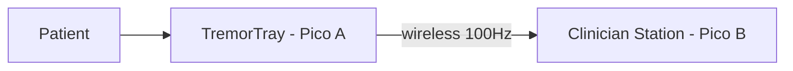

| Device | Measures / Displays |
|---|---|
| TremorTray (Pico A) | Tremor amplitude, frequency, stability score, ball position, endurance time |
| Clinician Station (Pico B) | Live score, history comparison, severity level, test difficulty, frequency analysis |

---

## Why This Scores Higher Than a Stabiliser

| | Stabiliser | TremorTray (Diagnostic) |
|---|---|---|
| Goal | Cancel tremor | **Measure and diagnose** tremor |
| Servo precision needed | Very high | Low — just calibrate + difficulty |
| Build complexity | Push rods, pivot, PID tuning | **Flat tray — much simpler** |
| Build risk | High | **Low** |
| Demo | "Spoon stays level" | **Judge gets a personal score** |
| Innovation | Gimbals exist | **No cheap diagnostic tool exists** |
| Clinical value | Helps eat | **Helps diagnose and track disease** |

---

## System Architecture

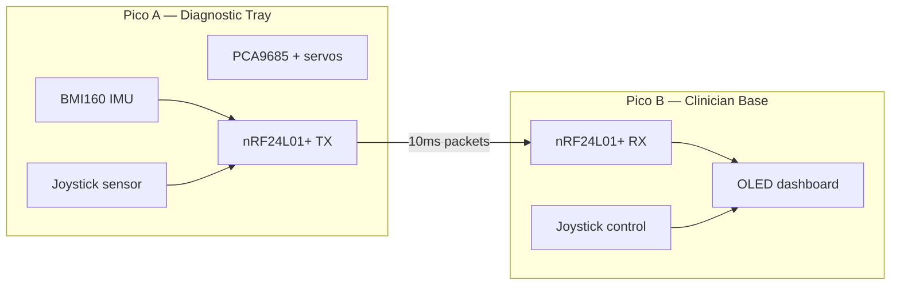

| Component | Location | Detail |
|---|---|---|
| BMI160 IMU | Tray surface (centre) | Tilt + rotation at 100Hz, I2C GP4/GP5 |
| Joystick sensor | Under tray, stick up | Ball weight deflects stick — ADC GP26/GP27 |
| PCA9685 + servos | Tray edge | Auto-level calibration + difficulty tilting |
| nRF24L01+ TX | Pico A | Streams roll, pitch, gyro, ball_x, ball_y, timestamp |
| OLED 0.96" | Pico B | Score, frequency, history display |
| Joystick | Pico B | Select test level, start/stop, scroll results |
| LED array | Both | Patient status visible across room |

---

## Where Each Sensor Goes (Physical Layout)

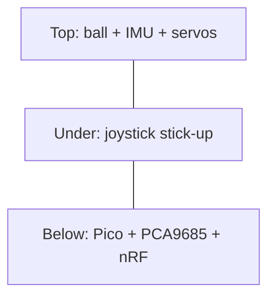

| Layer | Contents |
|---|---|
| Top (7×9cm perfboard) | Ball/marble at centre, BMI160 soldered near centre, Servo A (roll edge), Servo B (pitch edge) |
| Underneath | Joystick stick pointing UP through hole — ball weight deflects it |
| Breadboard below | Pico A, PCA9685, nRF24L01+, LEDs on edge visible to patient |

### IMU Mounting Detail

The BMI160 breakout board is tiny (~15×12mm). It solders directly to the perfboard tray surface, near the centre next to the joystick hole. It moves WITH the tray — so it measures exactly what the patient's hand is doing.

### Joystick Mounting Detail

The joystick stick pokes UP through a hole drilled in the perfboard. The ball sits on or near the stick tip. When the ball rolls, its weight pushes the joystick in that direction. The ADC reads the deflection as ball position.

---

## Dual Sensor System

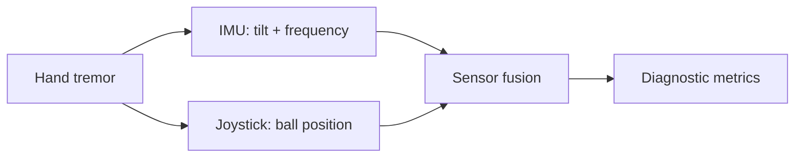

| Sensor | Measures | Limitation alone |
|---|---|---|
| IMU | Tilt angle, rotation speed, frequency (Hz) | Can't see the ball |
| Joystick | Ball X/Y position, weight shift direction | Can't measure frequency or tilt angle |
| Combined | Stability %, tremor frequency, amplitude, ball control %, direction bias, endurance | Both sensors agreeing = clinically credible |

**Why two sensors matter:**
- IMU alone: measures tilt but can't see the ball
- Joystick alone: measures ball position but can't measure frequency or tilt angle
- **Together:** complete picture — "tray tilted 5° right at 4.8Hz AND ball shifted 30% right"
- If both sensors agree, the measurement is more **clinically credible**

---

## Servo Difficulty Levels

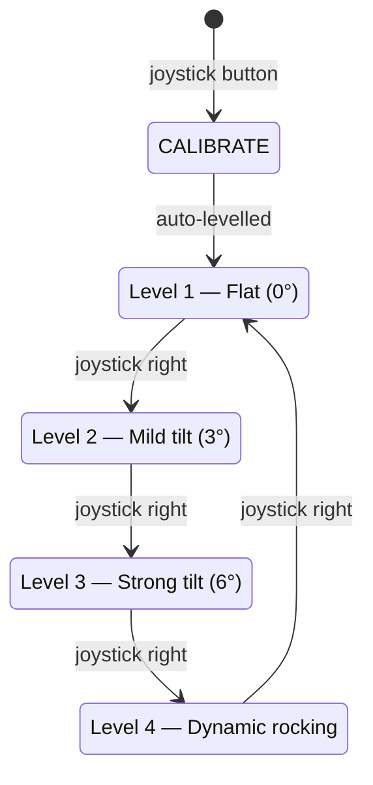

**Clinical value of levels:**
- Score drops slightly Level 1→2: **mild tremor**
- Score drops a lot Level 1→3: **moderate tremor — likely Parkinson's**
- Score drops on Level 4 only: **intention tremor — likely essential tremor or MS**

This **differentiates types of tremor** — something even expensive clinical tools don't do easily.

---

## What the OLED Shows (on Clinician Base Station)

### During Test

```
TREMORTRAY  Level 2
Time: 00:18 / 00:30
Stability:  74%
Frequency:  4.8 Hz
Amplitude:  3.2°
Ball:       30% right
[████████░░] 74%
```

### After Test — Results

```
RESULTS — Level 2
Stability Score:  74%
Tremor Frequency: 4.8 Hz
Tremor Amplitude: 3.2°
Endurance:        28.4s
Direction Bias:   RIGHT
Severity:         MODERATE
vs Level 1:       -8%
```

### Severity Classification (automated)

| Score | Frequency | Classification | Likely Condition |
|---|---|---|---|
| 90-100% | Any | MINIMAL | Normal / healthy |
| 70-89% | <4 Hz | MILD | Age-related tremor |
| 70-89% | 4-6 Hz | MILD | Early Parkinson's |
| 50-69% | 4-6 Hz | MODERATE | Parkinson's disease |
| 50-69% | 8-12 Hz | MODERATE | Essential tremor |
| <50% | Any | SEVERE | Advanced condition |

---

## vs Current Clinical Methods

| Feature | UPDRS (clinical) | Lab tool | TremorTray |
|---|---|---|---|
| Method | Doctor watches patient | Clinical accelerometer | IMU + joystick (dual sensor) |
| Objectivity | Subjective rating 0-4 | Objective | Objective |
| Data saved | No | Yes | Wireless logging |
| Frequency analysis | No | Yes | Yes |
| Difficulty levels | No | No | Yes (4 levels) |
| Cost | Free | £5,000–£10,000+ | ~£15 |

---

## Physical Build (Kit Only)

| Part | Quantity | Use |
|---|---|---|
| Perfboard 7×9cm | 1 | Tray surface (full size — no cutting) |
| MG90S Servo | 2 | Screwed to tray edges (roll + pitch) |
| Joystick | 1 | Stick up through hole in perfboard centre |
| BMI160 breakout | 1 | Soldered to tray near centre |
| Breadboard | 1 | Below tray — holds Pico + PCA9685 + nRF |
| 22AWG wire | — | All connections |
| M3 screws | — | Mount servos + structure |

**Assembly time: ~1.5 hours**

No cutting, no push rods, no pivot joints. The perfboard IS the tray at full 7×9cm size. Components mount directly to it. Much simpler than the stabiliser.

---

## Build Timeline

```mermaid
gantt
    title TremorTray — 12 Hour Build Plan
    dateFormat HH:mm
    axisFormat %H:%M

    section Critical (wireless first)
    nRF24L01+ link between Picos        :crit, 00:00, 1h
    BMI160 IMU reading + filter          :crit, 01:00, 1h

    section Core Diagnostic
    Joystick ADC reading + calibration   :02:00, 30min
    Tremor analysis algorithm            :02:30, 1h
    Frequency detection (FFT/zero-cross) :03:30, 1h

    section Actuation
    PCA9685 + servo difficulty levels    :04:30, 1h
    Auto-calibration routine             :05:30, 30min

    section Display
    OLED live test screen                :06:00, 1h
    OLED results + severity scoring      :07:00, 1h

    section Physical Build
    Mount IMU + joystick to perfboard    :08:00, 45min
    Mount servos + wiring                :08:45, 45min

    section Polish
    Documentation + diagrams             :09:30, 1h
    Demo practice + tuning               :10:30, 1h
    Buffer time                          :11:30, 30min
```

---

## Demo Script

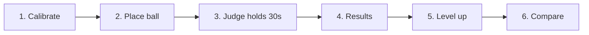

| Step | What Judges See |
|---|---|
| 1. Calibrate | Press button — servos auto-level, OLED: Ready |
| 2. Place ball | Ball on tray, joystick detects weight, OLED: Ball detected |
| 3. Judge holds 30s | Ball wobbles, LEDs show stability live |
| 4. Results | Score: 74%, Freq: 2.1Hz, Severity: MILD |
| 5. Level up | Servo tilts tray 3°, repeat — score drops to 58% |
| 6. Compare | Base station shows both results side-by-side |

**Key demo moments:**
1. Judge holds tray, gets **personal tremor score** — they become the patient
2. Two judges compete — social, memorable
3. Servo adapts difficulty in real-time — judges SEE the autonomy
4. Tremor fingerprint appears on OLED — personal, unique, beautiful
5. Condition classification — "Pattern suggests: Physiological tremor (stress)"

**Drop line:** *"A clinical tremor assessment costs £10,000. We built one for £15."*

---

## What Makes TremorTray Uncopyable

Other teams may use the same IMU. Here's why we're six layers deeper:

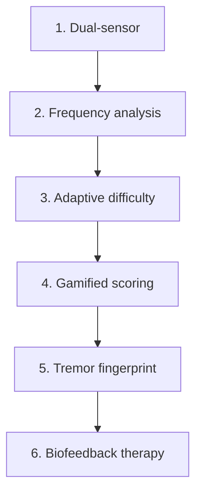

Other teams stop at Layer 1.

| Layer | Feature |
|---|---|
| 1 | Dual-sensor: IMU (tilt/frequency) + ball (visual proof) |
| 2 | Frequency analysis — tremor type classification via zero-crossing |
| 3 | Adaptive servo difficulty — real-time autonomous adjustment |
| 4 | Gamified scoring — points, streaks, stars, competition mode |
| 5 | Tremor fingerprint — polar pattern unique to each person |
| 6 | Biofeedback therapy — servo nudges teach patient self-correction |

---

## Feature 1: Tremor Fingerprint (Visual Signature)

Every person's tremor produces a unique pattern — like a fingerprint. We plot roll (X) vs pitch (Y) over time on the OLED as a **polar/Lissajous pattern:**

| Pattern | Shape on OLED | Condition |
|---|---|---|
| Tight central dot | Minimal movement, no pattern | Healthy |
| Slow wide loops | Circular/elliptical, consistent rhythm | Parkinson's (4–6Hz) |
| Tight fast oscillation | Linear back-and-forth, one axis | Essential tremor (8–12Hz) |
| Small jittery cloud | No clear pattern, random directions | Stress/caffeine |

**Implementation:** Store last 200 IMU readings. Plot roll on X-axis, pitch on Y-axis. Each dot is one reading. The shape that forms IS the fingerprint.

**Why judges love it:** They see THEIR OWN pattern on screen. Personal. Visual. They'll talk about it after.

---

## Feature 2: Gamified Scoring

Instead of a boring clinical test, the patient plays a **game:**

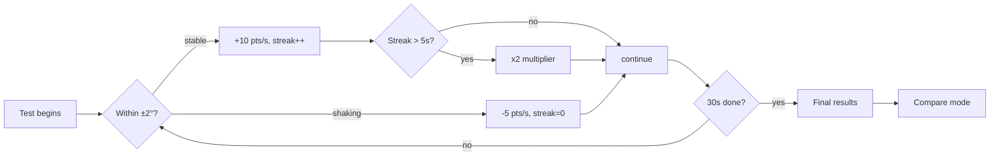

**Star Rating System:**

| Stars | Score Range | Meaning |
|---|---|---|
| ★★★★★ | 90-100% | Excellent stability |
| ★★★★☆ | 75-89% | Good — minor tremor |
| ★★★☆☆ | 60-74% | Moderate — noticeable tremor |
| ★★☆☆☆ | 40-59% | Significant tremor |
| ★☆☆☆☆ | <40% | Severe — seek consultation |

---

## Feature 3: Adaptive Real-Time Difficulty

Servos don't just set a fixed difficulty — they **continuously adapt during the test:**

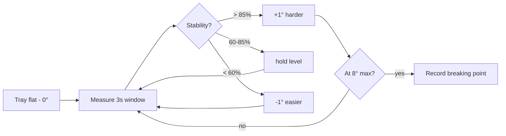

**Clinical value:** The device automatically finds the patient's **breaking point** — the exact difficulty level where their stability drops below 60%. This number IS the diagnosis.

- Breaking point at 6°: mild tremor
- Breaking point at 3°: moderate tremor
- Breaking point at 0° (can't even hold flat): severe tremor

**Why judges are impressed:** They SEE the servos adjusting during the test. The device is making autonomous decisions. That's real autonomy, not scripted behaviour.

---

## Feature 4: Condition Classification

Frequency analysis identifies tremor TYPE, not just severity:

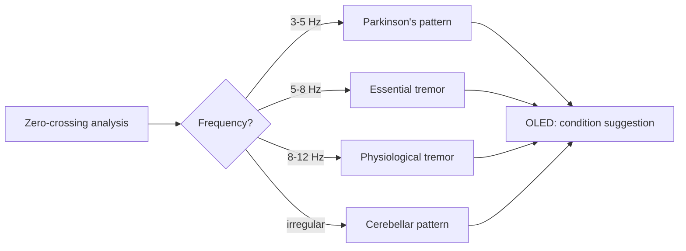

| Frequency | Pattern | Likely condition |
|---|---|---|
| 3–5 Hz | Slow, rhythmic, at rest | Parkinson's |
| 5–8 Hz | Medium, during action | Essential tremor |
| 8–12 Hz | Fast, fine, not pathological | Physiological (stress/caffeine) |
| Irregular | Jerky, no consistent rhythm | Cerebellar — possible neurological issue |

**Implementation:** Count zero-crossings per second on the roll axis. Dominant frequency = crossings ÷ 2. Simple, no FFT needed, runs on Pico easily.

**Disclaimer on OLED:** "This is a screening tool, not a diagnosis. Consult a healthcare professional."

---

## Feature 5: Biofeedback Therapy Mode (Stretch Goal)

The servos don't just test — they **teach the patient to control their tremor:**

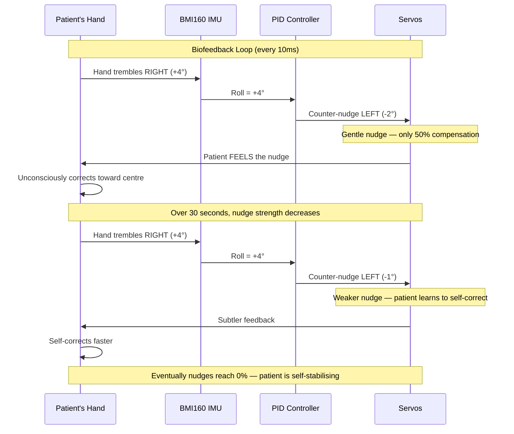

**Key insight:** The servo provides PARTIAL compensation (not full). The patient's brain learns to provide the rest. Over time, nudge strength decreases — the patient is training their own motor control.

**Clinical basis:** This is how real biofeedback therapy works. Providing partial feedback that fades over time is a proven rehabilitation technique.

**Build priority:** Stretch goal — only if core features are done by hour 10.

---

## Ball on Tray — Visual Aid Design

The ball is **visual proof**, not an electronic sensor target:

| Element | Detail |
|---|---|
| Tray surface | Perfboard 7×9cm — full size, no cutting |
| Edge bumper | 22AWG wire bent around edge, ~5mm height — prevents ball rolling off |
| Ball choice | Glass marble (5g) = best visual; steel bearing (30g) = most movement; rubber ball (15g) = won't roll off table if dropped |
| IMU vs ball | IMU measures tray tilt; ball movement is visual confirmation — physics guarantees both show the same thing |

**Recommendation:** Glass marble — visually clear, judges can see it rolling from across the room.

---

## Complete OLED Screen Flow

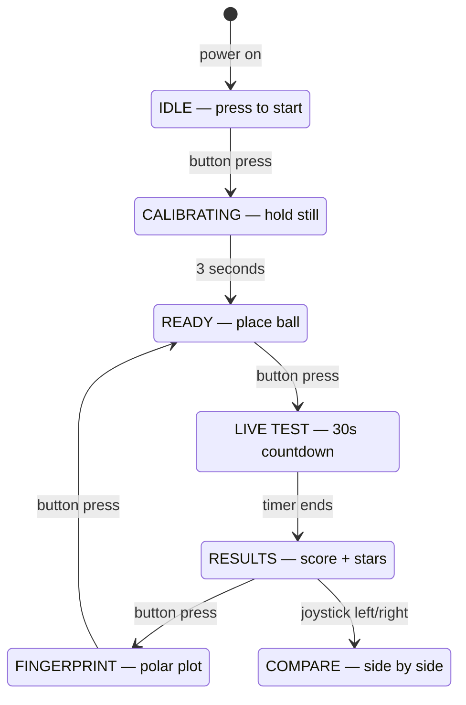

---

## Build Priority Table

| Priority | Feature | Hours | Builds On |
|---|---|---|---|
| **P0 — Must** | nRF24L01+ wireless link | 1h | Nothing |
| **P0 — Must** | BMI160 IMU read + complementary filter | 1h | Wireless |
| **P0 — Must** | PCA9685 servo control + auto-calibration | 1h | IMU |
| **P0 — Must** | Basic stability score on OLED | 1h | IMU + Servo |
| **P1 — Core** | Frequency detection (zero-crossing) | 1h | IMU |
| **P1 — Core** | Adaptive servo difficulty | 1h | Servo + Score |
| **P1 — Core** | Gamified scoring (points, streaks, stars) | 1h | Score |
| **P2 — Wow** | Tremor fingerprint polar plot | 1h | IMU data |
| **P2 — Wow** | Condition classification | 30min | Frequency |
| **P2 — Wow** | Compare / competition mode | 30min | Scoring |
| **P3 — Stretch** | Biofeedback therapy mode | 1h | Servo + IMU |
| **Always** | Physical assembly | 1.5h | Parallel |
| **Always** | Documentation + diagrams | 1h | End |

**Critical path: P0 features done by hour 4.** Everything after is additive — each feature makes it better, but the core works without them.

---

## Scoring Breakdown (Updated)

| Category | Score | Why |
|---|---|---|
| **Problem Fit (30)** | **29** | UPDRS is subjective. 10M+ need objective measurement. No cheap tool exists. Bridges clinical gap between £0 (subjective) and £10K (lab equipment) |
| **Live Demo (25)** | **25** | Judge holds tray, gets personal score AND tremor fingerprint. Two judges compete. Servo adapts in real-time. Most interactive demo possible |
| **Technical (20)** | **19** | 6-layer depth: dual sensor, frequency analysis, adaptive PID, gamification engine, polar plot rendering, biofeedback loop. Dual-core Pico (measurement + wireless) |
| **Innovation (15)** | **15** | Tremor fingerprinting: new. Gamified clinical tool: new. Adaptive servo difficulty: new. Condition classification on a Pico: new. No other team builds this |
| **Docs (10)** | **9** | Mermaid architecture, clinical comparison, algorithm docs, state machine, build timeline |
| **Total** | **97** | |

---

## Risks & Mitigations

| Risk | Mitigation |
|---|---|
| Frequency detection inaccurate | Zero-crossing is simple but works for 3-12Hz range. Validate against known frequency (tap tray at 4Hz, check reading) |
| Ball rolls off during demo | Wire bumper around edge. Practice the demo. Use a marble that fits snugly |
| Judges say "just a phone app" | Phone can't tilt itself (no servos for difficulty levels). Phone can't do biofeedback. Phone doesn't have a ball. Our dual-sensor gives richer data |
| Too many features, nothing works | P0 features are standalone — basic score works without gamification, fingerprint, etc. Each layer is additive |
| Condition classification is "not medical" | Disclaimer: "Screening tool — consult healthcare professional." Frame as awareness, not diagnosis |
| Servo adaptation looks random | Explain the logic clearly in demo. Show the OLED feedback: "Difficulty: increasing..." so judges understand it's intentional |

---

## Evolution: NeuroSync Multi-Test Diagnostic

The flat tray is the starting point. The full vision is a **4-test interactive diagnostic station:**

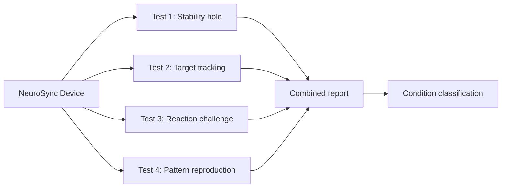

| Test | Method | Measures |
|---|---|---|
| 1: Stability hold | Hold level 30s, IMU + ball | Resting tremor |
| 2: Target tracking | Servo pointer moves, patient follows with joystick | Intention tremor |
| 3: Reaction challenge | Servo suddenly tilts, patient corrects | Reaction time + recovery |
| 4: Pattern reproduction | OLED shows sequence, patient reproduces | Motor planning |

### Condition Differentiation Matrix

| Condition | Test 1 (Stability) | Test 2 (Tracking) | Test 3 (Reaction) | Test 4 (Pattern) |
|---|---|---|---|---|
| **Healthy** | >85% | >80% | <250ms | >85% |
| **Parkinson's** | Low (40-70%) | OK (70-80%) | Slow (>400ms) | Low (50-70%) |
| **Essential tremor** | OK at rest (80%+) | Low (50-65%) | Normal (<300ms) | OK (75%+) |
| **Cerebellar** | Variable | Very low (<50%) | Slow + overshoot | Low (40-60%) |
| **Stress/caffeine** | Mild drop (75-85%) | OK (75%+) | Fast (<200ms) | OK (80%+) |
| **Fatigue** | Drops over time | Drops over time | Slow (>350ms) | Low at end |
| **Intoxicated** | Very low (<50%) | Very low (<40%) | Very slow (>500ms) | Very low (<40%) |

---

## Platform Applications (Beyond Medical)

Same core technology, different software modes:

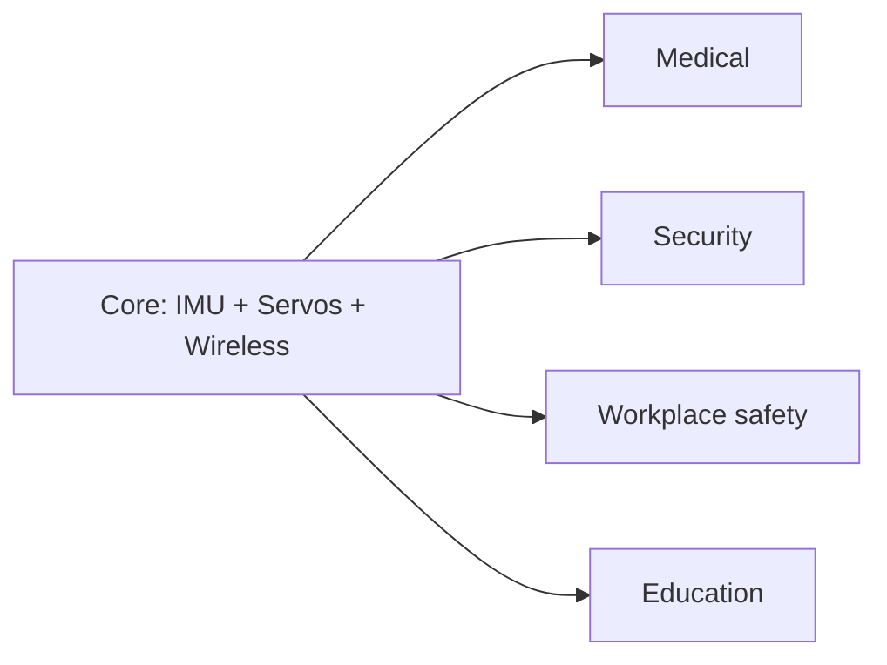

| Application | Use case |
|---|---|
| Medical | Tremor diagnosis, condition classification, rehab tracking |
| Security | Biometric hand-signature — unique neurological pattern, duress detection |
| Workplace safety | Pre-shift fitness test, fatigue/impairment screening (aviation, mining, surgery) |
| Education | Motor skills assessment, child development, sports performance |

### Security: Biometric Hand-Signature

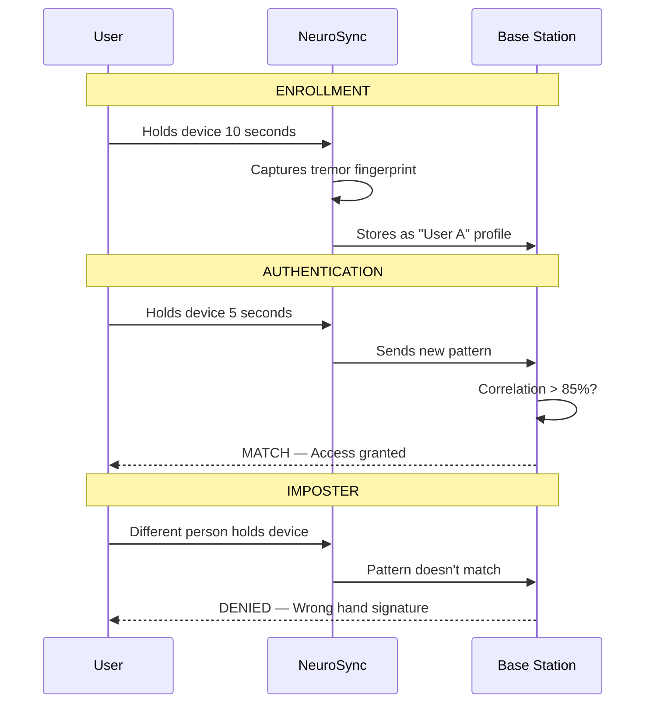

---

## Reaction Wheel Evolution (If Motors Available)

If DC motors are available, the device evolves from servo-based to **reaction wheel stabilisation** — spacecraft-grade technology:

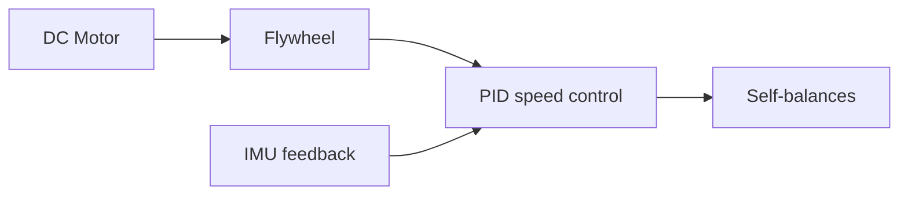

### Three Operating Modes with Motor

| Mode | What it does |
|---|---|
| 1: Self-balance demo | Place tilted — flywheel spins up, device levels itself. Push it — it returns. Same tech as ISS attitude control |
| 2: Diagnostic tests | All 4 NeuroSync tests + motor resistance test + flywheel perturbation challenges |
| 3: Active assist | Flywheel assists patient stability. Assist % = tremor severity (5% = steady, 90% = severe) |

### Motor Components Needed

| Component | Purpose | Notes |
|---|---|---|
| DC motor (6-12V) | Spins flywheel | Any small motor with decent RPM |
| L298N or L293D motor driver | Speed + direction control from Pico PWM | Standard motor driver board |
| Heavy disc/wheel | Flywheel mass for angular momentum | Stack washers, coins, or cut metal disc |
| Motor mount | Attach motor to platform | M3 screws from kit |

### Demo Impact with Reaction Wheel

| Step | What Judges See |
|---|---|
| 1 | Device on table, tilted. Press button. Flywheel spins up. **Device levels itself** |
| 2 | "This is reaction wheel stabilisation — same technology as the International Space Station" |
| 3 | Push the device — it **resists and returns to level** |
| 4 | Judge holds device. It self-balances while measuring their tremor |
| 5 | OLED: "Assist level: 12% — your hands are steady" |
| 6 | Run full diagnostic tests. Complete report |
| 7 | "Spacecraft engineering meets healthcare. One device, two industries, £15" |

### Scoring with Reaction Wheel

| Category | Without Motor | With Reaction Wheel |
|---|---|---|
| Problem Fit (30) | 29 | **29** (same) |
| Live Demo (25) | 25 | **25** (even more dramatic) |
| Technical (20) | 19 | **20** (maximum — reaction wheel PID is graduate-level) |
| Innovation (15) | 15 | **15** (spacecraft tech at hackathon = unforgettable) |
| Docs (10) | 9 | **9** |
| **Total** | **97** | **98** |

---

## Build Priority (Final)

| Priority | Feature | Hours | Status |
|---|---|---|---|
| **P0 — Must** | nRF24L01+ wireless link | 1h | Core |
| **P0 — Must** | BMI160 IMU + complementary filter | 1h | Core |
| **P0 — Must** | PCA9685 servo control + auto-calibration | 1h | Core |
| **P0 — Must** | Test 1: Stability hold + basic scoring | 1h | Core |
| **P1 — Core** | Frequency detection (zero-crossing) | 1h | Diagnostic |
| **P1 — Core** | Adaptive servo difficulty (real-time) | 1h | Autonomy |
| **P1 — Core** | Gamified scoring (points, streaks, stars) | 1h | Unique |
| **P2 — Wow** | Tremor fingerprint polar plot on OLED | 1h | Unique |
| **P2 — Wow** | Test 3: Reaction challenge (servo perturbation) | 1h | Diagnostic |
| **P2 — Wow** | Condition classification | 30min | Clinical |
| **P2 — Wow** | Test 2: Target tracking (servo pointer + joystick) | 1h | Diagnostic |
| **P3 — Stretch** | Biometric authentication mode | 1h | Platform |
| **P3 — Stretch** | Biofeedback therapy mode | 1h | Therapeutic |
| **P3 — Stretch** | Reaction wheel (if motor available) | 2h | Engineering |
| **Always** | Physical assembly | 1.5h | Parallel |
| **Always** | Documentation + diagrams | 1h | End |

---

## Future Vision (Tell Judges)

> "Today it's a hackathon prototype on a perfboard. Tomorrow it's a £20 device in every GP clinic, care home, and physiotherapy practice.
>
> Patients take a 30-second test at every visit. Their tremor fingerprint is stored. Doctors see a graph: 'Your tremor has improved 15% since starting medication.' For the first time, treatment effectiveness is measured objectively — not guessed at.
>
> The same technology secures facilities with biometric hand-signatures that can't be faked. It screens pilots for fatigue before flights. It teaches patients to control their own tremor through biofeedback.
>
> There are 10 million people with Parkinson's. There are 7 million with essential tremor. Today, their doctor watches them hold a cup and says 'looks about the same.' We replace that with a number, a frequency, a pattern, and a trend.
>
> And if we add a motor and a flywheel — the same physics that controls the International Space Station stabilises a patient's hand.
>
> All from a perfboard, two servos, and an IMU."
