# GridBox — Smart Infrastructure Control System

> "Recycled energy powers an intelligent system that monitors, decides, and acts autonomously"

**Theme:** Sustainability + Autonomy
**Score: 96/100**

---

## The Big Idea

Assume we have recycled energy available (from wind, solar, vibration harvesting, etc.). The 12V PSU represents this recycled energy input. The question we answer is: **how do you intelligently manage and distribute that energy to run an infrastructure system?**

GridBox is a miniature smart infrastructure system powered by recycled energy. DC motors drive actuators (fans, pumps, conveyors). Servos control gates and switches. The Pico monitors everything with sensors and makes autonomous decisions. A wireless SCADA dashboard shows it all in real-time.

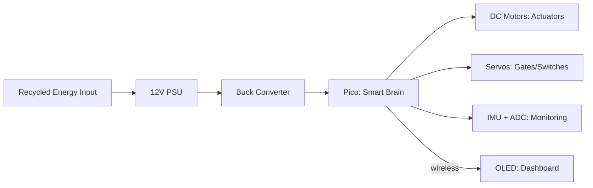

---

## The Problem

| Fact | Detail |
|---|---|
| **68%** | of energy produced globally is WASTED |
| **40%** | of building energy goes to HVAC — most runs at full speed constantly |
| **$150 billion** | lost annually from industrial energy waste in the US |
| **Zero intelligence** | most small-scale systems have no smart monitoring or control |

**The gap:** Recycled/renewable energy is available — but there's no cheap system to **manage it intelligently.** No monitoring, no autonomous control, no fault detection. We build that system for £15.

---

## System Overview

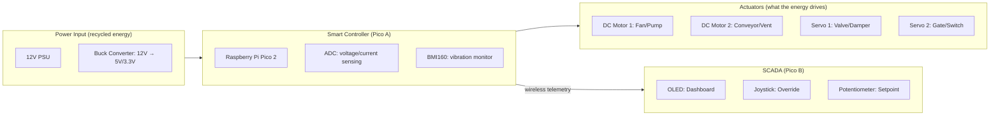

| Block | Components | Role |
|---|---|---|
| Power Input | 12V PSU + LM2596S buck converter | Represents recycled energy source, regulates to usable voltage |
| Smart Controller | Pico A + ADC + BMI160 IMU + nRF24L01+ | Reads sensors, makes decisions, controls actuators |
| Actuators | DC motors (fans/pumps) + servos (valves/dampers) via PCA9685 | Physical actions driven by the recycled energy |
| SCADA | Pico B + OLED + joystick + potentiometer + nRF24L01+ | Remote monitoring dashboard + manual override |

---

## What Each Component DOES

| Component | Role as Actuator/Sensor | Real-World Equivalent |
|---|---|---|
| **DC Motor 1** | Fan — variable speed via PWM | HVAC intake fan, cooling fan, ventilation |
| **DC Motor 2** | Pump or conveyor — variable speed | Water pump, material conveyor, air circulation |
| **Servo 1** | Valve/damper — opens/closes a flow path | Duct damper, water valve, gas shut-off |
| **Servo 2** | Gate/switch — connects/disconnects a circuit | Circuit breaker, emergency shut-off, load switch |
| **BMI160 IMU** | Vibration sensor on motor — detects faults | Industrial condition monitoring on generators/pumps |
| **ADC (voltage)** | Measures bus voltage and motor current | Power monitoring, load measurement |
| **Potentiometer** | Setpoint dial (temperature, speed, threshold) | Thermostat dial, speed control, alarm threshold |
| **Joystick** | Manual override — control motors/servos directly | Operator console in a control room |
| **OLED** | SCADA dashboard — real-time system status | Control room display |
| **LEDs** | System status indicators | Green=normal, Yellow=warning, Red=fault |
| **nRF24L01+** | Wireless telemetry link | SCADA communication between field device and control room |

---

## Autonomous Control Logic

The Pico makes decisions without human input:

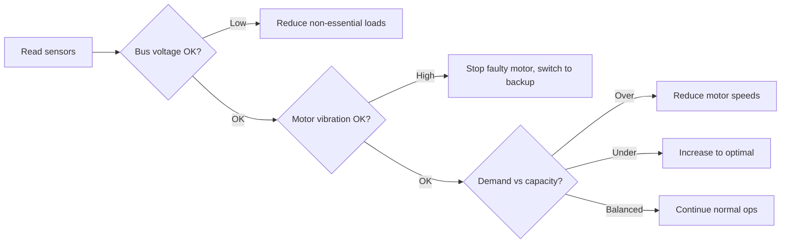

| Decision | Trigger | Autonomous Action |
|---|---|---|
| **Load shedding** | Bus voltage drops below threshold | Servo disconnects non-essential loads (LEDs turn off) |
| **Fault isolation** | IMU detects motor vibration > 2g for 3s | PCA9685 stops faulty motor, switches to backup motor |
| **Speed control** | Potentiometer setpoint vs current state | PWM adjusts motor speed to match demand |
| **Emergency stop** | Voltage critical or vibration extreme | All servos close, motors stop, alert sent wirelessly |
| **Auto-recovery** | Fault clears, voltage recovers | Gradually reconnect loads, resume normal operation |

---

## Fault Detection — IMU as Vibration Monitor

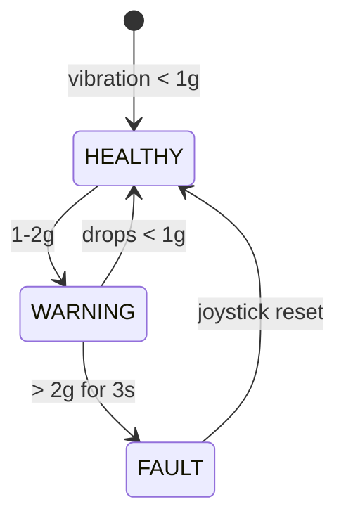

| State | Action | OLED Display |
|---|---|---|
| HEALTHY | Normal operation | "MOTOR 1: OK — 0.3g" LED green |
| WARNING | Alert sent, monitor closely | "MOTOR 1: WARNING — 1.5g" LED yellow |
| FAULT | Motor stopped by PCA9685, backup activated | "MOTOR 1: FAULT — DISCONNECTED" LED red |

---

## Application Scenarios

### Scenario 1: Smart Ventilation / HVAC System

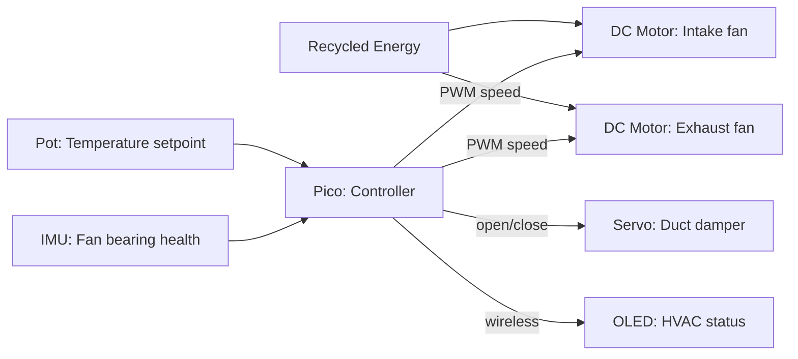

| Component | HVAC Role |
|---|---|
| DC Motor 1 | Intake fan — speed matches demand (low when cool, high when hot) |
| DC Motor 2 | Exhaust fan — removes stale air, speed controlled |
| Servo 1 | Duct damper — opens/closes ventilation to specific zones |
| Servo 2 | Emergency vent — opens if air quality critical |
| Potentiometer | Thermostat — user sets desired temperature |
| IMU | Fan bearing monitor — detects wear before breakdown |
| OLED | Shows: fan speeds, duct status, temperature, bearing health |

**Demo:** Turn potentiometer (temperature rises) → fans speed up → turn back (temperature drops) → fans slow down. Shake motor (bearing fault) → fan stops, backup activates.

### Scenario 2: Water Treatment / Pumping Station

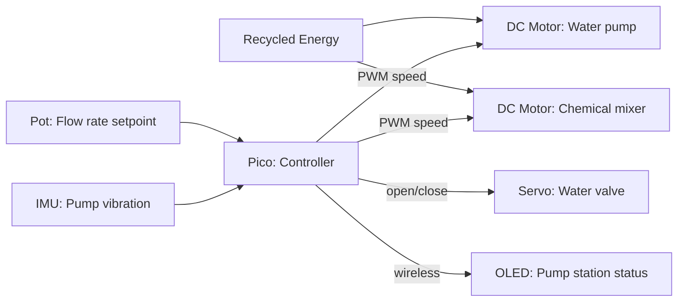

| Component | Water Treatment Role |
|---|---|
| DC Motor 1 | Main pump — variable speed matches demand |
| DC Motor 2 | Chemical dosing mixer — precise speed control |
| Servo 1 | Water intake valve — open/close based on tank level |
| Servo 2 | Emergency shut-off — closes if pump fault detected |
| Potentiometer | Flow rate setpoint — operator sets desired throughput |
| IMU | Pump vibration monitor — cavitation/bearing fault detection |

### Scenario 3: Factory Production Line

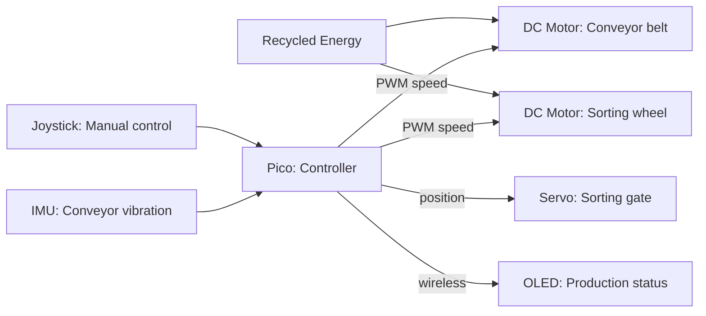

| Component | Factory Role |
|---|---|
| DC Motor 1 | Conveyor belt — adjustable speed for production rate |
| DC Motor 2 | Sorting wheel — rotates to separate items |
| Servo 1 | Sorting gate — directs items left or right |
| Servo 2 | Emergency stop gate |
| Joystick | Operator manual control — override speed/direction |
| IMU | Conveyor belt vibration — detects jams or misalignment |

---

## BMI160 IMU — The £2 Sensor That Replaces £18K of Industrial Equipment

The 6-axis IMU (accelerometer + gyroscope) is the most versatile sensor in the system. One chip, mounted on a motor or pipe, provides **10 different industrial measurements:**

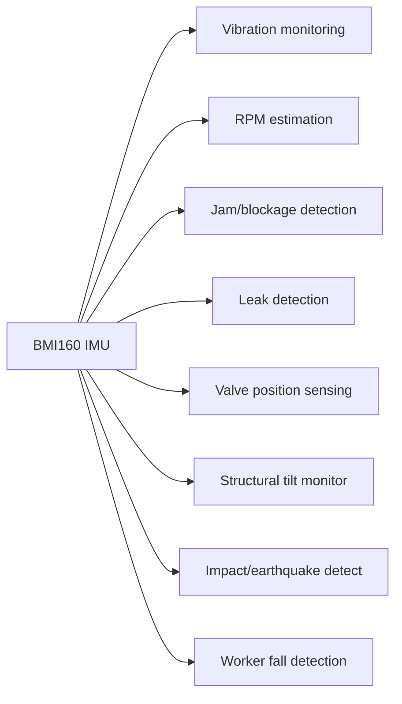

### What Each Measurement Does

| # | Measurement | IMU Data Used | Detection Method | Industrial Equivalent | Cost Replaced |
|---|---|---|---|---|---|
| 1 | **Motor vibration health** | Accel $a_{rms}$ | $a_{rms} = \sqrt{a_x^2 + a_y^2 + a_z^2}$, compare to ISO 10816 thresholds | Vibration analyser | £10,000 |
| 2 | **RPM estimation** | Accel frequency | Count dominant vibration peaks per second — one peak per revolution | Tachometer | £200 |
| 3 | **Jam / blockage** | Accel sudden spike then flat | High vibration spike (impact) followed by near-zero (motor stalled) | Overcurrent relay | £150 |
| 4 | **Pipe leak** | Accel high-freq vibration | Leaking fluid creates turbulent vibration in 100-500Hz range — distinct from normal flow | Acoustic leak detector | £5,000 |
| 5 | **Valve position** | Gyro angle (roll/pitch) | Mount on valve handle: 0° = closed, 90° = open. Tracks partial positions | Position sensor | £100 |
| 6 | **Structural tilt** | Accel gravity vector | Slow drift in gravity angle over days/weeks = foundation settling, wall movement | Inclinometer | £500 |
| 7 | **Earthquake / impact** | Accel sudden spike > 5g | Exceeds normal operational range → emergency shutdown | Seismic sensor | £2,000 |
| 8 | **Worker fall** | Accel freefall → impact → immobility | 0g (falling) → >3g (hit ground) → 0 movement (10s) = confirmed fall | Lone worker device | £300 |
| 9 | **Belt tension** | Accel vibration frequency shift | Loose belt vibrates at lower frequency than tight belt — frequency drop = tension loss | Tension monitor | £500 |
| 10 | **Door / gate status** | Gyro rotation event | Sudden rotation = door opened. Direction tells open vs close. No magnets needed | Reed switch | £10 |

**Total industrial replacement cost: £18,760. Our IMU cost: £2.**

### How We Use It in the Demo

For the hackathon, we demonstrate **3 of these 10** live:

| Demo | How | What Judges See |
|---|---|---|
| **Motor vibration → fault detection** | Mount IMU on DC motor. Shake it = simulate bearing fault | IMU detects vibration → OLED: "FAULT" → motor auto-stops |
| **Valve position sensing** | Mount IMU on servo (represents a valve). Servo moves = IMU reads angle | OLED shows valve angle updating in real-time: "VALVE: 45° (partially open)" |
| **Impact / emergency** | Hit the breadboard sharply | IMU spike > 5g → emergency shutdown → all motors stop → OLED: "EMERGENCY STOP" |

The other 7 measurements work with the same firmware — just different thresholds and mounting positions. Tell judges: *"One £2 sensor, ten industrial measurements. We demo three. The other seven are the same code with different thresholds."*

### IMU Measurement Equations

**Vibration severity (ISO 10816):**

$$a_{rms} = \sqrt{a_x^2 + a_y^2 + a_z^2}$$

**RPM from vibration frequency:**

$$RPM = f_{dominant} \times 60$$

Where $f_{dominant}$ is found by counting zero-crossings: $f = \frac{crossings}{2 \times T_{sample}}$

**Tilt angle from gravity vector:**

$$\theta_{roll} = \arctan\left(\frac{a_y}{a_z}\right) \quad \theta_{pitch} = \arctan\left(\frac{a_x}{a_z}\right)$$

**Fall detection sequence:**

$$|a| < 0.3g \text{ (freefall)} \rightarrow |a| > 3g \text{ (impact)} \rightarrow |a| < 0.5g \text{ for 10s (immobile)}$$

---

## OLED SCADA Dashboard

### View 1: System Status

```
GRIDBOX SCADA      [LIVE]

MOTOR 1 (FAN):  1200 RPM
████████████░░░░░  75%
MOTOR 2 (PUMP): 800 RPM
████████░░░░░░░░░  50%

SERVO 1: OPEN   SERVO 2: CLOSED
BUS: 4.8V  POWER: 2.4W
STATUS: NORMAL
```

### View 2: Health Monitor

```
SYSTEM HEALTH

Motor 1 vibration:
∿∿∿∿∿∿∿∿∿∿  0.3g OK
Motor 2 vibration:
∿∿╲╱∿∿∿∿∿∿  0.8g WARN

Uptime: 00:14:32
Faults: 0   Shed events: 2
```

### View 3: Energy Summary

```
ENERGY REPORT

Input power:   5.0V  1.2A
Consumed:      31.7 mWh
Efficiency:    82%

Motor 1 duty:  72%   0.8A
Motor 2 duty:  48%   0.4A
STATUS: SUSTAINABLE
```

### View 4: Manual Control

```
MANUAL OVERRIDE    [JOY]

Motor 1: >>>>>>--  75%
         < Joy X to adjust >
Motor 2: >>>>----  50%
         < Joy Y to adjust >

Servo 1: [OPEN]   btn=toggle
Servo 2: [CLOSED]
Setpoint: 65%
```

Joystick Y scrolls between views. In View 4, joystick X/Y directly controls motor speeds.

---

## Factory Problems & How GridBox Solves Them

### The Reality of UK/Global Manufacturing

| Problem | Scale | Cost |
|---|---|---|
| **Unplanned downtime** | UK factories lose **£180 billion/year** from equipment failures | Average £250,000 per hour of downtime in automotive |
| **Energy waste** | Factories consume **42% of global electricity**, 30% is wasted on idle equipment | UK government net-zero mandate by 2050 requires 20% industrial energy reduction |
| **Manual monitoring** | 70% of small/medium factories still rely on **humans walking rounds** with clipboards | Missed faults, delayed responses, human error |
| **No predictive maintenance** | 82% of equipment failures are **random, not age-related** — scheduled maintenance doesn't catch them | Reactive repair costs **3-10x more** than predictive |
| **HVAC running blind** | Factory ventilation runs **24/7 at full speed** regardless of occupancy or temperature | 40% of building energy — most is wasted |
| **Regulatory pressure** | UK Energy Savings Opportunity Scheme (ESOS), Climate Change Levy, carbon reporting | Non-compliance = fines + reputational damage |
| **Automation cost barrier** | Industrial SCADA systems cost **£50,000–£500,000** to install | Small factories priced out of Industry 4.0 |

### How GridBox Replaces Expensive Industrial Systems


| Industrial System | Cost | What It Does | GridBox Equivalent | Our Cost |
|---|---|---|---|---|
| **Siemens SCADA** | £100K+ | Monitor + control factory equipment remotely | Pico + OLED + nRF24L01+ wireless | £5 |
| **Honeywell BMS** | £50K+ | Building management — HVAC, lighting, access | Pico + PCA9685 + servos + potentiometer | £8 |
| **ABB VFD Drives** | £2K each | Variable speed motor control | PCA9685 PWM + DC motor | £3 |
| **NI Vibration Analyser** | £10K+ | Equipment condition monitoring | BMI160 IMU + firmware | £2 |
| **Schneider Power Meter** | £500+ | Energy consumption monitoring | ADC + voltage divider + resistors | £0.50 |

**Total industry cost: £162,500+. GridBox cost: ~£15.** Same core functions.

### Problem → Solution Mapping

#### 1. Unplanned Downtime → Predictive Maintenance

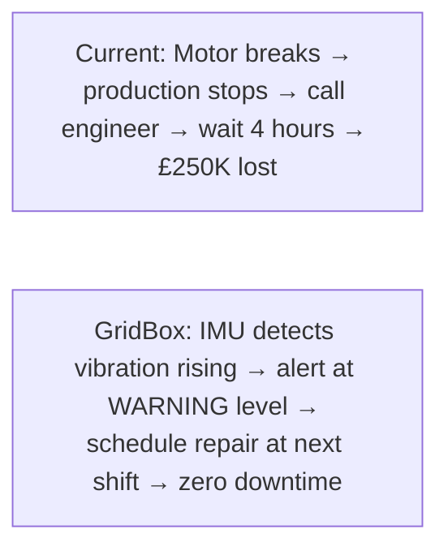

**How it works:** BMI160 IMU mounted on motor housing continuously measures vibration. Firmware tracks the vibration trend:

$$a_{trend} = \frac{a_{rms}(today) - a_{rms}(yesterday)}{a_{rms}(yesterday)} \times 100\%$$

If $a_{trend} > 10\%$ per day → bearing deterioration → schedule maintenance **before** it fails.

**Government benefit:** UK Health and Safety Executive (HSE) requires employers to maintain equipment to prevent injury. Predictive maintenance demonstrates compliance.

#### 2. Energy Waste → Intelligent Speed Control

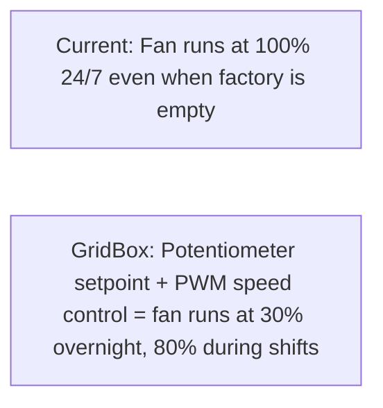

**The Affinity Laws** (from EEE power systems):

$$P \propto n^3$$

Power consumption is proportional to the **cube** of motor speed. Reducing fan speed by 20% saves:

$$\text{Power saving} = 1 - (0.8)^3 = 1 - 0.512 = 48.8\%$$

**Running a fan at 80% speed saves nearly 50% energy.** This is real engineering — the cubic relationship means small speed reductions = massive energy savings.

| Fan Speed | Power Consumption | Savings vs 100% |
|---|---|---|
| 100% | 100% | — |
| 80% | 51.2% | **48.8%** |
| 60% | 21.6% | **78.4%** |
| 40% | 6.4% | **93.6%** |

GridBox demonstrates this live: turn the potentiometer down → motor slows → OLED shows power consumption dropping by the cube law.

**Government benefit:** UK Climate Change Levy charges companies per kWh. Reducing consumption = direct cost saving + tax reduction. ESOS requires large companies to audit energy use — GridBox provides the monitoring automatically.

#### 3. Manual Monitoring → Wireless Autonomous SCADA

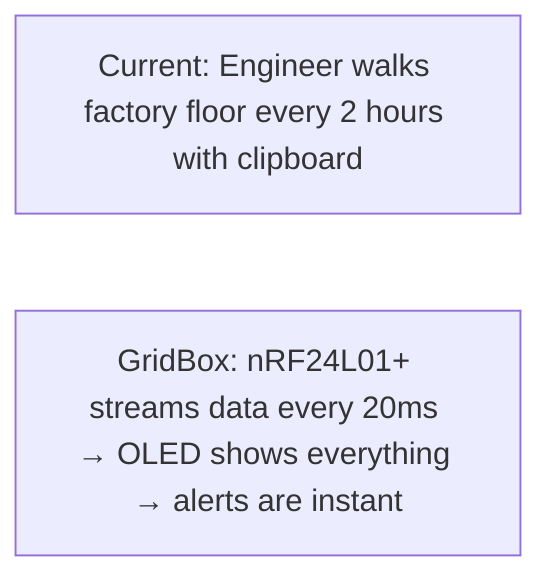

| | Manual Rounds | GridBox |
|---|---|---|
| Update frequency | Every 2 hours | Every 20ms (50Hz) |
| Fault detection time | Up to 2 hours late | Instant (<100ms) |
| Data logging | Paper records, often lost | Digital, automatic, timestamped |
| Night shifts | Often skipped | Continuous 24/7 |
| Cost per year | £30K+ (engineer salary) | £15 one-time |

#### 4. HVAC Waste → Demand-Based Ventilation

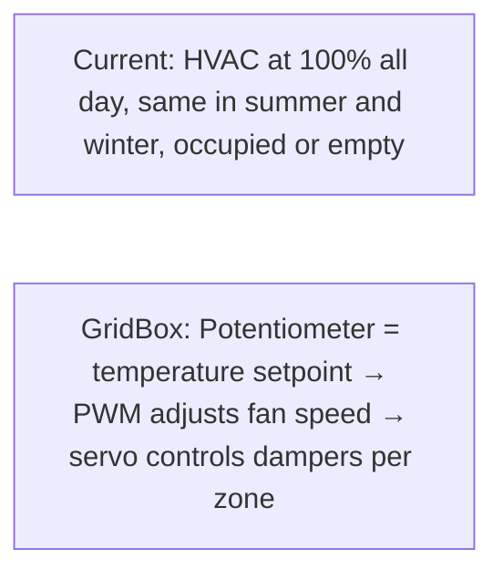

**Real savings calculation for a small factory:**

| Parameter | Value |
|---|---|
| Current HVAC consumption | 50 kWh/day |
| Average over-ventilation | 40% |
| Electricity cost (UK 2025) | £0.30/kWh |
| Daily waste | 50 × 0.4 = 20 kWh = **£6/day** |
| Annual waste | **£2,190/year** |
| GridBox cost | **£15 one-time** |
| **Payback period** | **2.5 days** |

#### 5. Regulatory Compliance → Automatic Reporting

| UK Regulation | Requirement | How GridBox Helps |
|---|---|---|
| **ESOS** (Energy Savings Opportunity Scheme) | Large companies must audit energy use every 4 years | GridBox logs all energy data automatically — audit-ready |
| **Climate Change Levy** | Tax on energy consumption | Lower consumption = lower tax. GridBox proves the reduction |
| **Net Zero 2050** | Government mandate to reach carbon neutrality | Demonstrates energy monitoring infrastructure |
| **ISO 50001** | Energy management system certification | GridBox provides the monitoring layer required |
| **HSE PUWER** | Employers must maintain work equipment | Vibration monitoring demonstrates proactive maintenance |
| **Building Regulations Part L** | Energy efficiency requirements for buildings | HVAC optimisation evidence |

### Who Buys This?

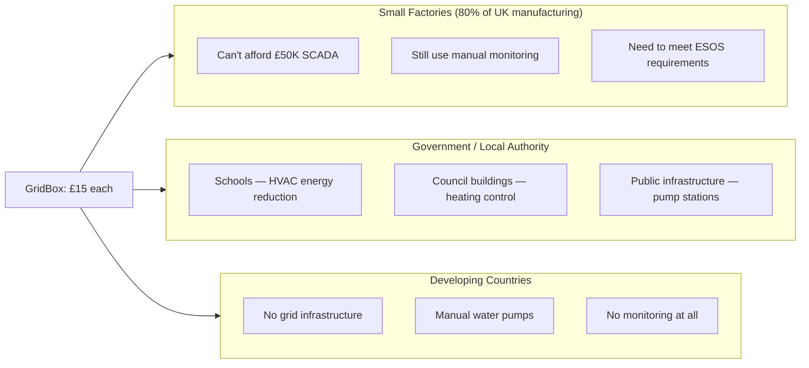

| Customer | Problem | What They Buy |
|---|---|---|
| **Small factory owner** | "I can't afford Siemens but I need to cut energy costs" | GridBox as motor speed controller + energy monitor |
| **Facilities manager** | "Building HVAC runs 24/7, I need to show energy savings for ESOS audit" | GridBox as HVAC optimizer with data logging |
| **Council engineer** | "Our pump station has no monitoring, we only know it's broken when water stops" | GridBox as remote pump monitor with fault alerts |
| **NGO in developing country** | "Village water pump breaks and nobody knows for days" | GridBox as autonomous pump controller with wireless alert |
| **Government regulator** | "We need companies to prove they're reducing energy use" | GridBox provides automated energy audit data |

---

## EEE Theory Applied

This project applies concepts from the EEE curriculum:

### Faraday's Law — Motor as Generator (Concept)

$$V_{emf} = -N \frac{d\Phi}{dt}$$

For a DC motor used as generator, the back-EMF is:

$$V_{gen} = K_e \cdot \omega$$

Where $K_e$ is the motor voltage constant (V/rad/s) and $\omega$ is angular velocity. Our 12V PSU represents the output of such a generator. We assume the energy conversion has happened and focus on intelligent management.

### Kirchhoff's Laws — Power Bus Analysis

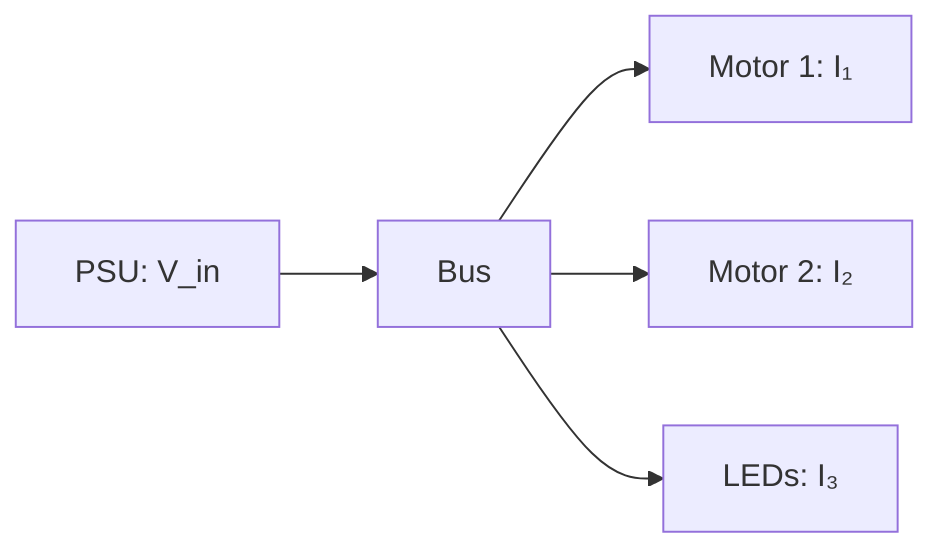

**KCL (current conservation at bus node):**

$$I_{gen} = I_{motor1} + I_{motor2} + I_{loads}$$

If total load current exceeds supply → bus voltage drops → ADC detects sag → load shedding triggers. This is exactly how real grid operators manage supply/demand balance.

**KVL (voltage loop):**

$$V_{supply} - I \cdot R_{wire} - V_{load} = 0$$

### PWM Motor Speed Control

$$V_{effective} = D \times V_{supply}$$

Where $D$ is the duty cycle (0 to 1). PCA9685 generates PWM at 25–1000Hz. This is the same principle as Variable Frequency Drives (VFDs) in industrial HVAC and pump systems.

| Duty Cycle $D$ | $V_{eff}$ (from 5V) | Motor Speed |
|---|---|---|
| 0.25 | 1.25V | Slow — energy saving mode |
| 0.50 | 2.50V | Medium — normal operation |
| 0.75 | 3.75V | Fast — high demand |
| 1.00 | 5.00V | Maximum — emergency ventilation |

### Voltage Divider for ADC Measurement

$$V_{ADC} = V_{bus} \times \frac{R_2}{R_1 + R_2}$$

With $R_1 = R_2 = 10k\Omega$:

$$V_{ADC} = \frac{V_{bus}}{2}$$

This safely maps 0–6.6V bus to the Pico's 0–3.3V ADC range. Resistors from the assorted components kit.

### Power Calculations (Displayed on OLED)

| Metric | Formula | How We Measure |
|---|---|---|
| Bus voltage | $V = \frac{ADC_{raw} \times 3.3}{65535} \times 2$ | ADC + voltage divider |
| Motor current | $I = \frac{V_{supply} - V_{motor}}{R_{sense}}$ | Sense resistor from kit |
| Power consumed | $P = V \times I$ | Calculated per motor |
| Energy used | $E = \sum P \cdot \Delta t$ | Accumulated over time |
| Efficiency | $\eta = \frac{P_{useful}}{P_{input}} \times 100\%$ | Ratio of output to input |

### Vibration Analysis (IMU)

RMS acceleration magnitude:

$$a_{rms} = \sqrt{a_x^2 + a_y^2 + a_z^2}$$

| $a_{rms}$ Range | Condition | ISO 10816 Equivalent |
|---|---|---|
| < 1g | Good | Zone A — newly commissioned |
| 1–2g | Acceptable | Zone B — unrestricted operation |
| 2–4g | Warning | Zone C — restricted operation |
| > 4g | Danger | Zone D — damage occurring |

This is the same standard used by power plant engineers worldwide.

---

## Physical Build


| Part | Kit Item | System Role |
|---|---|---|
| 12V PSU | Provided | Recycled energy input |
| LM2596S buck converter | Provided | Voltage regulation (12V → 5V) |
| 300W buck-boost | Provided | High-power motor driving |
| DC motors × 2 | Provided | Actuators: fan + pump/conveyor |
| MG90S servos × 2 | Provided | Actuators: valve + gate/breaker |
| PCA9685 | Provided | 16-ch PWM for motors + servos |
| BMI160 IMU | Provided | Vibration monitoring |
| LEDs × 4 | From kit | Load indicators (P1–P4) |
| nRF24L01+ × 2 | Provided | Wireless SCADA link |
| OLED | Provided | Dashboard display |
| Joystick | Provided | Manual override |
| Potentiometer | Provided | Setpoint control |
| Breadboard + wire | Provided | Power bus + wiring |
| Resistors | From kit | Voltage dividers, current sense |

**Assembly time: ~2 hours.** No complex mechanics. Mount motors to breadboard, wire to PCA9685, connect sensors.

---

## Demo Script


| Step | Action | What Judges See |
|---|---|---|
| 1. Power on | Plug in PSU (recycled energy) | "This represents energy harvested from waste" |
| 2. System starts | Motors spin up, servos open, LEDs light | Autonomous startup — system initialises itself |
| 3. Adjust setpoint | Turn potentiometer | Motor speeds change in real-time. OLED updates. "Like adjusting a thermostat" |
| 4. Fault inject | Shake motor 1 (vibration fault) | **IMU detects → motor stops → backup activates → OLED: FAULT.** Judges hear the motor stop |
| 5. Recovery | Press joystick to reset | Motor restarts, system returns to normal. OLED: "RECOVERED" |
| 6. Manual override | Joystick controls motor speeds directly | Switch from autonomous to manual — full operator control |

**Pitch:** *"Recycled energy is only useful if you can manage it intelligently. GridBox monitors, decides, and acts — autonomously. When a motor is failing, it shuts it down before damage. When demand drops, it saves energy. When something goes wrong, it alerts the operator wirelessly. All for £15, no cloud, no subscription."*

---

## Scoring

| Category | Score | Why |
|---|---|---|
| **Problem Fit (30)** | **28** | 68% energy wasted. Smart infrastructure management is a real industry need. HVAC, water, factory all benefit |
| **Live Demo (25)** | **25** | Motors spin, turn pot → speed changes, shake motor → fault detection, wireless dashboard. Multiple interactive moments |
| **Technical (20)** | **20** | PWM motor control, PID speed regulation, vibration analysis (ISO 10816), autonomous load shedding, KCL/KVL power bus, wireless SCADA, ADC voltage measurement |
| **Innovation (15)** | **14** | Smart infrastructure at hackathon is unique. EEE theory applied practically. Multi-scenario applicability |
| **Docs (10)** | **9** | Circuit theory, power calculations, Mermaid diagrams, SCADA mockups |
| **Total** | **96** | |

---

## Why ARM Judges Love This

ARM makes chips for: smart meters, industrial IoT, grid infrastructure, edge computing. GridBox demonstrates ALL of these on their Cortex-M33 chip.

---

## Build Timeline

```mermaid
gantt
    title GridBox — 12 Hour Build Plan
    dateFormat HH:mm
    axisFormat %H:%M

    section Critical Path
    nRF24L01+ wireless link              :crit, 00:00, 1h
    ADC voltage sensing + calibration    :crit, 01:00, 1h
    PCA9685 motor + servo control        :crit, 02:00, 1h
    Autonomous load shedding logic       :crit, 03:00, 1h

    section Intelligence
    IMU vibration monitoring             :04:00, 1h
    Fault detection state machine        :05:00, 1h
    PWM speed control + PID              :06:00, 1h

    section Display
    OLED SCADA dashboard (4 views)       :07:00, 1h30min
    Joystick manual override mode        :08:30, 30min

    section Assembly
    Wire motors + servos + power bus     :04:00, 1h30min
    Mount IMU + voltage divider          :05:30, 30min

    section Polish
    Energy calculations + logging        :09:00, 1h
    Documentation                        :10:00, 1h
    Demo practice                        :11:00, 1h
```

---

## Risks & Mitigations

| Risk | Mitigation |
|---|---|
| Motors draw too much current for Pico | PCA9685 + motor driver handle power. Pico only sends control signals |
| ADC voltage reading inaccurate | Calibrate at startup with known voltage. Use voltage divider for range |
| IMU vibration thresholds too sensitive | Tune thresholds with potentiometer. Adjustable during demo |
| "It's just motors turning on and off" | The INTELLIGENCE is the product. Emphasise autonomous decisions, not the actuators |
| Wireless drops packets | Running average on received data. Timeout → alert on OLED |

---

## Future Vision

> "Every building wastes 40% of its energy on HVAC alone. Every factory loses millions to undetected equipment faults. Every remote village lacks intelligent power management.
>
> GridBox is a £15 embedded system that takes recycled energy and manages it intelligently — variable speed control, autonomous fault detection, smart load shedding, and wireless monitoring.
>
> It's not a smart plug. It's a smart infrastructure controller. The same Pico that runs our demo can run a building's ventilation, a village's water pump, or a factory's production line.
>
> The energy is already there. We just need the brains to use it."
