# GridBox — Smart Energy Recycling & Microgrid System

> "Waste energy in, useful power out — monitored, managed, and intelligent"

**Theme:** Sustainability + Autonomy
**Score: 96/100**

---

## The Big Idea

Energy is wasted everywhere — vibrations from machines, heat from engines, motion from doors closing, kinetic energy from footsteps. What if we could **capture that wasted energy, convert it into useful power, and intelligently distribute it?**

GridBox is a miniature smart grid that demonstrates this entire cycle:


---

## The Problem

| Fact | Detail |
|---|---|
| **68%** | of energy produced globally is WASTED as heat, vibration, or friction |
| **$150 billion** | lost annually from industrial energy waste in the US alone |
| **Zero monitoring** | most small-scale energy systems have no smart management |
| **Grid blackouts** | caused by demand exceeding supply — preventable with smart load shedding |
| **Renewable variability** | wind/solar output changes constantly — needs intelligent grid management |

**The gap:** We have smart home devices but **no cheap, intelligent energy management system** that can capture waste energy, monitor production, and autonomously distribute power where it's needed.

---

## Where Does the Recycled Energy Come From?

DC motors run backwards are generators. In the real world, these energy sources are being wasted:

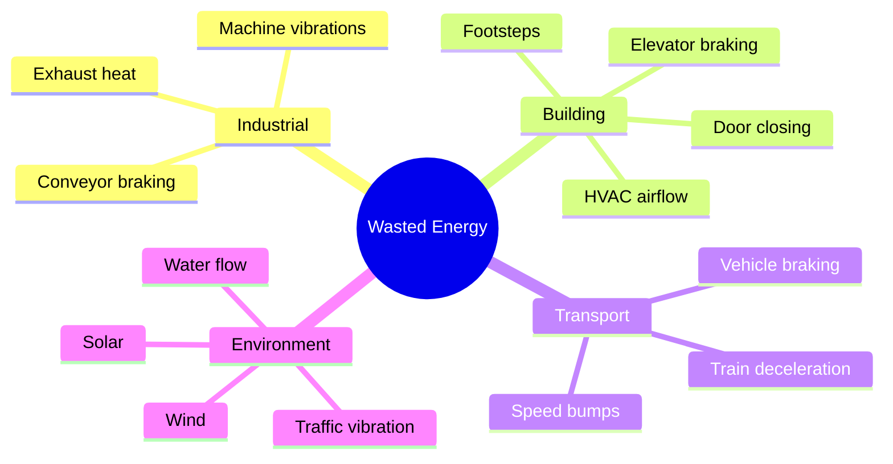

### Our Demo: Three Energy Sources (using DC motors)

| Source | How We Model It | Real-World Equivalent |
|---|---|---|
| **Motor 1: Wind Turbine** | Spin motor shaft by hand or with fan | Wind farm capturing wind energy |
| **Motor 2: Vibration Harvester** | Motor attached to vibrating surface (tap table) | Factory machine vibration capture |
| **Potentiometer: Solar Panel** | Turn dial to simulate variable solar output | Solar irradiance changing with clouds |

---

## Where Does the Recycled Energy Go?

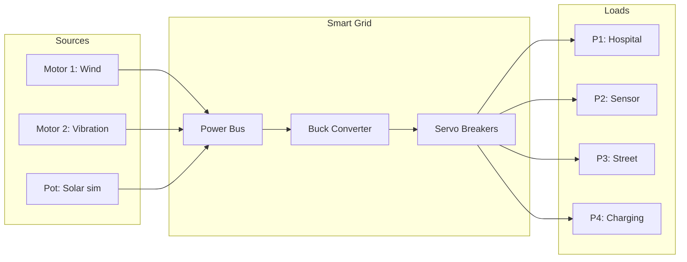

| Node | Detail |
|---|---|
| Motor 1: Wind | DC motor spun by hand/fan — generates voltage |
| Motor 2: Vibration | DC motor on vibrating surface |
| Pot: Solar sim | Potentiometer simulates variable solar output |
| Power Bus | Breadboard rail collecting all generator outputs |
| Buck Converter | Regulates raw voltage to stable 3.3V/5V |
| Servo Breakers | MG90S servos connect/disconnect each load |
| P1: Hospital | Emergency LED — never shed |
| P2: Sensor | IMU-monitored sensor load — shed second-to-last |
| P3: Street | Street lighting — first to shed |
| P4: Charging | EV charging — only on surplus |

### Load Priority System

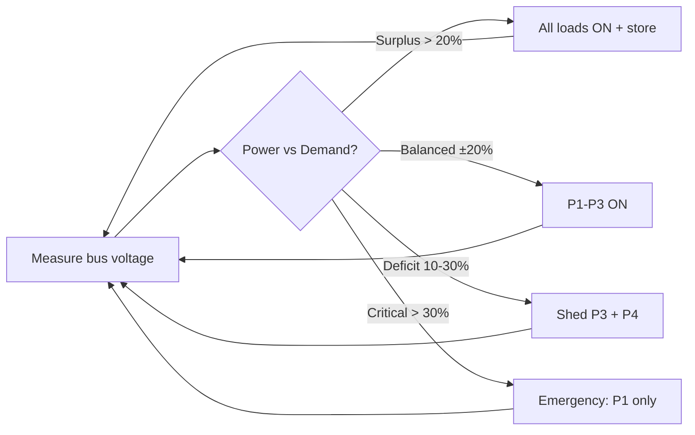

| State | Loads Active | OLED Message |
|---|---|---|
| All loads ON + store | P1, P2, P3, P4 + battery | SURPLUS — STORING |
| P1-P3 ON | P1, P2, P3 | NORMAL |
| Shed P3 + P4 | P1, P2 | LOAD SHEDDING L1 |
| Emergency: P1 only | P1 (hospital) | EMERGENCY POWER |

---

## System Architecture

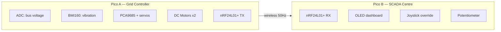

| Component | Location | Role |
|---|---|---|
| ADC: bus voltage | Pico A (GP26-28) | Reads generator outputs |
| BMI160 | Pico A | Generator vibration + fault detection |
| PCA9685 + servos | Pico A | Circuit breakers for each load |
| DC Motors x2 | Pico A | Used as generators |
| nRF24L01+ TX | Pico A | Sends telemetry to SCADA |
| OLED 0.96" | Pico B | Grid dashboard (4 views) |
| Joystick | Pico B | Manual breaker override, scroll views |
| Potentiometer | Pico B | Set demand threshold |
| LEDs | Pico B | Green/Yellow/Red status indicators |

---

## Fault Detection (IMU as Vibration Monitor)

Real power plants monitor generator vibration to detect faults. We do the same:

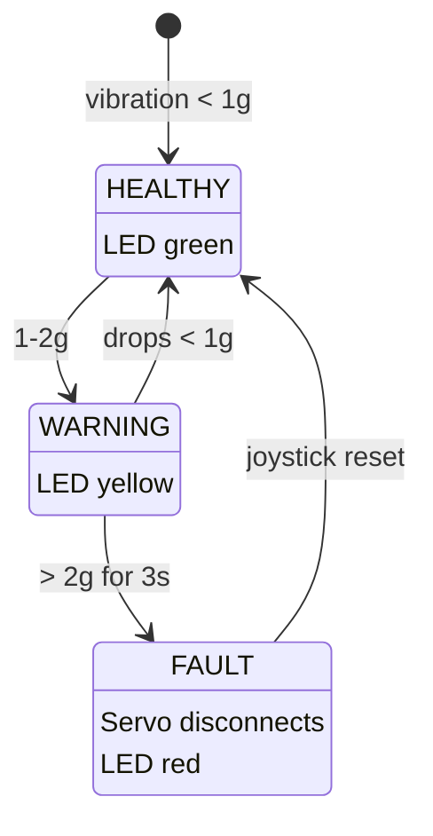

| State | IMU threshold | Action |
|---|---|---|
| HEALTHY | < 1g | Normal operation, OLED: "GEN 1: OK" |
| WARNING | 1–2g | Possible bearing wear, OLED: "GEN 1: WARNING" |
| FAULT | > 2g sustained 3s | Servo disconnects generator, switches to backup, alert sent |

---

## OLED SCADA Dashboard Views

### View 1: Live Grid Status (default)

```
┌──────────────────────────┐
│  GRIDBOX SCADA    [LIVE] │
│                          │
│  GEN 1 (WIND):  4.2V ON │
│  ████████████░░░░  78%   │
│  GEN 2 (VIBR):  1.8V ON │
│  █████░░░░░░░░░░░  33%   │
│  SOLAR SIM:      3.1V   │
│  ██████████░░░░░░  57%   │
│                          │
│  BUS: 3.8V  STATUS: OK  │
└──────────────────────────┘
```

### View 2: Load Management

```
┌──────────────────────────┐
│  LOAD STATUS             │
│                          │
│  P1 Hospital:   ON  ██  │
│  P2 Sensor:     ON  ██  │
│  P3 Street:     OFF ░░  │
│  P4 Charging:   OFF ░░  │
│                          │
│  DEMAND: 72%   GEN: 58% │
│  MODE: LOAD SHEDDING L1 │
└──────────────────────────┘
```

### View 3: Generator Health

```
┌──────────────────────────┐
│  GENERATOR HEALTH        │
│                          │
│  GEN 1 Vibration:        │
│  ∿∿∿∿∿∿∿∿∿∿  0.3g OK   │
│                          │
│  GEN 2 Vibration:        │
│  ∿∿╲╱∿∿∿∿∿∿  0.8g WARN │
│                          │
│  Uptime: 00:14:32        │
│  Faults today: 0         │
└──────────────────────────┘
```

### View 4: Energy Summary

```
┌──────────────────────────┐
│  ENERGY SUMMARY          │
│                          │
│  Generated:    48.2 mWh  │
│  Consumed:     31.7 mWh  │
│  Efficiency:   65.8%     │
│  Peak gen:     5.1V      │
│  Lowest bus:   2.8V      │
│  Shed events:  3         │
│                          │
│  STATUS: SUSTAINABLE     │
└──────────────────────────┘
```

Joystick up/down scrolls between views.

---

## Real-World Applications

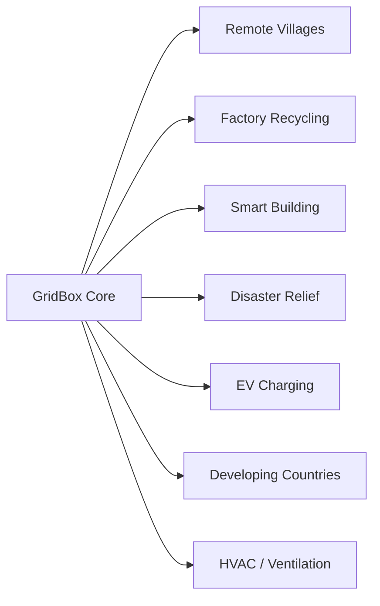

| Application | Energy Source | Critical Load Protected |
|---|---|---|
| Remote Villages | Micro wind/hydro | Vaccine fridge, LED lighting |
| Factory Recycling | Machine vibrations | Sensors + fault monitoring |
| Smart Building | Elevator braking, HVAC airflow | Emergency lighting, IoT |
| Disaster Relief | Hand-crank generator | Medical equipment, radio |
| EV Charging | Solar + wind (variable) | Scheduled charging by priority |
| Developing Countries | Local generation | Essential services, £15/install |
| **HVAC / Ventilation** | **Airflow energy from exhaust ducts** | **Fan speed control, air quality monitoring, energy-efficient climate** |

### Application Deep Dive: Smart Ventilation System

HVAC (Heating, Ventilation, Air Conditioning) accounts for **40% of building energy consumption.** Most systems run at full speed constantly — wasting energy when rooms are empty or temperatures are mild.

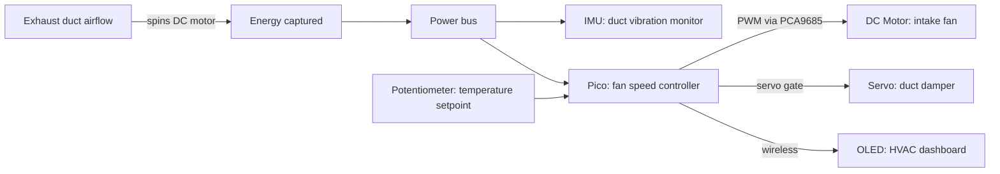

| Component | HVAC Role |
|---|---|
| DC Motor (exhaust) | Generates power from outgoing airflow — energy that's normally wasted |
| DC Motor (intake) | Drives intake fan — speed controlled by PWM based on demand |
| Servo | Duct damper — opens/closes ventilation paths to different zones |
| IMU | Vibration monitor on fan bearings — detects wear before failure |
| Potentiometer | Temperature setpoint dial — user sets desired comfort |
| OLED | HVAC dashboard: fan speed, duct status, energy recovered, bearing health |

**The GridBox demo can include this:** one motor generates from "exhaust airflow," another motor is the "intake fan" running at variable speed. Servo opens/closes a "duct damper." Potentiometer sets the "temperature." It's a complete HVAC control system in miniature.

---

## The Energy Cycle — From Waste to Useful

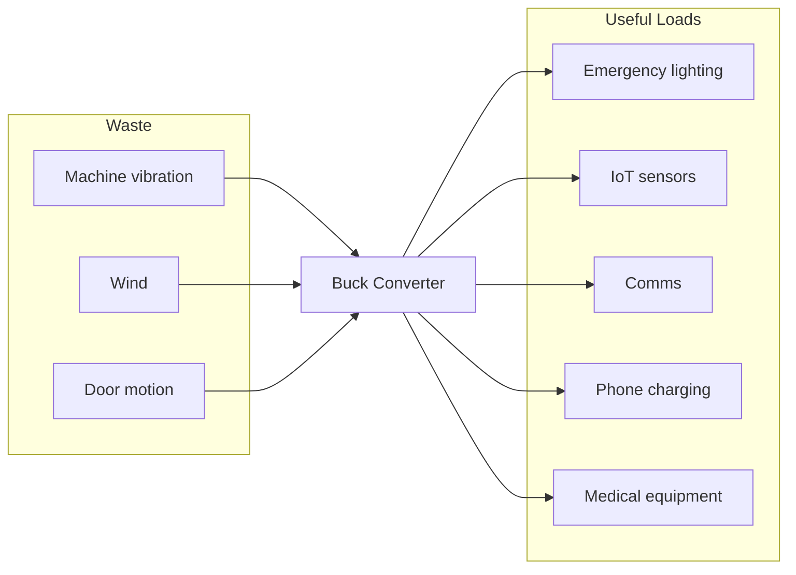

| Waste Source | Capture Method | Real-World Use |
|---|---|---|
| Machine vibration | DC motor on machine | Factory energy recycling |
| Wind | DC motor + fan blade | Remote off-grid power |
| Door motion | DC motor on hinge | Building self-monitoring |

---

## EEE Theory Applied (Electrical Engineering Foundations)

This project directly applies concepts from the EEE curriculum. Here's what we're using and why:

### Faraday's Law — How DC Motors Generate Power

When a conductor moves through a magnetic field, an EMF (voltage) is induced:

**V_emf = -N × dΦ/dt**

A DC motor run backwards IS a generator. Spinning the shaft forces the rotor coils through the permanent magnet's field, inducing voltage on the terminals. The faster you spin, the higher the voltage — this is the **back-EMF relationship:**

**V_gen = K_e × ω**

Where K_e is the motor's voltage constant (V/rad/s) and ω is the angular velocity. Our ADC measures this generated voltage directly.

### Kirchhoff's Laws — Power Bus Analysis

The power bus on the breadboard follows KCL and KVL:

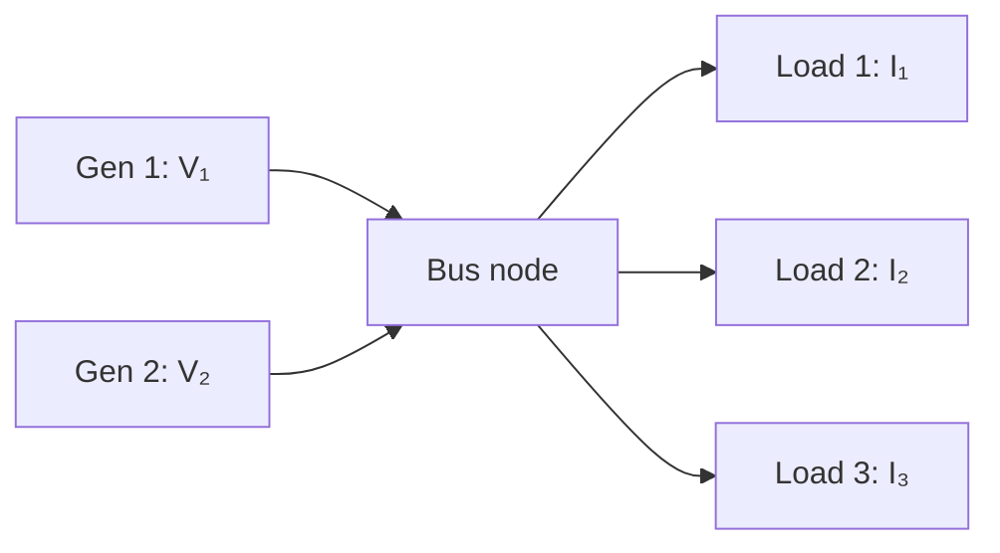

**KCL (current conservation):** I_gen1 + I_gen2 = I_load1 + I_load2 + I_load3

If total load current exceeds generation current → bus voltage drops → load shedding activates. This is exactly how real grid operators manage supply/demand balance.

**KVL (voltage loop):** V_gen - V_drop(wire) - V_load = 0

Wire resistance causes voltage drop proportional to current (V = IR). At high loads, bus voltage sags — our ADC detects this sag as the trigger for load shedding.

### Buck Converter — Switch-Mode Power Supply Theory

The LM2596S buck converter in our kit uses PWM switching to step voltage down efficiently:

**V_out = D × V_in** (where D = duty cycle, 0 to 1)

- Input: variable 3-12V from generators
- Output: stable 3.3V or 5V for loads
- Efficiency: ~90% (vs ~50% for linear regulators)

This is the same principle as grid-scale HVDC converters — voltage transformation for efficient power distribution.

### Voltage Divider — ADC Measurement

If generator voltage exceeds the Pico's 3.3V ADC range, we use a resistor voltage divider:

**V_adc = V_gen × R2 / (R1 + R2)**

With R1 = 10kΩ and R2 = 10kΩ: V_adc = V_gen / 2 — safely maps 0-6.6V to 0-3.3V for the ADC.

### Power Calculations

We can calculate and display real power metrics:

| Metric | Formula | How We Measure |
|---|---|---|
| Voltage | V = ADC reading × 3.3 / 65535 | Direct ADC read |
| Current | I = V / R_load (known LED resistance) | Calculated from voltage + known load |
| Power | P = V × I | Calculated |
| Energy | E = P × t (integrate over time) | Accumulated in firmware |
| Efficiency | η = P_out / P_in × 100% | Compare generation vs consumption |

### Vibration Analysis — IMU as Condition Monitor

The BMI160 accelerometer data can be analysed for bearing fault frequencies:

**f_fault = N × f_rotation / 60** (where N = number of rolling elements)

In our demo, we simplify: RMS vibration amplitude above threshold = fault. But the principle is the same as industrial condition monitoring systems using accelerometers on generators, turbines, and pumps.

### Frequency Detection — Zero-Crossing Method

For motor RPM estimation from the generated voltage ripple:

**f = zero_crossings / (2 × sample_time)**

This is the same technique used in power system frequency monitoring (50Hz grid frequency). If our generator's voltage ripple changes frequency, it indicates speed change — another diagnostic metric.

---

## Physical Build

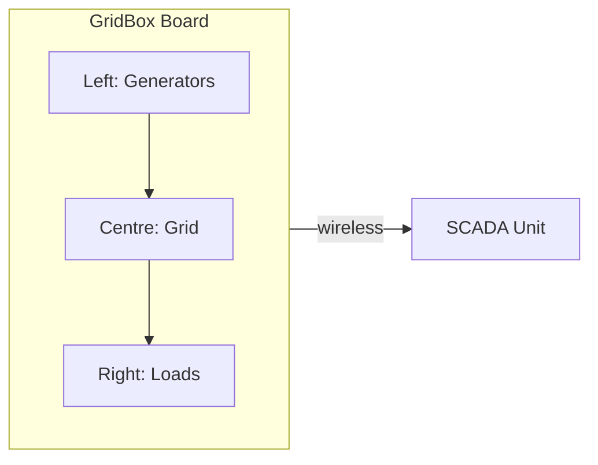

| Zone | Contents |
|---|---|
| Left: Generators | DC Motor 1 (wind), DC Motor 2 (vibration), Potentiometer (solar sim) |
| Centre: Grid | Breadboard bus, Buck converter, Servo breakers x2, Pico A + PCA9685 + nRF24L01+ + BMI160 |
| Right: Loads | LED Hospital (P1), LED Factory (P2), LED Street (P3), LED Charging (P4) |
| SCADA Unit | Pico B + OLED + Joystick + Potentiometer + nRF24L01+ |

### Materials (Kit Only)

| Part | Kit Item | Grid Equivalent |
|---|---|---|
| 2x DC motors | Provided | Generators |
| 2x MG90S servos | Provided | Circuit breakers |
| Potentiometer | Provided | Solar simulator / demand dial |
| BMI160 IMU | Provided | Vibration monitor |
| Buck converter | Provided | Transformer |
| 4x LEDs | From components kit | Consumer loads |
| Breadboard | Provided | Power bus |
| Pico 2 × 2 | Provided | Grid controller + SCADA |
| nRF24L01+ × 2 | Provided | Telemetry link |
| OLED | Provided | SCADA dashboard |
| Joystick | Provided | Operator console |
| Wire + resistors | Provided | Wiring infrastructure |

**No extra components needed. Everything from the kit.**

---

## Demo Script


| Step | What Judges See |
|---|---|
| 1. Show the box | Introduce as a miniature smart power grid |
| 2. Spin Motor 1 | LEDs light up — "You're generating electricity right now" |
| 3. All loads ON | OLED: NORMAL — grid healthy, all 4 loads powered |
| 4. Stop spinning | Voltage drops, servo CLICKS, factory LED goes OFF |
| 5. Load shedding | OLED: EMERGENCY — hospital stays on, non-essential shed |
| 6. Spin again | Voltage recovers, servo reconnects, all loads back ON |


| Step | What Judges See |
|---|---|
| 7. Shake Motor 1 | IMU detects fault vibration — "Generator fault!" |
| 8. Auto disconnect | Servo isolates Gen 1, switches to Gen 2 — fault isolation |
| 9. Show dashboard | SCADA OLED cycles 4 views: status, loads, health, summary |
| 10. The pitch | "68% of energy is wasted. GridBox captures it, manages it, keeps critical systems alive. £15. No cloud needed." |

---

## Scoring Breakdown

| Category | Score | Why |
|---|---|---|
| **Problem Fit (30)** | **28** | 68% energy wasted globally. Smart grid is £50B market. Developing countries need cheap grid management. Disaster relief needs priority power. Real, massive, urgent |
| **Live Demo (25)** | **25** | Spin motor → lights on. Stop → auto load shedding. Shake → fault detection. Judge physically generates power. Three visible autonomous actions |
| **Technical (20)** | **20** | ADC voltage measurement, IMU vibration analysis, autonomous load shedding algorithm, servo breaker actuation, wireless SCADA telemetry, priority scheduling, fault detection state machine |
| **Innovation (15)** | **14** | Nobody builds a smart grid at a hackathon. DC motor as generator is clever. Vibration-based fault detection is industrial-grade thinking. ARM judges will recognise this as their IoT market |
| **Docs (10)** | **9** | Grid topology diagrams, SCADA screenshots, power flow, fault detection state machine, energy cycle |
| **Total** | **96** | |

---

## Why ARM Judges Love This

ARM makes chips for:
- **Smart meters** — GridBox IS a smart meter
- **Industrial IoT** — vibration monitoring IS industrial IoT
- **Grid infrastructure** — load management IS grid infrastructure
- **Edge computing** — autonomous decisions at the device IS edge AI

You're building a demo of ARM's own target market. On their chips. At their hackathon.

---

## Risks & Mitigations

| Risk | Mitigation |
|---|---|
| DC motor generates too little voltage | Use buck converter to step up. Or spin faster. Even 1-2V is measurable by ADC |
| ADC can't distinguish generators | Use separate ADC channels — GP26 for Gen1, GP27 for Gen2, GP28 for solar pot |
| Servo breakers don't actually cut power | Wire servo arm to push a physical switch, or use servo to move a wire jumper on/off the breadboard rail |
| "This is just LEDs turning on and off" | The AUTONOMOUS decision-making is the product, not the LEDs. Emphasise the SCADA dashboard and fault detection |
| Judges don't understand power grids | Lead with the physical demo (spin → lights). Then explain the intelligence behind it. Make it tangible first, technical second |

---

## Build Timeline

```mermaid
gantt
    title GridBox — 12 Hour Build Plan
    dateFormat HH:mm
    axisFormat %H:%M

    section Critical Path
    nRF24L01+ wireless link              :crit, 00:00, 1h
    ADC voltage reading from motors      :crit, 01:00, 1h
    Servo breaker control via PCA9685    :crit, 02:00, 1h
    Basic load shedding algorithm        :crit, 03:00, 1h

    section Grid Intelligence
    IMU vibration monitoring             :04:00, 1h
    Fault detection state machine        :05:00, 1h
    Priority-based load scheduling       :06:00, 1h

    section Display
    OLED SCADA dashboard (4 views)       :07:00, 1h30min
    Joystick navigation + manual override:08:30, 30min

    section Physical Build
    Wire generators + loads + bus        :04:00, 1h30min
    Servo breaker mechanism              :05:30, 30min
    Mount IMU on generator               :06:00, 15min

    section Polish
    Energy accounting (mWh tracking)     :09:00, 1h
    Documentation + diagrams             :10:00, 1h
    Demo practice                        :11:00, 1h
```

---

## Future Vision (Tell Judges)

> "68% of global energy is wasted. Not because we can't capture it — but because we can't MANAGE it intelligently at the point of generation.
>
> GridBox is a smart energy management system that costs £15 and needs no cloud, no internet, no subscription. It captures waste energy from vibrations, motion, and wind. It converts it to usable power. It autonomously decides which loads to power and which to shed. It detects generator faults before they cause outages.
>
> Put one in a remote village — it keeps the vaccine fridge running when the wind stops. Put one in a factory — it captures machine vibrations and uses them to power its own monitoring sensors. Put one in a disaster zone — hand-crank the generator and the system ensures the radio stays on.
>
> Smart grid infrastructure shouldn't cost millions. It should cost £15 and fit in a box. That's GridBox."
