# GridBox — Smart Energy Recycling & Microgrid System

> "Waste energy in, useful power out — monitored, managed, and intelligent"

**Theme:** Sustainability + Autonomy
**Score: 96/100**

---

## The Big Idea

Energy is wasted everywhere — vibrations from machines, heat from engines, motion from doors closing, kinetic energy from footsteps. What if we could **capture that wasted energy, convert it into useful power, and intelligently distribute it?**

GridBox is a miniature smart grid that demonstrates this entire cycle:

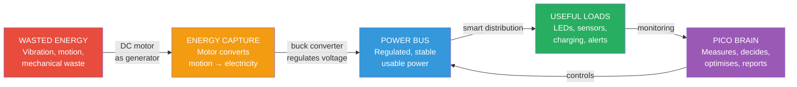

---

## The Problem

| Fact | Detail |
|---|---|
| **68%** | of energy produced globally is WASTED as heat, vibration, or friction |
| **$150 billion** | lost annually from industrial energy waste in the US alone |
| **Zero monitoring** | most small-scale energy systems have no smart management |
| **Grid blackouts** | caused by demand exceeding supply — preventable with smart load shedding |
| **Renewable variability** | wind/solar output changes constantly — needs intelligent grid management |

**The gap:** We have smart home devices but **no cheap, intelligent energy management system** that can capture waste energy, monitor production, and autonomously distribute power where it's needed.

---

## Where Does the Recycled Energy Come From?

DC motors run backwards are generators. In the real world, these energy sources are being wasted:

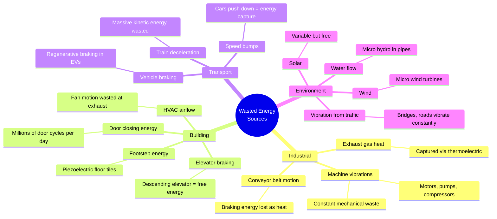

### Our Demo: Three Energy Sources (using DC motors)

| Source | How We Model It | Real-World Equivalent |
|---|---|---|
| **Motor 1: Wind Turbine** | Spin motor shaft by hand or with fan | Wind farm capturing wind energy |
| **Motor 2: Vibration Harvester** | Motor attached to vibrating surface (tap table) | Factory machine vibration capture |
| **Potentiometer: Solar Panel** | Turn dial to simulate variable solar output | Solar irradiance changing with clouds |

---

## Where Does the Recycled Energy Go?

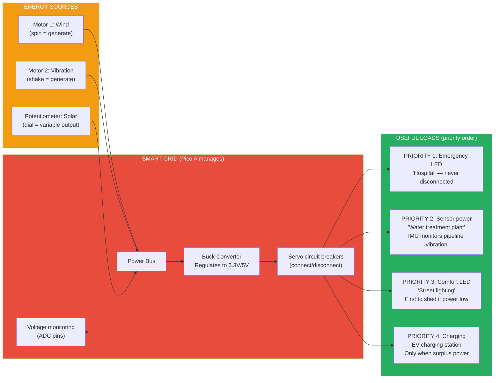

### Load Priority System

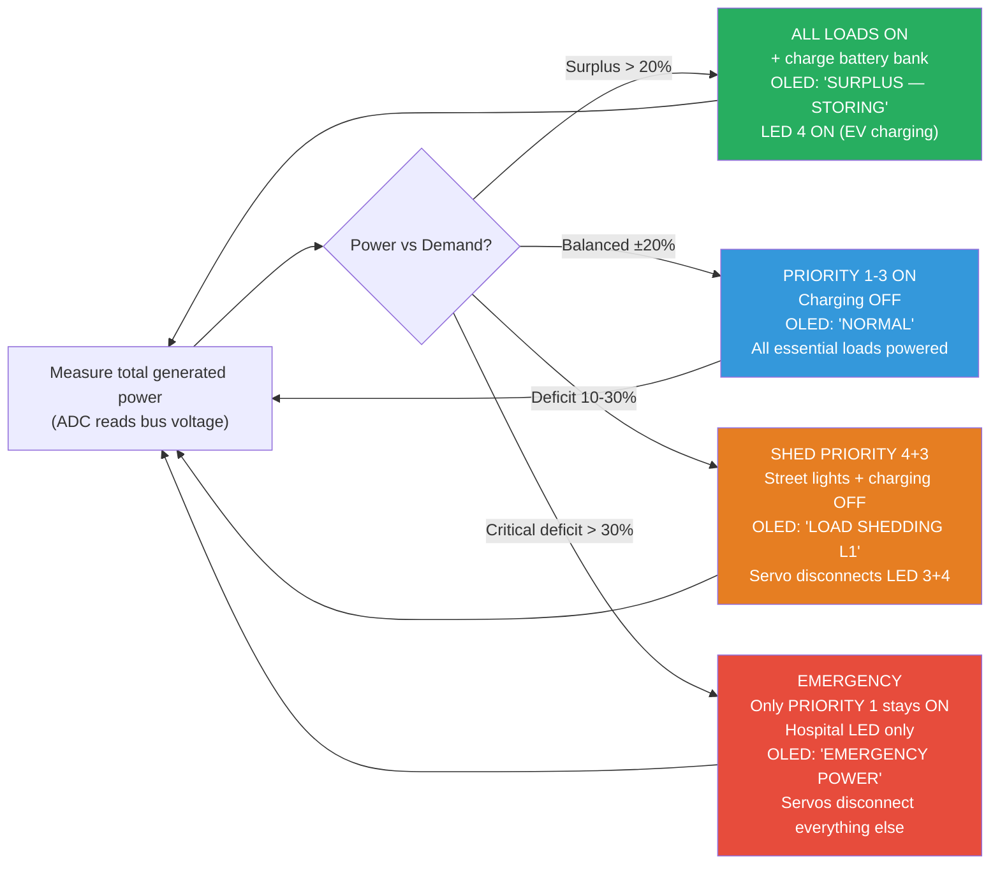

---

## System Architecture

```mermaid
graph LR
    subgraph PICO_A["PICO A — Grid Controller (the brain)"]
        ADC_V["ADC: Bus voltage measurement<br/>Reads power from each generator"]
        ADC_POT["ADC: Potentiometer<br/>Solar simulation / load demand"]
        IMU_A["BMI160 IMU<br/>Generator vibration monitoring<br/>Fault detection"]
        PCA_A["PCA9685 + 2x Servo<br/>Circuit breakers<br/>Connect/disconnect loads"]
        MOTOR_A["DC Motors × 2<br/>Used as GENERATORS<br/>Spin = generate power"]
        NRF_A["nRF24L01+ TX<br/>Sends telemetry to control centre"]
        LED_LOADS["LEDs × 4<br/>Represent consumer loads<br/>(house, factory, street, charging)"]
    end

    subgraph PICO_B["PICO B — SCADA Control Centre"]
        OLED_B["OLED 0.96&quot;<br/>Grid dashboard<br/>Voltage, loads, status, history"]
        JOY_B["Joystick<br/>Manual breaker override<br/>Scroll through views"]
        POT_B["Potentiometer<br/>Set demand threshold<br/>Adjust load shedding sensitivity"]
        NRF_B["nRF24L01+ RX<br/>Receives grid telemetry"]
        LED_B["LEDs<br/>Grid status indicators<br/>Green=normal Yellow=warning Red=emergency"]
    end

    PICO_A -->|"wireless 50Hz<br/>telemetry stream"| PICO_B

    style PICO_A fill:#e74c3c,color:#fff,stroke-width:2px
    style PICO_B fill:#3498db,color:#fff,stroke-width:2px
```

---

## Fault Detection (IMU as Vibration Monitor)

Real power plants monitor generator vibration to detect faults. We do the same:

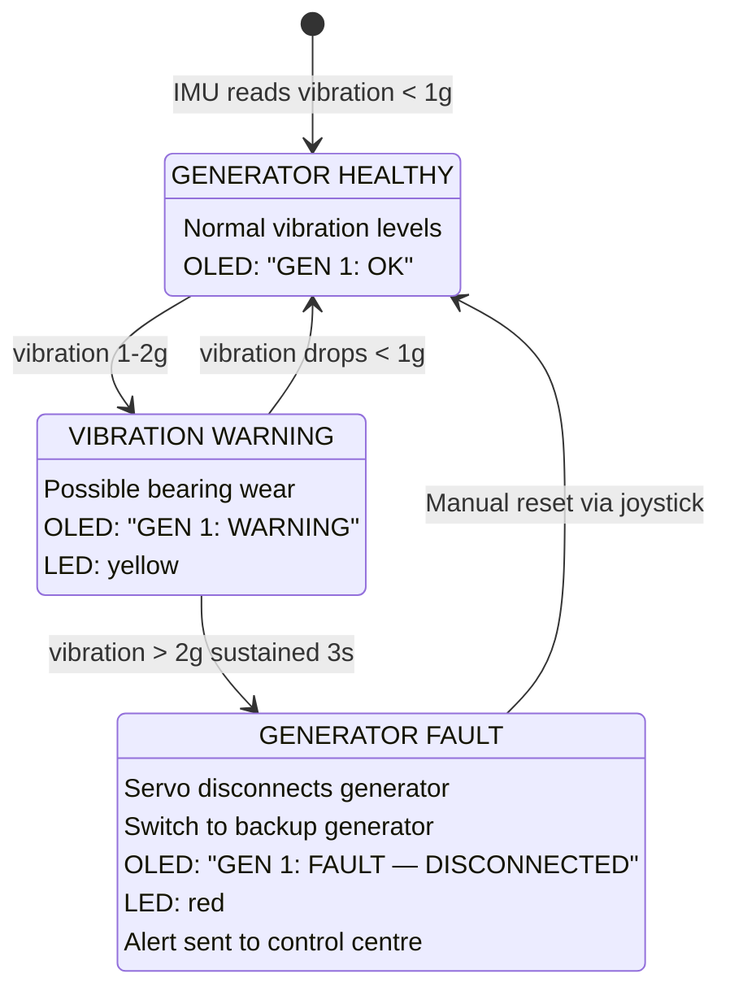

---

## OLED SCADA Dashboard Views

### View 1: Live Grid Status (default)

```
┌──────────────────────────┐
│  GRIDBOX SCADA    [LIVE] │
│                          │
│  GEN 1 (WIND):  4.2V ON │
│  ████████████░░░░  78%   │
│  GEN 2 (VIBR):  1.8V ON │
│  █████░░░░░░░░░░░  33%   │
│  SOLAR SIM:      3.1V   │
│  ██████████░░░░░░  57%   │
│                          │
│  BUS: 3.8V  STATUS: OK  │
└──────────────────────────┘
```

### View 2: Load Management

```
┌──────────────────────────┐
│  LOAD STATUS             │
│                          │
│  P1 Hospital:   ON  ██  │
│  P2 Sensor:     ON  ██  │
│  P3 Street:     OFF ░░  │
│  P4 Charging:   OFF ░░  │
│                          │
│  DEMAND: 72%   GEN: 58% │
│  MODE: LOAD SHEDDING L1 │
└──────────────────────────┘
```

### View 3: Generator Health

```
┌──────────────────────────┐
│  GENERATOR HEALTH        │
│                          │
│  GEN 1 Vibration:        │
│  ∿∿∿∿∿∿∿∿∿∿  0.3g OK   │
│                          │
│  GEN 2 Vibration:        │
│  ∿∿╲╱∿∿∿∿∿∿  0.8g WARN │
│                          │
│  Uptime: 00:14:32        │
│  Faults today: 0         │
└──────────────────────────┘
```

### View 4: Energy Summary

```
┌──────────────────────────┐
│  ENERGY SUMMARY          │
│                          │
│  Generated:    48.2 mWh  │
│  Consumed:     31.7 mWh  │
│  Efficiency:   65.8%     │
│  Peak gen:     5.1V      │
│  Lowest bus:   2.8V      │
│  Shed events:  3         │
│                          │
│  STATUS: SUSTAINABLE     │
└──────────────────────────┘
```

Joystick up/down scrolls between views.

---

## Real-World Applications

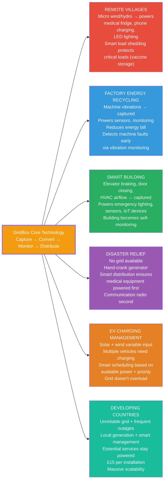

---

## The Energy Cycle — From Waste to Useful

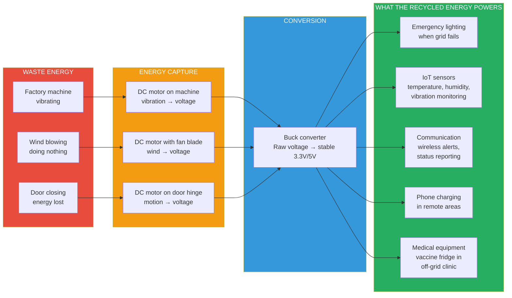

---

## Physical Build

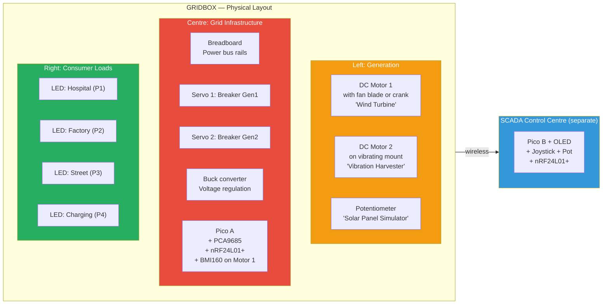

### Materials (Kit Only)

| Part | Kit Item | Grid Equivalent |
|---|---|---|
| 2x DC motors | Provided | Generators |
| 2x MG90S servos | Provided | Circuit breakers |
| Potentiometer | Provided | Solar simulator / demand dial |
| BMI160 IMU | Provided | Vibration monitor |
| Buck converter | Provided | Transformer |
| 4x LEDs | From components kit | Consumer loads |
| Breadboard | Provided | Power bus |
| Pico 2 × 2 | Provided | Grid controller + SCADA |
| nRF24L01+ × 2 | Provided | Telemetry link |
| OLED | Provided | SCADA dashboard |
| Joystick | Provided | Operator console |
| Wire + resistors | Provided | Wiring infrastructure |

**No extra components needed. Everything from the kit.**

---

## Demo Script

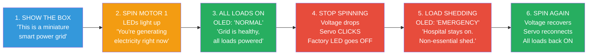

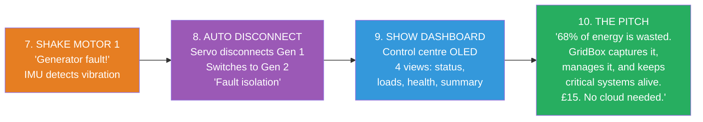

---

## Scoring Breakdown

| Category | Score | Why |
|---|---|---|
| **Problem Fit (30)** | **28** | 68% energy wasted globally. Smart grid is £50B market. Developing countries need cheap grid management. Disaster relief needs priority power. Real, massive, urgent |
| **Live Demo (25)** | **25** | Spin motor → lights on. Stop → auto load shedding. Shake → fault detection. Judge physically generates power. Three visible autonomous actions |
| **Technical (20)** | **20** | ADC voltage measurement, IMU vibration analysis, autonomous load shedding algorithm, servo breaker actuation, wireless SCADA telemetry, priority scheduling, fault detection state machine |
| **Innovation (15)** | **14** | Nobody builds a smart grid at a hackathon. DC motor as generator is clever. Vibration-based fault detection is industrial-grade thinking. ARM judges will recognise this as their IoT market |
| **Docs (10)** | **9** | Grid topology diagrams, SCADA screenshots, power flow, fault detection state machine, energy cycle |
| **Total** | **96** | |

---

## Why ARM Judges Love This

ARM makes chips for:
- **Smart meters** — GridBox IS a smart meter
- **Industrial IoT** — vibration monitoring IS industrial IoT
- **Grid infrastructure** — load management IS grid infrastructure
- **Edge computing** — autonomous decisions at the device IS edge AI

You're building a demo of ARM's own target market. On their chips. At their hackathon.

---

## Risks & Mitigations

| Risk | Mitigation |
|---|---|
| DC motor generates too little voltage | Use buck converter to step up. Or spin faster. Even 1-2V is measurable by ADC |
| ADC can't distinguish generators | Use separate ADC channels — GP26 for Gen1, GP27 for Gen2, GP28 for solar pot |
| Servo breakers don't actually cut power | Wire servo arm to push a physical switch, or use servo to move a wire jumper on/off the breadboard rail |
| "This is just LEDs turning on and off" | The AUTONOMOUS decision-making is the product, not the LEDs. Emphasise the SCADA dashboard and fault detection |
| Judges don't understand power grids | Lead with the physical demo (spin → lights). Then explain the intelligence behind it. Make it tangible first, technical second |

---

## Build Timeline


---

## Future Vision (Tell Judges)

> "68% of global energy is wasted. Not because we can't capture it — but because we can't MANAGE it intelligently at the point of generation.
>
> GridBox is a smart energy management system that costs £15 and needs no cloud, no internet, no subscription. It captures waste energy from vibrations, motion, and wind. It converts it to usable power. It autonomously decides which loads to power and which to shed. It detects generator faults before they cause outages.
>
> Put one in a remote village — it keeps the vaccine fridge running when the wind stops. Put one in a factory — it captures machine vibrations and uses them to power its own monitoring sensors. Put one in a disaster zone — hand-crank the generator and the system ensures the radio stays on.
>
> Smart grid infrastructure shouldn't cost millions. It should cost £15 and fit in a box. That's GridBox."
