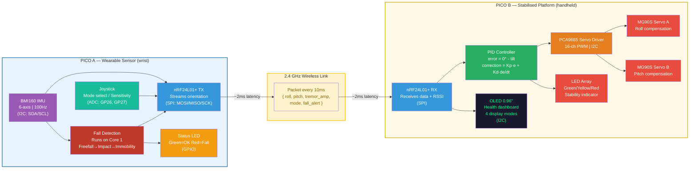
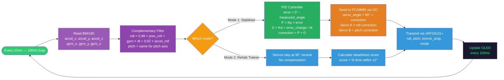
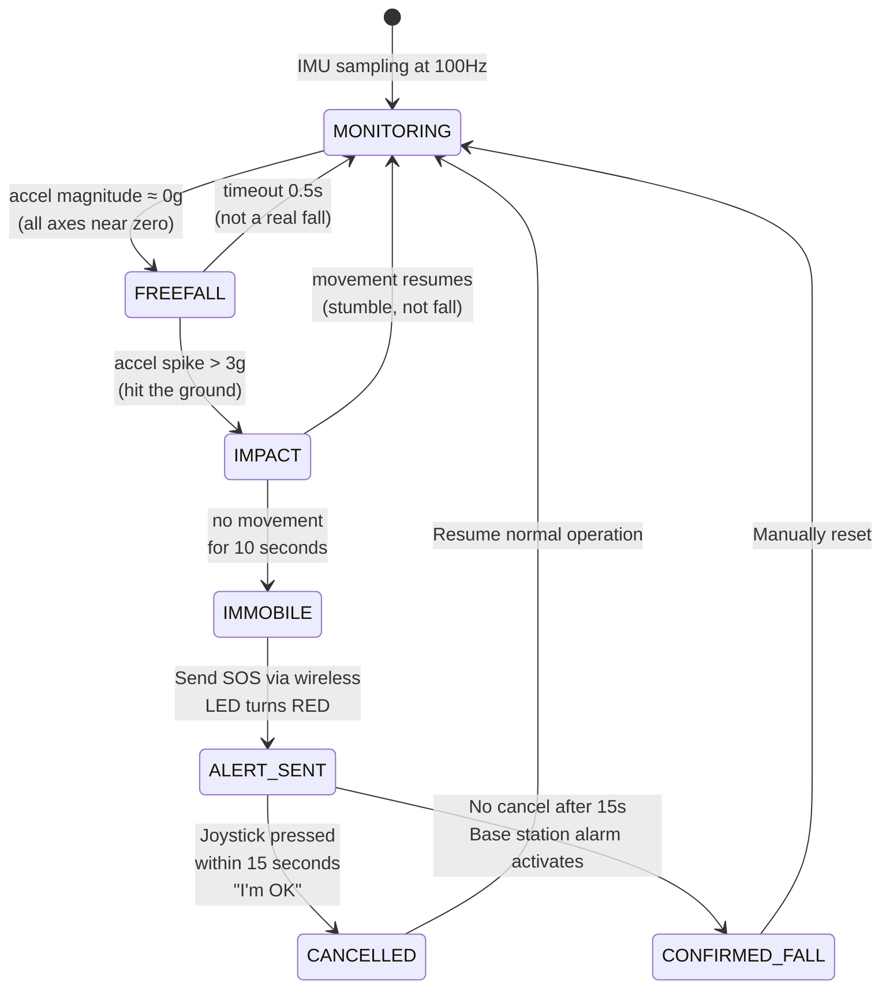
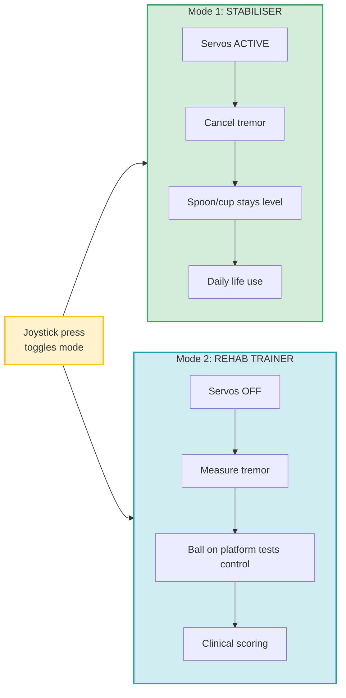
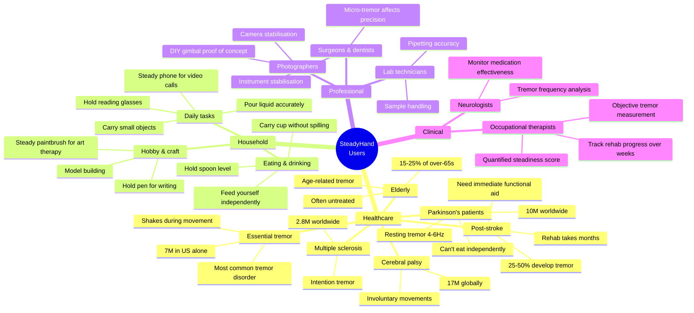
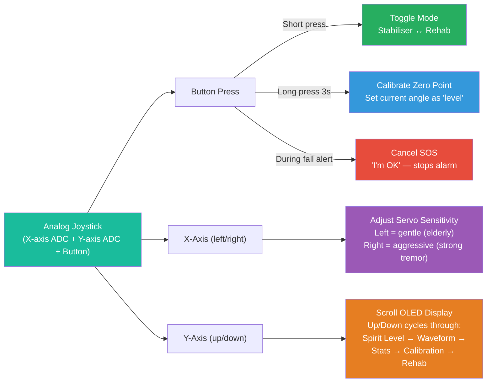
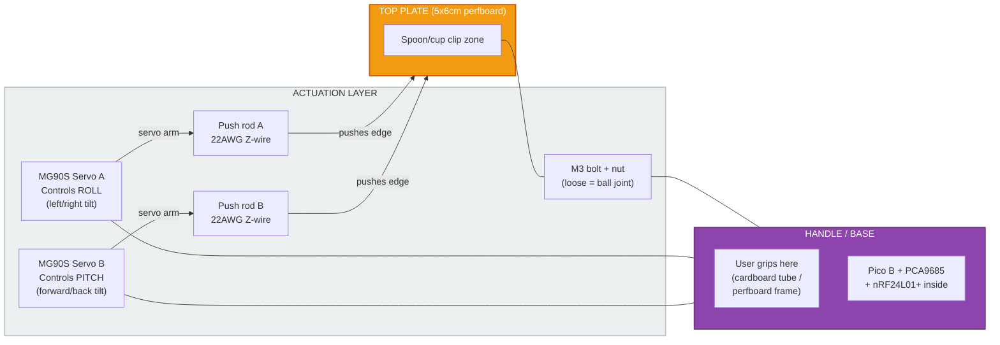
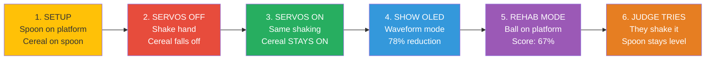

# SteadyHand — Tremor-Stabilising Assistive Device

> "Noise-cancelling headphones for physical movement"

**Theme:** Assistive Technology + Autonomy (semi-autonomous)
**Score: 95/100** — Highest ranked idea

---

## The Problem

| Stat | Detail |
|---|---|
| **10 million+** | people worldwide live with Parkinson's disease |
| **7 million** | in the US alone have essential tremor |
| **25%** | of adults over 65 have age-related tremor |
| **25-50%** | of stroke survivors develop upper limb tremor |
| **£200+** | cost of Liftware Steady (Google's stabilising spoon) |
| **~£15** | estimated cost of SteadyHand from our kit |

People with tremor can't eat independently, can't carry a cup of water, can't hold a phone steady. It strips dignity from daily life. Existing solutions are expensive or don't exist.

---

## System Architecture

---

## Control Loop

**Total latency: ~4ms** — IMU read (1ms) + Filter (0.1ms) + Wireless (2ms) + PID (0.1ms) + Servo (0.5ms)

---

## Fall Detection (Parallel on Core 1)

---

## Two Modes — Same Hardware

---

## Who Uses This?

### Healthcare Users

---

## Household Applications (with our limited sensors)

We only have **IMU + Joystick + Servos** — no cameras, no force sensors, no extra inputs. But that's enough:

| Use Case | What's on the Platform | Why It Matters |
|---|---|---|
| **Eating** | Spoon / fork clip | #1 daily need — restores independent eating |
| **Drinking** | Small cup holder | Prevents spilling hot drinks (burn risk for elderly) |
| **Video calls** | Phone cradle | Steady image for elderly talking to family — no shaky camera |
| **Medication** | Pill tray | Prevents dropping small pills — safety critical |
| **Writing** | Pen holder | Steadier handwriting for signing documents, letters |
| **Art therapy** | Brush holder | Rehab activity — painting helps motor recovery |
| **Pouring** | Small bottle cradle | Pour liquid without spilling (cooking, lab) |

All achieved by **swapping what clips onto the same 5x6cm platform**. One device, many attachments.

---

## Joystick Usage

The joystick serves **four critical functions** — not filler:

### 3D Printed Joystick Adapter (if available)

If you have access to a 3D printer, you could print a **thumb-grip cap** that sits on the joystick to make it easier for tremor patients to use (larger surface, textured grip). But the stock joystick works fine for the demo.

---

## Physical Build

**Dimensions:** ~15cm long, ~6cm wide, ~8cm tall
**Weight of moving part:** ~70g (platform + spoon)
**Assembly time:** ~2 hours

### What MG90S Can Handle

| Object | Weight | Works? |
|---|---|---|
| Spoon (empty) | ~40g | Yes — fast response |
| Spoon with food | ~60-80g | Yes |
| Small cup (espresso) | ~120g | Yes |
| Phone | ~180g | Borderline |
| Full mug | ~350g | No — too heavy |

---

## OLED Display Modes

| Mode | Screen | What It Shows | Who It's For |
|---|---|---|---|
| **1. Spirit Level** | Dot + crosshair, tilt angles | Real-time platform tilt — dot on cross = level | Live demo for judges |
| **2. Waveform** | Raw tremor wave vs flat compensated line | Before/after comparison + "78% reduction" | Proving the concept works |
| **3. Stats** | Duration, avg tremor, peak, stability %, corrections count | Session-level clinical data | Therapists / doctors |
| **4. Calibration** | Zero-point setting + sensitivity bar | Set what "level" means for this user | Initial setup |
| **5. Rehab** | Ball position dot + steadiness score + best today | Real-time rehab exercise scoring | Patients in therapy |
| **6. Fall Alert** | "FALL DETECTED" + countdown to SOS | 15-second cancel window | Emergency safety net |

Cycled with joystick Y-axis (up/down).

See `docs/images/steadyhand_oled_modes.png` for rendered mockups of each screen.

---

## Demo Script

**Drop line:** *"A Liftware Steady costs £200. We built this for £15."*

---

## Build Timeline

```mermaid
gantt
    title SteadyHand — 12 Hour Build Plan
    dateFormat HH:mm
    axisFormat %H:%M

    section Critical Path
    nRF24L01+ wireless link confirmed     :crit, w, 00:00, 1h
    BMI160 IMU + complementary filter      :crit, i, after w, 1h
    PCA9685 + servo PID control            :crit, p, after i, 1h
    End-to-end stabilisation working       :crit, e, after p, 1h

    section Mechanical
    Platform + pivot + push rods           :m, after e, 1h
    Spoon mount + handle assembly          :h, after m, 1h

    section Software Polish
    OLED display modes (4 screens)         :o, after h, 1h
    Fall detection on Core 1               :f, after o, 30min
    Rehab trainer mode                     :r, after f, 30min

    section Documentation
    Wiring diagram + README                :d, after r, 1h
    Architecture diagrams                  :a, after d, 30min

    section Final
    PID tuning + reliability testing       :t, after a, 1h
    Practice demo                          :demo, after t, 30min
```

---

## Scoring Breakdown

| Category | Score | Why |
|---|---|---|
| **Problem Fit (30)** | **29** | 10M+ Parkinson's patients. Affects eating — most basic human need. 10+ user groups. Household + clinical + professional |
| **Live Demo (25)** | **24** | Cereal-on-spoon before/after. OLED shows quantified improvement. Dual-mode demo. Judge tries it |
| **Technical (20)** | **19** | Complementary filter, PID control, 100Hz IMU, 4ms latency, dual-core, wireless streaming, 4 OLED modes |
| **Innovation (15)** | **14** | "Noise-cancelling for movement." Dual-mode (stabiliser + rehab). DIY Liftware for £15. Household attachment system |
| **Docs (10)** | **9** | Mermaid diagrams, control flow, architecture, OLED mockups, mechanical drawings |
| **Total** | **95** | |

---

## vs Competitors

| Feature | Liftware Steady | Apple Watch | SteadyHand |
|---|---|---|---|
| **Price** | £200 | £400+ | ~£15 |
| **Tremor cancellation** | Yes | No | Yes |
| **Fall detection** | No | Yes | Yes |
| **Rehab scoring** | No | No | Yes |
| **Clinical metrics** | No | Heart rate | Tremor amp, freq, reduction %, stability |
| **Phone required** | No | Yes (iPhone) | No |
| **Swappable attachments** | No (spoon only) | N/A | Yes (spoon, cup, phone, pen) |
| **Open source** | No | No | Yes |

---

## Risks & Mitigations

| Risk | Mitigation |
|---|---|
| MG90S too slow for fast tremors (>6Hz) | Focus on slow/medium tremor. Show % improvement, not perfection |
| Mechanical assembly takes too long | Pre-plan dimensions. Simple Z-wire push rods. Budget 2h max |
| PID tuning is fiddly | Start P+D only. Tune Kp first, add Kd for damping. Skip Ki |
| "Apple Watch does this" | "Apple Watch detects falls. SteadyHand actively cancels tremor. One monitors, ours solves." |
| Wireless latency spikes | Moving average on received data. Fallback to last known angle |
