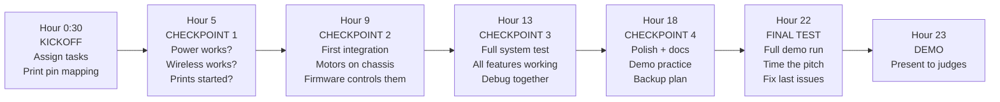

# GridBox — Team Work Plan

> 3-person team, 24-hour hackathon. Parallel workstreams, shared milestones.

---

## Team Roles

| Member | Role | Strengths | Responsibility |
|---|---|---|---|
| **Doyun** | Lead / Software | Firmware, software, AI-assisted dev, project management | MicroPython + C firmware, web dashboard, OLED screens, wireless protocol, documentation. Works with Claude Code |
| **Wooseung** | Electronics | EE, circuit design, soldering, wiring | All wiring, power distribution, MOSFET switching circuits, sensor connections, voltage dividers, I2C/SPI bus, testing circuits |
| **Billy** | Mechanical | 3D printing, CAD, physical design, motor mounting | Factory chassis/enclosure, motor mounts, servo brackets, conveyor mechanism, physical factory layout, labels |

---

## Master Timeline

```mermaid
gantt
    title GridBox — 24 Hour Build Plan (All Team Members)
    dateFormat HH:mm
    axisFormat %H:%M

    section ALL TOGETHER
    Kickoff + assign tasks                :done, 00:00, 30min
    Final integration test                :22:00, 1h
    Demo practice                         :23:00, 1h

    section DOYUN (Software)
    nRF24L01+ wireless link               :crit, 00:30, 1h30min
    IMU driver + vibration detection      :02:00, 1h30min
    PCA9685 motor + servo control         :03:30, 1h30min
    Energy sensing (ADC + current)        :05:00, 1h
    Autonomous control logic              :06:00, 1h30min
    OLED dashboard (4 views)              :07:30, 1h30min
    Gamification + dumb vs smart          :09:00, 1h
    Web dashboard on laptop               :10:00, 1h
    C SDK port (key modules)              :11:00, 2h
    Integration + bug fixes               :13:00, 2h
    Documentation + diagrams              :15:00, 1h

    section WOOSEUNG (Electronics)
    Power supply chain (PSU+buck+boost)   :00:30, 1h
    Pico A wiring (I2C + SPI + ADC)       :01:30, 1h30min
    MOSFET switching circuits (x4)        :03:00, 2h
    Voltage divider + sense resistors     :05:00, 1h
    IMU mounting + wiring                 :06:00, 30min
    Pico B wiring (OLED+joy+pot+nRF)      :06:30, 1h30min
    LED status tower (green/yellow/red)   :08:00, 1h
    Motor driver testing with Doyun       :09:00, 1h
    Full circuit debug + fix              :10:00, 2h
    Wire management + labelling           :12:00, 1h
    Backup circuits (spare wiring)        :13:00, 1h

    section BILLY (Mechanical)
    Factory base plate design             :00:30, 1h
    3D print motor mounts                 :01:30, 2h
    3D print servo brackets               :03:30, 1h30min
    Conveyor belt mechanism               :05:00, 2h
    Factory station labels + walls        :07:00, 1h
    Mount motors + servos to chassis      :08:00, 1h30min
    Mount electronics to base             :09:30, 1h
    Physical factory layout assembly      :10:30, 2h
    Control room station (separate)       :12:30, 1h
    Visual polish + labels                :13:30, 1h
    Presentation display setup            :14:30, 30min
```

---

## Doyun — Software / Firmware / Lead

### Hour 0-2: Foundation

| # | Task | Time | Details | Done When |
|---|---|---|---|---|
| D1 | **nRF24L01+ wireless link** | 0:30-2:00 | Get two Picos talking wirelessly. Test with simple ping-pong. Both MicroPython | Two Picos send/receive packets reliably |
| D2 | **Flash both Picos with MicroPython** | First 15min | Download .uf2, flash via USB | Both Picos run MicroPython REPL |

### Hour 2-5: Core Drivers

| # | Task | Time | Details | Done When |
|---|---|---|---|---|
| D3 | **BMI160 IMU driver** | 2:00-3:30 | I2C read, acceleration + gyro. Calculate $a_{rms}$ for vibration. Test: print values over serial | Live vibration readings on serial monitor |
| D4 | **PCA9685 motor + servo** | 3:30-5:00 | I2C PWM control. Set motor speed (duty cycle), servo angle. Test: motor spins at variable speed, servo moves | Motor responds to PWM, servo moves to set angles |
| D5 | **ADC power sensing** | 5:00-6:00 | Read bus voltage (GP26), motor currents (GP27, GP28). Calibrate with Wooseung's voltage divider. Test: read actual voltages | ADC readings match multimeter within 10% |

### Hour 6-9: Intelligence

| # | Task | Time | Details | Done When |
|---|---|---|---|---|
| D6 | **Autonomous control logic** | 6:00-7:30 | Energy optimization loop: sense → calculate excess → reroute via GPIO. Load shedding when voltage drops. Fault detection: IMU $a_{rms}$ > threshold → stop motor | System autonomously sheds loads when power drops, stops motors on vibration fault |
| D7 | **OLED dashboard** | 7:30-9:00 | 4 views: system status, power flow, health monitor, manual control. Joystick scrolls between views. Live data from wireless | OLED shows live motor speeds, power usage, vibration health |
| D8 | **Gamification** | 9:00-10:00 | Dumb vs Smart A/B comparison. Run system without intelligence, measure power. Run with intelligence, measure savings. Display: "Smart mode saved X%" | OLED shows quantified savings percentage |

### Hour 10-15: Polish + Production

| # | Task | Time | Details | Done When |
|---|---|---|---|---|
| D9 | **Web dashboard** | 10:00-11:00 | Flask app reads serial from Pico A. Shows live graphs on laptop. Energy usage over time | Laptop displays live graphs alongside OLED |
| D10 | **C SDK port** | 11:00-13:00 | Port core modules to C: main loop, ADC reading, PCA9685, nRF. Compile and flash | C firmware runs same demo as MicroPython |
| D11 | **Integration** | 13:00-15:00 | Work with Wooseung + Billy to get everything working together. Debug, tune thresholds, fix timing | Full system runs end-to-end autonomously |
| D12 | **Documentation** | 15:00-16:00 | Update README, wiring diagram photos, architecture diagram. Final docs for judges | GitHub repo looks professional |

### Coordination Points with Team

| When | Meet With | Purpose |
|---|---|---|
| Hour 2 | Wooseung | Test I2C bus — are IMU + PCA9685 detected? |
| Hour 5 | Wooseung | Calibrate ADC readings against actual voltages |
| Hour 9 | Wooseung + Billy | First full integration — motors on chassis, software controlling them |
| Hour 13 | Both | Final integration — everything working together |
| Hour 22 | Both | Full system test |

---

## Wooseung — Electronics / Circuits

### Hour 0-2: Power Infrastructure

| # | Task | Time | Details | Done When |
|---|---|---|---|---|
| W1 | **Power supply chain** | 0:30-1:30 | Wire: PSU 12V → LM2596S buck → 5V rail. PSU 12V → buck-boost → motor voltage (adjust to 6V). Test with multimeter | Stable 5V and 6V on breadboard rails |
| W2 | **Pico A basic wiring** | 1:30-3:00 | Wire I2C bus (GP4 SDA, GP5 SCL) with 4.7kΩ pull-ups to 3.3V. Wire SPI bus (GP0-3, GP16) for nRF24L01+. Connect Pico VSYS to 5V rail | Pico A powers on, I2C scan finds devices |

### Hour 3-6: Power Switching + Sensing

| # | Task | Time | Details | Done When |
|---|---|---|---|---|
| W3 | **MOSFET switching circuits (×4)** | 3:00-5:00 | For each motor/LED bank: NPN transistor or MOSFET, 1kΩ gate resistor from Pico GPIO (GP10-13). Test: GPIO HIGH = motor runs, GPIO LOW = motor stops | All 4 switches work — Doyun can control from firmware |
| W4 | **Voltage divider** | 5:00-5:30 | 10kΩ + 10kΩ from 5V bus to GND. Junction → GP26 ADC. Test: ADC reads ~half of bus voltage | Doyun confirms ADC reading matches expected |
| W5 | **Current sense resistors (×2)** | 5:30-6:00 | 1Ω resistor in series with each motor return path. Wire voltage across resistor to GP27, GP28. Test: ADC changes with motor load | Current readings change when motor runs |
| W6 | **IMU mounting** | 6:00-6:30 | Solder/mount BMI160 breakout. Wire I2C (same bus as PCA9685). Mount ON or near Motor 1 for vibration sensing | Doyun confirms I2C scan shows 0x68 |

### Hour 6-10: Pico B + LED Tower

| # | Task | Time | Details | Done When |
|---|---|---|---|---|
| W7 | **Pico B wiring** | 6:30-8:00 | Wire: OLED (I2C GP4/5), nRF24L01+ (SPI GP0-3,16), joystick (ADC GP26/27 + button GP22), potentiometer (ADC GP28), LEDs (GP14/15) | Pico B powers on, OLED lights up, joystick reads |
| W8 | **LED status tower** | 8:00-9:00 | 4 LEDs representing factory loads (P1-P4): green, yellow, red, blue. Each through 330Ω + MOSFET on GP12. Plus 2 status LEDs (green/red) on GP14/15 | LEDs light up when Doyun sends GPIO commands |
| W9 | **Integration test with Doyun** | 9:00-10:00 | Connect motors to switching circuits. Doyun runs firmware. Test: PWM speed control, fault detection, load shedding all work with real hardware | Motors respond to firmware, servos move, LEDs indicate status |

### Hour 10-14: Debug + Polish

| # | Task | Time | Details | Done When |
|---|---|---|---|---|
| W10 | **Full circuit debug** | 10:00-12:00 | Systematic test of every connection. Fix any intermittent wiring. Check voltage levels at all points with multimeter | Every connection reliable — no intermittent failures |
| W11 | **Wire management** | 12:00-13:00 | Tidy wires, add colour-coded labels. Group power (red), ground (black), signal (yellow), I2C (white/grey), SPI (blue) | Judges can see clean wiring — earns Technical points |
| W12 | **Backup circuits** | 13:00-14:00 | Pre-wire spare MOSFET switch, spare LED, spare sense resistor. If anything breaks during demo, swap in seconds | Backup ready on breadboard edge |

### What Wooseung Needs from Doyun

| When | What |
|---|---|
| Hour 0 | Pin mapping printout from `docs/gridbox-design.md` section 3 |
| Hour 2 | Run `test_i2c_scan.py` to verify wiring |
| Hour 5 | Run ADC calibration script to verify voltage readings |
| Hour 9 | Full firmware test on completed circuits |

### What Wooseung Needs from Billy

| When | What |
|---|---|
| Hour 8 | Motor mount positions finalised — where do wires route? |
| Hour 10 | Chassis ready to mount breadboards onto |

---

## Billy — Mechanical / 3D Printing / Physical Design

### Hour 0-3: Design + Print Start

| # | Task | Time | Details | Done When |
|---|---|---|---|---|
| B1 | **Factory base plate design** | 0:30-1:30 | Design base plate dimensions (approx 30×40cm). Mark zones: pump station, fill station, conveyor, QC, control electronics. Sketch layout | Layout sketch approved by team |
| B2 | **3D print motor mounts** | 1:30-3:30 | Design + print brackets to hold DC motors to base plate. Needs: shaft accessible for coupling, screw holes for M3. Print 2 mounts | 2 motor mounts printed, motors fit snugly |

### Hour 3-7: Servo Brackets + Conveyor

| # | Task | Time | Details | Done When |
|---|---|---|---|---|
| B3 | **3D print servo brackets** | 3:30-5:00 | MG90S mounting brackets — attach servos to base at fill station and QC station. Servo arm should move freely. Print 2 brackets | Servos mounted, arms can swing full range |
| B4 | **Conveyor belt mechanism** | 5:00-7:00 | Simple conveyor: Motor 2 shaft → rubber band or string belt over two rollers (could be 3D printed wheels or pen caps). Length ~15-20cm. Belt surface moves items from pump to QC | Belt moves when motor spins. Items (bottle caps?) travel along it |

### Hour 7-10: Factory Assembly

| # | Task | Time | Details | Done When |
|---|---|---|---|---|
| B5 | **Factory station labels + walls** | 7:00-8:00 | Print or write labels: "PUMP STATION", "FILLING", "QUALITY CHECK", "OUTPUT", "REJECT". Optional cardboard walls between stations | Factory looks like a factory, not a breadboard |
| B6 | **Mount motors + servos** | 8:00-9:30 | Attach motor mounts to base. Screw servos into brackets. Route wire channels so cables don't interfere with moving parts | All actuators physically mounted and moving freely |
| B7 | **Mount electronics** | 9:30-10:30 | Attach breadboards to base plate (double-sided tape or screws). Position Pico A, PCA9685, nRF near motors. Route wires to Wooseung's circuits | Electronics secured to chassis, nothing loose |

### Hour 10-15: Polish + Presentation

| # | Task | Time | Details | Done When |
|---|---|---|---|---|
| B8 | **Physical factory layout** | 10:30-12:30 | Final assembly — everything connected. Test that motors don't vibrate loose, servos don't jam, conveyor runs smooth. Fix any mechanical issues | Whole factory runs for 5 minutes without anything falling apart |
| B9 | **Control room station** | 12:30-13:30 | Separate small base for Pico B: OLED visible from front, joystick accessible, potentiometer knob on top. Clean presentation | SCADA station looks like a mini control panel |
| B10 | **Visual polish** | 13:30-14:30 | Add colour: paint stations, add arrows showing flow direction, add "GridBox" branding. Make it look professional for judges | Judges see a polished miniature factory, not a homework project |
| B11 | **Presentation display** | 14:30-15:00 | Set up demo table: factory on left, control room on right, laptop in middle showing web dashboard. Cable management. Poster if time allows | Demo table ready for judges to walk up to |

### What Billy Needs from Wooseung

| When | What |
|---|---|
| Hour 0 | Motor dimensions (shaft diameter, mounting hole pattern) |
| Hour 5 | Wire routing requirements — where do cables need to go? |
| Hour 8 | Breadboard dimensions + where electronics will sit |

### What Billy Needs from Doyun

| When | What |
|---|---|
| Hour 0 | Factory layout diagram from `docs/gridbox-design.md` |
| Hour 7 | Confirm station names and flow direction for labels |

---

## Shared Milestones (Everyone Stops and Syncs)

| Milestone | Hour | What Must Be Done | Fallback If Not |
|---|---|---|---|
| **Checkpoint 1** | 5 | Power stable, wireless working, first 3D prints done | Debug power first — nothing works without it |
| **Checkpoint 2** | 9 | Motors + servos controlled by firmware on Billy's chassis | Run on bare breadboard — chassis is cosmetic |
| **Checkpoint 3** | 13 | Full autonomous cycle: sense → decide → act → report | Cut features to minimum: just motor control + OLED |
| **Checkpoint 4** | 18 | Polished, documented, demo practiced | Focus on demo script — practice > features |
| **Final test** | 22 | Complete demo run, timed pitch | Whatever works is what we demo |

---

## Communication During Hackathon

| Channel | Purpose |
|---|---|
| **In person** | Primary — you're all in the same room |
| **GitHub** | Code changes, documentation updates |
| **Photos in `media/`** | Take photos of wiring, assembly, progress — for docs + judges |

### Rules

1. **If something breaks, tell the team immediately** — don't debug alone for 2 hours
2. **If you're ahead of schedule, help someone else** — we finish together or not at all
3. **If you're behind, tell us at the checkpoint** — we'll adjust scope, not quality
4. **Take photos every hour** — judges love seeing the build process
5. **Every checkpoint: does the demo work?** — features are cut before the demo is broken

---

## What Each Person Should Bring

### Doyun
- [ ] Laptop (MacBook) with Claude Code, mpremote, VS Code
- [ ] USB cables (×2, USB-A to micro-USB for Pico)
- [ ] MicroPython .uf2 firmware pre-downloaded
- [ ] Pico SDK installed (for C build later)
- [ ] This repo cloned and up to date
- [ ] Pin mapping printed on paper

### Wooseung
- [ ] Multimeter
- [ ] Soldering iron + solder (if allowed)
- [ ] Wire strippers
- [ ] Extra breadboard jumper wires
- [ ] Component organiser (resistors sorted by value)
- [ ] Pin mapping printed on paper

### Billy
- [ ] Laptop with CAD software (Fusion 360 / OnShape)
- [ ] Access to 3D printer (or pre-printed parts)
- [ ] Craft knife, ruler, cutting mat
- [ ] Hot glue gun
- [ ] Cardboard, coloured paper, labels
- [ ] Double-sided tape, cable ties
- [ ] Marker pens for labels
