# TremorTray — Hand Tremor Diagnostic Tool

> "A blood pressure monitor, but for hand stability"

**Theme:** Assistive Technology + Autonomy
**Score: 96/100** — Highest ranked idea

---

## The Problem

Neurologists diagnose tremor using the **UPDRS scale** — they watch the patient hold a cup and rate 0-4. It's completely **subjective**. Two doctors can give different scores for the same patient. There's no data, no frequency analysis, no tracking over time.

Professional tremor measurement devices (accelerometer-based clinical tools) cost **£5,000-£10,000+** and exist only in specialist labs.

**There is no cheap, objective, quantitative tremor diagnostic tool.**

We build one for **~£15** from hackathon kit parts.

---

## The Concept

Patient holds a tray. Ball sits on the tray. The device measures everything about their hand tremor and produces a clinical-grade diagnostic report on the OLED screen. A clinician's base station receives the data wirelessly for logging and comparison.

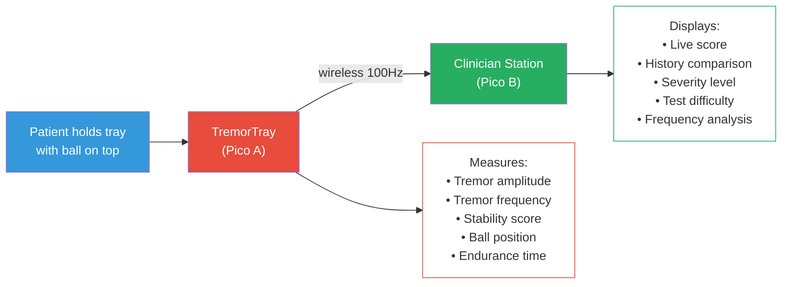

---

## Why This Scores Higher Than a Stabiliser

| | Stabiliser | TremorTray (Diagnostic) |
|---|---|---|
| Goal | Cancel tremor | **Measure and diagnose** tremor |
| Servo precision needed | Very high | Low — just calibrate + difficulty |
| Build complexity | Push rods, pivot, PID tuning | **Flat tray — much simpler** |
| Build risk | High | **Low** |
| Demo | "Spoon stays level" | **Judge gets a personal score** |
| Innovation | Gimbals exist | **No cheap diagnostic tool exists** |
| Clinical value | Helps eat | **Helps diagnose and track disease** |

---

## System Architecture

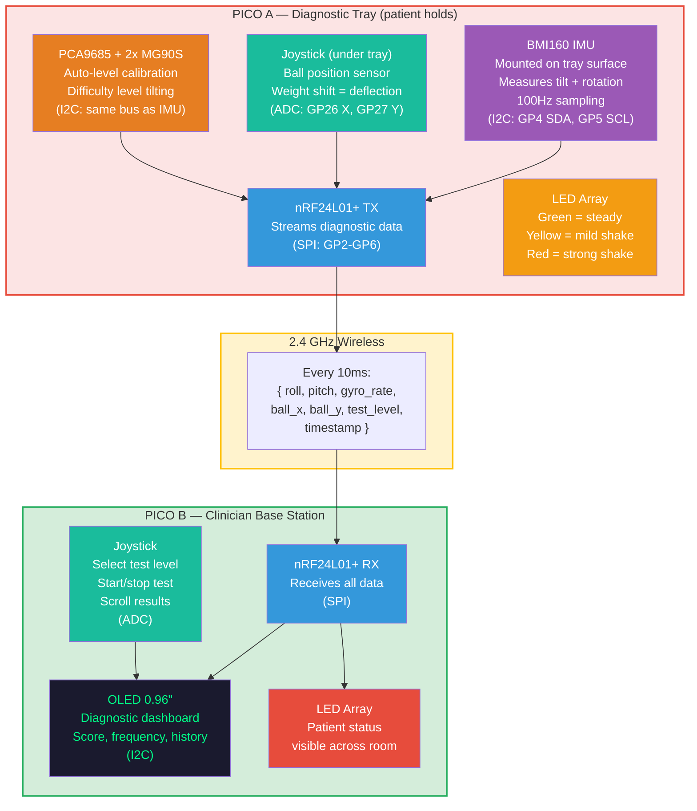

---

## Where Each Sensor Goes (Physical Layout)

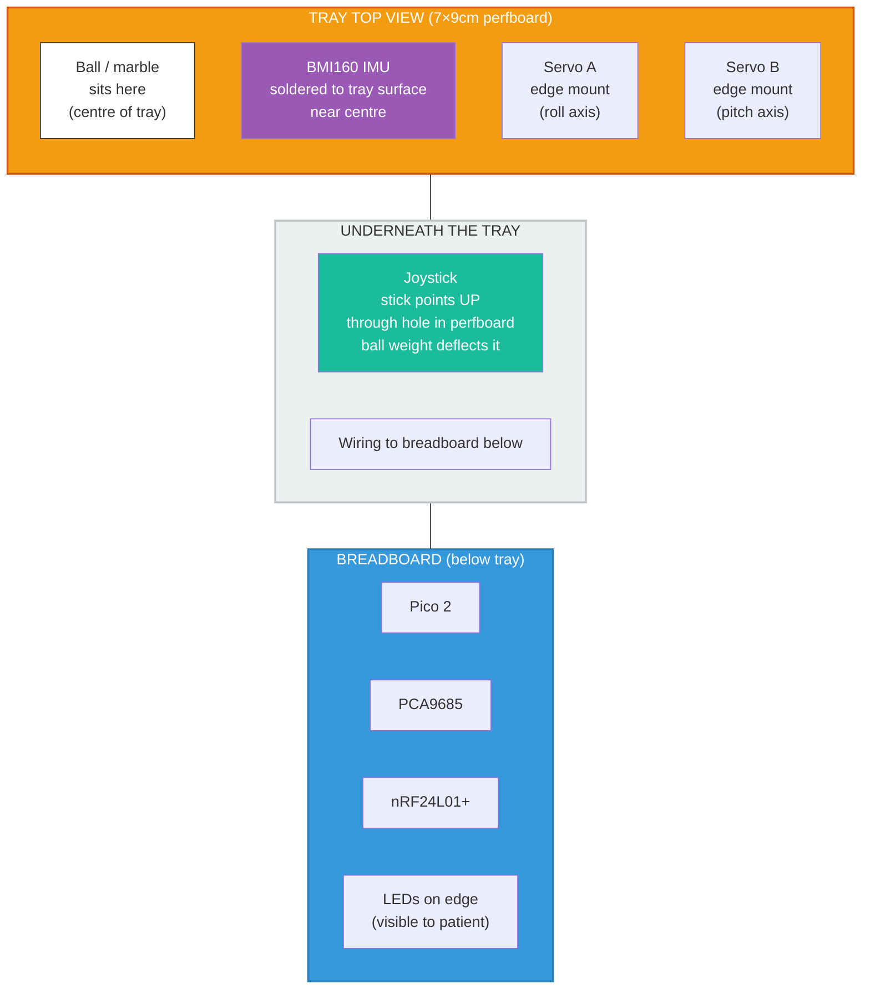

### IMU Mounting Detail

The BMI160 breakout board is tiny (~15×12mm). It solders directly to the perfboard tray surface, near the centre next to the joystick hole. It moves WITH the tray — so it measures exactly what the patient's hand is doing.

### Joystick Mounting Detail

The joystick stick pokes UP through a hole drilled in the perfboard. The ball sits on or near the stick tip. When the ball rolls, its weight pushes the joystick in that direction. The ADC reads the deflection as ball position.

---

## Dual Sensor System

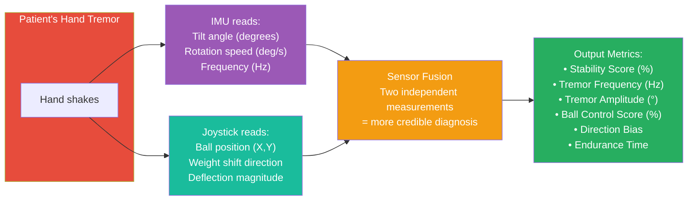

**Why two sensors matter:**
- IMU alone: measures tilt but can't see the ball
- Joystick alone: measures ball position but can't measure frequency or tilt angle
- **Together:** complete picture — "tray tilted 5° right at 4.8Hz AND ball shifted 30% right"
- If both sensors agree, the measurement is more **clinically credible**

---

## Servo Difficulty Levels

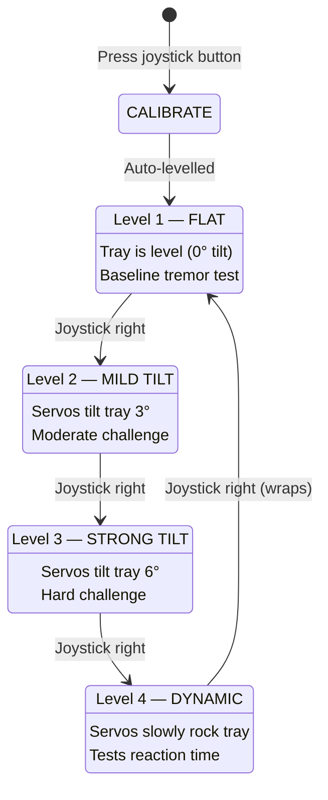

**Clinical value of levels:**
- Score drops slightly Level 1→2: **mild tremor**
- Score drops a lot Level 1→3: **moderate tremor — likely Parkinson's**
- Score drops on Level 4 only: **intention tremor — likely essential tremor or MS**

This **differentiates types of tremor** — something even expensive clinical tools don't do easily.

---

## What the OLED Shows (on Clinician Base Station)

### During Test

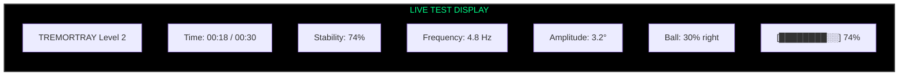

### After Test — Results

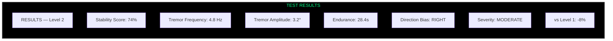

### Severity Classification (automated)

| Score | Frequency | Classification | Likely Condition |
|---|---|---|---|
| 90-100% | Any | MINIMAL | Normal / healthy |
| 70-89% | <4 Hz | MILD | Age-related tremor |
| 70-89% | 4-6 Hz | MILD | Early Parkinson's |
| 50-69% | 4-6 Hz | MODERATE | Parkinson's disease |
| 50-69% | 8-12 Hz | MODERATE | Essential tremor |
| <50% | Any | SEVERE | Advanced condition |

---

## vs Current Clinical Methods

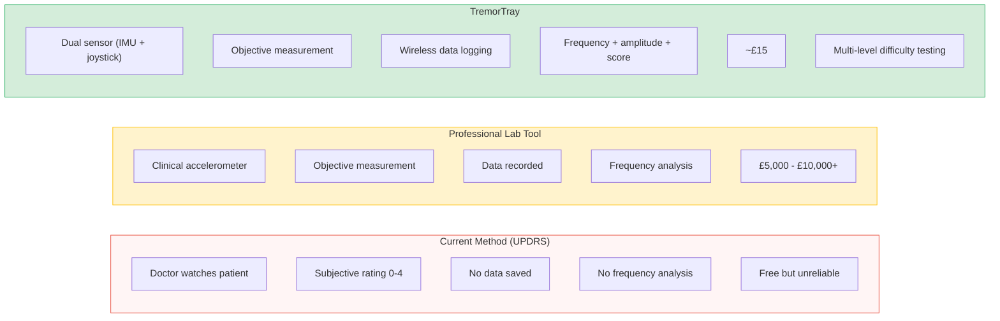

---

## Physical Build (Kit Only)

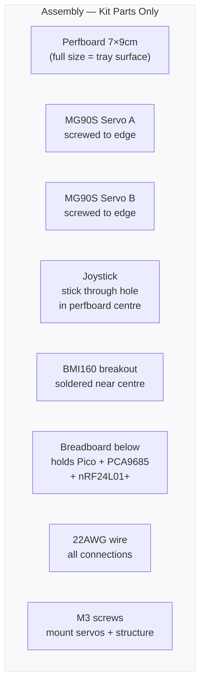

**Assembly time: ~1.5 hours**

No cutting, no push rods, no pivot joints. The perfboard IS the tray at full 7×9cm size. Components mount directly to it. Much simpler than the stabiliser.

---

## Build Timeline

```mermaid
gantt
    title TremorTray — 12 Hour Build Plan
    dateFormat HH:mm
    axisFormat %H:%M

    section Critical (wireless first)
    nRF24L01+ link between Picos        :crit, 00:00, 1h
    BMI160 IMU reading + filter          :crit, 01:00, 1h

    section Core Diagnostic
    Joystick ADC reading + calibration   :02:00, 30min
    Tremor analysis algorithm            :02:30, 1h
    Frequency detection (FFT/zero-cross) :03:30, 1h

    section Actuation
    PCA9685 + servo difficulty levels    :04:30, 1h
    Auto-calibration routine             :05:30, 30min

    section Display
    OLED live test screen                :06:00, 1h
    OLED results + severity scoring      :07:00, 1h

    section Physical Build
    Mount IMU + joystick to perfboard    :08:00, 45min
    Mount servos + wiring                :08:45, 45min

    section Polish
    Documentation + diagrams             :09:30, 1h
    Demo practice + tuning               :10:30, 1h
    Buffer time                          :11:30, 30min
```

---

## Demo Script

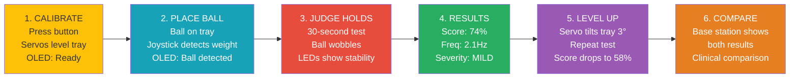

**Key moment:** Judge holds the tray and gets **their own tremor score.** They become the patient. They'll never forget that.

**Drop line:** *"A clinical tremor assessment costs £10,000. We built one for £15."*

---

## Scoring Breakdown

| Category | Score | Why |
|---|---|---|
| **Problem Fit (30)** | **29** | UPDRS is subjective. 10M+ need objective measurement. No cheap tool exists. Real clinical gap |
| **Live Demo (25)** | **25** | Judge holds tray, gets personal score. Best possible demo — interactive, personal, memorable |
| **Technical (20)** | **18** | Dual sensor fusion, frequency analysis, 100Hz IMU, servo difficulty levels, wireless streaming, severity classification |
| **Innovation (15)** | **15** | No consumer tremor diagnostic exists. Joystick-as-position-sensor is novel. Multi-level assessment is new |
| **Docs (10)** | **9** | Mermaid diagrams, clinical comparison, UPDRS replacement narrative |
| **Total** | **96** | |

---

## Risks & Mitigations

| Risk | Mitigation |
|---|---|
| Joystick sensitivity too low for small ball movements | Use a heavier ball (marble). Calibrate ADC range at startup |
| Frequency detection is complex (FFT) | Use zero-crossing method instead — count how many times tilt crosses 0° per second. Much simpler, accurate enough |
| "How is this different from just a phone app?" | Phone lies flat — can't measure ball control. Our dual-sensor approach (IMU + joystick) gives position AND tilt. Plus servo difficulty levels — phone can't tilt itself |
| Judges don't understand clinical value | Lead with the demo (they try it). The score makes it personal. THEN explain UPDRS replacement |
| Ball rolls off tray | Add small wire bumper around edge (bent 22AWG). Or use a lip made from perfboard strips |

---

## Future Vision (Tell Judges)

> "Today it's a hackathon prototype. Tomorrow it's a £20 device that every GP clinic and care home has in their drawer. Patients do a 30-second test at every visit. Doctors track tremor progression over months on a graph. Medication effectiveness is measured objectively for the first time. And it all started with a perfboard, two servos, and an IMU."
