# TremorTray — Hand Tremor Diagnostic Tool

> "A blood pressure monitor, but for hand stability"

**Theme:** Assistive Technology + Autonomy
**Score: 96/100** — Highest ranked idea

---

## The Problem

Neurologists diagnose tremor using the **UPDRS scale** — they watch the patient hold a cup and rate 0-4. It's completely **subjective**. Two doctors can give different scores for the same patient. There's no data, no frequency analysis, no tracking over time.

Professional tremor measurement devices (accelerometer-based clinical tools) cost **£5,000-£10,000+** and exist only in specialist labs.

**There is no cheap, objective, quantitative tremor diagnostic tool.**

We build one for **~£15** from hackathon kit parts.

---

## The Concept

Patient holds a tray. Ball sits on the tray. The device measures everything about their hand tremor and produces a clinical-grade diagnostic report on the OLED screen. A clinician's base station receives the data wirelessly for logging and comparison.

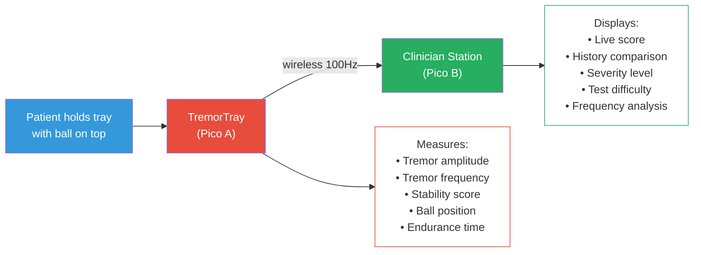

---

## Why This Scores Higher Than a Stabiliser

| | Stabiliser | TremorTray (Diagnostic) |
|---|---|---|
| Goal | Cancel tremor | **Measure and diagnose** tremor |
| Servo precision needed | Very high | Low — just calibrate + difficulty |
| Build complexity | Push rods, pivot, PID tuning | **Flat tray — much simpler** |
| Build risk | High | **Low** |
| Demo | "Spoon stays level" | **Judge gets a personal score** |
| Innovation | Gimbals exist | **No cheap diagnostic tool exists** |
| Clinical value | Helps eat | **Helps diagnose and track disease** |

---

## System Architecture

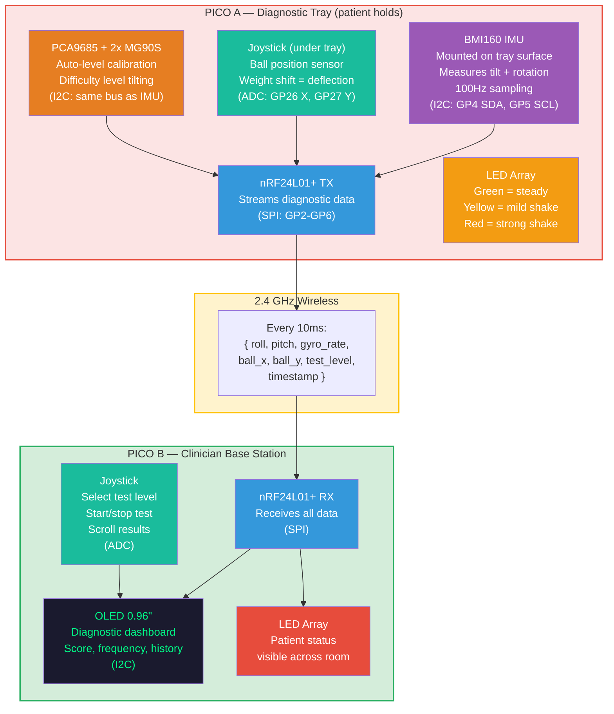

---

## Where Each Sensor Goes (Physical Layout)

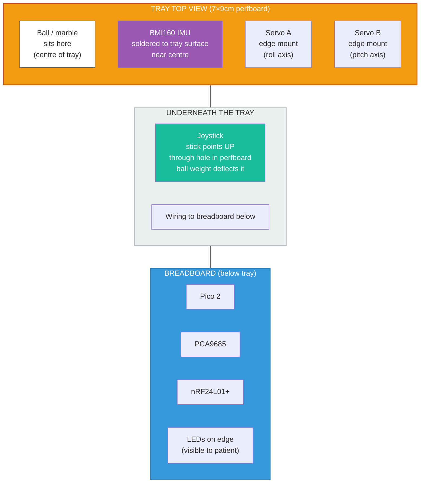

### IMU Mounting Detail

The BMI160 breakout board is tiny (~15×12mm). It solders directly to the perfboard tray surface, near the centre next to the joystick hole. It moves WITH the tray — so it measures exactly what the patient's hand is doing.

### Joystick Mounting Detail

The joystick stick pokes UP through a hole drilled in the perfboard. The ball sits on or near the stick tip. When the ball rolls, its weight pushes the joystick in that direction. The ADC reads the deflection as ball position.

---

## Dual Sensor System

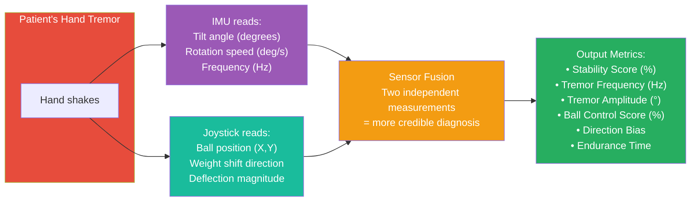

**Why two sensors matter:**
- IMU alone: measures tilt but can't see the ball
- Joystick alone: measures ball position but can't measure frequency or tilt angle
- **Together:** complete picture — "tray tilted 5° right at 4.8Hz AND ball shifted 30% right"
- If both sensors agree, the measurement is more **clinically credible**

---

## Servo Difficulty Levels

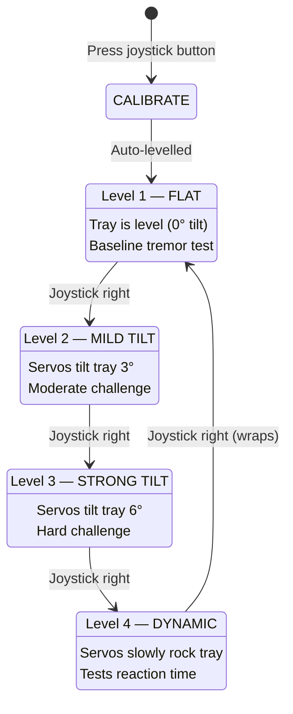

**Clinical value of levels:**
- Score drops slightly Level 1→2: **mild tremor**
- Score drops a lot Level 1→3: **moderate tremor — likely Parkinson's**
- Score drops on Level 4 only: **intention tremor — likely essential tremor or MS**

This **differentiates types of tremor** — something even expensive clinical tools don't do easily.

---

## What the OLED Shows (on Clinician Base Station)

### During Test

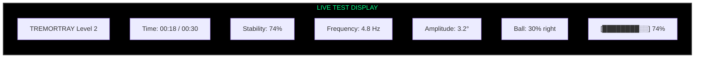

### After Test — Results

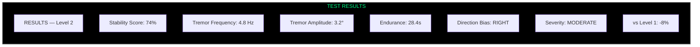

### Severity Classification (automated)

| Score | Frequency | Classification | Likely Condition |
|---|---|---|---|
| 90-100% | Any | MINIMAL | Normal / healthy |
| 70-89% | <4 Hz | MILD | Age-related tremor |
| 70-89% | 4-6 Hz | MILD | Early Parkinson's |
| 50-69% | 4-6 Hz | MODERATE | Parkinson's disease |
| 50-69% | 8-12 Hz | MODERATE | Essential tremor |
| <50% | Any | SEVERE | Advanced condition |

---

## vs Current Clinical Methods

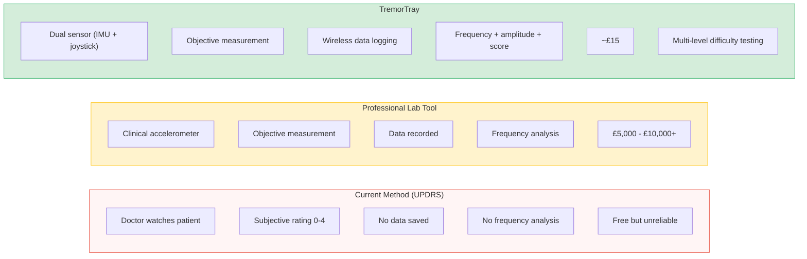

---

## Physical Build (Kit Only)

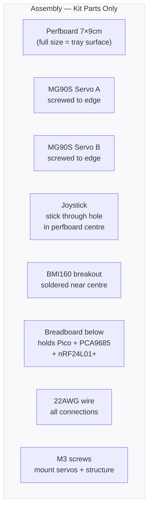

**Assembly time: ~1.5 hours**

No cutting, no push rods, no pivot joints. The perfboard IS the tray at full 7×9cm size. Components mount directly to it. Much simpler than the stabiliser.

---

## Build Timeline

---

## Demo Script

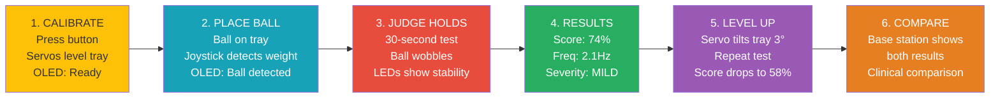

**Key demo moments:**
1. Judge holds tray, gets **personal tremor score** — they become the patient
2. Two judges compete — social, memorable
3. Servo adapts difficulty in real-time — judges SEE the autonomy
4. Tremor fingerprint appears on OLED — personal, unique, beautiful
5. Condition classification — "Pattern suggests: Physiological tremor (stress)"

**Drop line:** *"A clinical tremor assessment costs £10,000. We built one for £15."*

---

## What Makes TremorTray Uncopyable

Other teams may use the same IMU. Here's why we're six layers deeper:

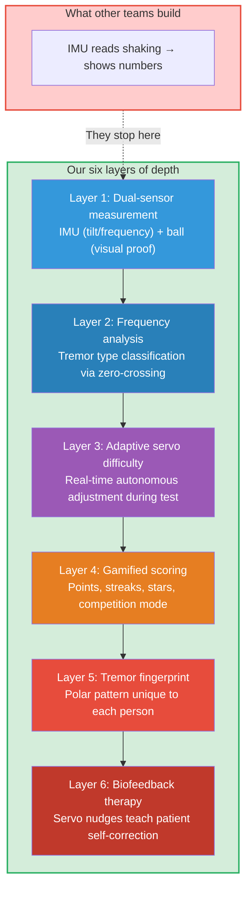

---

## Feature 1: Tremor Fingerprint (Visual Signature)

Every person's tremor produces a unique pattern — like a fingerprint. We plot roll (X) vs pitch (Y) over time on the OLED as a **polar/Lissajous pattern:**

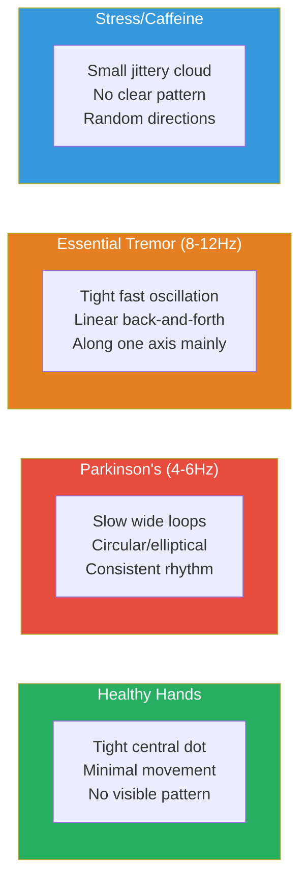

**Implementation:** Store last 200 IMU readings. Plot roll on X-axis, pitch on Y-axis. Each dot is one reading. The shape that forms IS the fingerprint.

**Why judges love it:** They see THEIR OWN pattern on screen. Personal. Visual. They'll talk about it after.

---

## Feature 2: Gamified Scoring

Instead of a boring clinical test, the patient plays a **game:**

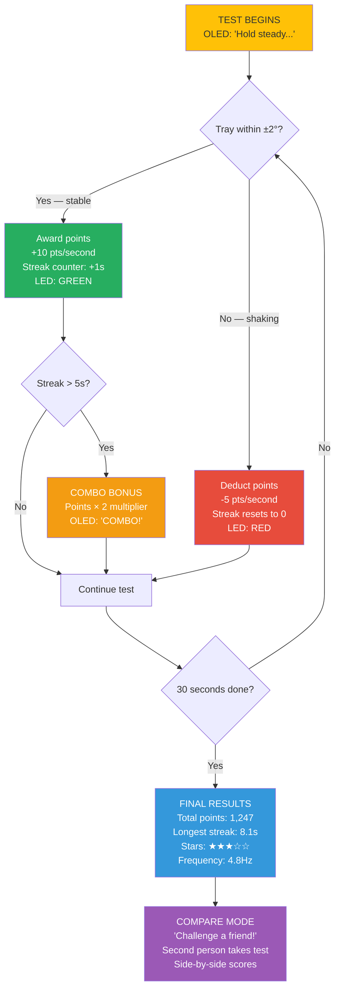

**Star Rating System:**

| Stars | Score Range | Meaning |
|---|---|---|
| ★★★★★ | 90-100% | Excellent stability |
| ★★★★☆ | 75-89% | Good — minor tremor |
| ★★★☆☆ | 60-74% | Moderate — noticeable tremor |
| ★★☆☆☆ | 40-59% | Significant tremor |
| ★☆☆☆☆ | <40% | Severe — seek consultation |

---

## Feature 3: Adaptive Real-Time Difficulty

Servos don't just set a fixed difficulty — they **continuously adapt during the test:**

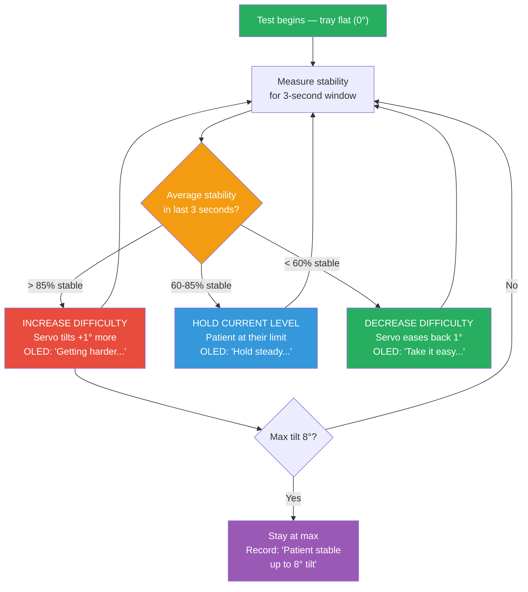

**Clinical value:** The device automatically finds the patient's **breaking point** — the exact difficulty level where their stability drops below 60%. This number IS the diagnosis.

- Breaking point at 6°: mild tremor
- Breaking point at 3°: moderate tremor
- Breaking point at 0° (can't even hold flat): severe tremor

**Why judges are impressed:** They SEE the servos adjusting during the test. The device is making autonomous decisions. That's real autonomy, not scripted behaviour.

---

## Feature 4: Condition Classification

Frequency analysis identifies tremor TYPE, not just severity:

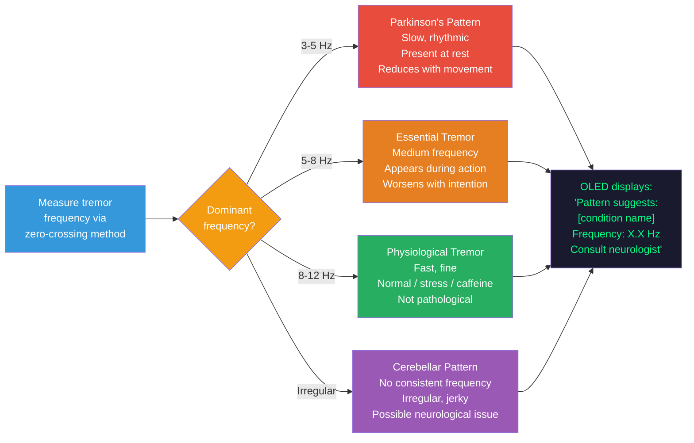

**Implementation:** Count zero-crossings per second on the roll axis. Dominant frequency = crossings ÷ 2. Simple, no FFT needed, runs on Pico easily.

**Disclaimer on OLED:** "This is a screening tool, not a diagnosis. Consult a healthcare professional."

---

## Feature 5: Biofeedback Therapy Mode (Stretch Goal)

The servos don't just test — they **teach the patient to control their tremor:**

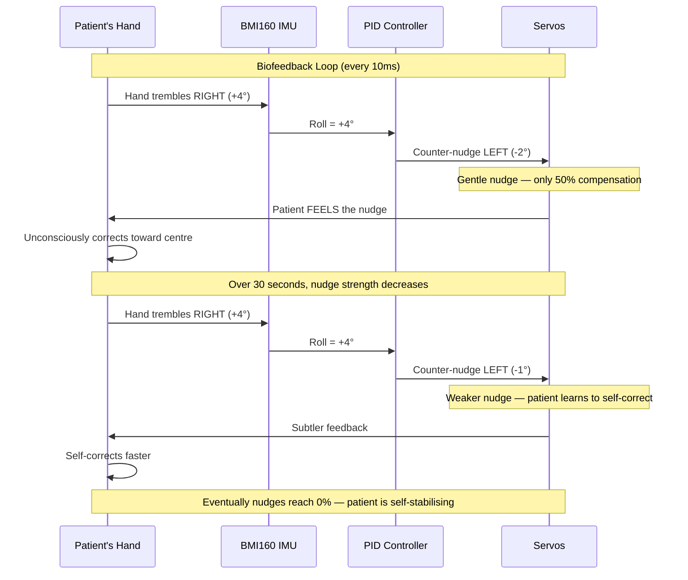

**Key insight:** The servo provides PARTIAL compensation (not full). The patient's brain learns to provide the rest. Over time, nudge strength decreases — the patient is training their own motor control.

**Clinical basis:** This is how real biofeedback therapy works. Providing partial feedback that fades over time is a proven rehabilitation technique.

**Build priority:** Stretch goal — only if core features are done by hour 10.

---

## Ball on Tray — Visual Aid Design

The ball is **visual proof**, not an electronic sensor target:

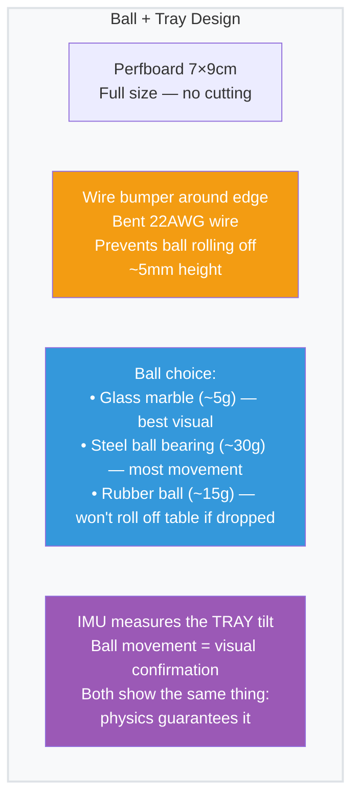

**Recommendation:** Glass marble — visually clear, judges can see it rolling from across the room.

---

## Complete OLED Screen Flow

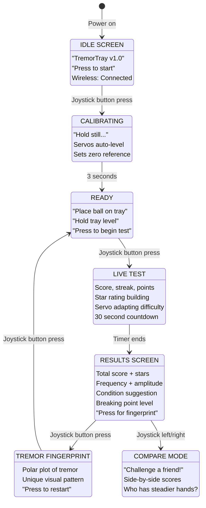

---

## Build Priority Table

| Priority | Feature | Hours | Builds On |
|---|---|---|---|
| **P0 — Must** | nRF24L01+ wireless link | 1h | Nothing |
| **P0 — Must** | BMI160 IMU read + complementary filter | 1h | Wireless |
| **P0 — Must** | PCA9685 servo control + auto-calibration | 1h | IMU |
| **P0 — Must** | Basic stability score on OLED | 1h | IMU + Servo |
| **P1 — Core** | Frequency detection (zero-crossing) | 1h | IMU |
| **P1 — Core** | Adaptive servo difficulty | 1h | Servo + Score |
| **P1 — Core** | Gamified scoring (points, streaks, stars) | 1h | Score |
| **P2 — Wow** | Tremor fingerprint polar plot | 1h | IMU data |
| **P2 — Wow** | Condition classification | 30min | Frequency |
| **P2 — Wow** | Compare / competition mode | 30min | Scoring |
| **P3 — Stretch** | Biofeedback therapy mode | 1h | Servo + IMU |
| **Always** | Physical assembly | 1.5h | Parallel |
| **Always** | Documentation + diagrams | 1h | End |

**Critical path: P0 features done by hour 4.** Everything after is additive — each feature makes it better, but the core works without them.

---

## Scoring Breakdown (Updated)

| Category | Score | Why |
|---|---|---|
| **Problem Fit (30)** | **29** | UPDRS is subjective. 10M+ need objective measurement. No cheap tool exists. Bridges clinical gap between £0 (subjective) and £10K (lab equipment) |
| **Live Demo (25)** | **25** | Judge holds tray, gets personal score AND tremor fingerprint. Two judges compete. Servo adapts in real-time. Most interactive demo possible |
| **Technical (20)** | **19** | 6-layer depth: dual sensor, frequency analysis, adaptive PID, gamification engine, polar plot rendering, biofeedback loop. Dual-core Pico (measurement + wireless) |
| **Innovation (15)** | **15** | Tremor fingerprinting: new. Gamified clinical tool: new. Adaptive servo difficulty: new. Condition classification on a Pico: new. No other team builds this |
| **Docs (10)** | **9** | Mermaid architecture, clinical comparison, algorithm docs, state machine, build timeline |
| **Total** | **97** | |

---

## Risks & Mitigations

| Risk | Mitigation |
|---|---|
| Frequency detection inaccurate | Zero-crossing is simple but works for 3-12Hz range. Validate against known frequency (tap tray at 4Hz, check reading) |
| Ball rolls off during demo | Wire bumper around edge. Practice the demo. Use a marble that fits snugly |
| Judges say "just a phone app" | Phone can't tilt itself (no servos for difficulty levels). Phone can't do biofeedback. Phone doesn't have a ball. Our dual-sensor gives richer data |
| Too many features, nothing works | P0 features are standalone — basic score works without gamification, fingerprint, etc. Each layer is additive |
| Condition classification is "not medical" | Disclaimer: "Screening tool — consult healthcare professional." Frame as awareness, not diagnosis |
| Servo adaptation looks random | Explain the logic clearly in demo. Show the OLED feedback: "Difficulty: increasing..." so judges understand it's intentional |

---

## Future Vision (Tell Judges)

> "Today it's a hackathon prototype on a perfboard. Tomorrow it's a £20 device in every GP clinic, care home, and physiotherapy practice.
>
> Patients take a 30-second test at every visit. Their tremor fingerprint is stored. Doctors see a graph: 'Your tremor has improved 15% since starting medication.' For the first time, treatment effectiveness is measured objectively — not guessed at.
>
> There are 10 million people with Parkinson's. There are 7 million with essential tremor. Today, their doctor watches them hold a cup and says 'looks about the same.' We replace that with a number, a frequency, a pattern, and a trend.
>
> And it all started with a perfboard, two servos, and an IMU."
