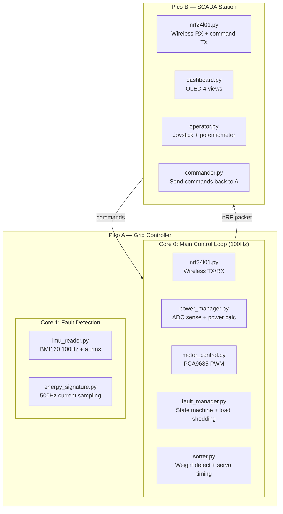
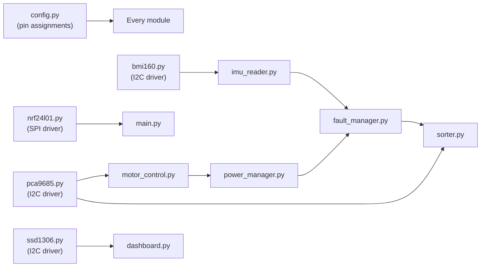

# Firmware Development Plan

> Technical development roadmap for GridBox firmware. Both MicroPython (dev) and C SDK (production).

---

## Architecture Overview



---

## Module Dependency Map



Build order follows this dependency chain: drivers first, then logic modules, then integration.

---

## Development Phases

### Phase 1: Hardware Drivers (No Factory Logic)

| Module | File | What It Does | Lines (est) | Test File |
|---|---|---|---|---|
| **nRF24L01+ driver** | `nrf24l01.py` | SPI init, send packet, receive packet, set channel/address | ~200 | `test_wireless.py` |
| **BMI160 IMU driver** | `bmi160.py` | I2C init, read accel XYZ, read gyro XYZ, calculate $a_{rms}$ | ~150 | `test_imu.py` |
| **PCA9685 PWM driver** | `pca9685.py` | I2C init, set channel duty cycle, servo angle, motor speed % | ~120 | `test_servo.py`, `test_motor.py` |
| **SSD1306 OLED driver** | `ssd1306.py` | I2C init, text, lines, rectangles, pixels, clear, show | ~180 | `test_oled.py` |
| **Config** | `config.py` | All pin assignments, I2C addresses, thresholds, timing constants | ~80 | — |
| **Protocol** | `shared/protocol.py` | Pack/unpack 32-byte wireless packets | ~60 | `test_protocol.py` |

**Total Phase 1: ~790 lines, 6 test files**

### Phase 2: Sensing & Control Logic

| Module | File | What It Does | Lines (est) |
|---|---|---|---|
| **Power manager** | `power_manager.py` | Read ADC (voltage, current ×2), calculate per-branch power, total, excess, efficiency | ~100 |
| **IMU reader** | `imu_reader.py` | Continuous 100Hz read on Core 1, compute $a_{rms}$, classify (healthy/warning/fault) | ~80 |
| **Motor control** | `motor_control.py` | Set motor speed via PCA9685 PWM, ramp up/down, emergency stop | ~60 |
| **Fault manager** | `fault_manager.py` | State machine: NORMAL→DRIFT→WARNING→FAULT→EMERGENCY, load shedding logic | ~120 |
| **Energy signature** | `energy_signature.py` | Wooseong's system: 500Hz sampling, baseline learning, divergence score | ~150 |

**Total Phase 2: ~510 lines**

### Phase 3: Factory Application

| Module | File | What It Does | Lines (est) |
|---|---|---|---|
| **Sorter** | `sorter.py` | Weight detection via current spike, timing calculation, servo gate trigger | ~100 |
| **LED stations** | `led_stations.py` | 4-LED sequence: INTAKE→WEIGH→RESULT→SORTED | ~40 |
| **Calibration** | `calibration.py` | Empty belt baseline, known weight reference, save to flash | ~60 |

**Total Phase 3: ~200 lines**

### Phase 4: SCADA (Pico B)

| Module | File | What It Does | Lines (est) |
|---|---|---|---|
| **Dashboard** | `dashboard.py` | 4 OLED views: status, power flow, fault monitor, manual control + production view | ~200 |
| **Operator** | `operator.py` | Read joystick (scroll views, override motors, reset faults) + potentiometer (setpoint) | ~60 |
| **Commander** | `commander.py` | Send commands back to Pico A: change mode, set threshold, override | ~40 |

**Total Phase 4: ~300 lines**

---

## Total Estimated Code

| Category | Lines | Files |
|---|---|---|
| Drivers (Phase 1) | 790 | 6 modules + 6 tests |
| Logic (Phase 2) | 510 | 5 modules |
| Factory (Phase 3) | 200 | 3 modules |
| SCADA (Phase 4) | 300 | 3 modules |
| Main entry points | 200 | 2 (master main.py + slave main.py) |
| **Total MicroPython** | **~2,000** | **19 modules + 6 tests** |
| C SDK port (key modules) | ~1,500 | 8 files (.c + .h) |
| Web dashboard | ~200 | 2 files (app.py + index.html) |
| **Grand total** | **~3,700 lines** | **~35 files** |

---

## File Structure (Final)

```
src/
├── master-pico/
│   ├── micropython/
│   │   ├── main.py              ← Entry point: init + main loop
│   │   ├── config.py            ← Pin assignments, thresholds
│   │   ├── bmi160.py            ← IMU I2C driver
│   │   ├── nrf24l01.py          ← Wireless SPI driver
│   │   ├── pca9685.py           ← PWM I2C driver
│   │   ├── power_manager.py     ← ADC sensing + power calculations
│   │   ├── motor_control.py     ← Motor speed + servo angle control
│   │   ├── imu_reader.py        ← Core 1: continuous vibration monitoring
│   │   ├── fault_manager.py     ← State machine + load shedding
│   │   ├── energy_signature.py  ← Wooseong's current analysis
│   │   ├── sorter.py            ← Weight detection + timed sorting
│   │   ├── led_stations.py      ← 4-LED production sequence
│   │   └── calibration.py       ← Startup calibration routine
│   ├── c_sdk/
│   │   ├── CMakeLists.txt
│   │   ├── main.c
│   │   ├── bmi160.c / .h
│   │   ├── nrf24l01.c / .h
│   │   ├── pca9685.c / .h
│   │   └── power_manager.c / .h
│   └── tests/
│       ├── test_wireless.py     ← Ping-pong between two Picos
│       ├── test_imu.py          ← Read + print vibration values
│       ├── test_servo.py        ← Move servo to angles
│       ├── test_motor.py        ← Spin motor at speeds
│       ├── test_oled.py         ← Display text + graphics
│       └── test_adc.py          ← Read voltage + current
│
├── slave-pico/
│   ├── micropython/
│   │   ├── main.py              ← Entry point: SCADA loop
│   │   ├── config.py            ← Pin assignments
│   │   ├── nrf24l01.py          ← Wireless RX + command TX
│   │   ├── ssd1306.py           ← OLED driver
│   │   ├── dashboard.py         ← 4+ OLED views with live data
│   │   ├── operator.py          ← Joystick + potentiometer input
│   │   └── commander.py         ← Send commands to Pico A
│   └── c_sdk/
│       ├── CMakeLists.txt
│       └── main.c
│
├── shared/
│   └── protocol.py              ← 32-byte packet format
│
├── web/
│   ├── app.py                   ← Flask dashboard
│   └── templates/index.html     ← Live graphs UI
│
└── tools/
    └── flash.sh                 ← Upload to Pico via mpremote
```

---

## Technical Decisions

| Decision | Choice | Reason |
|---|---|---|
| Language (dev) | MicroPython | Fast iteration, REPL debugging, 24h hackathon |
| Language (demo) | C SDK | Rock-solid timing, instant boot, impresses judges |
| IMU sampling | 100Hz on Core 1 | Continuous monitoring without blocking main loop |
| Energy signature | 500Hz on Core 1 (interleaved with IMU) | Wooseong's design — sufficient for DC motor characterisation |
| Wireless rate | 50Hz (20ms packets) | Enough for live dashboard, low enough to avoid packet loss |
| OLED update | 10Hz (100ms) | Smooth visual without wasting CPU |
| PID control | P+D only (skip I) | Simpler tuning, sufficient for demo |
| Fault thresholds | Configurable via potentiometer | Adjustable during demo without reflashing |
| ADC averaging | 10 samples per reading | Noise reduction without adding latency |
